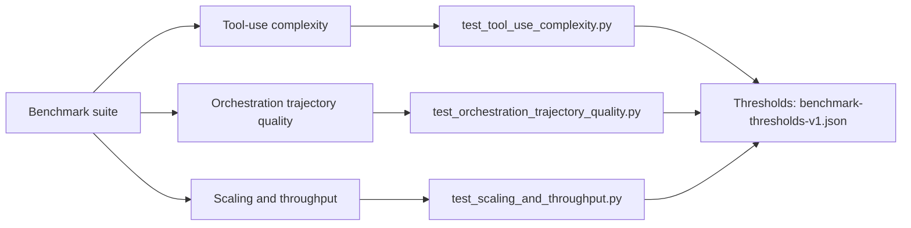
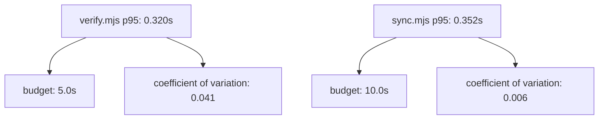

# emage.code

> **Multi-platform AI dev-team orchestration** — disciplined software-engineering
> practice for AI-assisted coding, projected from a single canonical knowledge
> base into every major AI coding assistant.

[](https://gitlab.com/em-age/emage.code/-/commits/main)
[](LICENSE)
[](https://www.conventionalcommits.org)

emage.code brings a **structured multi-agent development team** to your
favourite AI assistant. Every project follows the same protocol:

Latest release: v5.0.0

- **Plan → Approve → Execute** lifecycle, never silent execution
- **DAG-based task management** with explicit dependencies
- **Validation gates** with `PASS` / `CONDITIONAL_PASS` / `FAIL` verdicts
- **Checkpoint compression** for long-running multi-agent workflows
- **GitFlow** branching with conventional commits
- **OWASP Top-10** security baseline enforced via the security-engineer agent

**v5 is the current release** — ecosystem-aligned workflows (mandatory skills,
agent safety guards, handoff, skill discovery) on the schema-first
`implementation/` stream. Older version trees live under `archive/`.

---

## Repository layout

```
emage.code/
├── AGENTS.md                  ← workspace-level conventions (loaded by every agent)
├── implementation/            ← current release — canonical knowledge + projections
│   ├── knowledge/             ← edit here; platform folders are generated
│   ├── scripts/               ← sync, verify, check, packaging, registry
│   ├── cookbooks/             ← managed-agent definitions
│   ├── triggers/              ← trigger specs and examples
│   └── .cursor/ … .pi/        ← generated platform outputs (do not edit by hand)
├── scripts/
│   └── install.sh             ← one-command install into your project
├── docs/                      ← runtime workspace state + wiki sources
│   ├── wiki/                  ← hand-curated wiki (synced to GitLab Wiki)
│   ├── releases/              ← per-release install + highlights
│   ├── plans/                 ← Plan-Approve-Execute plans
│   ├── tasks/                 ← active + completed task ledgers
│   ├── checkpoints/           ← phase-boundary snapshots
│   ├── decisions/             ← ADRs (Architecture Decision Records)
│   └── artifacts/             ← versioned design artifacts
├── archive/                   ← frozen historical version streams
│   ├── v1/                    ← legacy triple-duplicated bundles
│   ├── v2/                    ← previous stable toolchain
│   └── v3/                    ← pointer to promoted implementation/
└── .gitlab-ci.yml             ← drift verification + sync sanity pipeline
```

Use [`implementation/`](implementation/README.md) for new work. See
[`archive/README.md`](archive/README.md) for historical version trees.

---

## Versions at a glance

| | **v1** (legacy) | **v2** (previous) | **v3/v4** (current) |
|---|---|---|---|
| Source of truth | per-platform folders, **triple-duplicated** | single `knowledge/` tree | schema-first `knowledge/` + runtime workflows |
| Supported platforms | GitHub Copilot, Gemini CLI, Opencode | + **Cursor** | + **Pi**, packaging, triggers, adapters |
| Workflow skills | ad-hoc prompts | commands + skills | **v4:** mandatory skill workflow + safety guards |
| MCP config | three divergent JSON files | one `mcp/servers.yaml` registry | same registry model, stricter validation |
| Drift detection | none | `verify.mjs` + CI gate | `check-v3.py` + `verify-v3.mjs` |
| Status | **frozen** — `archive/v1/` | **maintained** — `archive/v2/` | **current** — v5.0.0 on `implementation/` |

Migration guide: [`archive/v2/plan/05-migration-from-v1.md`](archive/v2/plan/05-migration-from-v1.md)

---

## Supported platforms

| Platform | Output folder | Format |
|----------|---------------|--------|
| GitHub Copilot (VS Code) | `.github/` + `.vscode/mcp.json` | `.agent.md`, `.prompt.md`, `.instructions.md` |
| Gemini CLI | `.gemini/` | `.md` (no `tools` field), `settings.json` with hooks |
| Opencode | `.opencode/` | `.md` (object `tools`), `opencode.json` |
| Cursor | `.cursor/` | `.mdc`, `applyTo` → `globs`, `mcp.json` |
| Pi | `.pi/` | agents, prompts, instructions, skills (`.md`) |

Adding a new platform = adding a `platforms/<name>.json` manifest under
`implementation/`. No script changes required. See
[`archive/v2/plan/02-platform-adapter-spec.md`](archive/v2/plan/02-platform-adapter-spec.md).

---

## Install

Install the **current release** (`v5.0.0`) with the installer script:

```bash
git clone https://gitlab.com/em-age/emage.code.git
cd emage.code
scripts/install.sh --target /path/to/your-project --platform cursor
```

| Platform | `--platform` value |
|----------|-------------------|
| Cursor | `cursor` |
| GitHub Copilot (VS Code) | `github` |
| Gemini CLI | `gemini` |
| Opencode | `opencode` |
| Pi | `pi` |
| All platforms | `all` |

Makefile shortcut: `make install TARGET=/path/to/your-project PLATFORM=cursor`

Per-release install steps also live in [`docs/releases/v5.0.0.md`](docs/releases/v5.0.0.md)
and are embedded in [GitLab Releases](https://gitlab.com/em-age/emage.code/-/releases).

## Quick start

After install, set MCP env vars (`GITLAB_PERSONAL_ACCESS_TOKEN`, `BRAVE_API_KEY`, …)
from the generated `mcp.json`, then in your AI assistant:

```
/discover-skills "start new project"
/new-project "My SaaS application"
```

Detailed guides:

- [`implementation/README.md`](implementation/README.md)
- [`docs/wiki/quick-start.md`](docs/wiki/quick-start.md)
- [project Wiki](https://gitlab.com/em-age/emage.code/-/wikis/home)

### Implementation

The `implementation/` tree is the **current release stream** (schema-first
knowledge, cookbooks, triggers, packaging, adapters, validation super-gate).

Start here:

- [`implementation/README.md`](implementation/README.md)
- [`docs/wiki/implementation-guide.md`](docs/wiki/implementation-guide.md)

Validate from the repository root:

```bash
python3 implementation/scripts/check-v3.py --root implementation --required --schemas --cookbooks --handoff-security --hook-policy --telemetry --benchmarks --registry --packaging --triggers --adapters
node implementation/scripts/verify-v3.mjs --root implementation
```

---

## Use emage.code in practice

Use this sequence in a real project:

1. Bootstrap: copy one platform folder plus `AGENTS.md` and `docs/`.
2. Start with intent: run `/new-project "<your project>"`.
3. Work through task ledger: review `docs/tasks/active-tasks.md` and approve
   plans before implementation.
4. Validate quality gates: ensure CI checks pass (`verify-knowledge-drift`,
   `sync-no-diff`, tests).
5. Release safely: update documentation and pass the release docs gate before
   tag publication.

For contributor detail, see [`CONTRIBUTING.md`](CONTRIBUTING.md).

---

## Documentation release contract

Release publication is blocked unless documentation is updated for the tag.

- Required marker in release docs: `Latest release: vX.Y.Z`
- Required per-release brief: `docs/releases/vX.Y.Z.md` (Install + Highlights)
- Required files:
  - `README.md`
  - `docs/wiki/README.md`
  - `docs/wiki/home.md`
  - `docs/wiki/implementation-guide.md`
  - `implementation/README.md`
  - `scripts/install.sh`
  - `docs/releases/vX.Y.Z.md`
- Content verification script:
  ```bash
  python3 scripts/verify-release-docs.py --tag vX.Y.Z
  ```

This script checks required files, marker alignment, required usage sections,
and local/internal markdown link validity for core release docs.

---

## Architecture (6 layers)

1. **Commands** — 18 slash commands, the user entry point
2. **Orchestration** — Plan-Approve-Execute engine (`@orchestrator`, `@poc-orchestrator`)
3. **Agents** — 27 specialists (backend, frontend, qa, security, devops, …)
4. **Skills** — 22 reusable capabilities (code-review, validation-gates, …)
5. **Memory** — `docs/` artifacts + MCP `memory` server
6. **MCP servers** — declared once in [`implementation/knowledge/mcp/servers.yaml`](implementation/knowledge/mcp/servers.yaml)

Deep dive:
- [`archive/v2/plan/00-vision-v2.md`](archive/v2/plan/00-vision-v2.md)
- [`archive/v2/plan/01-shared-knowledge-architecture.md`](archive/v2/plan/01-shared-knowledge-architecture.md)
- [`archive/v2/plan/04-sync-script-design.md`](archive/v2/plan/04-sync-script-design.md)

---

## Benchmark and performance

v2 includes a deterministic benchmark suite for agent-team quality and runtime
health under `tests/performance/`.

### Benchmark coverage map



### Runtime envelope (latest local baseline run)



Key files:
- `tests/_baselines/benchmark-thresholds-v1.json`
- `tests/fixtures/benchmarks/tool_use_cases.json`
- `tests/fixtures/benchmarks/trajectory_cases.json`
- `tests/fixtures/benchmarks/scaling_cases.json`

Run locally:

```bash
python3 tests/run.py --suite performance -v
BENCH_STRESS=1 python3 tests/run.py --suite performance -v
```

---

## Contributing

1. Edit canonical knowledge under [`implementation/knowledge/`](implementation/knowledge/) — **never** the generated `.github/`, `.gemini/`, `.opencode/`, `.cursor/`, `.pi/` folders.
2. Run the sync engine from the repo root:
   ```bash
   make sync
   make verify
   ```
3. Commit both the knowledge change **and** the regenerated platform folders.
4. CI runs drift gates for both `implementation/` (current) and `archive/v2/implementation/` (previous stable).

Full contributor guide: [`CONTRIBUTING.md`](CONTRIBUTING.md)
Authoring rules: [`implementation/knowledge/README.md`](implementation/knowledge/README.md)

### Branching (GitFlow)
```
main         ← production-ready releases
develop      ← integration branch for new work
feature/*    ← branch from develop, MR back to develop
bugfix/*     ← bug fixes, MR back to develop
release/*    ← stabilize a release, MR to main + back-merge to develop
hotfix/*     ← emergency fix from main
```

Commit messages follow [Conventional Commits](https://www.conventionalcommits.org/):
`feat(scope): …`, `fix(scope): …`, `docs: …`, `refactor: …`, `test: …`, `chore: …`

---

## Security

This project enforces:

- No secrets in source control (use environment variables / vault)
- Parameterized queries only — no string-concat SQL
- Input validation at every system boundary
- OWASP Top-10 audit before every release
- Permission boundaries per agent role

Report vulnerabilities privately — see [`implementation/SECURITY.md`](implementation/SECURITY.md).

---

## License

[MIT](LICENSE) © em-age
