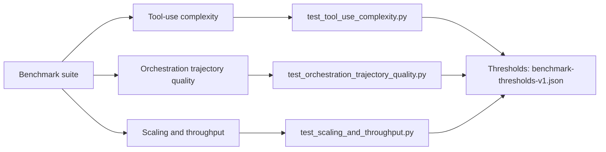
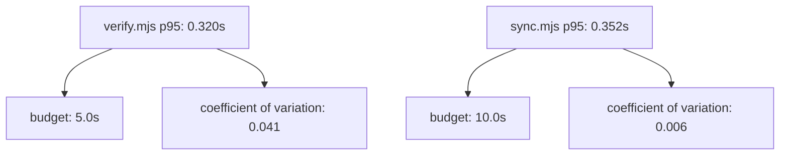

# emage.code

> **Multi-platform AI dev-team orchestration** — disciplined software-engineering
> practice for AI-assisted coding, projected from a single canonical knowledge
> base into every major AI coding assistant.

[](https://gitlab.com/em-age/emage.code/-/commits/main)
[](LICENSE)
[](https://www.conventionalcommits.org)

emage.code brings a **structured multi-agent development team** to your
favourite AI assistant. Every project follows the same protocol:

Latest release: v1.0.1

- **Plan → Approve → Execute** lifecycle, never silent execution
- **DAG-based task management** with explicit dependencies
- **Validation gates** with `PASS` / `CONDITIONAL_PASS` / `FAIL` verdicts
- **Checkpoint compression** for long-running multi-agent workflows
- **GitFlow** branching with conventional commits
- **OWASP Top-10** security baseline enforced via the security-engineer agent

---

## Repository layout

```
emage.code/
├── AGENTS.md                  ← workspace-level conventions (loaded by every agent)
├── docs/                      ← runtime workspace state
│   ├── plans/                 ← Plan-Approve-Execute plans
│   ├── tasks/                 ← active + completed task ledgers
│   ├── checkpoints/           ← phase-boundary snapshots
│   ├── decisions/             ← ADRs (Architecture Decision Records)
│   └── artifacts/             ← versioned design artifacts
├── v1/                        ← v1 release — frozen, kept for reference
│   ├── plan/                  ← original architecture & phase plans
│   └── implementation/        ← per-platform agent bundles (triple-duplicated)
├── v2/                        ← current release — single source of truth
│   ├── plan/                  ← v2 architecture, adapter spec, phase backfills
│   └── implementation/        ← canonical knowledge + sync engine + generated mirrors
└── .gitlab-ci.yml             ← drift verification + sync sanity pipeline
```

Use [`v2/implementation/`](v2/implementation/README.md) for new work — v1 is
preserved unchanged so existing deployments keep working.

---

## Versions at a glance

| | **v1** (legacy) | **v2** (current) |
|---|---|---|
| Source of truth | per-platform folders, **triple-duplicated** | single `knowledge/` tree |
| Supported platforms | GitHub Copilot, Gemini CLI, Opencode | + **Cursor** |
| MCP config | three divergent JSON files | one `mcp/servers.yaml` registry |
| Drift detection | none | `verify.mjs` + CI gate |
| Status | **frozen** — no new development | **active** — accept contributions here |

Migration guide: [`v2/plan/05-migration-from-v1.md`](v2/plan/05-migration-from-v1.md)

---

## Supported platforms (v2)

| Platform | Output folder | Format |
|----------|---------------|--------|
| GitHub Copilot (VS Code) | `.github/` + `.vscode/mcp.json` | `.agent.md`, `.prompt.md`, `.instructions.md` |
| Gemini CLI | `.gemini/` | `.md` (no `tools` field), `settings.json` with hooks |
| Opencode | `.opencode/` | `.md` (object `tools`), `opencode.json` |
| Cursor | `.cursor/` | `.mdc`, `applyTo` → `globs`, `mcp.json` |

Adding a new platform = adding a `platforms/<name>.json` manifest. No script
changes required. See
[`v2/plan/02-platform-adapter-spec.md`](v2/plan/02-platform-adapter-spec.md).

---

## Quick start

Pick the platform you use, copy that folder to your project root, plus
`AGENTS.md` and `docs/`:

```bash
# GitHub Copilot
cp -r v2/implementation/.github         <your-project>/
cp    v2/implementation/.vscode/mcp.json <your-project>/.vscode/

# Gemini CLI
cp -r v2/implementation/.gemini         <your-project>/

# Opencode
cp -r v2/implementation/.opencode       <your-project>/

# Cursor
cp -r v2/implementation/.cursor         <your-project>/

# Always include
cp    v2/implementation/AGENTS.md       <your-project>/
cp -r v2/implementation/docs            <your-project>/
```

Set the MCP env vars (`GITLAB_PERSONAL_ACCESS_TOKEN`, `BRAVE_API_KEY`, …) — the
full list lives in the generated `mcp.json`.

Then in your AI assistant:

```
/new-project "My SaaS application"
```

Detailed guide: [`v2/implementation/README.md`](v2/implementation/README.md)
and [project Wiki](https://gitlab.com/em-age/emage.code/-/wikis/home).

---

## Architecture (6 layers)

1. **Commands** — 16 slash commands, the user entry point
2. **Orchestration** — Plan-Approve-Execute engine (`@orchestrator`, `@poc-orchestrator`)
3. **Agents** — 27 specialists (backend, frontend, qa, security, devops, …)
4. **Skills** — 22 reusable capabilities (code-review, validation-gates, …)
5. **Memory** — `docs/` artifacts + MCP `memory` server
6. **MCP servers** — declared once in [`v2/implementation/knowledge/mcp/servers.yaml`](v2/implementation/knowledge/mcp/servers.yaml)

Deep dive:
- [`v2/plan/00-vision-v2.md`](v2/plan/00-vision-v2.md)
- [`v2/plan/01-shared-knowledge-architecture.md`](v2/plan/01-shared-knowledge-architecture.md)
- [`v2/plan/04-sync-script-design.md`](v2/plan/04-sync-script-design.md)

---

## Benchmark and performance

v2 includes a deterministic benchmark suite for agent-team quality and runtime
health under `tests/performance/`.

### Benchmark coverage map



### Runtime envelope (latest local baseline run)



Key files:
- `tests/_baselines/benchmark-thresholds-v1.json`
- `tests/fixtures/benchmarks/tool_use_cases.json`
- `tests/fixtures/benchmarks/trajectory_cases.json`
- `tests/fixtures/benchmarks/scaling_cases.json`

Run locally:

```bash
python3 tests/run.py --suite performance -v
BENCH_STRESS=1 python3 tests/run.py --suite performance -v
```

---

## Contributing

1. Edit canonical knowledge under [`v2/implementation/knowledge/`](v2/implementation/knowledge/) — **never** the generated `.github/`, `.gemini/`, `.opencode/`, `.cursor/` folders.
2. Run the sync engine:
   ```bash
   cd v2/implementation
   node scripts/sync.mjs
   ```
3. Commit both the knowledge change **and** the regenerated platform folders.
4. CI runs [`scripts/verify.mjs`](v2/implementation/scripts/verify.mjs) — it
   fails the pipeline if generated folders drift from `knowledge/`.

Full contributor guide: [`CONTRIBUTING.md`](CONTRIBUTING.md)
Authoring rules: [`v2/implementation/knowledge/README.md`](v2/implementation/knowledge/README.md)

### Branching (GitFlow)
```
main         ← production-ready releases
develop      ← integration branch for new work
feature/*    ← branch from develop, MR back to develop
bugfix/*     ← bug fixes, MR back to develop
release/*    ← stabilize a release, MR to main + back-merge to develop
hotfix/*     ← emergency fix from main
```

Commit messages follow [Conventional Commits](https://www.conventionalcommits.org/):
`feat(scope): …`, `fix(scope): …`, `docs: …`, `refactor: …`, `test: …`, `chore: …`

---

## Security

This project enforces:

- No secrets in source control (use environment variables / vault)
- Parameterized queries only — no string-concat SQL
- Input validation at every system boundary
- OWASP Top-10 audit before every release
- Permission boundaries per agent role

Report vulnerabilities privately — see [`v2/implementation/SECURITY.md`](v2/implementation/SECURITY.md).

---

## License

[MIT](LICENSE) © em-age
