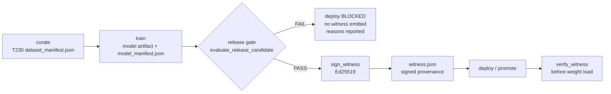

# Release Gate + Ed25519 Witness Signing

## Purpose

Wrap the SIA model-promotion lifecycle (`curate → train → eval → deploy`) with
a **release gate** and **Ed25519 witness provenance**. A model artifact cannot
be promoted/deployed unless it passes an evaluator gate, and every successful
promotion emits a cryptographically **signed witness manifest** binding the
dataset version to the model version.

The signing and gating logic is **real** (real Ed25519 via the `cryptography`
package). Pending T231 (the actual fine-tune), the "model weights" are a
synthetic stand-in described by a `model_manifest.json`.

---

## Gated Promotion Flow



A gate `FAIL` is terminal for that candidate: **no witness is written** and
`promote()` returns `{"promoted": false, ...}` with the failure reasons.

---

## Gate Criteria

`evaluate_release_candidate(dataset_manifest_path, model_manifest_path, gate_config)`
applies the following criteria. Unspecified keys fall back to
`DEFAULT_GATE_CONFIG`.

| Criterion | Source field | Rule | Default |
|-----------|--------------|------|---------|
| `min_grpo_count` | `dataset.grpo.count` | `>=` threshold | `1` |
| `min_mean_reward` | `dataset.grpo.reward_stats.mean` | `>=` threshold | `0.0` |
| `min_eval_score` | `model.eval.score` | `>=` threshold | `0.0` |
| `required_fields` | dotted paths over `{dataset, model}` | each must resolve non-null | `["model.model_id", "model.version", "model.artifact_sha256"]` |

`required_fields` are dotted paths resolved against a combined context
(`{"dataset": <dataset manifest>, "model": <model manifest>}`), e.g.
`model.version` or `dataset.grpo.count`.

### Result shape

```json
{
  "passed": true,
  "reasons": [],
  "checked": {
    "required_field:model.model_id": true,
    "required_field:model.version": true,
    "min_grpo_count": {"observed": 10, "threshold": 5, "passed": true},
    "min_mean_reward": {"observed": 0.5, "threshold": 0.2, "passed": true},
    "min_eval_score": {"observed": 0.85, "threshold": 0.5, "passed": true}
  }
}
```

On failure, every failed criterion is appended to `reasons` (all failures are
reported, not just the first).

---

## Witness Manifest Schema

`sign_witness(witness_payload, private_key_path)` returns:

```json
{
  "payload": {
    "dataset": {
      "version": "ds-2026.06.23",
      "hash": "<sha256 of dataset_manifest.json bytes>",
      "grpo_count": 10,
      "mean_reward": 0.5
    },
    "model": {
      "model_id": "sia-coder",
      "version": "0.1.0-synthetic",
      "eval_score": 0.85,
      "artifact_sha256": "<sha256 of the model artifact bytes>"
    },
    "gate": {
      "passed": true,
      "checked_count": 5,
      "reasons": []
    },
    "issued_at": "2026-06-23T09:20:00+00:00"
  },
  "signature": "<base64 Ed25519 signature, 64 bytes raw>",
  "public_key": "<base64 raw 32-byte Ed25519 public key>",
  "algorithm": "Ed25519",
  "signed_at": "2026-06-23T09:20:00+00:00"
}
```

- The **payload binds the dataset version/hash, the model version, AND the model
  artifact content hash** (`model.artifact_sha256`), so a witness cannot be
  replayed against a different dataset, model version, or swapped model bytes.
- `model.artifact_sha256` is resolved by `_resolve_artifact_hash`: it prefers the
  sha256 of the file at `model.artifact_path` (resolved relative to the manifest)
  over the declared `model.artifact_sha256`. A declared hash that disagrees with
  the computed file hash is a **fail-closed gate failure** (blocks promotion).
  When no `artifact_path` bytes are readable, the declared `artifact_sha256` is
  required — a missing hash is a gate failure.
- The `public_key` field is the signer's **embedded** raw key. It proves
  integrity-against-corruption only and is **NOT** an authenticity anchor (see
  verification model below).
- The signature is computed over the **canonicalised** payload:
  sorted-key, compact-separator, UTF-8 JSON. The same canonicalisation is used
  for verification, so any payload mutation invalidates the signature.

---

## Signing / Verification Workflow

| Function | Role |
|----------|------|
| `generate_keypair(out_dir)` | Dev helper — writes `*.ed25519.key` (0600) + `*.pub` (PEM) |
| `sign_witness(payload, private_key_path)` | Canonicalise + Ed25519-sign; embeds raw public key |
| `verify_witness(manifest, public_key_path=None, *, trust_embedded_key=False)` | True only if signature valid for untampered payload under a **trusted** key |
| `promote(..., *, trusted_public_key_path=None)` | Run gate → sign → write `witness.json` → re-verify against trust anchor (blocked on FAIL) |

### Verification trust model (SEC-001)

Authenticity is established **only** against a pinned, trusted public key. The
embedded `public_key` in the witness is attacker-controllable, so trusting it
implicitly would let anyone forge a `gate.passed=true` payload, sign it with
their own key, embed that key, and pass verification.

`verify_witness` therefore enforces a **fail-closed** policy:

| `public_key_path` | `trust_embedded_key` | Behaviour |
|-------------------|----------------------|-----------|
| provided (PEM) | (ignored) | **Secure path** — verify authenticity against the trusted key |
| `None` | `False` (default) | **Fail closed** — return `False`, log a warning (no trust anchor) |
| `None` | `True` (explicit opt-in) | Verify against the **embedded** key — integrity-only, **NOT authenticity**; logs a warning |

`promote()` always signs and then re-verifies the emitted witness against
`trusted_public_key_path` (defaulting to the committed dev anchor
`keys/witness-dev.pub`, resolved relative to the module). If that self-check
fails, the witness file is discarded and promotion is reported as failed.

`verify_witness` returns **False** for: tampered payload (including a mutated
`model.artifact_sha256`), corrupted/missing/empty signature, wrong key, garbage
base64, a non-dict manifest, or a missing trust anchor.

### `verify-witness` usage

```python
import json
from release_gate import verify_witness

witness = json.load(open("out/witness.json"))

# Secure path — authenticity pinned to a trusted committed key:
assert verify_witness(
    witness,
    public_key_path="implementation/adapters/sia-target/keys/witness-dev.pub",
)

# Default with no trust anchor fails closed (returns False):
assert verify_witness(witness) is False

# Integrity-only (NOT authenticity) — explicit opt-in for corruption checks:
assert verify_witness(witness, trust_embedded_key=True)
```

### Smoke test

```bash
python3 -c "
import importlib.util, json, pathlib, tempfile
p = pathlib.Path('implementation/adapters/sia-target/release_gate.py')
spec = importlib.util.spec_from_file_location('rg', p)
m = importlib.util.module_from_spec(spec); spec.loader.exec_module(m)
work = tempfile.mkdtemp()
keys = m.generate_keypair(work + '/keys')
ds = work + '/dataset_manifest.json'; md = work + '/model_manifest.json'
json.dump({'version':'ds1','grpo':{'count':10,'reward_stats':{'mean':0.5}}}, open(ds,'w'))
json.dump({'model_id':'sia','version':'0.1.0','eval':{'score':0.9}}, open(md,'w'))
r = m.promote(ds, md, {'min_grpo_count':1,'min_eval_score':0.5}, keys['private_key_path'], work + '/out', trusted_public_key_path=keys['public_key_path'])
w = json.load(open(r['witness_path']))
pub = keys['public_key_path']
print('promoted:', r['promoted'], '| verify:', m.verify_witness(w, public_key_path=pub))
w['payload']['model']['eval_score'] = 0.0  # tamper
print('verify after tamper:', m.verify_witness(w, public_key_path=pub))
"
```

---

## Key Management (Dev vs Prod)

| Aspect | Dev (this PoC) | Production (required) |
|--------|----------------|------------------------|
| Key storage | Local PEM file, `0600` | KMS / HSM, never exported |
| Signing | In-process `cryptography` | KMS signer API |
| Private key in repo | **Never** (git-ignored) | **Never** |
| Public key | `keys/witness-dev.pub` committed (dev only) | Distributed via trusted channel |
| Key path source | `--private-key-path` arg or `SIA_WITNESS_PRIVATE_KEY` env | KMS key ID |
| Rotation | None | Scheduled rotation + revocation |

### Security properties

- **Authenticity pinned to a trusted key (SEC-001)** — `verify_witness` never
  trusts the embedded key by default; authenticity requires a pinned
  `public_key_path`, and `promote()` self-checks the emitted witness against the
  trust anchor. Fail-closed on a missing anchor.
- **Model bytes bound (SEC-002)** — the signed payload includes
  `model.artifact_sha256`; a declared/computed hash mismatch blocks promotion.
- **No secrets in source** — private keys are loaded from a path supplied by
  argument or `SIA_WITNESS_PRIVATE_KEY`. Generated private keys are git-ignored
  (`*.ed25519.key`, `**/keys/*.key`, `deploy/keys/`).
- **No path traversal** — `promote()` confines all writes to `output_path` via
  `_assert_safe_path` (OWASP A01).
- **Input validation** — manifests are validated (must exist, be valid JSON
  objects) before use; invalid inputs raise `ReleaseGateError`.
- **No hand-rolled crypto** — uses `cryptography`'s Ed25519 primitives, pinned
  `>=43.0.1` (SEC-003) to pick up upstream security fixes.

---

## Security Review Findings (T232)

The read-only security review returned `CONDITIONAL_PASS`. Status after
remediation:

| ID | Sev | Finding | Status |
|----|-----|---------|--------|
| SEC-001 | HIGH | Default verification trusted the embedded public key (forgeable) | **RESOLVED** — fail-closed trust model; `promote()` self-checks against a pinned anchor |
| SEC-002 | MEDIUM | Model artifact bytes not bound into the signed payload | **RESOLVED** — `model.artifact_sha256` bound; path/declared mismatch blocks promotion |
| SEC-003 | MEDIUM | `cryptography==41.0.7` pin | **RESOLVED** — bumped to `cryptography>=43.0.1` |
| SEC-004 | — | No external transparency-log anchoring | Tracked (POC-DEBT #4) |
| SEC-005 | — | Forgery / fail-closed regression coverage | **ADDED** — 6 new functional tests |
| SEC-006 | — | Flat gate thresholds (no policy-as-code) | Tracked (POC-DEBT #6) |

---

## Production Debt

| # | Tag | Description | Effort |
|---|-----|-------------|--------|
| 1 | POC-DEBT | Dev key only — production must sign via KMS/HSM, never a local PEM | L |
| 2 | POC-DEBT | No key rotation or revocation list | M |
| 3 | POC-DEBT | Model artifact is a synthetic manifest stand-in (real weights land in T231) | M |
| 4 | POC-DEBT | Witness is not anchored to an external transparency log / ledger | M |
| 5 | POC-DEBT | Dataset hash covers the manifest file only, not the underlying JSONL shards | S |
| 6 | POC-DEBT | Gate criteria are flat thresholds — no policy-as-code / multi-tier gates | S |

---

## Files

| Path | Description |
|------|-------------|
| `implementation/adapters/sia-target/release_gate.py` | Gate + witness module |
| `implementation/adapters/sia-target/keys/witness-dev.pub` | Dev public key (verify only) |
| `implementation/adapters/sia-target/keys/README.md` | Key handling notes |
| `tests/functional/test_t232_release_gate.py` | 38 functional tests |
