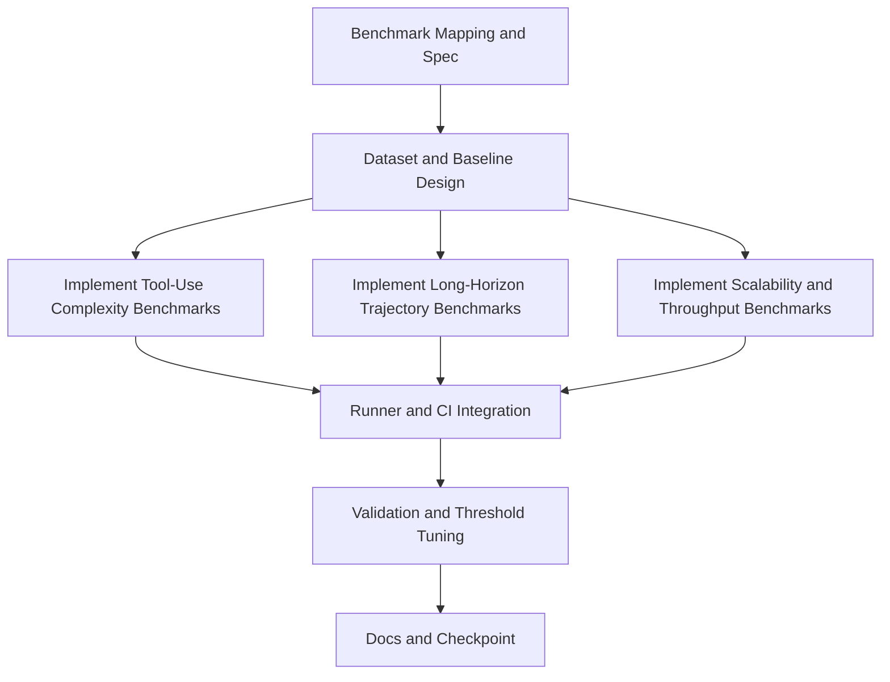

# Plan: agent-benchmark-expansion-v2

## Goal
Add a second wave of agent-performance benchmarks to v2 that are inspired by the AI Agent Benchmark Compendium and directly executable in this repository, so emage.code measures not only static integrity and runtime speed but also multi-turn tool-use quality, long-horizon orchestration quality, and scalability under realistic workload growth.

## Scope
- In scope: new benchmark datasets, new performance benchmark tests under tests/performance, baseline thresholds, test runner wiring, CI coverage, and short README updates for execution/interpretation.
- Out of scope: introducing heavyweight external benchmark frameworks (for example, full WebArena or OSWorld runtime), network-dependent benchmark jobs, and model-specific leaderboard replication.
- Assumptions: benchmarks must stay deterministic, offline, and lightweight enough for GitLab CI on small runners.

## Task graph

## Agent assignments

| Task | Agent | Estimated scope |
|------|-------|-----------------|
| T001 | solution-architect | small |
| T002 | qa-engineer | medium |
| T003 | backend-developer | medium |
| T004 | backend-developer | medium |
| T005 | backend-developer | medium |
| T006 | devops-engineer | small |
| T007 | qa-engineer + tech-lead | medium |
| T008 | technical-writer | small |

## Artifact flow

T001 -> docs/artifacts/agent-benchmark-mapping-v1.md (consumed by: T002, T003, T004, T005)
T002 -> tests/_baselines/benchmark-thresholds-v1.json and tests/fixtures/benchmarks/*.json (consumed by: T003, T004, T005, T007)
T003 -> tests/performance/test_tool_use_complexity.py (consumed by: T006, T007)
T004 -> tests/performance/test_orchestration_trajectory_quality.py (consumed by: T006, T007)
T005 -> tests/performance/test_scaling_and_throughput.py (consumed by: T006, T007)
T006 -> tests/run.py and .gitlab-ci.yml updates (consumed by: T007)
T007 -> benchmark-validation-report-v1.md (consumed by: T008)
T008 -> docs/checkpoints/checkpoint-004-benchmark-expansion.md

## Proposed benchmark additions (mapped to compendium themes)

1. Function Calling and Tool Use inspired benchmark: Tool-use complexity score
- Measures single-tool, parallel-tool, nested-tool, and multi-turn tool selection correctness from fixture scenarios.
- Adds hard metrics: tool selection accuracy, argument schema validity, and step efficiency ratio.

2. General Assistant and Reasoning inspired benchmark: Orchestration trajectory quality
- Evaluates orchestrator-like planning traces against rubric-based fixtures.
- Adds hard metrics: plan coverage score, dependency correctness, blocker routing correctness, and retry discipline.

3. AgentBench-style interaction benchmark: Stateful multi-turn task completion
- Simulates evolving task state over multiple turns and checks policy-consistent next action selection.
- Adds hard metrics: state transition validity and completion rate under perturbations.

4. SWE-bench style regression benchmark for repo operations: Patch quality proxy
- Uses local synthetic issue fixtures to score whether proposed edits preserve schema and pass functional gates.
- Adds hard metrics: pass rate on guarded synthetic issues and no-regression score.

5. System scalability benchmark: Throughput and variance envelope
- Runs repeated sync and verify plus benchmark suite loops to track p50/p95 runtime and variance.
- Adds hard metrics: p95 runtime budget and stability delta versus baseline.

## Risks and mitigations

| Risk | Likelihood | Impact | Mitigation |
|------|-----------|--------|-----------|
| Benchmarks become too slow for CI | medium | high | keep fixtures small, gate heavy loops behind BENCH_STRESS=1 |
| Rubric metrics too subjective | medium | medium | encode strict machine-checkable fixture expectations |
| Flaky runtime metrics | medium | medium | use percentile thresholds and warmup runs |
| Overfitting to fixtures | low | medium | keep holdout fixture file for local-only validation |

## Token budget

| Phase | Budget | Spent | Remaining |
|-------|--------|-------|-----------|
| Planning | 80k | ~10k | ~70k |
| Architecture | 80k | 0 | 80k |
| Implementation | 120k | 0 | 120k |
| QA / Security / Release | 60k | 0 | 60k |

## Approval

- [x] User approved on 2026-05-11
- [ ] Plan locked; revisions create plan-001-agent-benchmark-expansion-v2-v2.md
