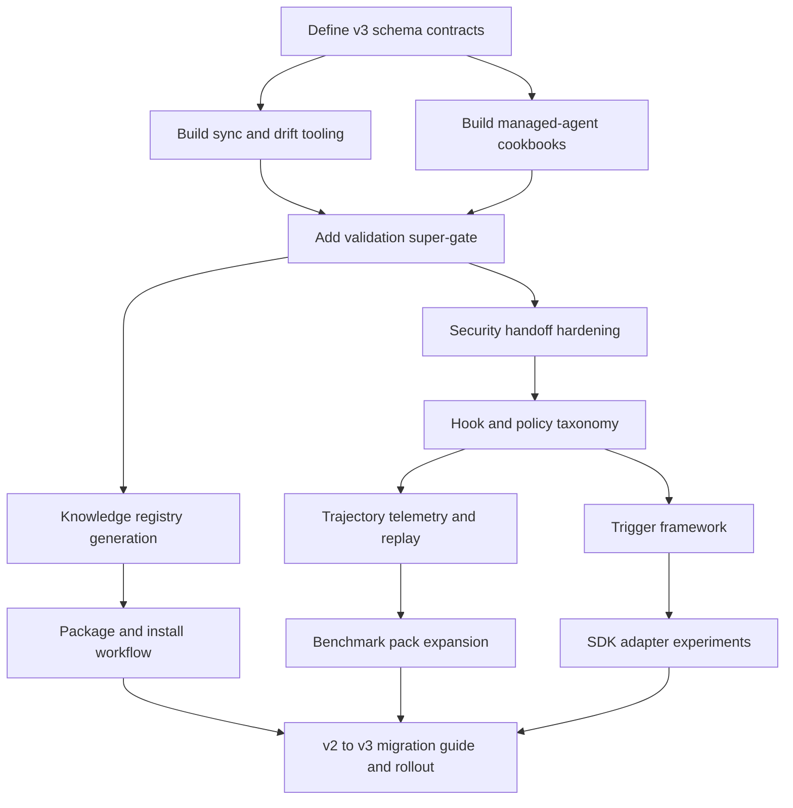

# Plan: emage.code v3 roadmap

## Goal
Deliver emage.code v3 as a production-grade knowledge and orchestration platform that keeps a single canonical source of truth while enabling safe multi-agent deployment patterns, richer skill/agent packaging, stronger validation gates, and ecosystem integrations across Copilot, Gemini, and Opencode. Done means v3 can author, validate, package, and deploy reusable knowledge modules with measurable quality gates and a clear upgrade path from v2.

## Scope
- In scope: knowledge architecture upgrades, skill/agent packaging model, managed-agent deployment manifests, policy and safety hooks, validation and benchmark expansion, ecosystem registry ingest, and phased rollout plan with acceptance criteria.
- Out of scope: full migration of all existing v2 content in one release, proprietary hosted control plane, and non-open-source connector implementations requiring paid vendor credentials.
- Assumptions: v2 remains the active baseline; v3 is delivered incrementally behind feature flags and schema versioning; CI budget allows expanded validation suites.

## Research basis
- https://github.com/anthropics/financial-services
- https://github.com/anthropics/financial-services/tree/main/managed-agent-cookbooks
- https://github.com/anthropics/financial-services/blob/main/scripts/check.py
- https://github.com/anthropics/financial-services/blob/main/scripts/sync-agent-skills.py
- https://github.com/anthropics/financial-services/blob/main/scripts/orchestrate.py
- https://github.com/awesome-opencode/awesome-opencode
- https://github.com/awesome-opencode/awesome-opencode/tree/main/data
- https://github.com/anomalyco/opencode
- https://github.com/anomalyco/opencode-sdk-python
- https://github.com/google-antigravity/antigravity-sdk-python
- https://github.com/google-antigravity/antigravity-sdk-python/tree/main/examples
- https://github.com/google-antigravity/antigravity-sdk-python/blob/main/google/antigravity/hooks/README.md

## Prioritized roadmap

### P0 - Foundation hardening (critical path)
1. Canonical skill source plus bundled-copy sync model
- Introduce source and bundled skill topology similar to vertical source plus agent bundles.
- Add sync utility to propagate canonical skill edits to agent bundles.
- Add drift detection gate in CI.

2. Managed deployment cookbook layer
- Add deploy-oriented manifests for orchestrators and worker agents.
- Define manifest-to-runtime resolution rules (file references, skill upload references, worker manifests).
- Add steering examples and per-agent security notes.

3. Validation super-gate
- Add repo-wide checker that validates YAML/JSON/frontmatter schema, cross-file references, required artifact presence, and bundled-skill drift.
- Fail CI on unresolved references or drift.

4. Security and handoff hardening
- Introduce allowlisted handoff routing contracts and schema validation for cross-agent handoffs.
- Add fail-closed behavior for malformed handoff payloads.

### P1 - Observability and quality intelligence
5. Hook and policy taxonomy for agent runtime controls
- Define inspect, decide, and transform hook classes for emage.code runtime adapters.
- Add policy precedence model: specific deny > ask > allow, wildcard deny > ask > allow.

6. Trajectory telemetry and replay
- Capture step-level traces, tool-call events, and handoff events in a normalized schema.
- Build replay harness for regression comparison across Copilot, Gemini, and Opencode.

7. Expanded benchmark packs
- Add deterministic scenario packs for planning quality, safety compliance, orchestration routing, and tool efficiency.
- Add trend dashboards from benchmark JSON outputs.

### P1 - Ecosystem and discoverability
8. Knowledge registry format
- Define schema for listing agents, skills, commands, instructions, examples, maturity, and compatibility metadata.
- Auto-generate human docs and machine-readable registry artifacts from source metadata.

9. Package and install workflow
- Add package manifest and installer commands for reusable knowledge packs.
- Support local, git, and registry-based install/update/uninstall flows.

### P2 - Advanced runtime capabilities
10. Trigger framework and background workflows
- Add scheduled/event-driven triggers that can enqueue steering inputs to orchestrators.
- Add safety guardrails around autonomous trigger execution.

11. Rich input and multimodal readiness
- Add optional content attachment conventions for images/docs and adapter-level capability negotiation.

12. SDK adapter layer
- Add experimental adapters for Antigravity-style runtime orchestration and Opencode SDK automation scripts.
- Keep adapters optional and behind feature toggles.

## Task graph

## Agent assignments

| Task | Agent | Estimated scope |
|------|-------|-----------------|
| T001 | solution-architect + tech-lead | medium |
| T002 | backend-developer | medium |
| T003 | backend-developer + technical-writer | medium |
| T004 | qa-engineer + security-engineer | medium |
| T005 | security-engineer | medium |
| T006 | solution-architect + security-engineer | medium |
| T007 | backend-developer + devops-engineer | large |
| T008 | qa-engineer + evaluation-agent | medium |
| T009 | backend-developer | medium |
| T010 | devops-engineer + backend-developer | medium |
| T011 | backend-developer | medium |
| T012 | integration-agent + backend-developer | medium |
| T013 | product-owner + tech-lead + technical-writer | medium |

## Artifact flow

T001 -> docs/artifacts/v3-schema-contract-v1.md (consumed by: T002, T003, T004, T009)
T002 -> v3/implementation/scripts/sync-v3.mjs (consumed by: T004, T013)
T003 -> v3/implementation/cookbooks/* (consumed by: T004, T005, T013)
T004 -> v3/implementation/scripts/check-v3.py (consumed by: T008, T013)
T005 -> docs/artifacts/v3-handoff-security-model-v1.md (consumed by: T006, T013)
T006 -> docs/artifacts/v3-hook-policy-spec-v1.md (consumed by: T007, T011, T012)
T007 -> docs/artifacts/v3-telemetry-schema-v1.md + tooling (consumed by: T008, T013)
T008 -> docs/artifacts/v3-benchmark-report-v1.md (consumed by: T013)
T009 -> v3/implementation/registry/*.json (consumed by: T010, T013)
T010 -> v3/implementation/commands/package-* (consumed by: T013)
T011 -> v3/implementation/triggers/* (consumed by: T012, T013)
T012 -> docs/artifacts/v3-adapter-evaluation-v1.md (consumed by: T013)
T013 -> docs/plans/plan-003-v3-execution-wave1.md + docs/checkpoints/checkpoint-v3-001-planning.md

## Implementation waves

| Wave | Priority | Features | Exit criteria |
|------|----------|----------|---------------|
| Wave 1 | P0 | T001-T005 | CI blocks on drift/reference/security handoff contract violations |
| Wave 2 | P1 | T006-T008 | Hook-policy spec enforced and benchmark trend pipeline running |
| Wave 3 | P1 | T009-T010 | Registry generated and package install/update flows validated |
| Wave 4 | P2 | T011-T012 | Trigger and adapter experiments validated behind flags |
| Wave 5 | P0/P1 closeout | T013 | Migration guide and rollout plan approved |

## Risks and mitigations

| Risk | Likelihood | Impact | Mitigation |
|------|-----------|--------|-----------|
| v3 schema churn breaks projections | medium | high | Version schemas, add contract tests, keep v2 compatibility window |
| Added validation gates slow CI | medium | medium | Parallelize checks, split fast/slow lanes, cache manifests |
| Multi-agent handoff introduces security gaps | medium | high | Allowlists, schema validation, fail-closed execution, audit logs |
| Ecosystem registry becomes stale | medium | medium | Auto-generate from source metadata in CI |
| Adapter complexity exceeds immediate value | low | medium | Keep adapters experimental and feature-flagged |

## Token budget

| Phase | Budget | Planned spend | Remaining |
|-------|--------|---------------|-----------|
| Planning | 80k | 35k | 45k |
| Architecture | 80k | 60k | 20k |
| Implementation | 120k | 110k | 10k |
| QA / Security / Release | 60k | 50k | 10k |

## Approval

- [ ] User approved on 2026-05-22
- [ ] Plan locked; revisions create plan-003-*.md

## Active task ID mapping

Current execution task IDs covered by this plan: T009, T010, T011, T012, T013, T014, T015, T016, T017, T018, T019, T020, T021.
