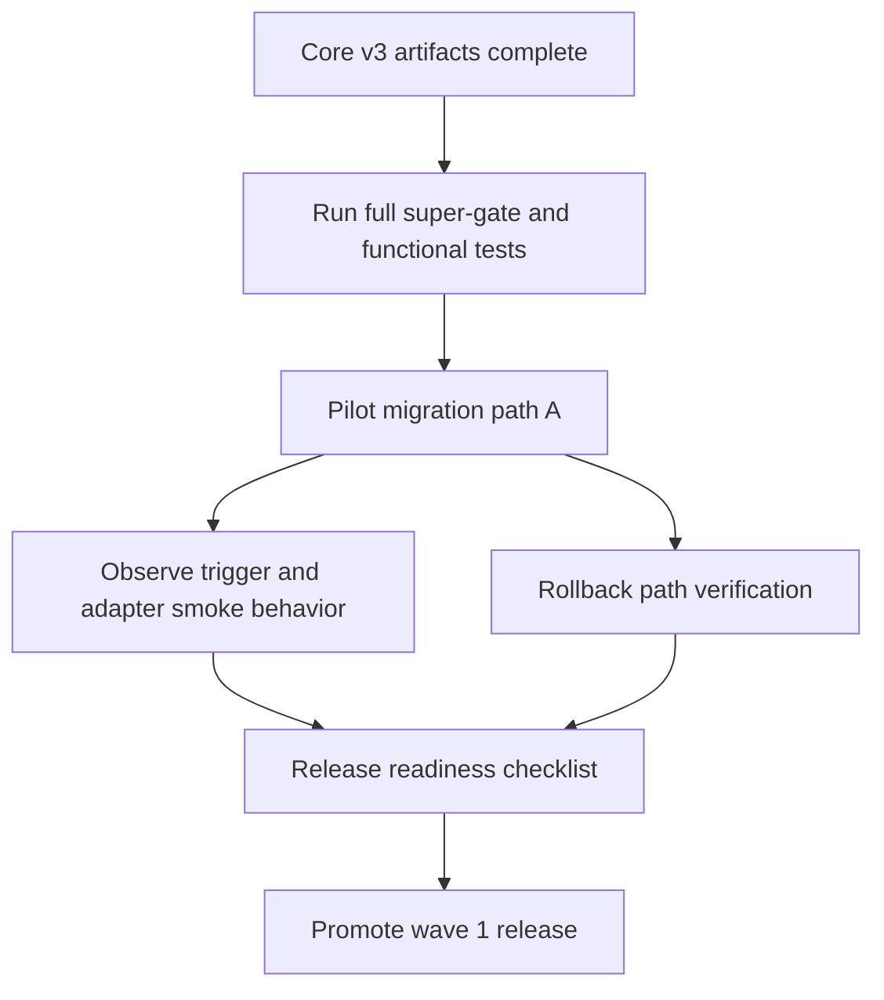

# Plan 003 - v3 Execution Wave 1

Goal: Complete and release v3 execution wave 1 by moving from validated implementation artifacts to controlled rollout with explicit rollback controls.

## Phase summary

1. Stabilize core gates and implementation artifacts.
2. Execute pilot rollout with conservative migration path.
3. Validate release readiness and publish handoff checkpoint.

## Task graph

## Deliverables

- [docs/checkpoints/checkpoint-v3-002-implementation-readiness.md](../checkpoints/checkpoint-v3-002-implementation-readiness.md)
- CI run evidence with green pipeline and gate parity.

## Rollout controls

- Use conservative migration path for first wave.
- Keep `V3_EXPERIMENTAL_ADAPTERS` disabled in production.
- Require trigger policy review before enabling schedule/event automation.
- Enforce rollback readiness before release signoff.

## Validation gates

- Implementation gate: v3 super-gate pass.
- Integration gate: functional suite pass.
- Security gate: policy controls verified for triggers/adapters.
- Release gate: checklist complete and no open P0/P1 blockers.

## Risks and mitigations

| Risk | Impact | Mitigation |
|---|---|---|
| Generated artifact drift | CI failures | run generator check gates pre-merge |
| Experimental adapter misuse | security and reliability | strict feature flags and workflow allowlist |
| Trigger flood from bad schedule | noisy orchestration | deny-by-default policy and bounded retries |

## Exit criteria

- All migration guide acceptance conditions met.
- Checkpoint published with readiness verdict.
- Release recommendation documented as Go or No-Go.
