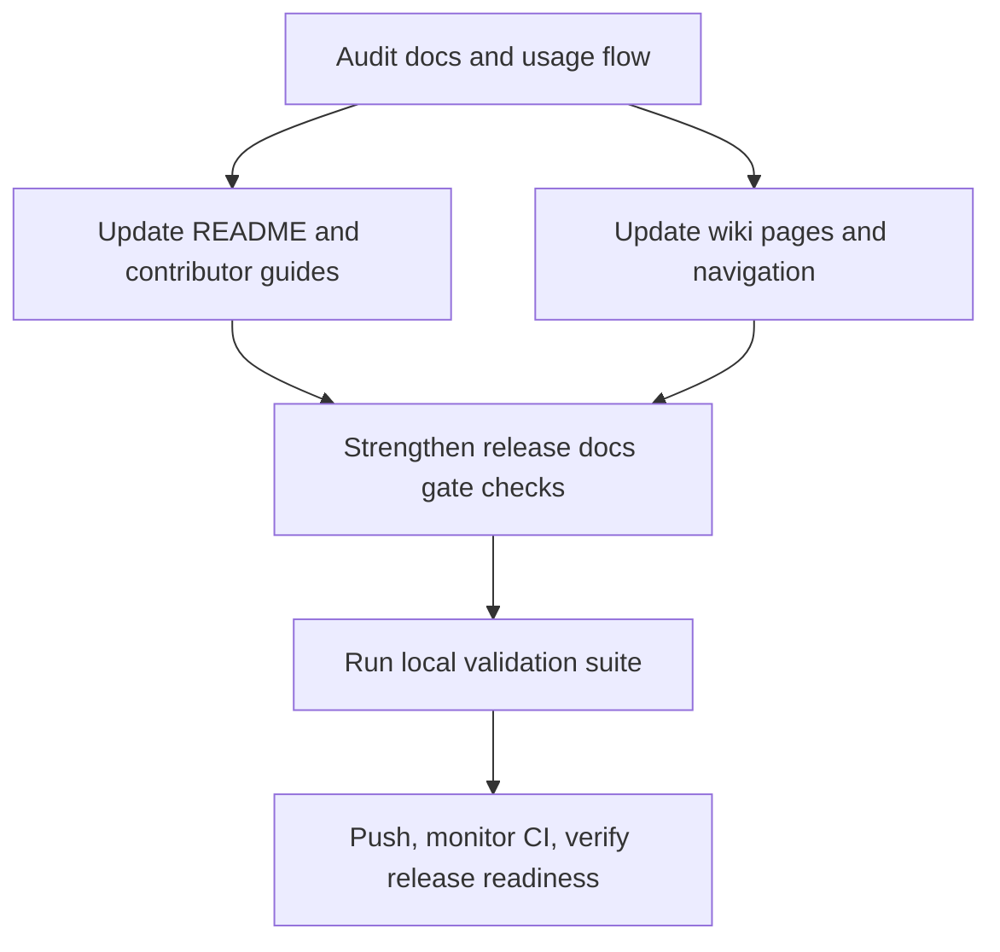

# Plan: docs-alignment-release-gate

## Goal
Align end-user and contributor documentation with the current emage.code v2 architecture and workflows, and enforce a verifiable documentation gate in CI so releases cannot be published unless required docs are updated and content-consistent with the tagged version.

## Scope
- **In scope**: root docs audit and updates (`README.md`, `CONTRIBUTING.md`, key docs in `docs/wiki/`), release-gate hardening in `.gitlab-ci.yml`, documentation validation checks, task artifacts and completion records.
- **Out of scope**: major product feature changes, non-documentation refactors, v1 content rewrite, release automation redesign beyond docs-gating requirements.
- **Assumptions**: release continues to be tag-driven (`vX.Y.Z`), `WIKI_TOKEN` remains available in CI for wiki-related operations, and canonical source remains repository markdown plus `docs/wiki/` sync flow.

## Task graph



## Agent assignments

| Task | Agent | Estimated scope |
|------|-------|-----------------|
| T025 | technical-writer | small |
| T026 | technical-writer | medium |
| T027 | technical-writer | medium |
| T028 | devops-engineer | small |
| T029 | qa-engineer | small |
| T030 | release-manager | small |

## Artifact flow

```text
T025 -> docs/artifacts/artifact-v1-doc-audit.md (consumed by: T026, T027, T028)
T026 -> README.md + CONTRIBUTING.md updates (consumed by: T029, T030)
T027 -> docs/wiki/*.md updates (consumed by: T029, T030)
T028 -> .gitlab-ci.yml docs-gate updates (consumed by: T029, T030)
T029 -> docs/artifacts/artifact-v1-doc-validation-report.md (consumed by: T030)
T030 -> docs/tasks/completed-tasks.md entries + release evidence links
```

## Risks & mitigations

| Risk | Likelihood | Impact | Mitigation |
|------|-----------|--------|-----------|
| Docs become stale again after release | medium | high | Require explicit docs marker + content checks in release pipeline |
| Wiki and repo docs diverge | medium | medium | Maintain docs/wiki as source and verify wiki-sync path in CI |
| Gate too strict and blocks valid releases | low | medium | Keep checks deterministic and document exact required files/markers |
| Incomplete user onboarding guidance | medium | high | Add concrete quick-start and release workflow sections with command examples |

## Token budget

| Phase | Budget | Spent | Remaining |
|-------|--------|-------|-----------|
| Planning | 80k | ~8k | ~72k |
| Architecture | 80k | 0 | 80k |
| Implementation | 120k | 0 | 120k |
| QA / Security / Release | 60k | 0 | 60k |

## Approval

- [x] User approved on 2026-05-23
- [ ] Plan locked; revisions create `plan-004-docs-alignment-release-gate-v2.md`
