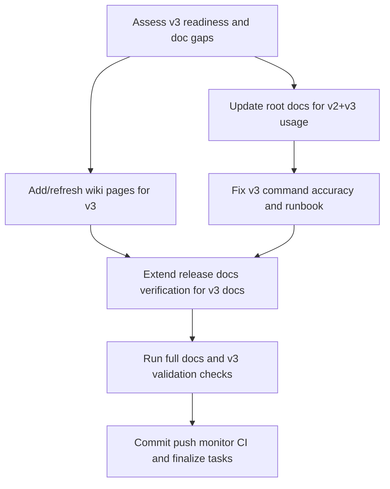

# Plan: v3-docs-readiness-alignment

## Goal
Bring user-facing and contributor-facing documentation into full alignment with the current codebase by documenting v3 usage end-to-end (install, validate, operate, and release expectations), correcting inaccurate v3 command examples, and extending release-time documentation verification so v3-critical docs are validated before release publication.

## Scope
- In scope: documentation updates in root Markdown and docs/wiki pages; v3 implementation README corrections; docs verification gate extension for v3-critical docs; validation evidence artifacts.
- Out of scope: redesign of v3 architecture, new v3 runtime feature development unless readiness checks fail during execution.
- Assumptions: v3 readiness is currently validated by passing super-gate and v3 functional tests; release process remains tag-based with existing release-docs-gate.

## Task graph

## Agent assignments

| Task | Agent | Estimated scope |
|------|-------|-----------------|
| T031 | technical-writer | small |
| T032 | technical-writer | medium |
| T033 | technical-writer | medium |
| T034 | backend-developer | small |
| T035 | devops-engineer | small |
| T036 | qa-engineer | small |
| T037 | release-manager | small |

## Artifact flow

T031 -> docs/artifacts/artifact-v2-v3-doc-gap-audit-v1.md (consumed by: T032, T033, T034, T035)
T032 -> README.md + CONTRIBUTING.md updates (consumed by: T036, T037)
T033 -> docs/wiki/home.md + docs/wiki/quick-start.md + docs/wiki/agents-overview.md + docs/wiki/v3-implementation.md (consumed by: T036, T037)
T034 -> v3/implementation/README.md corrections (consumed by: T036)
T035 -> scripts/verify-release-docs.py + .gitlab-ci.yml updates (consumed by: T036, T037)
T036 -> docs/artifacts/artifact-v3-doc-validation-report-v1.md (consumed by: T037)
T037 -> docs/tasks/completed-tasks.md updates + CI evidence links

## Risks & mitigations

| Risk | Likelihood | Impact | Mitigation |
|------|-----------|--------|-----------|
| v3 docs diverge again from implementation | medium | high | Expand deterministic release docs verification to include v3-critical docs and key content checks |
| Incorrect command examples reduce usability | medium | high | Validate every documented command during T036 and record pass/fail evidence |
| Wiki and repository docs mismatch | medium | medium | Update docs/wiki sources and verify wiki sync from develop pipeline |
| Hidden v3 readiness gap appears | low | high | If v3 gates fail in T036, pivot to implementation fix subtasks before closing |

## Token budget

| Phase | Budget | Spent | Remaining |
|-------|--------|-------|-----------|
| Planning | 80k | ~14k | ~66k |
| Architecture | 80k | 0 | 80k |
| Implementation | 120k | 0 | 120k |
| QA / Security / Release | 60k | 0 | 60k |

## Approval

- [x] User approved on 2026-05-23
- [x] Plan locked; revisions create plan-005-v3-docs-readiness-alignment-v2.md
