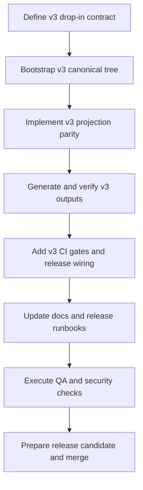

# Plan: v3 release-ready parity

## Goal
Deliver a release-ready v3 that is instantly usable in the same way as v2, including canonical knowledge, deterministic multi-platform projections, workspace conventions, validation and CI gates, and release packaging/documentation flow. "Done" means a user can copy v3 platform outputs plus shared workspace files and run the same operational workflow currently used for v2.

## Scope
- In scope: create v3 canonical projection source structure, generate v3 platform outputs, add v3 workspace docs/conventions, wire CI release-readiness gates for v3, update release docs and runbooks, validate with tests and GitLab pipelines.
- Out of scope: deprecating/removing v2, changing historical v1/v2 artifacts, introducing new external platforms beyond current v2 set.
- Assumptions: existing GitLab auth remains valid; HTTPS git remote is used for pushes (no SSH); current local edits outside v3 track (for example scripts/publish-release.py) remain untouched.

## Task graph

## Agent assignments

| Task | Agent | Estimated scope |
|------|-------|-----------------|
| T038 Define v3 drop-in contract | solution-architect | small |
| T039 Bootstrap v3 canonical tree | backend-developer | medium |
| T040 Implement v3 projection parity | backend-developer | large |
| T041 Generate and verify v3 outputs | qa-engineer | medium |
| T042 Add v3 CI gates and release wiring | devops-engineer | medium |
| T043 Update docs and release runbooks | technical-writer | medium |
| T044 Execute QA and security checks | qa-engineer + security-engineer | medium |
| T045 Prepare release candidate and merge | release-manager | small |

## Artifact flow

T038 -> docs/artifacts/v3-drop-in-contract-v1.md (consumed by T039, T040, T043)
T039 -> v3/implementation/knowledge/* + v3/implementation/platforms/* (consumed by T040, T041)
T040 -> v3/implementation/scripts/sync-v3.mjs + verify-v3.mjs + generated folders (consumed by T041, T042)
T041 -> docs/artifacts/v3-parity-validation-report-v1.md (consumed by T044, T045)
T042 -> .gitlab-ci.yml updates for v3 gates (consumed by T044, T045)
T043 -> README/wiki/release docs updates for v3 instant usage (consumed by T045)
T044 -> docs/artifacts/v3-release-readiness-gate-v1.md (consumed by T045)
T045 -> merge request + green pipelines + release-ready checklist

## Risks and mitigations

| Risk | Likelihood | Impact | Mitigation |
|------|------------|--------|------------|
| v3 projections drift on mixed Linux/Windows runners | Medium | High | enforce normalized path and newline comparisons in sync/verify, run verify in CI and locally |
| Accidental overwrite of existing v3 innovation artifacts | Medium | High | additive migration with targeted file merges; preserve runtime/registry/adapters trees |
| CI duration increases materially | Medium | Medium | stage v3 gates behind focused jobs and parallelize where possible |
| v3 docs promise parity before gates prove it | Low | High | gate docs updates behind successful parity validation artifacts |

## Token budget

| Phase | Budget | Spent | Remaining |
|-------|--------|-------|-----------|
| Planning | 80k | ~12k | ~68k |
| Architecture | 80k | 0 | 80k |
| Implementation | 120k | 0 | 120k |
| QA / Security / Release | 60k | 0 | 60k |

## Approval

- [x] User approved on 2026-05-24
- [ ] Plan locked; revisions create plan-006-v3-release-ready-parity-v2.md
