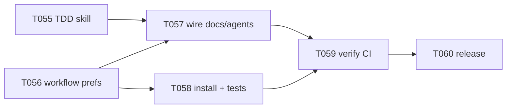

# Plan 008 — Optional TDD Enforcement & Skill Gap Closure

**Author:** orchestrator
**Date:** 2026-06-06
**Status:** draft — **awaiting user approval**
Based on: `docs/artifacts/requirements-optional-tdd-v1.md`, `docs/artifacts/research-agents-skills-ecosystem-v1.md`

## Objective

Close the largest remaining Superpowers/HackerNoon gap — **test-first implementation** — by adding a canonical TDD skill with **user-consent enforcement** (`ask` / `always` / `never`). Document and schedule other missing ecosystem features without expanding this release scope.

## Research synthesis

### HackerNoon — [12 OpenCode Skills Every Dev Team Should Steal](https://hackernoon.com/twelve-opencode-skills-every-dev-team-should-steal)

Full article body is paywalled/JS-rendered; themes align with our existing research artifact and Superpowers:

| # | Theme | emage.code today | Gap |
|---|-------|------------------|-----|
| 1 | Structured planning before code | `plan-approve-execute`, `project-planning`, `/new-project` | Partial — no dedicated `brainstorming` skill |
| 2 | Code review as first-class skill | `code-review`, `/code-review`, `validation-gates` | Covered |
| 3 | Git/worktree discipline | `worktree-isolation`, git-workflow instruction | Covered |
| 4 | Test-first implementation | `testing-strategy` (planning only) | **Gap — no TDD enforcement skill** |
| 5 | Debugging methodology | `systematic-debugging` (v4) | Covered |
| 6 | Context/memory management | `memory-management`, `context-window-management`, MCP memory | Covered |
| 7 | Security guardrails | `security-guidelines` destructive-command guards (v4) | Covered |
| 8 | Session handoff | `/handoff`, handoff schema (v4) | Covered |
| 9 | Parallel delegation | `/batch`, orchestrator subagents | Partial — no `dispatching-parallel-agents` skill |
| 10 | Skill discovery/packaging | `/discover-skills`, registry, packaging (v4) | Covered |
| 11 | Token/context pruning | `cost-token-governance` | Partial — no automatic pruning hooks |
| 12 | Verification before done | `verification-before-completion` (v4) | Covered |

**Score:** 8 covered, 3 partial, **1 major gap (TDD)**.

### Superpowers ([obra/superpowers](https://github.com/obra/superpowers)) — skill-by-skill

| Superpowers skill | emage.code equivalent | Status |
|-------------------|----------------------|--------|
| `using-superpowers` | `AGENTS.md` Skill Workflow + `/discover-skills` | Partial |
| `brainstorming` | `/plan`, `/new-project` | Partial |
| `writing-plans` | `project-planning`, task briefs | Partial |
| `executing-plans` | `plan-approve-execute` | Covered |
| `subagent-driven-development` | Orchestrator delegation model | Partial (no skill) |
| `test-driven-development` | — | **Missing** |
| `systematic-debugging` | `systematic-debugging` | Covered (v4) |
| `verification-before-completion` | `verification-before-completion` | Covered (v4) |
| `receiving-code-review` | `receiving-code-review` | Covered (v4) |
| `requesting-code-review` | `code-review` skill | Partial |
| `using-git-worktrees` | `worktree-isolation` | Covered |
| `finishing-a-development-branch` | `release-workflow` | Partial |
| `dispatching-parallel-agents` | `/batch` | Partial |

### obra TDD skill — key behaviors to adopt

From [test-driven-development/SKILL.md](https://raw.githubusercontent.com/obra/superpowers/main/skills/test-driven-development/SKILL.md):

- **Iron Law:** no production code without a failing test first
- **RED → verify fail → GREEN → verify pass → REFACTOR** cycle
- Mandatory "watch the test fail" verification
- Rationalization table and red-flag stop conditions
- Verification checklist before marking work complete
- Integration with debugging: bugs get a failing test first

### emage.code adaptation — optional enforcement

Superpowers is **always-on**. emage.code adds a consent layer:

```yaml
# docs/emage-workflow.yaml (consumer project)
workflow:
  tdd_enforcement: ask   # ask | always | never
```

| Mode | Behavior |
|------|----------|
| `ask` (default) | Before implementation, agent asks user whether to enforce strict TDD for this task. User yes → full Iron Law; no → `testing-strategy` + `verification-before-completion` only. |
| `always` | `test-driven-development` joins mandatory Skill Workflow row (like `systematic-debugging`). |
| `never` | Skill available via `/discover-skills` but not prompted or mandatory. |

This mirrors [OpenCode skill permissions `ask`](https://opencode.ai/docs/skills/): user approval before loading strict process.

## Scope (v6.1.0 target)

## Active Task Linkage

- T235 (SIA executor production integration) remains on the active board and is tracked as an implementation follow-up dependency during this planning wave.

### In scope

1. Canonical `test-driven-development` skill (Superpowers-derived + optional mode section)
2. `docs/emage-workflow.yaml` template + install/update merge
3. `AGENTS.md` conditional mandatory rule
4. Updates: orchestrator agent, `discover-skills`, `new-project`, `install.sh` post-install hint
5. Registry regen, sync/verify, functional test for workflow merge
6. Release brief + research artifact status update

### Out of scope (v6.x / v7 backlog)

- `brainstorming`, `using-superpowers`, `subagent-driven-development`, `finishing-a-development-branch` skills
- Dynamic context pruning automation
- Pi extension bridge, plan annotation UI, OPA/Rego policy
- Changing Superpowers plugin behavior in Cursor (consumer-side only)

## Technical approach

### 1. TDD skill authoring

- Source: obra/superpowers TDD skill (MIT-compatible methodology)
- Add section **"Optional enforcement (emage.code)"** after Overview
- Cross-reference `testing-strategy` (when to plan tests) and `verification-before-completion` (evidence before done)
- Keep skill under ~250 lines; link rationalization table, don't duplicate `testing-strategy` pyramid

### 2. Workflow preferences

```
implementation/docs/emage-workflow.yaml     → template (canonical)
implementation/runtime/workflow/schema-v1.json → optional validation
scripts/merge-workflow-config.py             → update merge (preserve user values)
```

Merge logic mirrors `merge-task-docs.py`: seed missing keys, never overwrite existing `tdd_enforcement`.

### 3. Wiring points

```mermaid
flowchart TD
    install[install.sh] --> wf[docs/emage-workflow.yaml]
    newproj[/new-project] --> wf
    orch[Orchestrator delegation] --> read[Read workflow prefs]
    read --> ask{tdd_enforcement?}
    ask -->|ask| prompt[Prompt user per task]
    ask -->|always| tdd[TDD mandatory in brief]
    ask -->|never| skip[Skip TDD gate]
    discover[/discover-skills] --> table[Mandatory/Suggested table]
    agents[AGENTS.md Skill Workflow] --> always[tdd_enforcement always row]
```

### 4. Orchestrator delegation addition

When assigning implementation tasks to `backend-developer` / `frontend-developer`:

```markdown
## Workflow constraints
- Read `docs/emage-workflow.yaml`
- tdd_enforcement: <ask|always|never>
- Per-task TDD decision: <pending|enabled|declined>  # if ask
- If enabled/always: load `test-driven-development` before writing production code
```

## Task breakdown

| ID | Title | Assignee | Priority | Depends on | Effort |
|----|-------|----------|----------|------------|--------|
| T055 | Author `test-driven-development` skill | backend-developer | P0 | — | M |
| T056 | Workflow prefs template + merge script | backend-developer | P0 | — | M |
| T057 | Wire AGENTS.md, commands, orchestrator | technical-writer | P0 | T055, T056 | S |
| T058 | install.sh integration + functional tests | backend-developer | P0 | T056 | M |
| T059 | Registry, sync, verify, CI green | qa-engineer | P0 | T055–T058 | S |
| T060 | Release v6.1.0 docs + research update | release-manager | P1 | T059 | S |

## Dependency graph



## Risks and mitigations

| Risk | Mitigation |
|------|------------|
| Superpowers TDD too strict for some teams | Default `ask`; document `never` for PoC track |
| Skill duplication with `testing-strategy` | Clear split: strategy = plan; TDD = implement loop |
| `--update` overwrites workflow prefs | Merge script + functional test (same class as v6.0.2 ledger fix) |
| Platform folders edited by hand | Edit `implementation/knowledge/` only; run sync |

## Token budget

| Phase | Budget |
|-------|--------|
| Planning (this doc) | ~15k |
| Implementation | ≤80k |
| QA + release | ≤30k |

## Approval

**Shall I proceed with this plan?** You can:

- **APPROVE** — create task briefs T055–T060 and begin implementation
- **APPROVE_WITH_CHANGES** — specify adjustments (e.g. default `never`, different file path)
- **REJECT** — cancel or replan

Recommended default: **APPROVE** with `tdd_enforcement: ask`.
