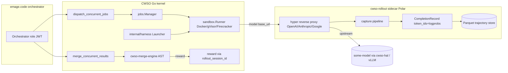
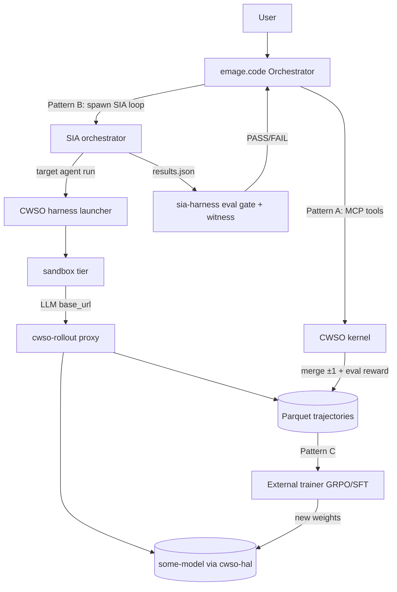
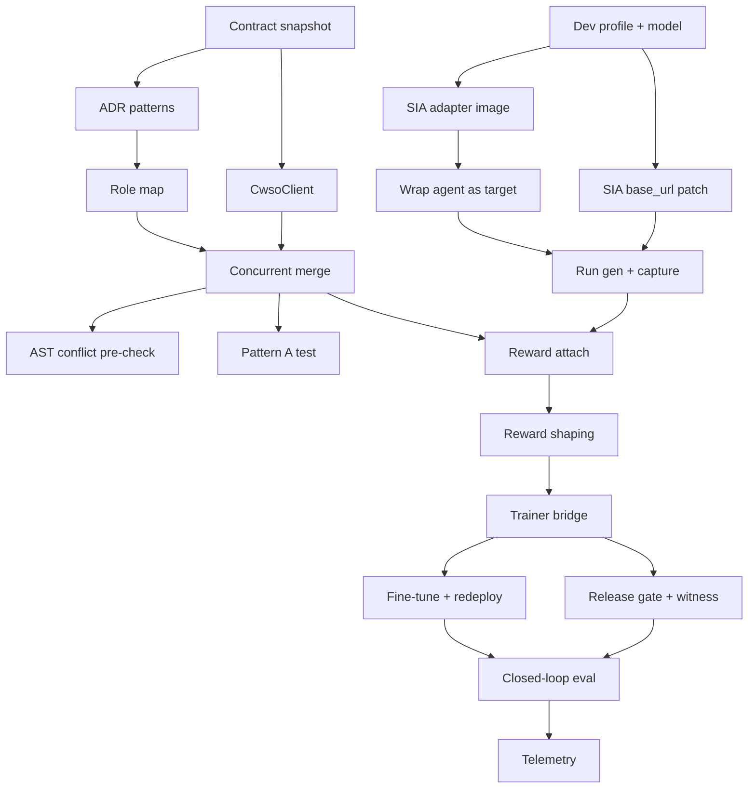

# Plan 009 — emage.code × CWSO × SIA: Self-Improving Coding Swarm with RL Capture

> Owner: orchestrator · Status: **approved — execution started** · Date: 2026-06-19
> Based on: live inspection of CWSO `v0.4.1` MCP server (`http://127.0.0.1:8080/mcp`),
> CWSO source on disk, SIA `sia-agent 0.2.1`, `sia-harness 0.1.0`, and `emage.code` v3 conventions (`AGENTS.md`).
> Supersedes and replaces the earlier (ungrounded) Plan 009 + six companion artifacts, now deleted.

---

## 0. Why this plan is different from the previous one

The previous Plan 009 and its companion documents were written **without inspecting the running
system**. They asserted tools that do not exist (`spawn_python_sandbox`), fabricated benchmark and
cost figures, and assumed Polar was unbuilt. This plan is grounded in **direct evidence**: a live MCP
handshake, the real tool schemas, the Rust rollout source, the Go harness launcher, and the SIA
agent backends. Every capability claim below is traceable to a file path or a live probe result.

### Evidence captured during analysis

| Claim | Evidence |
|-------|----------|
| CWSO exposes **11 MCP tools**, not the assumed set | `tools/list` over authenticated HTTP at `:8080/mcp` |
| Auth is **JWT bearer**, role-gated (`orchestrator` planning tier, `worker` worker tier) | `401 missing bearer token`; `403 unrecognised role` for `planner`; `200` for `orchestrator` |
| Permission gate is **enforced server-side** | `commit_shadow` returned `-32002 role "orchestrator" may not invoke tool` |
| Shadow + AST path **works live** | `create_shadow_workspace` → `write_shadow_file` (88 B, blob OID) → `query_ast find_definition` returned exact Go AST hit → `drop` |
| **Polar / rollout is already implemented (GA)** | `services/cwso-rollout/src/{main,capture,record,store}.rs`; Phase 9 marked **complete** in `docs/plans/plan-cwso-nextgen-phase6plus.md` |
| CWSO already has a **harness launcher** that points agent `base_url` at the rollout proxy | `orchestrator/internal/harness/{launcher,registry,runtime}.go` |
| Harness adapters for `codex`/`claude_code`/`qwen_code` are **stubs** (alpine echo); `shell-command` is the only real one | `orchestrator/internal/harness/registry.go` |
| `merge_concurrent_results` already carries a **reward hook** | schema field `rollout_session_id` — "programmatic reward attachment (T136)" |
| SIA target agents call LLMs via **claude-agent-sdk** or **openhands LLM** (litellm) | `sia/sia/util.py` `run_agent_claude` / `run_agent_openhands` |
| sia-harness is a **governance scaffold**, not a trainer (only a `ping` MCP tool today) | `sia-harness/src/mcp/tools.ts`, `src/agents/*.ts` are persona prompts |

---

## 1. Goal

Combine the four systems into one closed loop where **emage.code orchestrates**, **CWSO executes and
merges deterministically while capturing RL trajectories (Polar)**, **SIA drives self-improvement**,
and an **open-weight `<some-model>`** is fine-tuned from the captured trajectories — all gated by
**sia-harness** provenance and release gates.

"Done" for this plan = an approved, phased roadmap (this document) plus a **working Pattern-A
integration** (emage.code driving CWSO's 11 MCP tools for deterministic concurrent merge) and a
**validated PoC of the capture loop** (a SIA generation whose agent LLM calls are captured by
cwso-rollout into the Parquet trajectory store with a merge-derived reward attached).

---

## 2. Direct answer to the framing questions

### 2.1 "How could emage.code and CWSO usefully be combined?"

Three composable patterns, in increasing order of ambition and risk:

- **Pattern A — CWSO as emage.code's deterministic execution & merge backend.**
  emage.code's orchestrator already decomposes work into parallel agent tasks. Today those tasks
  touch the real filesystem and risk merge conflicts. Route them through CWSO's
  `create_shadow_workspace` → `write_shadow_file` → `merge_concurrent_results` instead. Each agent
  gets an isolated in-memory libgit2 workspace; results merge via the AST-semantic engine with
  explicit conflict heuristics. **Usable today, zero new infrastructure** — only an MCP client and a
  mapping from emage.code agent roles to CWSO dispatch jobs.

- **Pattern B — SIA self-improvement loop, executed on CWSO, captured by Polar.**
  Wrap an emage.code agent (or a coding harness) as a SIA *target agent*. SIA's
  meta→target→feedback loop proposes improvements across generations. Run each generation through
  CWSO's harness launcher so the agent's model `base_url` points at `cwso-rollout`; every completion
  is captured (token IDs + logprobs) and the merge outcome attaches a reward. **No weight updates
  yet** — this is "SIA-H" (harness-only self-improvement) and is cheap and safe.

- **Pattern C — Weight updates ("SIA-W") from Polar trajectories.**
  Feed the Parquet trajectory store to an external trainer that fine-tunes a local open-weight
  `<some-model>` (GRPO/SFT). Redeploy behind cwso-hal, repeat. sia-harness governs the
  curate→train→eval→deploy lifecycle with release gates and witness provenance. **Highest value,
  highest cost; only justified once trajectory volume and eval gates exist.**

### 2.2 "Would it be better to first finish implementation of Polar in CWSO?"

**No — Polar does not need finishing; it is already implemented and GA.** The CWSO next-gen roadmap
marks Phase 9 (Rollout-as-a-Service, "Polar") **complete**, shipped in the `v0.3.0 → v0.4.1` line.
The rollout sidecar (`cwso-rollout`) implements the four-step capture pipeline (detect → normalize →
forward+store → denormalize), the `CompletionRecord` (`prompt_token_ids`, `sampled_token_ids`,
`logprobs`, `finish_reason`, `timestamp_ns`), an async **Parquet** trajectory store, a KV prefix
cache with **differential prompting** (T150, done), **offline SFT generation mode** (T151, done), and
a **programmatic reward hook** (`merge_concurrent_results.rollout_session_id`, T136). T163 "Polar
parity validation gate" is **done**.

What is genuinely *incomplete* — and is therefore the real work — is **not Polar itself** but the
pieces that turn Polar into a usable training loop:

1. **Real harness adapter images.** `codex`, `claude_code`, `qwen_code` adapters in
   `orchestrator/internal/harness/registry.go` are alpine `echo` stubs. A real SIA/agent image is
   needed.
2. **The external trainer.** Polar emits trajectories and rewards; nothing consumes them yet to
   update weights. This is the SIA-W half.
3. **Reward shaping beyond merge ±1.** Today reward is the merge state machine (+1/−1, GRPO). Task
   eval signals (from SIA `evaluate.py` / sia-harness eval gate) need to feed reward too.

**Recommendation:** Do **not** spend effort "finishing Polar." Spend it on (1) Pattern A (immediate
value, no new infra), then (2) the harness-adapter + capture PoC (Pattern B), and only then (3) the
trainer bridge (Pattern C). Polar is a dependency that is already satisfied.

### 2.3 "Use /home/emage/sia as model and /home/emage/sia-harness to train/improve the stack"

- **SIA (`sia-agent 0.2.1`)** is the *control loop*, not a model. Its value is the
  meta/target/feedback generational improvement and the `evaluate.py → results.json` contract. We use
  it to drive Pattern B/C. Its backends (`claude`, `openhands`) are routable to the rollout proxy via
  `ANTHROPIC_BASE_URL` / `OPENAI_BASE_URL` / openhands `base_url`.
- **`<some-model>`** is a *separate* local open-weight model (e.g. a Qwen2.5-Coder-class model) served
  via vLLM behind **cwso-hal**, fronted by **cwso-rollout**. This is the artifact that actually gets
  fine-tuned from captured trajectories. SIA chooses/improves the *harness*; the trainer improves the
  *weights*; together they are SIA-W+H.
- **sia-harness (`0.1.0`)** is the *governance and provenance* layer (persona agents
  curator/trainer/evaluator/deployer, release gates, Ed25519 witness signing, agentdb memory). It is
  **not** a training engine. We use it to gate and sign the curate→train→eval→deploy steps of
  Pattern C, not to run training.

---

## 3. System reality map (grounded)

### 3.1 CWSO live MCP tool surface (11 tools)

| Tool | Tier | Key args | Purpose |
|------|------|----------|---------|
| `read_file_sync` | read | `path` | Read file under workspace root |
| `write_file_sync` | worker | `path`, `content` | Write file under workspace root |
| `list_dir` | read | `path` | List directory |
| `create_shadow_workspace` | planning | `base_commit_sha?` | Allocate in-memory libgit2 workspace → `workspace_uuid`, `base_tree_oid` |
| `write_shadow_file` | worker | `workspace_uuid`, `path`, `content` | Stage file in shadow ODB → blob OID |
| `read_shadow_file` | read | `workspace_uuid`, `path` | Read from shadow ODB |
| `commit_shadow` | worker | `workspace_uuid`, `message` | Commit staged files → commit + tree OID |
| `drop_shadow_workspace` | planning | `workspace_uuid` | Free workspace |
| `query_ast` | read | `workspace_uuid`, `path`, `query_type∈{find_definition,find_references,extract_signature,list_exports,detect_entrypoints}`, `target_symbol?` | Tree-sitter AST query (Go/Python/Rust/TS) |
| `dispatch_concurrent_jobs` | planning | `jobs[]={agent_role, objective_prompt, target_workspace_uuid, sandbox_profile?}`, `execution_timeout_seconds` | Async fan-out of agent jobs; server enforces sandbox routing (callers cannot escalate to `docker-trusted`) |
| `merge_concurrent_results` | worker | `source_workspace_uuids[]`, `merge_inputs[]={path,language,base_content,ours_content,theirs_content}`, `auto_resolve_heuristic∈{ast_semantic_only,prefer_theirs,prefer_ours,fail_rapidly_on_conflict}`, `target_branch_ref?`, `rollout_session_id?` | Semantic AST merge with reward attachment |

Auth: `Authorization: Bearer <HS256 JWT>` with claims `{role, iss:"cwso", aud:["cwso-mcp"], exp}`.
Dev secret lives in `CWSO/.env.jwt.dev`. Rate limit ≈ 60 req/min, burst 1 (pace ≥ ~1.05 s).

### 3.2 CWSO execution & capture internals



- `dispatch_concurrent_jobs` enqueues jobs; when a runner is wired, each job runs a sandbox container
  with env `CWSO_AGENT_ROLE`, `CWSO_OBJECTIVE_PROMPT`, `CWSO_TARGET_WORKSPACE`, `CWSO_DISPATCH_*` and
  the requested `SandboxProfile`. (`orchestrator/internal/tools/dispatch_tools.go`.)
- `internal/harness/launcher.go` launches a registered adapter image, mounts the workspace at
  `/workspace`, injects the prompt as `CWSO_HARNESS_PROMPT`, and **rewrites the model base URL env**
  (`OPENAI_BASE_URL` / `ANTHROPIC_BASE_URL`) to the `cwso-rollout` proxy. This is the capture seam.
- `cwso-rollout` proxies provider calls, captures `CompletionRecord`s, fans them out to the Parquet
  store, and supports KV prefix differential prompting. Gated by `CWSO_ROLLOUT_*` env (default off).

### 3.3 SIA loop (control plane)

```
gen_1: (meta_agent, reference_target_agent) → target_agent_1 → run → evaluate.py → results.json
gen_n: (feedback_agent, target_agent_{n-1}) → target_agent_n → run → evaluate.py → results.json
```

- Backends: `claude` (claude-agent-sdk, honors `ANTHROPIC_BASE_URL`), `openhands`
  (`openhands.sdk.LLM`, litellm — accepts `base_url`; SIA does not pass one **yet**).
- Per-task contract: `tasks/<name>/data/public/evaluate.py` exposes `evaluate(submission)→dict` and
  writes `results.json`. This is the natural reward source for Pattern C.

### 3.4 sia-harness (governance plane)

- Node/TS MCP server; agents are persona prompts (`data-curator`, `trainer`, `evaluator`,
  `deployer`); primitives: `learning`, `witness` (Ed25519 provenance), `releaseGates`, `memory`
  (agentdb), `routing` 3-tier. MCP tool surface today: only `ping`. Use as the **release-gate +
  provenance wrapper** around training, not as a trainer.

---

## 4. Target architecture (combined)



Boundary of ownership:
- **emage.code**: task decomposition, delegation, validation-gate verdicts, checkpoints.
- **CWSO**: isolation, AST merge, concurrency, trajectory capture, reward emission, HAL serving.
- **SIA**: generational self-improvement control loop + eval contract.
- **`<some-model>` + trainer**: the weights and their fine-tuning.
- **sia-harness**: provenance signing + release gates for the train/deploy steps.

---

## 5. Scope

- **In scope**
  - MCP client adapter from emage.code → CWSO (Pattern A).
  - Concurrent-merge orchestration pattern + role/permission mapping.
  - A real SIA harness-adapter image and the capture PoC (Pattern B).
  - Reward shaping that combines merge outcome + task eval.
  - Trainer bridge design + sia-harness release-gate/witness wrapping (Pattern C, design + thin slice).
- **Out of scope (this plan)**
  - Re-implementing or "finishing" Polar (already GA).
  - Building a new sandbox or merge engine (use CWSO's).
  - Production multi-tenant model serving at scale (later plan).
  - Any change to CWSO core that destabilizes its GA gates.
- **Assumptions**
  - The CWSO `v0.4.1` MCP contract (11 tools, JWT roles) stays stable for the integration window.
  - We can run CWSO with `CWSO_ROLLOUT_*` flags enabled in a dev profile.
  - A local open-weight `<some-model>` can be served via vLLM behind cwso-hal (OpenAI-compatible).
  - Secrets (JWT secret, provider keys) are provided via env/files, never committed.

---

## 6. Phased roadmap

> Task IDs continue emage.code's sequence. Scope sizing is S/M/L (no fabricated cost figures).
> Each phase ends at an emage.code validation gate (`PASS`/`CONDITIONAL_PASS`/`FAIL`).

### Phase 0 — Spike & contract lock (validate before building)

| ID | Title | Owner | Scope | Output |
|----|-------|-------|-------|--------|
| T201 | Live MCP contract snapshot + auth helper | backend-developer | S | `cwso-mcp-contract-v1.md`, reusable JWT/HTTP client |
| T202 | Decision record: integration patterns A/B/C + Polar-already-done finding | solution-architect | S | `ADR-0xx-cwso-sia-integration.md` |
| T203 | Stand up CWSO dev profile with rollout enabled + `<some-model>` via vLLM/HAL | devops-engineer | M | running `:8080/mcp` + rollout proxy + model endpoint |

Gate 0 (tech-lead): contract snapshot matches live server; rollout proxy captures a hand-made call.

### Phase 1 — Pattern A: CWSO as deterministic execution & merge backend (usable now)

| ID | Title | Owner | Scope | Depends |
|----|-------|-------|-------|---------|
| T210 | `CwsoClient` library (initialize, tools/call, role-aware JWT, rate-limit pacing) | backend-developer | M | T201 |
| T211 | Map emage.code agent roles → CWSO tiers (orchestrator=planning, workers=worker) | solution-architect | S | T202 |
| T212 | Concurrent-merge orchestration: N workers → N shadow workspaces → `merge_concurrent_results` | backend-developer | L | T210, T211 |
| T213 | `query_ast`-driven conflict pre-check + heuristic selection per language | backend-developer | M | T212 |
| T214 | Integration test: 3 agents edit a Go/Python repo, deterministic merge, zero manual conflicts | qa-engineer | M | T212 |

Gate 1 (tech-lead + qa): a real emage.code multi-agent task completes through CWSO shadow workspaces
with a deterministic semantic merge and an audit trail (commit/tree OIDs).

Artifacts: `cwso-emagecode-adapter-v1.md`, `merge-orchestration-v1.md`.

### Phase 2 — Pattern B: SIA loop on CWSO with Polar capture (harness-only, no weight updates)

| ID | Title | Owner | Scope | Depends |
|----|-------|-------|-------|---------|
| T220 | Real harness-adapter image for SIA target agent (replaces `claude_code`/`qwen_code` stub) | backend-developer | M | T203 |
| T221 | Patch SIA `openhands` backend to honor `LLM_BASE_URL`/`base_url` (claude already honors `ANTHROPIC_BASE_URL`) | backend-developer | S | T203 |
| T222 | Wrap one emage.code agent as a SIA target agent + author `evaluate.py` for it | backend-developer | M | T220 |
| T223 | Run a SIA generation through CWSO harness launcher; confirm trajectories land in Parquet store | qa-engineer | M | T220, T221, T222 |
| T224 | Attach reward: pass `rollout_session_id` through `merge_concurrent_results`; verify reward record | backend-developer | M | T223, T212 |
| T225 | Reward shaping: combine merge ±1 with `results.json` eval metric | backend-developer | M | T224 |

Gate 2 (tech-lead + security): one SIA generation's LLM calls are captured with token IDs + logprobs,
a merge-derived + eval-derived reward is attached, and **no provider secrets** are persisted in
trajectories or logs (security review of capture path).

Artifacts: `sia-target-adapter-v1.md`, `reward-shaping-v1.md`, `capture-poc-report-v1.md`.

### Phase 3 — Pattern C: weight updates from trajectories (SIA-W), governed by sia-harness

| ID | Title | Owner | Scope | Depends |
|----|-------|-------|-------|---------|
| T230 | Trainer bridge: read Parquet trajectory store → GRPO/SFT dataset (reuse T151 offline mode) | backend-developer | L | T225 |
| T231 | Fine-tune `<some-model>` (LoRA/GRPO) offline; redeploy behind cwso-hal | backend-developer | L | T230 |
| T232 | sia-harness release gate + Ed25519 witness signing around curate→train→eval→deploy | devops-engineer | M | T230 |
| T233 | Closed-loop eval: N SIA generations against a fixed held-out task; measure deltas | qa-engineer | M | T231, T232 |
| T234 | Cost/latency telemetry per generation (tokens, proxy overhead, sandbox time) | devops-engineer | M | T233 |

Gate 3 (tech-lead + qa + security): a redeployed fine-tuned model is produced through a
witness-signed, release-gated pipeline; held-out eval shows a measured (not assumed) delta; rollback
path verified.

Artifacts: `trainer-bridge-v1.md`, `closed-loop-eval-report-v1.md`, signed `witness.json`.

### Phase 4 — Productization (separate approval)

Observability dashboards, multi-task scheduling, model registry, multi-tenant serving, autoscaling.
Deferred; out of scope until Phases 1–3 demonstrate value.

---

## 7. Task graph



## 8. Agent assignments

| Phase | Lead agents |
|-------|-------------|
| 0 | solution-architect, devops-engineer, backend-developer |
| 1 | backend-developer, solution-architect, qa-engineer |
| 2 | backend-developer, qa-engineer, security-engineer |
| 3 | backend-developer, devops-engineer, qa-engineer, security-engineer |

## 9. Artifact flow

```
T201 → cwso-mcp-contract-v1.md         (consumed by: T210, T220)
T202 → ADR-0xx-cwso-sia-integration.md (consumed by: all)
T212 → cwso-emagecode-adapter-v1.md    (consumed by: T224, T230)
T225 → reward-shaping-v1.md            (consumed by: T230)
T230 → trainer-bridge-v1.md            (consumed by: T231, T233)
T233 → closed-loop-eval-report-v1.md   (consumed by: release gate)
```

---

## 10. Risks & mitigations

| Risk | Likelihood | Impact | Mitigation |
|------|-----------|--------|-----------|
| CWSO MCP contract drifts during integration | Low | High | Pin to `v0.4.1`; T201 snapshot test runs in CI; version the adapter |
| Provider secrets leak into captured trajectories/logs | Medium | Critical | Security review at Gate 2; capture only token IDs/logprobs (no raw keys); scrub headers; `CompletionRecord` already omits auth |
| Sandbox routing can't reach `docker-trusted` (by policy) | High (by design) | Low | Use `gvisor-fast-ephemeral`/`firecracker-secure-isolation`; never rely on escalation |
| AST semantic merge can't resolve a conflict | Medium | Medium | `fail_rapidly_on_conflict` heuristic + 3-way fallback + escalate to human/agent fix task |
| Weight-update loop overfits or regresses | Medium | High | sia-harness held-out eval gate (T233); witness-signed, reversible deploy; rollback path mandatory |
| Generational cost runs away | Medium | Medium | `max_gen` cap + convergence stop on `results.json` plateau; telemetry T234 |
| Rate limiting throttles orchestration | High | Low | Pace ≥1.05 s/req; batch via `dispatch_concurrent_jobs`; raise limit only in trusted dev profile |
| Scope creep into "finishing Polar" | Medium | Medium | Explicit non-goal (§2.2); Polar is GA — consume, don't rebuild |

## 11. Security constraints (non-negotiable)

- No secrets committed (JWT secret, provider keys via env/files only).
- Capture path must never persist provider auth material; verified at Gate 2.
- Permission tiers enforced server-side (already true — `commit_shadow` rejected for planning tier).
- Fine-tuned model deploys are reversible and witness-signed before promotion.
- All external input (objective prompts, merge inputs) validated at the adapter boundary.

## 12. Token budget (emage.code governance)

| Phase | Planning | Implementation | QA / Security / Release |
|-------|----------|----------------|-------------------------|
| 0 | ≤80k | — | — |
| 1 | ≤80k | ≤120k | ≤60k |
| 2 | ≤80k | ≤120k | ≤60k |
| 3 | ≤80k | ≤120k | ≤60k |

## 13. Recommendation

1. **Approve Pattern A first** (Phase 1). It delivers immediate, low-risk value using only the live
   MCP tools — deterministic concurrent merges for emage.code multi-agent tasks.
2. **Then run the Phase 2 capture PoC** (one SIA generation captured by Polar with a shaped reward).
   This validates the entire self-improvement substrate cheaply, with **no weight updates**.
3. **Defer Pattern C (weight updates)** until Phase 2 proves trajectory quality and the eval gate is
   trustworthy. Only then is fine-tuning `<some-model>` justified.
4. **Do not "finish Polar."** It is GA. The real gaps are the harness-adapter image, the trainer
   bridge, and reward shaping — all addressed above.

## 14. Approval

- [x] User approved on 2026-06-19
- [x] Plan locked; revisions create `plan-009-cwso-emagecode-sia-integration-v2.md`
- Tasks T201–T234 created in `docs/tasks/active-tasks.md` with per-task briefs.

---

## Appendix A — Reproduce the live probe

```bash
# From the CWSO repo (uses the dev JWT secret in .env.jwt.dev):
cd /home/emage/Code/emage/CWSO
SECRET=$(cat .env.jwt.dev)
# Mint an HS256 JWT with claims {role:"orchestrator", iss:"cwso", aud:["cwso-mcp"], exp:+600}
# then: POST /mcp {"method":"tools/list"} with Authorization: Bearer <jwt>,
#       Accept: application/json, text/event-stream, Origin: http://localhost
# Observed: 11 tools; orchestrator=planning tier, worker=worker tier; ~60 req/min burst 1.
```

## Appendix B — Key source references

- MCP tools & dispatch: `CWSO/orchestrator/internal/tools/dispatch_tools.go`
- Harness launcher (capture seam): `CWSO/orchestrator/internal/harness/{launcher,registry,runtime}.go`
- Rollout/Polar sidecar: `CWSO/services/cwso-rollout/src/{main,capture,record,store}.rs`
- Next-gen plan (Polar = Phase 9, complete): `CWSO/docs/plans/plan-cwso-nextgen-phase6plus.md`
- SIA loop & backends: `sia/sia/{orchestrator,util}.py`; eval contract: `sia/EVALUATION_GUIDE.md`
- sia-harness governance: `sia-harness/src/{agents/*,mcp/tools.ts}`, `sia-harness/package.json`
