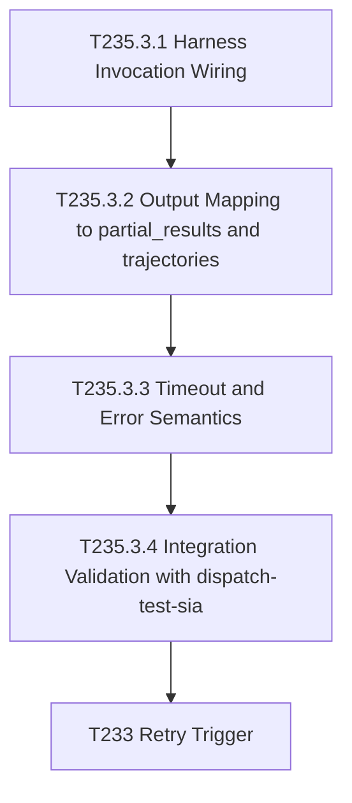

# Plan 010 - T235 Phase 3.3 Real Harness Wiring

Owner: orchestrator
Status: draft - awaiting approval
Date: 2026-06-23
Based on: docs/plans/plan-009-cwso-emagecode-sia-integration.md, docs/tasks/task-T235.md, docs/tasks/active-tasks.md

## Goal

Unblock terminal completion for T233 by implementing T235 Phase 3.3 in the executor path: replace mock execution in implementation/scripts/sia-executor.py with real SIA harness invocation via the existing adapter entrypoint, map harness outputs into rollout result payloads, and validate end-to-end task completion signals needed by closed-loop evaluation.

## Task Graph

## Agent Assignments

- backend-developer: implement executor runtime wiring and output mapping in implementation/scripts/sia-executor.py and related adapter integration points.
- qa-engineer: run integration validation and produce evidence for completion/unblock status.

## Artifact Flow

- Input: implementation/adapters/sia-target/harness-entrypoint.py
- Input: implementation/adapters/sia-target/reward_attachment.py
- Input: implementation/scripts/dispatch-test-sia.py
- Output: implementation/scripts/sia-executor.py (real harness execution path)
- Output: docs/artifacts/t235-phase3.3-validation-report-v1.md
- Output: updated task board state and blocker resolution note for T233 if validated

## Work Packages

### T235.3.1 Harness Invocation Wiring

Objective:
- Replace mock sleep path in execute_session with subprocess invocation of the SIA harness entrypoint.

Acceptance:
- execute_session invokes real harness path every assigned task run.
- No mock-only execution remains in critical path.

### T235.3.2 Output Mapping

Objective:
- Parse harness output and map to executor report payload.

Acceptance:
- partial_results includes real fields from harness output (code/eval/error summary).
- trajectories includes trace or step artifacts when available.

### T235.3.3 Timeout and Error Semantics

Objective:
- Add explicit execution timeout handling and stable error payloads.

Acceptance:
- Default timeout 120s configurable by env/flag.
- Timeout and harness failures are reported with structured error payloads (not silent).

### T235.3.4 Integration Validation

Objective:
- Validate dispatch to executor to result reporting path with real execution mode.

Acceptance:
- dispatch-test-sia without mock mode progresses beyond running and yields executor-side result artifact.
- Evidence captured in artifact report with command outputs.

## Risks and Mitigations

- Risk: harness entrypoint env mismatch with executor task_spec.
  Mitigation: add explicit mapping layer and defaults in executor before invocation.

- Risk: long-running harness tasks cause rollout timeouts.
  Mitigation: configurable timeout plus structured timeout result payload and retry guidance.

- Risk: partial output parsing failures.
  Mitigation: tolerant parsing with fallback to raw stderr/stdout snapshot.

## Token Budget

- Planning: 10k
- Implementation: 45k
- Validation: 20k
- Total: 75k max for this phase slice

## Definition of Done

- T235 Phase 3.3 implementation committed and pushed via feature branch workflow.
- CI green for touched branches.
- Validation artifact confirms real harness invocation path executed.
- T233 blocker status updated to ready for rerun (or clearly documented residual blocker if any).
