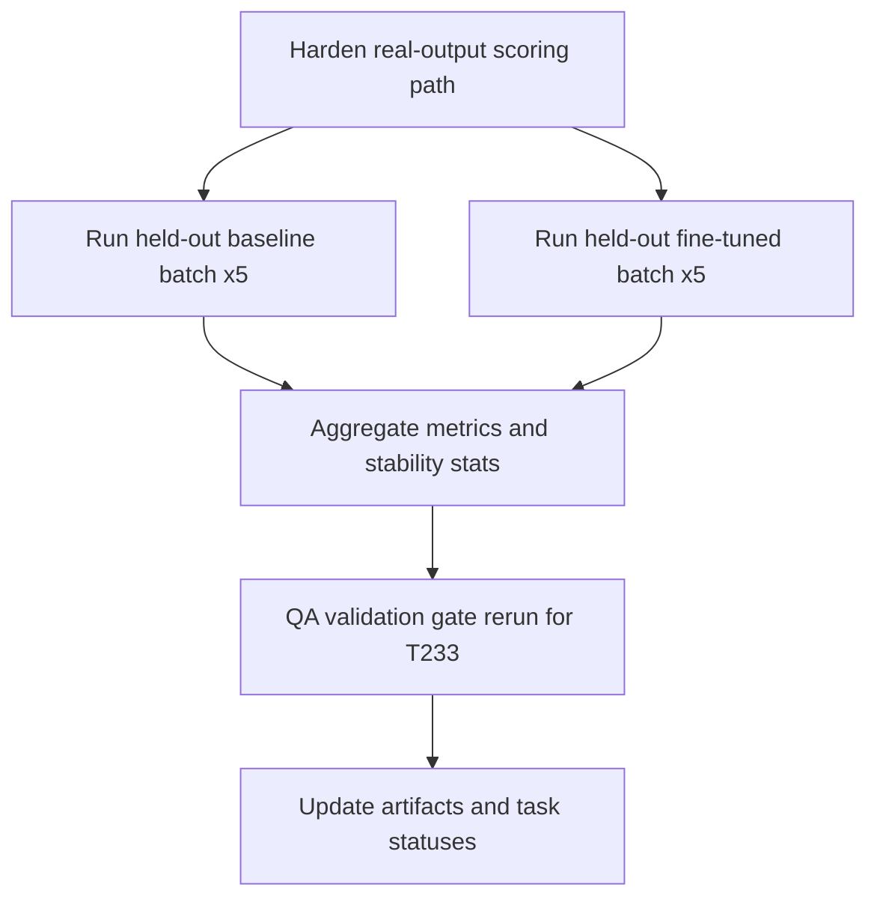

# Plan: T237/T233 Production-Credible Held-Out Evaluation Closeout

## Goal
Complete T237 and unblock/close T233 by replacing synthetic discrimination behavior with real-output-only evaluation evidence, then executing a reproducible held-out baseline vs fine-tuned run set (>= 5 per group), publishing stability metrics, and issuing a QA gate-ready recommendation for promotion or rollback.

## Scope
- **In scope**: finalize model-agnostic scoring path, run bounded held-out batches, collect per-run artifacts, compute stability statistics (mean/median/variance), update evaluation report and task briefs, run QA validation gate evidence pack for T233.
- **Out of scope**: retraining models, redesigning evaluator architecture, unrelated task board reconciliation, non-T233 performance initiatives.
- **Assumptions**: runtime stack is available, evaluator contract remains stable, API/model endpoints are reachable for repeated runs.

## Task graph



## Agent assignments

| Task | Agent | Estimated scope |
|------|-------|-----------------|
| T237A | backend-developer | medium |
| T237B | qa-engineer | medium |
| T237C | qa-engineer | medium |
| T237D | qa-engineer | small |
| T233G | qa-engineer + tech-lead (review) | small |
| T237E | technical-writer | small |

## Artifact flow

```
T237A -> implementation/adapters/sia-target/harness-entrypoint.py
      -> tests/unit/test_sia_harness_entrypoint.py
      (consumed by: T237B, T237C)

T237B/T237C -> docs/artifacts/t233-rollout-*.json
           -> per-run workspace evidence
           (consumed by: T237D)

T237D -> docs/artifacts/closed-loop-eval-report-v1.md
      (consumed by: T233G, T237E)

T233G -> qa gate verdict note in docs/tasks/task-T233.md

T237E -> docs/tasks/task-T237.md
      -> docs/tasks/active-tasks.md
      -> docs/tasks/completed-tasks.md (if done)
```

## Risks & mitigations

| Risk | Likelihood | Impact | Mitigation |
|------|-----------|--------|-----------|
| Non-deterministic model outputs create noisy deltas | Medium | High | Use >= 5 runs per group, report variance and confidence caveats |
| Runtime/evaluator intermittently fails | Medium | High | Bounded retries, explicit failure labeling, keep raw diagnostics |
| Schema mismatch between generated output and evaluator | Medium | Medium | Contract validation checks before scoring, fail fast with reason tags |
| CI drift from task-doc updates | Low | Medium | Run task-plan governance checks before push |

## Token budget

| Phase | Budget | Spent | Remaining |
|-------|--------|-------|-----------|
| Planning | 80k | ~8k | ~72k |
| Implementation | 120k | 0 | 120k |
| QA / Security | 60k | 0 | 60k |
| Release | 60k | 0 | 60k |

## Approval

- [ ] User approved on 2026-06-26
- [ ] Plan locked; revisions create `plan-011-t237-t233-production-credible-eval-v2.md`
