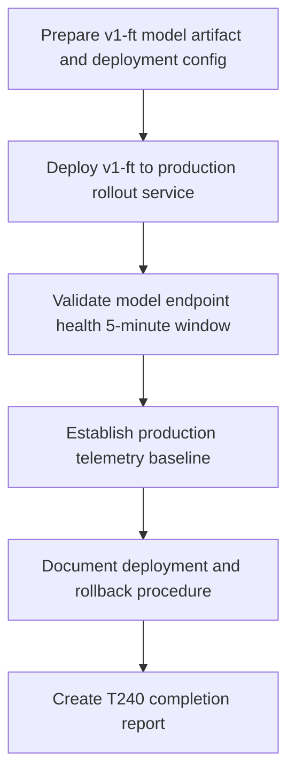

# Plan: T240 Production Deployment of Fine-Tuned Model

## Goal
Deploy the fine-tuned v1-ft model to the production rollout service, establishing the fine-tuned model as the primary endpoint with baseline available as fallback. Validate production readiness through 5-minute zero-error window and establish telemetry baseline for post-deployment monitoring (T241).

## Scope
- **In scope**: Deploy v1-ft model artifact to production service, configure rollout endpoint for v1-ft, maintain baseline as fallback, validate model health over 5-minute window, establish production telemetry baseline, document deployment procedure and rollback steps.
- **Out of scope**: Major architecture changes, load testing at scale, multi-region deployment, model retraining or fine-tuning.
- **Assumptions**: T233 gate passes (production-credible evidence), CWSO stack is available, deployment infrastructure (docker-compose, orchestrator) is operational, rollback capability exists.

## Task graph

## Agent assignments

| Task | Agent | Estimated scope |
|------|-------|-----------------|
| T240A | devops-engineer / backend-developer | medium |
| T240B | devops-engineer | medium |
| T240C | qa-engineer | small |
| T240D | devops-engineer | small |
| T240E | technical-writer | small |
| T240F | orchestrator | small |

## Dependencies and blockers

**Hard dependencies**:
- T233: QA gate PASS verdict ✅ (production-credible evidence)
- T238: Held-out batch complete ✅ (5/5 baseline, 5/5 fine-tuned metrics)
- T239: Aggregation complete ✅ (promotion recommendation issued)

**Blocking conditions**:
- If T240B fails (deployment error): blocker type=technical, mitigation=debug and retry with rollback ready
- If T240C fails (zero-error window violated): blocker type=technical, mitigation=investigate model behavior and either fix or trigger rollback

## Deployment strategy

**Primary approach**: Deploy v1-ft model as the active endpoint in production rollout service; keep baseline model artifact available for rapid rollback if needed.

**Validation criteria**:
- Zero errors over 5-minute sustained request window
- Model responds to dispatch requests with expected structure
- Rollout status transitions complete without timeout
- Telemetry collection active and data flowing

**Rollback procedure**: Revert v1-ft endpoint to baseline model artifact (pre-documented in deployment config)

## Token budget

- Deployment prep: ≤ 20k tokens
- Validation and testing: ≤ 15k tokens
- Documentation and reporting: ≤ 10k tokens
- **Total**: ≤ 45k tokens

## Success criteria

✅ T240 complete when:
1. v1-ft model is serving requests from production rollout endpoint
2. 5-minute validation window shows zero errors
3. Production telemetry baseline established and published
4. Deployment report signed by devops-engineer
5. Rollback procedure documented and tested
6. Task T240 status = done
