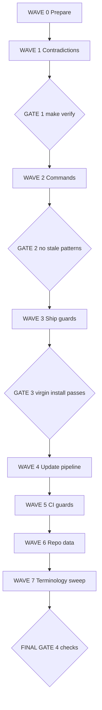

# Plan 014: Task Ledger Hardening (Post-Install Safe)

**Status:** draft — awaiting user approval
**Created:** 2026-07-27
**Owner:** orchestrator
**Based on:** audit of `docs/tasks/`, `implementation/knowledge/skills/task-management/`, `scripts/install.sh`, `scripts/merge-task-docs.py`, `tests/performance/test_team_health.py`
**Audience:** implementation agents of any capability level, including low-capability ("cheap") models

---

## Goal

Make the emage.code task-ledger protocol unambiguous, self-consistent, and **mechanically enforced inside target projects**, not just inside the emage.code source repository. Today the archival rule ("`done` tasks are removed from `active-tasks.md` and appended to `completed-tasks.md`") is contradicted by the very skill that defines it, taught with three different ID formats and four different lifecycles, and enforced only by a CI test that is never installed. This plan closes 18 identified defects and proves the fix by running a validator inside a freshly installed target project.

"Done" for this plan means: a virgin `install.sh --target <dir> --platform all` followed by `python3 docs/tasks/validate-tasks.py` exits `0`, and a subsequent `--update` round-trip still exits `0`.

---

## Scope

- **In scope**: canonical knowledge sources (`implementation/knowledge/**`), installed workspace conventions (`implementation/AGENTS.md`), installed docs templates (`implementation/docs/**`), installer tooling (`scripts/install.sh`, `scripts/merge-task-docs.py`), repo CI guards (`tests/**`), and remediation of the emage.code repository's own ledger data (`docs/tasks/**`).
- **Out of scope**: GitLab issue synchronization behaviour, checkpoint format, artifact versioning format, agent role definitions beyond the archival-ownership sentence, any runtime code under `implementation/runtime/`.
- **Assumptions**: `make sync` regenerates all platform projections from `implementation/knowledge/`; `tests/` and `scripts/` are never installed into target projects; Python 3 and `node` are available.

---

## Part 1 — Findings: how finished tasks are handled today

### Designed behaviour (confirmed)

`active-tasks.md` is a **live queue only**. When a task reaches `done`, its row is **cut** from `docs/tasks/active-tasks.md` and **appended** to `docs/tasks/completed-tasks.md`. Enforced by `tests/performance/test_team_health.py::TestTaskLifecycle::test_no_done_tasks_in_active_queue`.

Current repository state confirms the model is in use: `docs/tasks/active-tasks.md` has **0 rows**, `docs/tasks/completed-tasks.md` has **80 rows**.

### Schema transformation during the move

| Ledger | Columns |
|---|---|
| `active-tasks.md` | `ID · Title · Owner · Status · Priority · Depends on · Last update` (7) |
| `completed-tasks.md` | `ID · Title · Owner · Done on · Outcome / artifact` (5) |

`Status`, `Priority`, and `Depends on` are **dropped**. `Done on` and `Outcome / artifact` are **added**. The per-task brief `docs/tasks/task-T<NNN>.md` is **never moved** — 78 briefs currently accumulate in `docs/tasks/`.

### What actually ships to a target project

`scripts/install.sh` copies exactly:

| Installed | Source |
|---|---|
| `AGENTS.md` | `implementation/AGENTS.md` (via `scripts/render_installed_agents.py`) |
| `docs/{tasks,plans,checkpoints,artifacts,decisions,wiki}/` | `implementation/docs/` |
| `.github/` `.cursor/` `.gemini/` `.opencode/` `.pi/` `.vscode/mcp.json` | `implementation/.<platform>/` |

**Not installed:** `tests/`, `scripts/`, `Makefile`, `.gitlab-ci.yml`, `implementation/`.

**Consequence:** every mechanical guard is repo-only. A target project running emage.code in production has **prose only** — exactly the condition that produced the T214 loss inside emage.code itself.

---

## Part 2 — Defect register (18 issues)

### Source-repo defects

| ID | Severity | Defect |
|---|---|---|
| **D1** | P0 | `task-management` SKILL.md self-contradicts: File Locations says active-tasks.md holds *"All tasks not yet archived (**pending through done**)"*, while Guidelines and CI forbid `done` rows. |
| **D2** | P0 | Four ID formats in one system: skill says `TASK-001`; AGENTS.md/orchestrator/real data say `T001`; CI regex is `^T\d{3,}$`; `merge-task-docs.py` regex is `^\| T\d{3} \|` (exactly 3 digits). |
| **D3** | P1 | Two priority scales: skill says `critical/high/medium/low`; AGENTS.md and CI say `P0/P1/P2`. |
| **D4** | P1 | Three archival triggers: orchestrator "on completion", scrum-master "at sprint close", skill "within one checkpoint cycle". |
| **D5** | P1 | Archive procedure references non-existent `Blocks`/`BlockedBy` columns, claims fields are "preserved" (they are not), and instructs deletion of dependency references — destroying the audit trail. |
| **D6** | P0 | Real task loss: `docs/tasks/task-T214.md` exists with `Status: Pending`, `P0`, dependencies met — but T214 is in **neither** ledger. `T037`, `T227`, `T229` are similar gaps. |
| **D7** | P1 | `cancelled` is a valid status in AGENTS.md and CI, but absent from the skill lifecycle with no defined destination. |
| **D8** | P1 | `completed-tasks.md` claims "append-only" but T237/T238/T239 (2026-06-26/27) sit between T045 and T046 (2026-06-06); T233 lands after T240. Neither ID- nor date-sorted. |
| **D9** | P2 | Brief naming drift: `brief-T202.md` **and** `task-T202.md` both exist; `task-T220-CONDITIONS.md` is a third pattern. |

### Post-install (productive use) defects

| ID | Severity | Defect |
|---|---|---|
| **D10** | **P0** | **No enforcement ships.** `tests/` is not installed, so target projects cannot detect `done` rows in the active queue, orphan briefs, duplicate IDs, or invalid statuses. |
| **D11** | **P0** | `/bug-report` instructs writing `\| BUG-<id> \| <title> \| pending \| <owner> \| <severity> \| <blocker-ids> \|` — **6 cells** into a 7-column table, wrong column order, non-conforming ID. `merge-task-docs.py` then **silently deletes every `BUG-` row** on the next `install.sh --update`. Live customer data loss. |
| **D12** | P1 | Fresh installs seed a phantom row `\| T001 \| _Example: Define requirements_ \| product-owner \| pending \| P0 \| — \| YYYY-MM-DD \|`. The orchestrator's "next unblocked task, lowest ID first" rule picks it up as real work. Invalid date; ID T001 becomes ambiguous. |
| **D13** | P1 | `docs/tasks/` is the only shipped docs folder **without** a `_template.md` (`plans/`, `checkpoints/`, `artifacts/`, `decisions/` all have one). Brief structure is improvised per project. |
| **D14** | **P0** | `/new-project` teaches a fourth lifecycle: `pending → in_progress → review → done (or blocked)`. `review` ≠ `in_review`; `cancelled` missing. This is the first command a new user runs. |
| **D15** | **P0** | `/sprint-status` and `/team-status` render `done` nodes but read **only** `active-tasks.md`, which by the archive rule can never contain `done`. `completed-tasks.md` lacks Status/Depends-on columns, so completed nodes are unreconstructable. Every status report silently under-reports the project. |
| **D16** | P1 | `merge_ledger` rebuilds header/footer from the template and re-inserts old rows. A project that added a column keeps 8-cell rows under a 7-cell header. No validation. |
| **D17** | P1 | Asymmetric `--update` semantics: docs use `rsync --ignore-existing`, platform trees use `rsync --delete`. Local edits to `.github/skills/task-management/SKILL.md` are silently lost while `docs/tasks/` keeps old-format data — the two halves drift to different rule versions. |
| **D18** | P1 | No `/validate-tasks` command and no shipped script lets a target project answer "is my task ledger healthy?". |

### Original-plan effectiveness before this revision

| Original item | Ships? | Post-install verdict |
|---|---|---|
| Skill / AGENTS.md rewrites | ✅ | Effective |
| `merge-task-docs.py` regex fix | ⚠️ runs from source repo | Effective during `--update` |
| CI guards in `tests/` | ❌ | **Ineffective** |
| Repo data remediation | n/a | Correctly scoped |

≈55% effective. Waves 2 and 3 below close the gap.

---

## Part 3 — Rules of engagement (READ BEFORE EVERY TASK)

```
R1. NEVER edit files under .github/ .cursor/ .gemini/ .opencode/ .pi/
    These are GENERATED. Edits there are destroyed by `make sync`.
    Canonical sources are ONLY:
      implementation/knowledge/**
      implementation/AGENTS.md
      implementation/docs/**
      scripts/**
      tests/**
      docs/tasks/**            (repo's own data, Wave 6 only)

R2. ONE task = ONE file. Never touch a second file in the same task.

R3. After EVERY task, run its Verify command. If it fails, REVERT with
    `git checkout -- <file>` and STOP. Do not improvise a fix.

R4. Never delete a table row unless the task says "delete row".
    Never reorder rows unless the task says "reorder".

R5. If the exact find-text in a task is not found, STOP and report
    "PRECONDITION FAILED: <task-id>". Do not search for something similar.

R6. Do not run `make sync` except at the Gates. Do not run `git push`.

R7. Commit format: fix(tasks): <task-id> <short description>
    One commit per task.

R8. Tasks marked "STOP FIRST" require explicit user confirmation before
    any file is modified. Ask, wait, then proceed.
```

---

## Part 4 — Execution waves

### WAVE 0 — Prepare (mandatory, do first)

#### W0-01 · Baseline
```
Run:     git status --porcelain
Expect:  empty output
Stop-if: not empty → report "DIRTY WORKTREE" and stop
```

#### W0-02 · Record the pre-change test result
```
Run:    python3 tests/run.py --suite performance -v
Action: save the pass/fail counts into your notes. Do NOT fix failures yet.
```

---

### WAVE 1 — Kill the contradictions

Fixes: D1, D2, D3, D4, D5, D7

#### W1-01 · Fix the self-contradicting File Locations table *(D1)*
```
File:   implementation/knowledge/skills/task-management/SKILL.md

Find:   | `docs/tasks/active-tasks.md` | All tasks not yet archived (pending through done) |

Replace with:
| `docs/tasks/active-tasks.md` | Tasks in `pending`, `in_progress`, `blocked`, `in_review` ONLY |

Then insert this block immediately AFTER that table:

> ## INVARIANT (never violate)
> `active-tasks.md` MUST NEVER contain a row whose Status is `done` or `cancelled`.
> The row is removed in the SAME edit that sets the terminal status.
> Writing `done` into `active-tasks.md` is a protocol violation.

Verify: grep -c "pending through done" implementation/knowledge/skills/task-management/SKILL.md
Expect: 0
```

#### W1-02 · Replace the invented table schema with the real one *(D2, D3, D5)*
```
File:   implementation/knowledge/skills/task-management/SKILL.md
Action: Replace the WHOLE "## Task Table Format" section — from that heading
        down to but NOT including "## Status Lifecycle" — with EXACTLY:
```

````markdown
## Task Table Format

### active-tasks.md — 7 columns, in this exact order
| ID | Title | Owner | Status | Priority | Depends on | Last update |
|----|-------|-------|--------|----------|-----------|-------------|
| T042 | Add rate limiting | backend-developer | in_progress | P1 | T040 | 2026-07-27 |

### completed-tasks.md — 5 columns, in this exact order
| ID | Title | Owner | Done on | Outcome / artifact |
|----|-------|-------|---------|--------------------|
| T042 | Add rate limiting | backend-developer | 2026-07-27 | src/mw/ratelimit.ts; docs/tasks/task-T042.md |

### Field rules
| Field | Rule |
|-------|------|
| ID | `T` + 3 or more digits. `T001`, `T042`, `T1001`. NEVER `TASK-001`. NEVER `BUG-7`. |
| Owner | Exact agent slug, kebab-case, from the installed agents folder. |
| Status | `pending` \| `in_progress` \| `blocked` \| `in_review` \| `done` \| `cancelled` |
| Priority | `P0` \| `P1` \| `P2`. NEVER `critical`/`high`/`medium`/`low`. |
| Depends on | Comma-separated task IDs, or `—` |
| Last update / Done on | `YYYY-MM-DD`, a real date |

### Field mapping when archiving
| active column | goes to |
|---------------|---------|
| ID, Title, Owner | copied as-is |
| Status | DROPPED (implied `done`) |
| Priority | DROPPED |
| Depends on | DROPPED |
| Last update | becomes `Done on` |
| — | new `Outcome / artifact`: semicolon-separated paths, MUST include `docs/tasks/task-<ID>.md` |
````

```
Verify: grep -c "TASK-00" implementation/knowledge/skills/task-management/SKILL.md
Expect: 0
```

#### W1-03 · Replace the archive procedure with the atomic 4-step *(D4, D5)*
```
File:   implementation/knowledge/skills/task-management/SKILL.md
Action: Replace the WHOLE "### 4. Archive a Task" section with EXACTLY:
```

````markdown
### 4. Complete a Task (ATOMIC — all 4 steps in one edit session)

Performed by the ORCHESTRATOR ONLY. Other agents report completion; they never move rows.

1. Verify acceptance criteria are met (skill: `verification-before-completion`).
2. APPEND one row to `docs/tasks/completed-tasks.md` using the 5-column schema
   and the field mapping above. Append at the BOTTOM.
3. DELETE the task's row from `docs/tasks/active-tasks.md`.
4. In `docs/tasks/task-<ID>.md`, set the header lines to:
       **Status:** done
       **Completed:** YYYY-MM-DD

Never do step 3 without step 2. Never do step 2 without step 4.

### 5. Cancel a Task

Same 4 steps, except step 2's `Outcome / artifact` MUST start with
`CANCELLED: <reason>;` and step 4 sets `**Status:** cancelled`.

### 6. Dependency bookkeeping

When T-x is completed, for every active row whose `Depends on` contains T-x,
rewrite that cell as `T-x (done)`. NEVER delete the reference — it is the audit trail.
````

```
Verify: grep -c "Blocks/BlockedBy" implementation/knowledge/skills/task-management/SKILL.md
Expect: 0
```

#### W1-04 · Add `cancelled` to the lifecycle *(D7)*
```
File:   implementation/knowledge/skills/task-management/SKILL.md
Action: In "## Status Lifecycle", add these rows to the transitions table:
| any | `cancelled` | Work abandoned — orchestrator decision |
| `in_review` | `cancelled` | Rejected outright |
Then append below the diagram:
`done` and `cancelled` are TERMINAL → archive immediately (see § "Complete a Task").

Verify: grep -c "cancelled" implementation/knowledge/skills/task-management/SKILL.md
Expect: 3 or more
```

#### W1-05 · Fix Scrum Master archival ownership *(D4)*
```
File:   implementation/knowledge/agents/scrum-master.md

Find:   Move completed tasks to `docs/tasks/completed-tasks.md` at sprint close

Replace with:
Report task completion to the orchestrator. NEVER move rows between ledgers — archival is orchestrator-only and happens immediately on completion, not at sprint close

Verify: grep -c "at sprint close" implementation/knowledge/agents/scrum-master.md
Expect: 0
```

#### W1-06 · Tighten the installed Task Protocol *(D1 for target projects)*
```
File:   implementation/AGENTS.md

Find:   - Task list: `docs/tasks/active-tasks.md` (table: ID, status, owner, dependencies)

Replace with:
- Task list: `docs/tasks/active-tasks.md` — columns: `ID | Title | Owner | Status | Priority | Depends on | Last update`
- **INVARIANT:** `active-tasks.md` MUST NEVER hold a `done` or `cancelled` row. Terminal rows move to `docs/tasks/completed-tasks.md` (columns: `ID | Title | Owner | Done on | Outcome / artifact`) in the same edit.
- Archival is orchestrator-only and immediate. See skill `task-management` § "Complete a Task".

Verify: grep -c "INVARIANT" implementation/AGENTS.md
Expect: 1
```

> #### GATE 1 — do not proceed until all pass
> ```
> make sync
> make verify                                                   → exit 0
> git diff --stat implementation/.github implementation/.cursor → shows changes
> python3 implementation/scripts/check.py --registry --root implementation → exit 0
> ```
> Stop-if `make verify` fails →
> `git checkout -- implementation/.github implementation/.cursor implementation/.gemini implementation/.opencode implementation/.pi`
> then re-run `make sync`.

---

### WAVE 2 — Fix the commands that teach wrong rules

Fixes: D11, D14, D15, D2

#### W2-01 · Fix `/bug-report` ledger corruption *(D11 — P0)*
```
File:   implementation/knowledge/commands/bug-report.md

Find:   - Format: `| BUG-<id> | <title> | pending | <owner> | <severity> | <blocker-ids> |`

Replace with:
   - Use the NEXT sequential `T<NNN>` ID. NEVER invent a `BUG-` prefix — non-`T` rows are silently deleted by `install.sh --update`.
   - Format (7 columns, exact order):
     `| T<NNN> | BUG: <title> | <owner-slug> | pending | P0\|P1\|P2 | <dep-ids or —> | YYYY-MM-DD |`
   - Map severity → priority: critical→P0, high→P0, medium→P1, low→P2

Verify: grep -c "BUG-<id>" implementation/knowledge/commands/bug-report.md
Expect: 0
```

#### W2-02 · Fix the `/new-project` lifecycle *(D14 — P0)*
```
File:   implementation/knowledge/commands/new-project.md

Find:   - Track states: `pending → in_progress → review → done` (or `blocked`)

Replace with:
    - Track states: `pending → in_progress → blocked → in_review → done | cancelled`
    - The state is spelled `in_review`, NOT `review`.

Verify: grep -c "→ review →" implementation/knowledge/commands/new-project.md
Expect: 0
```

#### W2-03 · Make `/sprint-status` read both ledgers *(D15, D2)*
```
File:   implementation/knowledge/commands/sprint-status.md
Action: (a) Replace every `TASK-00` with `T00` in the Mermaid example.
        (b) Replace the line
              - Read from `docs/tasks/active-tasks.md` for current task states
            with
              - Read `docs/tasks/active-tasks.md` for pending/in_progress/blocked/in_review nodes
              - Read `docs/tasks/completed-tasks.md` for `done` nodes — `active-tasks.md` NEVER contains `done`
              - Reconstruct dependency edges for done nodes from the `Depends on` cells of active rows

Verify: grep -c "TASK-0" implementation/knowledge/commands/sprint-status.md
Expect: 0
```

#### W2-04 · Same fix for `/team-status` *(D15, D2)*
```
File:   implementation/knowledge/commands/team-status.md
Action: identical to W2-03.
Verify: grep -c "TASK-0" implementation/knowledge/commands/team-status.md
Expect: 0
```

> #### GATE 2
> ```
> make sync && make verify                                       → exit 0
> grep -rn "BUG-<id>\|→ review →" implementation/knowledge/      → no output
> python3 implementation/scripts/check.py --registry --root implementation → exit 0
> ```

---

### WAVE 3 — Ship the guards into target projects (the decisive wave)

Fixes: D10, D12, D13, D16, D18

#### W3-01 · Create the task brief template *(D13)*
```
File: implementation/docs/tasks/_template.md   (NEW FILE)
Body: exactly —
```

````markdown
# Task <ID> — <Title>

**ID:** T<NNN>
**Owner:** <agent-slug>
**Status:** pending
**Priority:** P0 | P1 | P2
**Depends on:** <IDs or —>
**Created:** YYYY-MM-DD
**Completed:** —
**Based on:** docs/plans/plan-<NNN>-<slug>.md

## Objective
<one paragraph>

## Inputs
- <artifact-vN.md paths>

## Expected outputs
- <artifact paths this task must produce>

## Acceptance criteria
1. <specific, testable>

## Blocker protocol
Report blockers as: type (`technical` | `dependency` | `unclear_requirements` | `external`)
+ severity (`critical` | `major` | `minor`) + one proposed mitigation. Max 2 retries.

## Execution notes
<filled during execution>
````

```
Verify: test -f implementation/docs/tasks/_template.md && echo OK
```

#### W3-02 · Remove the phantom seed task *(D12)*
```
File:   implementation/docs/tasks/active-tasks.md

Action: DELETE this exact line:
| T001 | _Example: Define requirements_ | product-owner | pending | P0 | — | YYYY-MM-DD |

Then add this line directly under the footer notes:
> This ledger starts EMPTY. Do not treat any row here as a template. The first real task is `T001`.

Verify: grep -c "_Example:" implementation/docs/tasks/active-tasks.md
Expect: 0
```

#### W3-03 · Ship a self-check script into target projects *(D10, D16, D18 — highest leverage)*
```
File: implementation/docs/tasks/validate-tasks.py   (NEW FILE)

Requirements — the script MUST use ONLY the Python standard library, read ONLY
./docs/tasks/ relative to CWD (falling back to its own directory if ./docs/tasks
does not exist), take NO arguments, perform NO network access, write NO files,
and exit 1 if any check fails:

  C1  active-tasks.md contains no row with Status `done` or `cancelled`
  C2  every active row has exactly 7 cells; every completed row exactly 5
  C3  every ID matches ^T\d{3,}$
  C4  every Status is in {pending,in_progress,blocked,in_review,done,cancelled}
      and every Priority in {P0,P1,P2}
  C5  no ID appears in both ledgers; no ID appears twice within either ledger
  C6  every docs/tasks/task-T*.md has its ID in exactly one ledger    (orphan guard)
  C7  every ledger ID has a matching docs/tasks/task-<ID>.md
  C8  every task-<ID>.md whose header says `**Status:** done` is in
      completed-tasks.md, and every completed-tasks.md ID has a brief saying done
      or cancelled
  C9  completed-tasks.md `Done on` values are non-decreasing top to bottom
  C10 every date cell is a valid YYYY-MM-DD

Output: one line per violation, prefixed `FAIL C<n>: `, then a summary count line.
On success print `TASK LEDGER: PASS (<n> active, <m> completed)` and exit 0.
Ignore rows whose ID cell is `ID` (header) or consists only of `-` and `:` (separator).

Verify: cd implementation/docs/tasks && python3 validate-tasks.py; echo "exit=$?"
Expect: exit=0
```

#### W3-04 · Create the `/validate-tasks` command *(D18)*
```
File: implementation/knowledge/commands/validate-tasks.md   (NEW FILE)
Body: exactly —
```

````markdown
---
description: "Validate task ledger integrity. Run before every checkpoint, before every release, and after every install --update."
agent: "orchestrator"
---

Run `python3 docs/tasks/validate-tasks.py` from the project root.

- Exit 0 → report "TASK LEDGER: PASS".
- Exit 1 → report every `FAIL C<n>` line verbatim, then propose one fix per
  violation. Do NOT auto-fix C5, C6, or C8 — ask the user which ledger is correct.

Run this command:
1. Before writing any checkpoint
2. Before `/prepare-release`
3. Immediately after `install.sh --update`
````

```
Verify: test -f implementation/knowledge/commands/validate-tasks.md && echo OK
```

#### W3-05 · Wire the self-check into the mandatory skill workflow
```
File:   implementation/AGENTS.md
Action: In the "Skill Workflow (mandatory)" table, add this row:
| Before any checkpoint, release, or after `install --update` | run `/validate-tasks` |

Verify: grep -c "validate-tasks" implementation/AGENTS.md
Expect: 1
```

> #### GATE 3 — the post-install proof (most important gate in this plan)
> ```
> make sync && make verify
> python3 implementation/scripts/check.py --registry --root implementation
> rm -rf /tmp/emage-gate3
> bash scripts/install.sh --target /tmp/emage-gate3 --platform github
> cd /tmp/emage-gate3 && python3 docs/tasks/validate-tasks.py; echo "exit=$?"
> ```
> **Expect `exit=0` on a virgin install.** This proves the guard reaches production.
> Stop-if non-zero.

---

### WAVE 4 — Fix the update pipeline

Fixes: D2, D11, D17

#### W4-01 · Fix the row-preservation regex *(D2, D11)*
```
File:   scripts/merge-task-docs.py

Find:   TASK_ROW_RE = re.compile(r"^\| T\d{3} \|")

Replace with:
TASK_ROW_RE = re.compile(r"^\|\s*T\d{3,}\s*\|")

Verify: python3 -c "import re;r=re.compile(r'^\|\s*T\d{3,}\s*\|');print(bool(r.match('| T1001 | x |')), bool(r.match('|T042| x |')))"
Expect: True True
```

#### W4-02 · Warn instead of silently dropping non-conforming rows *(D11)*
```
File:   scripts/merge-task-docs.py
Action: In _extract_task_rows, for any line that starts with "|", is not the
        header, is not a separator row, is not an example row, and does NOT
        match TASK_ROW_RE — print to stderr:
          f"warning: dropping non-conforming task row (ID must match T<NNN>): {line}"
        Keep the existing drop behaviour; ONLY add the warning.

Verify: python3 -m py_compile scripts/merge-task-docs.py && echo OK
```

#### W4-03 · Regression tests for W4-01 / W4-02
```
File:   tests/functional/test_merge_task_docs.py
Action: Add two test methods:
  test_four_digit_ids_survive_merge  → a `| T1001 | ... |` row is present after merge
  test_bug_prefixed_row_warns        → a `| BUG-7 | ... |` row is dropped AND a
                                       "warning: dropping non-conforming" line hits stderr

Verify: python3 tests/run.py --suite functional -v
Expect: 0 failures
```

#### W4-04 · Warn before `--update` overwrites local platform edits *(D17)*
```
File:   scripts/install.sh
Action: Inside validate_before_update(), BEFORE the validate_github_agents call,
        print to stderr for each platform dir present in $TARGET:
          "warning: --update replaces $TARGET/<dir> entirely (rsync --delete). Local edits there will be lost."
        Do NOT block; warn only.

Verify: bash -n scripts/install.sh && echo OK
```

---

### WAVE 5 — Repo-side CI guards

Fixes: D10 (repo side), D6 blind spot

#### W5-01 · Reuse the shipped checker in CI — do not reimplement
```
File:   tests/performance/test_team_health.py
Action: Add ONE test class that executes implementation/docs/tasks/validate-tasks.py
        with CWD = repo root, asserts exit code 0, and prints stdout on failure.
        Do NOT duplicate check logic — single source of truth.

Verify: python3 tests/run.py --suite performance -v
Expect: this test FAILS initially. That is CORRECT — Wave 6 fixes the data.
```

#### W5-02 · Remove the over-broad duplicate exemption *(D6 blind spot)*
```
File:   tests/performance/test_team_health.py

Find:   dupes.discard("T001")
Action: DELETE that line.
Reason: W3-02 removed the example row, so this exemption now hides real duplicates.

Verify: grep -c 'discard("T001")' tests/performance/test_team_health.py
Expect: 0
```

---

### WAVE 6 — Remediate the emage.code repository's own data

Fixes: D6, D8, D9

#### W6-01 · Resolve orphan T214 *(D6)* — **STOP FIRST**
```
STOP FIRST: ask the user to confirm T214 is truly superseded by T228.
            Do not guess. Wait for the answer.

File:   docs/tasks/completed-tasks.md
Action: Append at the bottom:
| T214 | Pattern A Integration Test (3 Agents, Deterministic Merge) | qa-engineer | 2026-07-27 | CANCELLED: superseded by T228 live integration; docs/tasks/task-T214.md |

Then, as a SEPARATE task, in docs/tasks/task-T214.md:
  change `**Status**: Pending` → `**Status:** cancelled`
  and add   `**Completed:** 2026-07-27`

Verify: python3 docs/tasks/validate-tasks.py 2>&1 | grep -c "T214"
Expect: 0
```

#### W6-02 · Audit the remaining ID gaps *(D6)* — **STOP FIRST**
```
Run:    for id in T037 T227 T229; do
          echo "== $id"; grep -l "$id" docs/tasks/*.md 2>/dev/null;
        done
Action: - ID with neither a ledger row nor a brief → no action (never used).
        - ID with a brief but no ledger row → apply the W6-01 pattern.
STOP FIRST: present findings to the user and wait before editing.
```

#### W6-03 · Re-sort `completed-tasks.md` by `Done on` *(D8)*
```
File:   docs/tasks/completed-tasks.md
Action: Sort ONLY the data rows by (Done on ascending, then ID ascending).
        Keep header, separator, and surrounding prose untouched.
        Change NO cell content.

Verify: python3 docs/tasks/validate-tasks.py 2>&1 | grep -c "FAIL C9"
Expect: 0
```

#### W6-04 · Consolidate brief naming *(D9)* — **STOP FIRST**
```
Files:  docs/tasks/brief-T202.md, brief-T210.md, brief-T211.md, task-T220-CONDITIONS.md
Action: For each, append its content under a `## Additional brief content` heading
        in the matching task-T<ID>.md, then delete the source file.

STOP FIRST: show the user the full diff before deleting anything.

Verify: ls docs/tasks/brief-*.md 2>/dev/null | wc -l
Expect: 0
```

---

### WAVE 7 — Terminology sweep

Fixes: D2, D3 everywhere else

#### W7-01 · Find and fix every stale ID reference
```
Run:    grep -rn "TASK-[0-9N]" implementation/knowledge/

Action: For EACH hit, replace `TASK-NNN` → `T<NNN>` and `TASK-001` → `T001`.
        Known affected files:
          skills/gitlab-management/SKILL.md
          skills/release-workflow/SKILL.md
          skills/code-review/SKILL.md
          skills/testing-strategy/SKILL.md
          skills/technical-debt-tracking/SKILL.md
          commands/prepare-release.md
          commands/handoff.md
          commands/batch.md
          commands/new-feature.md
        ONE FILE PER COMMIT.

Verify: grep -rc "TASK-[0-9N]" implementation/knowledge/ | grep -v ":0"
Expect: no output
```

#### W7-02 · Fix priority vocabulary in technical-debt-tracking *(D3)*
```
File:   implementation/knowledge/skills/technical-debt-tracking/SKILL.md

Find:   with priority `must`
Replace with: with priority `P0`

Verify: grep -c "priority \`must\`" implementation/knowledge/skills/technical-debt-tracking/SKILL.md
Expect: 0
```

---

## Part 5 — Final gate

All four checks must pass before this plan is marked complete.

```
1. make sync && make verify
   → exit 0
   python3 implementation/scripts/check.py --registry --root implementation
   → exit 0

2. python3 tests/run.py -v
   → 0 failures

3. rm -rf /tmp/emage-final
   bash scripts/install.sh --target /tmp/emage-final --platform all
   cd /tmp/emage-final && python3 docs/tasks/validate-tasks.py
   → exit 0

4. bash scripts/install.sh --target /tmp/emage-final --platform all --update
   cd /tmp/emage-final && python3 docs/tasks/validate-tasks.py
   → exit 0
```

Check 4 is the regression proof for D11 and D16: it verifies that an update
round-trip does not corrupt or silently delete ledger data in a live project.

---

## Part 6 — Coverage matrix

| Issue | Fixed by | Effective post-install? |
|---|---|---|
| D1 self-contradiction | W1-01, W1-06 | ✅ |
| D2 ID formats | W1-02, W4-01, W7-01 | ✅ |
| D3 priorities | W1-02, W7-02 | ✅ |
| D4 archival owner | W1-03, W1-05 | ✅ |
| D5 phantom columns | W1-02, W1-03 | ✅ |
| D6 lost tasks | **W3-03 (C6/C7)**, W5-02, W6-01, W6-02 | ✅ |
| D7 cancelled | W1-04, W1-03 § 5 | ✅ |
| D8 ordering | W3-03 (C9), W6-03 | ✅ |
| D9 brief naming | W6-04 | repo-only (n/a) |
| **D10 no enforcement ships** | **W3-03, W3-04, W3-05** | ✅ |
| **D11 bug-report corruption** | **W2-01, W4-01, W4-02, W4-03** | ✅ |
| D12 phantom T001 | W3-02 | ✅ |
| D13 no brief template | W3-01 | ✅ |
| D14 wrong lifecycle | W2-02 | ✅ |
| D15 status blind to done | W2-03, W2-04 | ✅ |
| D16 header/row desync | W3-03 (C2) | ✅ |
| D17 silent overwrite | W4-04 | ✅ |
| D18 no self-check | W3-03, W3-04 | ✅ |

**Post-install effectiveness: 17/17 applicable issues.**

Decisive additions over a docs-only fix:
- **W3-03** ships the validator into every target project.
- **W2-01** stops `/bug-report` from silently destroying customer task data on update.

---

## Part 7 — Task graph



---

## Part 8 — Agent assignments

| Wave | Agent | Estimated scope | Notes |
|------|-------|-----------------|-------|
| W0 | orchestrator | small | baseline only |
| W1 | technical-writer | medium | canonical docs edits |
| W2 | technical-writer | small | 4 command files |
| W3 | backend-developer | medium | `validate-tasks.py` is the only real code |
| W4 | backend-developer | small | regex + warnings + tests |
| W5 | qa-engineer | small | CI wiring |
| W6 | orchestrator | medium | requires user confirmation (STOP FIRST tasks) |
| W7 | technical-writer | medium | mechanical sweep, one file per commit |

---

## Part 9 — Risks & mitigations

| Risk | Likelihood | Impact | Mitigation |
|------|-----------|--------|-----------|
| Agent edits generated `.github/` instead of `implementation/knowledge/` | high | high | R1 + `make verify` at every gate |
| `validate-tasks.py` written with third-party deps | medium | high | W3-03 states stdlib-only, no network, no writes; Gate 3 runs it in a bare install dir |
| W5-01 fails and the agent "fixes" it by weakening the check | medium | high | W5-01 explicitly states the failure is expected until Wave 6 |
| W6 tasks guess at task intent and archive live work | medium | critical | STOP FIRST on W6-01, W6-02, W6-04 |
| Terminology sweep breaks unrelated prose | low | medium | one file per commit; `make verify` after wave |
| Re-sorting `completed-tasks.md` alters cell content | low | high | W6-03 explicitly forbids content changes; C9 verifies ordering only |

---

## Part 10 — Token budget

| Wave | Budget | Spent | Remaining |
|------|--------|-------|-----------|
| W0 + W1 | 40k | — | — |
| W2 | 25k | — | — |
| W3 | 60k | — | — |
| W4 + W5 | 45k | — | — |
| W6 + W7 | 50k | — | — |

---

## Approval

- [ ] User approved on YYYY-MM-DD
- [ ] GATE 1 passed on YYYY-MM-DD
- [ ] GATE 2 passed on YYYY-MM-DD
- [ ] GATE 3 passed on YYYY-MM-DD
- [ ] FINAL GATE passed on YYYY-MM-DD

## Task ID index (traceability)

This plan is executed by the task briefs listed below. The index exists so that every
active task traces back to a plan, as required by the TestPlanCoverage check in
`tests/performance/test_team_health.py`.

T242, T243, T244, T245, T246, T247, T248, T249, T250, T251, T252, T253, T254,
T255, T256, T257, T258, T259, T260, T261, T262, T263, T264, T265, T266, T267,
T268, T269, T270, T271, T272, T273, T274, T275, T276, T277, T278, T279, T280,
T281, T282, T283, T284
