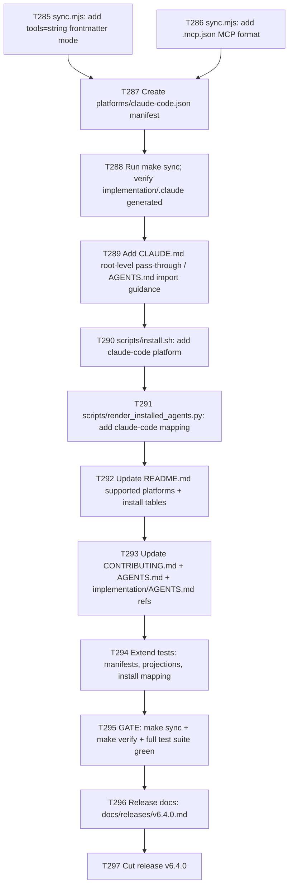

# Plan 015 — Add Claude Code as a Supported Platform

Based on: `implementation/platforms/{cursor,github,gemini,opencode,pi}.json`,
`implementation/scripts/sync.mjs`, `AGENTS.md`, `README.md`, `CONTRIBUTING.md`.

## Goal

Add **Claude Code** (Anthropic's CLI coding agent) as a sixth supported platform
in emage.code, projected automatically from the canonical
`implementation/knowledge/` tree — exactly like `cursor`, `github`, `gemini`,
`opencode`, and `pi` are today. No sync-engine script changes should be
required beyond what a manifest-driven platform needs; if any script gap is
found, it must be fixed as its own task. Ship as release `v6.4.0`.

## Claude Code target format (researched facts, cite in every task)

Claude Code reads these project-scoped files (repo root, unless noted):

| Concept | Location | Format |
|---|---|---|
| Project instructions | `CLAUDE.md` (or `.claude/CLAUDE.md`) | plain Markdown, **no frontmatter** |
| Subagents | `.claude/agents/<name>.md` | YAML frontmatter (`name`, `description`, `tools` **as a comma-separated string or array**, `model`, optional fields) + Markdown system prompt body |
| Slash commands (skills) | `.claude/commands/<name>.md` (legacy form; still supported) | YAML frontmatter (`description`, `argument-hint`) + Markdown body. Note: Claude Code's newer "skills" convention (`.claude/skills/<name>/SKILL.md`) also works and is preferred for reusable knowledge; commands/ is kept for parity with existing `commands` category. |
| Rules / scoped instructions | `.claude/rules/<name>.md` | optional YAML frontmatter with `paths: [...]` glob list; Markdown body |
| Skills (knowledge packs) | `.claude/skills/<name>/SKILL.md` | YAML frontmatter (`name`, `description`) + Markdown body — same shape as other platforms' `skills` category |
| MCP servers | `.mcp.json` at repo root | `{ "mcpServers": { "<name>": { "command": ..., "args": [...], "env": {...} } } }` for stdio; `{ "type": "http", "url": ... }` for remote |

Key differences vs existing platforms that the manifest/sync engine must handle:
1. Claude Code subagent `tools` field is typically a **comma-separated string**
   (e.g. `tools: Read, Grep, Glob`), not a YAML array or `key: true` object.
   The sync engine currently supports `"array"` and `"object"` tools formats
   only (`applyAgentFrontmatter` in `sync.mjs`) — a new `"string"` mode must be
   added.
2. Claude Code has no `applyTo` concept for commands/instructions frontmatter;
   `instructions` map to `.claude/rules/*.md` using `paths` (same rename as
   Cursor's `globs`).
3. MCP file format is close to Cursor's `mcpServers` shape but at a **different
   path** (`.mcp.json` at repo root, not inside `.claude/`).
4. There is no `user-invocable` concept for Claude Code orchestrators — Claude
   Code has no first-class "primary agent" distinction from a manifest
   perspective; all subagents are invoked either automatically (matched by
   `description`) or explicitly via `@agent-name`. The orchestrator/poc-orchestrator
   agents still project as regular subagent files; instruct the user to invoke
   `@orchestrator` or `@poc-orchestrator` explicitly from `CLAUDE.md`.

## Scope

- **In scope**: new `implementation/platforms/claude-code.json` manifest;
  `applyAgentFrontmatter`/`emitMcp` support for the `"string"` tools format and
  the `.mcp.json` MCP format in `sync.mjs`; generated
  `implementation/.claude/` tree; `scripts/install.sh` support for
  `--platform claude-code`; `scripts/render_installed_agents.py` platform
  mapping entry; README/CONTRIBUTING/AGENTS.md updates; test coverage
  (`test_manifests.py`, `test_platform_projections.py`,
  `test_install_agents_mapping.py`); release `v6.4.0` docs + tag.
- **Out of scope**: Claude Code plugin marketplace packaging, Claude Code
  `hooks` automation parity with Gemini's `AfterTool` hook, background-agent /
  agent-teams features.
- **Assumptions**: Claude Code accepts the same knowledge content
  (agents/commands/instructions/skills) as other platforms with only
  frontmatter-shape and path differences — validated against the official
  docs fetched during planning (`docs.claude.com/en/docs/claude-code/{sub-agents,slash-commands,mcp,memory,settings}`).

## Task graph



## Agent assignments

| Task | Agent | Estimated scope |
|------|-------|-----------------|
| T285 | backend-developer | small |
| T286 | backend-developer | small |
| T287 | backend-developer | small |
| T288 | backend-developer | small |
| T289 | technical-writer | small |
| T290 | backend-developer | small |
| T291 | backend-developer | small |
| T292 | technical-writer | small |
| T293 | technical-writer | small |
| T294 | qa-engineer | medium |
| T295 | qa-engineer | small |
| T296 | release-manager | small |
| T297 | release-manager | small |

## Artifact flow

```
T285/T286 → implementation/scripts/sync.mjs (modified)      (consumed by: T287, T288)
T287      → implementation/platforms/claude-code.json       (consumed by: T288, T294)
T288      → implementation/.claude/**                        (consumed by: T289, T294, T295)
T290      → scripts/install.sh (modified)                    (consumed by: T294, T295)
T291      → scripts/render_installed_agents.py (modified)    (consumed by: T294, T295)
T292/T293 → README.md, CONTRIBUTING.md, AGENTS.md, implementation/AGENTS.md (modified)
T294      → tests/functional/*.py (modified/added)            (consumed by: T295)
T296      → docs/releases/v6.4.0.md                           (consumed by: T297)
```

## Risks & mitigations

| Risk | Likelihood | Impact | Mitigation |
|------|-----------|--------|-----------|
| Claude Code's `tools` field conventions differ from documented string form (e.g. accepts array too) | Low | Medium | T287 emits comma-separated string; docs confirm array also accepted as fallback — verify via `/doctor`-style manual smoke test note in task brief |
| `.mcp.json` at repo root collides with an existing project file when installed via `--platform all` | Low | Medium | T290 installs `.mcp.json` only under `--platform claude-code`; `all` copies but does not overwrite silently — same pattern as `.vscode/mcp.json` for github |
| Test suite assumes exactly 5 platforms in hardcoded lists (`_TARGET_PLATFORMS`, `REQUIRED_SCRIPTS` unaffected) | Medium | Low | T294 explicitly updates `_TARGET_PLATFORMS` tuple and any hardcoded platform-name lists found via grep |
| Cheap/dumb agents misinterpret "no script changes needed" claim in README and skip T285/T286 | Medium | Medium | Task briefs explicitly state sync.mjs changes ARE required for this platform and enumerate exact line ranges to edit |

## Token budget

| Phase | Budget | Spent | Remaining |
|-------|--------|-------|-----------|
| Planning | 80k | ~40k | 40k |
| Architecture/Implementation (T285-T293) | 120k | — | — |
| QA (T294-T295) | 60k | — | — |
| Release (T296-T297) | 60k | — | — |

## Approval

- [ ] User approved on YYYY-MM-DD
