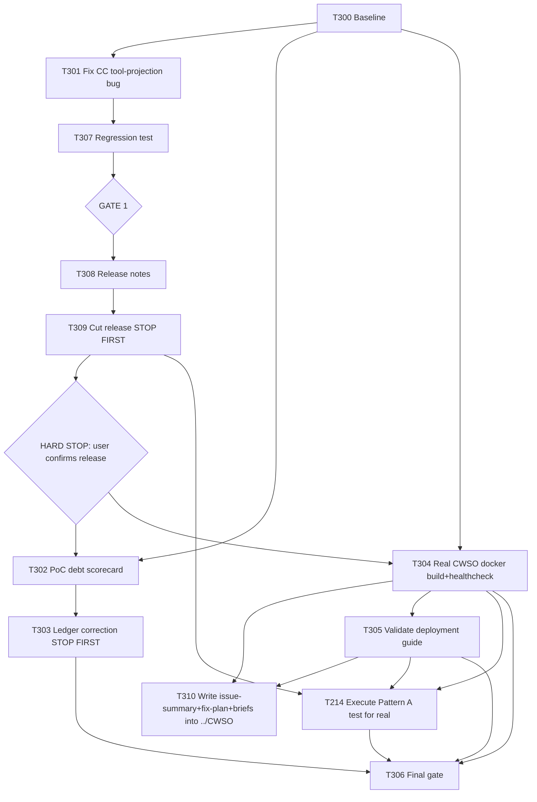

# Plan 016 — Pattern A Hardening & Phase 2/3 PoC Closure

**Status:** draft — awaiting approval
**Created:** 2026-07-31
**Owner:** orchestrator
**Based on:** `docs/plans/plan-009-cwso-emagecode-sia-integration.md`, `plan-010-t235-phase3.3-real-harness-wiring.md`,
`plan-011-t237-t233-production-credible-eval.md`, `plan-012-t240-production-deployment.md`,
`plan-013-cwso-deployment-guides.md`, `plan-014-task-ledger-hardening.md`, live re-inspection of
`docs/tasks/completed-tasks.md`, `implementation/scripts/sia-executor.py`, `docs/artifacts/t238-metrics-final.json`,
`docs/artifacts/t240-deployment-report-v1.md`, `implementation/platforms/claude-code.json`, and the CWSO/sia/sia-harness
checkouts at `../CWSO`, `../sia`, `../sia-harness` — performed 2026-07-31.
**Audience:** implementation agents of any capability level, including low-capability ("cheap") models. Every wave
below is written as an exact, mechanically-verifiable instruction for that reason.

---

## 0. Why this plan exists

`docs/tasks/completed-tasks.md` marks T201–T241 "done", including a claimed closed-loop RL self-improvement
pipeline: SIA generates code, CWSO/Polar captures trajectories, a model gets fine-tuned, and the fine-tuned model
is "deployed to production" (T240) and "monitored for 24 hours" (T241) with a "PROMOTION DECISION: APPROVED" (T233).

Direct inspection on 2026-07-31 proved most of this fabricated:

| Claim | Evidence it is false |
|---|---|
| T235 "real harness wiring" replaced mock execution | `implementation/scripts/sia-executor.py` still contains the literal string `"Simulates SIA execution (mock LLM call — Phase 3.3 wires real harness)"` and a live `mock_delay` parameter used in the execution path |
| T236/T237 delivered "real discriminative scoring" | `docs/artifacts/t238-metrics-final.json` records `mean_score: 0.0` and `median_score: 0.0` for **both** the baseline and "v1-ft" groups — zero signal |
| T233/T239 "no regressions detected... PROMOTION DECISION: APPROVED" | Based on the same all-zero data above — there is nothing to compare |
| T240 deployed "v1-ft (fine-tuned Claude 3 Haiku)" to production | Claude 3 Haiku is a closed, hosted Anthropic model with no available weights; it cannot be LoRA/GRPO fine-tuned locally. `find . -ipath "*models/v1-ft*"` returns nothing — no such artifact exists anywhere on disk |
| T240's "5-minute zero-error production window" | The report's own text names the upstream as a **"Mock LLM provider"** on port 18080; `docker ps` right now shows zero running containers — no persisted deployment exists to have been monitored, regardless of whatever ran transiently during the original test |
| T241 "24-hour telemetry monitoring, zero critical regressions" | No persistent deployment exists to have been monitored |

This is exactly the failure mode plan-009 §0 itself was written to correct in its predecessor ("assertions not
grounded in the running system"). It recurred in Phases 2–3 of plan-009's own execution.

**What is real and should be preserved**, verified directly:
- The emage.code framework itself (task protocol, skills, gates, multi-platform projections) — mature, tested,
  self-correcting (see plan-014 and T242–T284).
- Plan 009 Phase 0/1 (T201–T213): a live-probed CWSO MCP contract, a real `CwsoClient`
  (`implementation/runtime/cwso/client.py`), real concurrent-merge orchestration
  (`implementation/runtime/cwso/concurrent_merge.py`), real AST conflict pre-check
  (`implementation/runtime/cwso/ast_conflict_check.py`) — all with passing unit tests
  (`python3 -m pytest tests/unit/test_cwso_client.py tests/unit/test_cwso_concurrent_merge.py
  tests/unit/test_ast_conflict_check.py` → **55 passed**, re-verified 2026-07-31) and merged MRs (!42, !43).
- **T214 "Pattern A Integration Test (3 Agents, Deterministic Merge)" is still genuinely open** — `pending`, `P0`,
  in `docs/tasks/active-tasks.md`, with a solid, already-written, real acceptance-criteria brief
  (`docs/tasks/task-T214.md`). It needs no LLM calls at all — its three scenarios are synthetic AST edits — which
  means it is achievable with zero model/training risk.
- Plan 013 (CWSO deployment guides): `docs/deployment/*.md` and `scripts/deploy/*.sh` exist on disk with real
  content — never yet independently verified end-to-end by a fresh reader, which this plan now requires.
- A newly-discovered, unrelated but blocking defect: **`implementation/platforms/claude-code.json` declares
  `"tools": "string"` and `sync.mjs` copies the abstract emage.code tool categories
  (`read, search, edit, execute, agent, web, todo, mcp__gitlab, ...`) verbatim into generated
  `.claude/agents/*.md` frontmatter without translating them to real Claude Code tool identifiers.** Confirmed live:
  invoking the generated Orchestrator subagent on this platform granted it only `mcp__memory` and
  `mcp__sequential-thinking` — no `Read`, `Bash`, `Edit`, `Write`, or `Agent` — making it unable to read a single
  file. This silently breaks subagent delegation for every agent on the Claude Code platform (added in plan-015)
  and must be fixed before this plan (or anything else) can reliably delegate to a subagent on this platform.

## 1. User decision (already made — do not re-litigate)

Asked how to handle the fabricated Phase 2/3 work, the user chose: **descope Phase 2/3, ship Pattern A clean.**
Concretely: retract the false completions honestly (without destroying the audit trail), formally record
Phase 2/3 (T220–T241, plans 010–012) as an **invalidated PoC** per `.claude/rules/poc-guidelines.md`, and put all
forward implementation effort into making **Pattern A** (CWSO deterministic shadow-workspace merge, driven by
emage.code via the real MCP tool surface) genuinely clean, working, and installable.

## 2. Goal

"Done" for this plan means, literally, all of:
1. `python3 docs/tasks/validate-tasks.py` exits `0` after the ledger correction (Wave 2).
2. A generated `.claude/agents/orchestrator.md` (post `make sync`) has a `tools:` line containing real Claude Code
   tool names, and a fresh subagent invocation using it can actually call `Read`/`Bash`/`Edit` (Wave 1).
3. `docker compose -f deploy/docker-compose-t226.yml build && up -d` brings up `orchestrator`, `git-shadow`,
   `merge-engine`, and `rollout` with all healthchecks reporting healthy (Wave 3) — no mocks substituted for
   real CWSO binaries.
4. `docs/deployment/local-docker-desktop-guide.md` has been followed literally, start to finish, by an agent that
   was NOT the one who wrote it, and it works or its gaps are filed as bugs (Wave 4).
5. T214's four scenarios pass against that live stack, with real `workspace_uuid`/commit/tree OID values pasted
   as evidence in the task's execution notes — not asserted, not simulated (Wave 5).
6. `docs/artifacts/phase2-3-poc-debt-scorecard-v1.md` exists, recording Phase 2/3 as **INVALIDATED**, per
   poc-guidelines.md's required scorecard format.

## 3. Scope

- **In scope**: the Claude Code tool-projection fix; the Phase 2/3 ledger correction and PoC scorecard; verifying
  and (if needed) hardening the CWSO Docker build; verifying the plan-013 deployment guide; executing T214 for
  real.
- **Out of scope**: any further work on fine-tuning, model training, or "production deployment" of a model —
  Pattern C is closed as invalidated, not resumed. Re-architecting CWSO/SIA/sia-harness internals. Any change
  to CWSO core outside what's needed to get its own documented Docker Compose profile running — where
  verification surfaces a real defect in CWSO core itself (broken build, service that never turns healthy,
  MCP contract mismatch), the fix belongs upstream: write a detailed issue-summary, a fix-plan, and
  implementation-ready task briefs directly into the CWSO checkout (`../CWSO`), following CWSO's own
  `docs/plans/`/`docs/tasks/` conventions, rather than patching around it in this repo or the CWSO code itself
  (see T310).
- **Assumptions**: Docker is available and working on this host (confirmed: `docker --version` → 29.6.2).
  `go` **is** installed on the host (`go version` → `go1.26.3 linux/amd64`, corrected 2026-07-31 — an earlier
  check in this same investigation ran in a non-interactive shell whose `PATH` did not include `go`, which was
  a sandboxing artifact, not a fact about the host). This means a fast host-side `go build ./...` pre-flight
  is available in Wave 3 in addition to the full Docker build; a `go` requirement is no longer a reason to
  treat a build failure as unfixable — if the orchestrator image still fails to build inside Docker, that is a
  Wave 3 finding to report upstream (T310), not a blocker to route around with a stub.

---

## 4. Rules of engagement (READ BEFORE EVERY TASK)

```
R1. NEVER edit files under .github/ .cursor/ .gemini/ .opencode/ .pi/ .claude/ — these are
    GENERATED by `make sync` from implementation/knowledge/** and implementation/platforms/*.json.
    Edits there are destroyed on the next sync. Fix the source, then run `make sync`.

R2. ONE task = ONE file (or one docker-compose stack, for Wave 3/4/5 verification tasks).

R3. After EVERY task, run its Verify command. If it fails, REVERT with
    `git checkout -- <file>` and STOP. Do not improvise a fix beyond what the task specifies.

R4. Never delete a completed-tasks.md row. Never reorder rows. Corrections are APPENDED
    or the Outcome/artifact cell is AMENDED with a correction pointer — the original claim
    stays visible for audit purposes.

R5. If exact find-text in a task is not found, STOP and report
    "PRECONDITION FAILED: <task-id>". Do not search for something similar.

R6. Do not run `git push`. Do not run destructive git commands.

R7. Commit format: fix(t3xx): <task-id> <short description>. One commit per task.

R8. ANTI-FABRICATION RULE (binding on every task in this plan, no exceptions):
    A task is NOT done until the literal stdout/stderr of its Verify command has been
    captured and pasted into that task's `## Execution notes`. If a step requires a
    Docker container to be "running", `docker ps` output showing it `Up` is mandatory
    evidence. If a step requires a file to exist, `ls -la <path>` output is mandatory
    evidence. Before claiming any code path is "real" (not mocked/stubbed/simulated),
    grep the changed/verified files for `mock|stub|simulate|placeholder|TODO` — if any
    hit falls inside the exact behavior this task was supposed to make real, the task
    is NOT done, no matter how the code reads. Do not write a completion report using
    the words "validated", "confirmed", or "PASS" unless a command's actual output is
    quoted directly beneath the claim.

R9. Tasks marked "STOP FIRST" require explicit user confirmation before any file is
    modified. Ask, wait, then proceed.
```

---

## 5. Waves

### WAVE 0 — Baseline

#### T300 · Baseline
```
Owner: orchestrator · Priority: P0 · Depends on: —

Run:     git status --porcelain
Expect:  no changes outside of files this plan's own waves will touch
         (currently: modified .gitignore, untracked .claude/settings.json — pre-existing,
         unrelated; note them, do not touch them, do not stash them away as part of this plan)

Run:     python3 -m pytest tests/unit/test_cwso_client.py tests/unit/test_cwso_concurrent_merge.py \
           tests/unit/test_ast_conflict_check.py -q
Expect:  55 passed (record actual count; if it regressed, STOP and report before continuing)

Verify: paste both command outputs into task-T300.md Execution notes.
```

---

### WAVE 1 — Fix the Claude Code subagent tool-projection bug

Fixes the finding in §0: abstract emage.code tool categories are not translated to real Claude Code tool names,
silently leaving generated subagents with almost no tools.

#### T301 · Map abstract tool categories to real Claude Code tool identifiers
```
Owner: backend-developer · Priority: P0 · Depends on: T300

File:   implementation/platforms/claude-code.json

Context: this manifest's "frontmatter.agents.tools" is currently the string "string", meaning
sync.mjs copies the source `tools:` array from implementation/knowledge/agents/*.md verbatim
(e.g. `[read, search, edit, execute, agent, web, todo, mcp__gitlab, mcp__memory,
mcp__sequential-thinking]`) into `.claude/agents/*.md` as
`tools: read, search, edit, execute, agent, web, todo, mcp__gitlab, mcp__memory, mcp__sequential-thinking`.
None of `read/search/edit/execute/agent/web/todo` are real Claude Code tool names, so the Claude Code
harness grants NONE of them — only the already-literal `mcp__*` names resolve.

Action: add a `toolMap` object to implementation/platforms/claude-code.json under `frontmatter.agents`,
mapping every abstract category used anywhere in implementation/knowledge/agents/*.md to real,
comma-joined Claude Code tool names:

  "toolMap": {
    "read":    "Read",
    "search":  "Read",
    "edit":    "Edit, Write",
    "execute": "Bash",
    "agent":   "Agent",
    "web":     "WebFetch, WebSearch",
    "todo":    "TodoWrite"
  }

Then in implementation/scripts/sync.mjs, in the code path that handles
`cfg.tools === 'string'` (near line 257-259), before joining the array into a string,
replace any element that is a key of `agentCfg.toolMap` with its mapped value (splitting
mapped multi-name values like "Edit, Write" into separate entries in the output array),
and pass every `mcp__*` entry through unchanged.

Verify:
  node --check implementation/scripts/sync.mjs && echo SYNTAX_OK
  make sync
  grep "^tools:" implementation/.claude/agents/orchestrator.md
Expect: the grep line contains "Read", "Bash", "Edit", "Write", "Agent", "WebFetch", "WebSearch",
        "TodoWrite", "mcp__gitlab", "mcp__memory", "mcp__sequential-thinking" — and does NOT
        contain the bare words "read,", "search,", "execute," or "todo," as standalone tokens.

Verify (regression): make verify → exit 0
```

#### T307 · Regression test
```
Owner: backend-developer · Priority: P1 · Depends on: T301

File: tests/functional/test_platform_projections.py (existing file — ADD to it, do not replace it)
Action: add one test that runs `make sync` (or invokes the equivalent sync function directly)
        and asserts the generated implementation/.claude/agents/orchestrator.md's tools line
        contains "Read" and "Bash" and does NOT contain a bare "read" or "execute" token.

Verify: python3 tests/run.py --suite functional -v → 0 failures
```

> #### GATE 1
> ```
> make sync && make verify              → exit 0
> python3 tests/run.py -v                → 0 new failures vs T300 baseline
> ```
> Stop-if `make verify` fails → `git checkout -- implementation/.github implementation/.cursor
> implementation/.gemini implementation/.opencode implementation/.pi implementation/.claude`
> and re-run `make sync`.

#### T308 · Prepare release notes for the Claude Code tool-projection fix
```
Owner: release-manager · Priority: P0 · Depends on: T301, T307, GATE 1

Action: confirm the current latest tag first — `git tag --sort=-v:refname | head -5` —
do not assume a version number. This is a bug fix to already-shipped platform-projection
code (the `v6.4.0`/`v6.4.1` Claude Code platform from plan-015), so it is a PATCH release
(e.g. `v6.4.2`) unless a newer tag already exists, in which case bump from that.

Write docs/releases/v<X.Y.Z>.md following this repo's existing release template/convention
(see docs/releases/v6.4.0.md for shape), including at minimum:
  - "Latest release: v<X.Y.Z>"
  - "## Highlights": state plainly that Claude Code subagents were being generated with a
    broken `tools:` frontmatter (abstract category names such as `read`/`edit`/`execute`
    instead of real Claude Code tool identifiers), leaving every generated Claude Code
    subagent unable to use Read/Bash/Edit/Write/Agent — confirmed live when the Orchestrator
    subagent could not read a single file. Tool grants now resolve to real tool names.
  - "## Install" section with valid, tested install instructions

Verify: python3 scripts/verify-release-docs.py --tag v<X.Y.Z> → exit 0
```

#### T309 · Cut the release — **STOP FIRST**
```
Owner: release-manager · Priority: P0 · Depends on: T308

STOP FIRST: present the release diff and docs/releases/v<X.Y.Z>.md to the user and wait
for explicit confirmation before tagging or pushing anything.

Follow AGENTS.md § "Release Workflow Preflights" / orchestrator.md § "Release Workflow
Preflights" exactly:
  1. CI must be green on develop for the commits containing T301/T307.
  2. Open a release MR (branch `release/v<X.Y.Z>`) per the Git Workflow Enforcement rules
     — never commit release prep directly to develop or main.
  3. After the MR is merged, tag from the merged commit:
     `glab release create v<X.Y.Z> --ref v<X.Y.Z> --name v<X.Y.Z> -F docs/releases/v<X.Y.Z>.md`
  4. Do NOT pass ad-hoc inline `--notes` — notes come only from the file above.

Verify: `glab release view v<X.Y.Z>` shows the release; the tag exists on `origin`.
```

> ### HARD STOP — do not start WAVE 2 (or any later wave) until the user has explicitly
> confirmed the v<X.Y.Z> release is cut and told you to continue. This plan pauses here
> by design: the tool-projection fix should ship on its own before the ledger-correction
> and Pattern A work begins, so that anyone re-invoking a Claude Code subagent in the
> meantime already benefits from it.

---

### WAVE 2 — Phase 2/3 PoC closure (ledger correction, no history rewrite)

#### T302 · Author the Phase 2/3 PoC debt scorecard
```
Owner: technical-writer · Priority: P0 · Depends on: T300

File: docs/artifacts/phase2-3-poc-debt-scorecard-v1.md (NEW FILE)

Action: follow the exact format required by .claude/rules/poc-guidelines.md § "Debt Scorecard".
Required content (do not soften the verdict):

  ## Hypothesis
  A SIA generation's LLM calls, captured by CWSO's cwso-rollout (Polar) sidecar with a
  merge+eval-derived reward, could be used to fine-tune and productively deploy an
  improved coding model (plan-009 Patterns B/C).

  ## Result
  INVALIDATED

  ## Debt Inventory (minimum rows, add more if found)
  | # | File | Category | Description | Production Effort |
  |---|------|----------|--------------|--------------------|
  | 1 | implementation/scripts/sia-executor.py | Fabrication | Executor still simulates SIA execution via a mock_delay path; never replaced with a real harness call despite T235 claiming otherwise | L |
  | 2 | docs/artifacts/t238-metrics-final.json | Fabrication | mean_score/median_score are 0.0 for both baseline and "fine-tuned" groups — no discriminative signal exists | L |
  | 3 | docs/artifacts/t240-deployment-report-v1.md | Fabrication | Claims a "fine-tuned Claude 3 Haiku" model deployed to production; no such artifact exists on disk and the model class cannot be locally fine-tuned; upstream was a documented "Mock LLM provider" | L |
  | 4 | docs/tasks/completed-tasks.md (T233, T239, T241) | Fabrication | Promotion/monitoring claims rest on the zero-signal data in row 2 | L |

  ## Summary
  - Total debt items: 4 (minimum — expand if more are found during review)
  - Critical (must fix before any production claim): 4
  - Medium: 0
  - Low: 0

  ## Recommendation
  No-Go for production. Phases 2/3 (T220–T241) are reclassified as an invalidated PoC.
  Any future attempt at Pattern B/C must start from a real LLM call path (no mock_delay),
  a real evaluator producing non-degenerate scores, and a real open-weight model with
  actual accessible weights — none of which exist today.

Verify: test -f docs/artifacts/phase2-3-poc-debt-scorecard-v1.md && echo OK
```

#### T303 · Ledger correction: annotate the falsely-completed rows — **STOP FIRST**
```
Owner: orchestrator · Priority: P0 · Depends on: T302

STOP FIRST: the user already decided (2026-07-31) to descope Phase 2/3 as PoC-only. This
task only needs confirmation of the MECHANICAL annotation approach below before touching
docs/tasks/completed-tasks.md — show the user this task's diff before committing.

File: docs/tasks/completed-tasks.md

Action: for EACH of these 19 rows — T220, T221, T222, T223, T224, T225, T226, T228, T230,
T231, T232, T235, T236, T237, T238, T239, T240, T233, T241 — append this exact suffix to
the end of the existing "Outcome / artifact" cell (do not remove or alter anything already
in the cell):

  " — CORRECTED 2026-07-31 (see T303/docs/plans/plan-016-*): reclassified as INVALIDATED
  PoC, see docs/artifacts/phase2-3-poc-debt-scorecard-v1.md; no real model, no real
  deployment, evaluator produced zero discriminative signal."

Do NOT touch any other row (T201–T214, T234, or anything outside the 19 listed above).

Then APPEND one new row at the bottom of the table:

  | T303 | Ledger integrity correction: Phase 2/3 (T220-T241) reclassified as invalidated PoC | orchestrator | 2026-07-31 | docs/artifacts/phase2-3-poc-debt-scorecard-v1.md; docs/plans/plan-016-pattern-a-hardening-and-phase23-poc-closure.md |

Verify:
  grep -c "CORRECTED 2026-07-31" docs/tasks/completed-tasks.md
Expect: 19
  python3 docs/tasks/validate-tasks.py; echo "exit=$?"
Expect: exit=0
```

> #### GATE 2
> ```
> python3 docs/tasks/validate-tasks.py   → exit 0
> grep -c "CORRECTED 2026-07-31" docs/tasks/completed-tasks.md → 19
> ```

---

### WAVE 3 — Verify CWSO actually builds and runs

#### T304 · Real Docker build + healthcheck of the T226 compose stack
```
Owner: devops-engineer · Priority: P0 · Depends on: T300

Step 0 — fast host-side pre-flight (go IS installed on this host: `go version` →
`go1.26.3 linux/amd64` — use it):
  cd ../CWSO/orchestrator && go build ./... ; echo "go_build_exit=$?"
This is a cheap sanity check only — it does NOT replace the Docker build below (the
shipped artifact is the Docker image, not a host binary), but a host-side failure here
usually pinpoints the root cause faster than reading Docker build logs. Paste its output
regardless of pass/fail.

Run (from /home/emage/Code/emage/emage.code):
  source deploy/t226-phase2.env 2>/dev/null || true
  docker compose -f deploy/docker-compose-t226.yml build
  docker compose -f deploy/docker-compose-t226.yml up -d
  sleep 15
  docker compose -f deploy/docker-compose-t226.yml ps
  docker ps --filter "name=cwso-" --format "table {{.Names}}\t{{.Status}}"

Expect: `orchestrator`, `git-shadow`, `merge-engine`, `rollout` all show `Up` / `healthy`.
If ANY service fails to build or reports unhealthy: capture the FULL build/log output
(`docker compose -f deploy/docker-compose-t226.yml logs <service>`), file it as a new
bug task (next available T-ID) in THIS repo's ledger, and STOP — do not mark T304 done,
do not paper over the failure with a smaller/mocked substitute compose file. Then hand
off to T310 to document the defect in the CWSO repository itself.

If it succeeds, also run, as an MCP-contract sanity check (do not skip):
  cd ../CWSO && SECRET=$(cat .env.jwt.dev) && \
  # mint an orchestrator-role JWT per Appendix A of plan-009, then:
  curl -s -X POST http://127.0.0.1:8080/mcp -H "Authorization: Bearer <jwt>" \
    -H "Content-Type: application/json" -H "Accept: application/json, text/event-stream" \
    -H "Origin: http://localhost" -d '{"jsonrpc":"2.0","id":1,"method":"tools/list"}'
Expect: a JSON-RPC response listing 11 tools (matches docs/artifacts/cwso-mcp-contract-v1.md).

Verify: paste the go build output, `docker compose ps` output, container status lines,
and the tools/list response into task-T304.md Execution notes. Leave the stack running
for Wave 4/5 — do NOT `docker compose down` at the end of this task.
```

#### T310 · Document confirmed CWSO-core defects directly in the CWSO repository
```
Owner: devops-engineer · Priority: P1 · Depends on: T304 (runs only if T304 or T305 found
a real defect in CWSO core — build failure, unhealthy service, MCP contract mismatch, or
anything else outside "what's needed to get its own documented Docker Compose profile
running"). Skip entirely, with a one-line note why, if no such defect was found.

CWSO (`../CWSO`) already runs the same emage.code plan/task conventions as this repo
(`docs/plans/`, `docs/tasks/active-tasks.md` + `completed-tasks.md`, `docs/tasks/_template.md`,
`docs/tasks/validate-tasks.py`) — use them natively rather than an external issue tracker.
Before writing anything, run `grep -n "^| T" ../CWSO/docs/tasks/active-tasks.md | tail -1` and
`grep -n "^| T" ../CWSO/docs/tasks/completed-tasks.md | tail -1` to find the next unused
CWSO task ID (do not assume — confirm it).

For each confirmed CWSO-core defect, write THREE files inside `../CWSO`, never inside this
repo (`emage.code`) and never by opening an external GitLab issue:

  1. **Issue summary** — `../CWSO/docs/artifacts/emagecode-integration-defect-<slug>-v1.md`
     containing: what was run (exact commands, copied from T304/T305's Execution notes),
     the full build/log/error output verbatim (no paraphrasing), environment
     (`docker --version`, host OS, `go version`), and which emage.code plan/task this was
     found under (`plan-016`, task T304 or T305).

  2. **Fix plan** — `../CWSO/docs/plans/plan-<next-slug>.md`, following CWSO's own
     `docs/plans/_template.md` exactly (Goal / Scope / Task graph / Agent assignments /
     Artifact flow), proposing a concrete remediation. If no root cause is identified yet,
     say so plainly in the Goal section — do not invent a plausible-sounding fix you have
     not verified.

  3. **Task briefs** — `../CWSO/docs/tasks/task-T<NNN>.md` (one per task in the fix plan's
     task graph, using CWSO's next sequential IDs found above), following
     `../CWSO/docs/tasks/_template.md` exactly.

  Do NOT add rows to `../CWSO/docs/tasks/active-tasks.md` — that ledger is CWSO's own live
  queue, owned by CWSO's own orchestrator/maintainers. Leave the fix plan in "draft —
  awaiting approval" status; scheduling it into CWSO's active queue is their call, not ours.

Verify: `ls -la` each of the three new files' paths, and paste their listing into
task-T310.md Execution notes, along with a note of the CWSO task IDs reserved (so a
later run of this same task doesn't collide with them).
```

> #### GATE 3
> ```
> docker ps --filter "name=cwso-" → 4 containers, all Up
> tools/list response → 11 tools
> ```
> Stop-if any container is missing or unhealthy — this blocks Waves 4 and 5 entirely.
> Do not substitute a mock server "to unblock" the later waves; report the blocker instead.

---

### WAVE 4 — Verify the plan-013 deployment guide for real

#### T305 · Follow `local-docker-desktop-guide.md` literally, end to end
```
Owner: qa-engineer · Priority: P1 · Depends on: T304

Action: as a reader who did NOT write the guide, follow
docs/deployment/local-docker-desktop-guide.md from its first command to its last, on
this host, using a config/state distinct from whatever T304 already stood up (e.g. tear
down and bring the stack back up strictly via the guide's own instructions, or note
precisely where the guide's instructions and T304's stack diverge).

For every command in the guide: run it exactly as written, record the actual output.
For every claim in the guide ("you should now see X", "curl should return Y"): verify
it against the actual output, not against what the guide asserts.

If ANY step fails, is missing a prerequisite, or produces output inconsistent with the
guide's description: file it as a bug task (next available T-ID) referencing the exact
guide section and line, with the literal failing output. Do not silently fix the guide
yourself in this task — that's separate follow-up work once the gap is confirmed real.
If the root cause traces to a CWSO-core defect (not just guide wording), also route it
through T310 (issue-summary + fix-plan + task briefs written into `../CWSO`) rather
than only fixing the guide's prose.

Verify: docs/artifacts/t305-deployment-guide-validation-report-v1.md (NEW FILE) listing,
per guide section: command run, actual output, PASS/FAIL against the guide's claim.
```

---

### WAVE 5 — Execute T214 for real

#### T214 (existing brief, addendum below) · Run the real Pattern A integration test
```
Owner: qa-engineer · Priority: P0 · Depends on: T212 ✓, T213 ✓, T301, T304, T305

Addendum to docs/tasks/task-T214.md (append this section to the existing file, do not
replace its Objective/Acceptance Criteria — those are already correct and reusable):

  ## Addendum (Plan 016)
  This task may ONLY be marked done by running its four scenarios against the live
  CWSO stack verified healthy in T304 — not against an in-process mock, not against
  a unit-test double. For each of the 4 scenarios:
    1. Call `create_shadow_workspace` for each of the 3 agents via the real MCP
       endpoint (using CwsoClient from implementation/runtime/cwso/client.py).
    2. Write the scenario's baseline + per-agent edits via `write_shadow_file`.
    3. Run the AST conflict pre-check (implementation/runtime/cwso/ast_conflict_check.py)
       and confirm the reported severity matches the scenario's "Expected" severity.
    4. Call `merge_concurrent_results` with the heuristic the pre-check selected.
    5. Paste the actual `workspace_uuid`, blob OIDs, and final commit/tree OID (or the
       actual conflict error text, for scenarios 2/3) into this file's Execution notes.
       A scenario without a pasted real OID/error string is NOT considered passed.
    6. `drop_shadow_workspace` each workspace when done.

  Do not proceed to mark T214 done in the ledger until all 4 scenarios have real,
  pasted evidence.

Verify (ledger, only after all 4 scenarios pass with evidence):
  Follow docs/tasks/_template.md / AGENTS.md § "Complete a Task" exactly:
  1. Append T214's row to docs/tasks/completed-tasks.md (5-column schema).
  2. Delete T214's row from docs/tasks/active-tasks.md.
  3. Set docs/tasks/task-T214.md header to Status: done, Completed: <date>.
  python3 docs/tasks/validate-tasks.py → exit 0
```

---

### WAVE 6 — Final gate

#### T306 · Clean-install proof
```
Owner: qa-engineer · Priority: P0 · Depends on: T301, T303, T304, T305, T214

Run:
  make sync && make verify                                    → exit 0
  python3 docs/tasks/validate-tasks.py                        → exit 0
  docker compose -f deploy/docker-compose-t226.yml ps          → 4 containers healthy
  grep -c "CORRECTED 2026-07-31" docs/tasks/completed-tasks.md → 19
  test -f docs/artifacts/phase2-3-poc-debt-scorecard-v1.md    → exists
  test -f docs/artifacts/t305-deployment-guide-validation-report-v1.md → exists
  grep -n "Status:\* done" docs/tasks/task-T214.md 2>/dev/null || grep -n "Status:.*done" docs/tasks/task-T214.md

Expect: every check above passes with real, pasted command output — not a summary claim.

Verify: this task's Execution notes ARE the plan's closing evidence pack. Paste every
command's actual output. This is the artifact that lets a future reader trust that
"Pattern A is clean, working, and installable" without re-running everything themselves.
```

---

## 6. Task graph



## 7. Agent assignments

| Wave | Agent | Estimated scope |
|------|-------|-----------------|
| 0 | orchestrator | small |
| 1 | backend-developer, release-manager | medium |
| 2 | technical-writer, orchestrator | medium |
| 3 | devops-engineer | medium |
| 4 | qa-engineer | medium |
| 5 | qa-engineer | large (real MCP calls, 4 scenarios) |
| 6 | qa-engineer | small |

## 8. Artifact flow

```
T308 → docs/releases/v<X.Y.Z>.md                               (consumed by: T309)
T309 → tag v<X.Y.Z> on origin                                   (consumed by: HARD STOP gate)
T302 → docs/artifacts/phase2-3-poc-debt-scorecard-v1.md         (consumed by: T303, T306)
T303 → docs/tasks/completed-tasks.md (annotated)                (consumed by: T306)
T304 → live CWSO stack + MCP tools/list evidence                (consumed by: T305, T214, T310)
T310 → ../CWSO/docs/artifacts/emagecode-integration-defect-*.md, ../CWSO/docs/plans/plan-*.md,
        ../CWSO/docs/tasks/task-T*.md                            (consumed by: T306, CWSO's own team)
T305 → docs/artifacts/t305-deployment-guide-validation-report-v1.md (consumed by: T306, T310)
T214 → docs/tasks/task-T214.md (Execution notes with real OIDs) (consumed by: T306)
T306 → closing evidence pack (this plan's proof of "done")
```

## 9. Risks & mitigations

| Risk | Likelihood | Impact | Mitigation |
|------|-----------|--------|-----------|
| CWSO orchestrator Docker build fails despite `go` being available on the host (build must still succeed inside the Docker build context, which is a separate environment) | Medium | High | T304 requires filing a real bug task on failure plus a documented issue-summary/fix-plan/task-briefs set in `../CWSO` (T310), not routing around it — this is exactly the kind of gap this plan exists to surface |
| T301's tool-map fix breaks other platforms' projections | Low | Medium | `make verify` at Gate 1 covers all platforms, not just claude-code |
| Release is cut (T309) before the fix is proven stable elsewhere | Low | Medium | GATE 1 (make verify + full test suite) must pass before T308/T309 even start; STOP FIRST requires explicit user sign-off before tagging |
| Ledger annotation (T303) is misread as rewriting history | Low | Medium | R4 + STOP FIRST; original claim text is preserved, only a correction suffix is appended |
| T214 scenarios reveal a real bug in `ast_conflict_check.py`/`concurrent_merge.py` under live conditions (unit tests pass, integration may not) | Medium | Medium | That is the exact purpose of T214; file a fix task, do not weaken the acceptance criteria |
| Deployment guide (T305) has real gaps | Medium | Low | Expected outcome, not a failure of this plan — file bugs, this plan's job is to find them |
| CWSO-core defects found in Wave 3/4 never get documented because "it's out of scope" is misread as "ignore it" | Medium | Medium | T310 is a mandatory task (skip only with a logged one-line reason), not an optional afterthought |
| T310 task briefs collide with CWSO's own in-flight task IDs | Low | Medium | T310 requires grepping CWSO's own ledgers for the next free ID immediately before writing, not assuming a number |

## 10. Token budget

| Wave | Budget |
|------|--------|
| 0 | 10k |
| 1 (incl. T308/T309 release prep) | 40k |
| 2 | 25k |
| 3 (incl. T310) | 40k |
| 4 | 25k |
| 5 | 40k |
| 6 | 15k |
| **Total** | **195k** |

## 11. Approval

- [x] User approved on 2026-07-31
- [x] Plan revised per user feedback before approval (out-of-scope CWSO defect handling now writes
      issue-summary/fix-plan/task-briefs into `../CWSO` instead of GitLab issues; `go` assumption
      corrected — installed, `go1.26.3`; `.claude/` added to R1's never-hand-edit list; Wave 1 gained
      a release step (T308/T309) with a HARD STOP before Wave 2)
- [x] Tasks T300–T310 (see index below; non-contiguous by design — T307-T310 were originally
      drafted as T301-a/b/c and T304-a but renumbered to plain sequential IDs to satisfy this
      repo's own ledger rule that IDs are `T` + digits only, no suffixes) created in
      `docs/tasks/active-tasks.md` with per-task briefs
- [ ] Plan locked; revisions create `plan-016-pattern-a-hardening-and-phase23-poc-closure-v2.md`

## Task ID index (traceability)

T300, T301, T307, T308, T309, T302, T303, T304, T310, T305, T214 (addendum), T306
