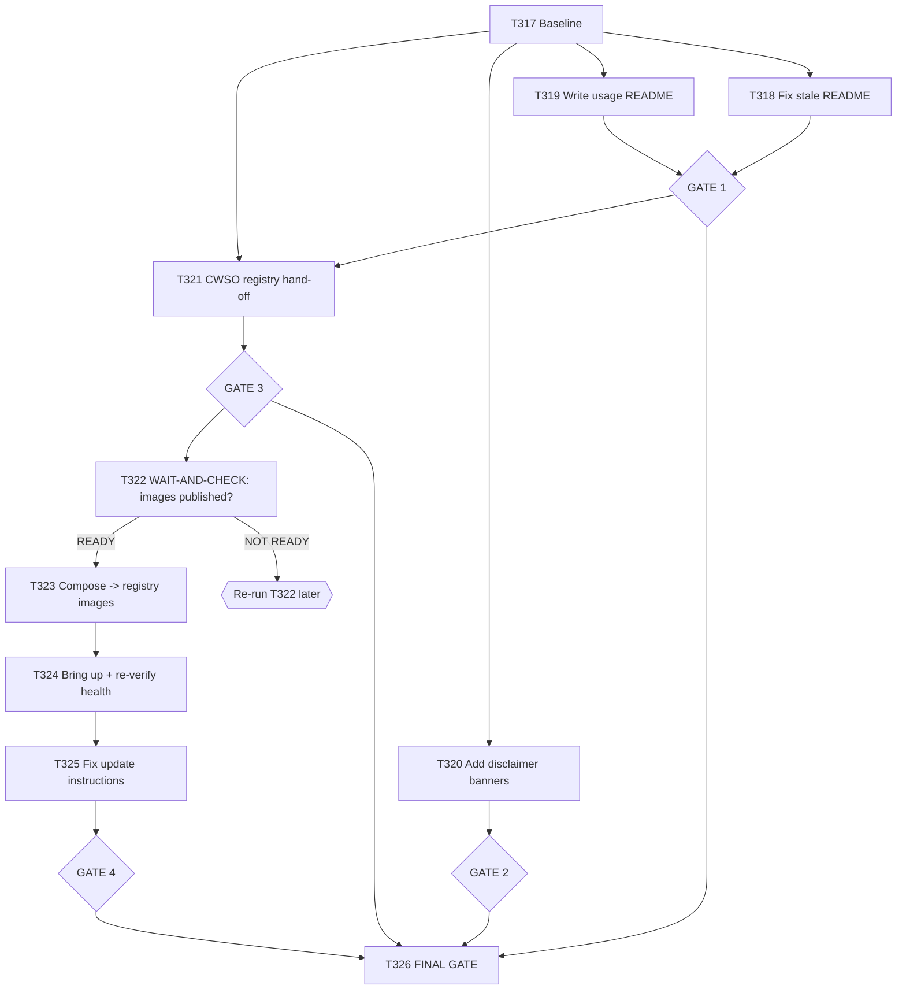

# Plan 017 — Deployment/Usage Documentation Repair & CWSO Container Registry Hardening

**Status:** draft — awaiting approval
**Created:** 2026-08-02
**Owner:** orchestrator
**Based on:** `docs/plans/plan-013-cwso-deployment-guides.md`, `docs/plans/plan-016-pattern-a-hardening-and-phase23-poc-closure.md`
(the plan that made the real CWSO Docker stack, and Pattern A, genuinely verified), live investigation performed
2026-08-02 (deployment-doc freshness audit + GitLab Container Registry feasibility assessment, delegated to a
solution-architect subagent and independently re-verified by the coordinating session).
**Audience:** implementation agents of any capability level, including low-capability ("cheap") models. Every wave
below is written as an exact, mechanically-verifiable instruction for that reason — same convention as plan-014
and plan-016.

---

## 0. Why this plan exists

Plan-016 made the real CWSO Docker stack, and Pattern A itself, genuinely work and be genuinely verified
(T304–T306, T313–T315, T214). Two documentation/infrastructure gaps were found immediately afterward that
plan-016 did not cover, plus one improvement opportunity:

| Finding | Evidence |
|---|---|
| `docs/deployment/README.md` is stale and **self-contradicting** | Still instructs `cd deploy/local-dev && docker-compose logs -f` / `docker-compose down` / `docker volume inspect cwso-local-dev_orchestrator-data` (lines 146, 159, 172) — `deploy/local-dev/` has not existed since before the T226 stack. Never mentions `deploy/docker-compose-t226.yml` (the real, validated compose file) by name. Last touched 2026-06-29 (`4883e38`), never part of the T304/T305/T313/T214 hardening wave. |
| `docs/deployment/proxmox-lxc-guide.md` and `gcp-cloud-run-guide.md` are **untested, not validated** | Same commit `4883e38` as the README (style-normalization only, 2026-06-29). No task in `docs/tasks/completed-tasks.md` shows either guide ever run against a real Proxmox host or GCP project. This is a "never exercised" gap, not a "known broken" one — be precise about the distinction in all follow-on work. |
| The promised Pattern A **usage guide was never written** | `docs/tasks/task-T214.md`'s own original brief (line 123) required `implementation/runtime/cwso/README.md` as a deliverable. `ls implementation/runtime/cwso/` confirms it does not exist — that directory has real, validated code (`client.py`, `mcp_client.py`, `ast_conflict_check.py`, `concurrent_merge.py`, all exercised for real by T214/T314/T315) and zero usage documentation. |
| CWSO's images are **built from source on every install**, not published | `deploy/docker-compose-t226.yml` hardcodes `context: /home/emage/Code/emage/CWSO` (an absolute, machine-specific path) in all 4 `build:` blocks, tagged locally `:dev`. `../CWSO/.gitlab-ci.yml` already has `build:orchestrator`/`build:git-shadow`/`build:merge-engine` jobs and a `deploy:registry` stage — but it only pushes `orchestrator` and `git-shadow` (confirmed via `grep -n "needs:" .gitlab-ci.yml` around the `deploy:registry` job), never `merge-engine`, and there is **no build job for `rollout` at all**. The CWSO GitLab project is confirmed `visibility: public` with `container_registry_access_level: enabled` — no new credential needed for a pull-based install. |
| The guide's own "update" instructions are **already dead** | `local-docker-desktop-guide.md` § "Updating CWSO Image" and `cwso-docker-desktop.sh --update` both call `docker-compose pull` — but the compose file has no `image:` field for any of the 4 CWSO services (only `build:`), so there is nothing for `pull` to resolve against. This is broken today, independent of whether the registry work below happens. |

## 1. Goal

"Done" for this plan means, literally, all of:
1. `docs/deployment/README.md` accurately names the real, current files (`docker-compose-t226.yml`,
   `cwso-docker-desktop.sh`) and contains no reference to any nonexistent path.
2. `implementation/runtime/cwso/README.md` exists, documents Pattern A usage against the *current, correct*
   code (post-T314/T315 fixes), and its example commands are verified to actually work against the live stack.
3. `proxmox-lxc-guide.md` and `gcp-cloud-run-guide.md` each carry an explicit, honest "not validated end-to-end"
   banner until (and unless) a future plan actually runs them against real infrastructure.
4. CWSO's CI publishes all 4 images (`orchestrator`, `git-shadow`, `merge-engine`, `rollout`) to
   `registry.gitlab.com/em-age/emage.code.cwso/...` with real semver tags — delivered via a hand-off into
   `../CWSO` (this repo does not touch CWSO's own CI file), and **only claimed done here once independently
   confirmed present in the registry**, never assumed.
5. `deploy/docker-compose-t226.yml` references the published registry images by default (fixing the hardcoded
   absolute-path defect as a side effect), with a documented, opt-in override for building from local source.
6. `docker compose -f deploy/docker-compose-t226.yml pull && up -d` genuinely brings up all 4 services
   healthy/Up, re-verified the same way T304 verified the source-build path — no mocks, no assumptions.
7. The guide's "Updating CWSO Image" section and `cwso-docker-desktop.sh --update` are updated to match this
   now-actually-working `pull` behavior.

## 2. Scope

- **In scope**: the 3 documentation gaps (README, usage README, disclaimer banners), a CWSO CI hand-off for the
  missing registry publishing (design + hand-off only, per plan-016's established `../CWSO` hand-off convention —
  see T310/T169/T170 precedent, which CWSO's team picked up and shipped for real), and the `emage.code`-side
  compose/doc changes once (and only once) those images are confirmed actually published.
- **Out of scope**: actually validating `proxmox-lxc-guide.md` or `gcp-cloud-run-guide.md` against real
  infrastructure (no Proxmox host or GCP project is available in this environment — that is future work, tracked
  but not attempted here). Modifying `../CWSO`'s `.gitlab-ci.yml` directly from this repo. Any change to CWSO
  core beyond what's needed for the registry publishing gap.
- **Assumptions**: the live CWSO Docker stack from plan-016 may or may not still be running when this plan
  executes — check first (Wave 0), don't assume. `../CWSO` is a real, separate GitLab-backed git repo you have
  local filesystem access to but must not push to directly — same hand-off convention as plan-016's T310.

---

## 3. Rules of engagement (READ BEFORE EVERY TASK)

Same core rules as plan-016 (which itself extended plan-014's), repeated here for a standalone reader:

```
R1. NEVER edit files under .github/ .cursor/ .gemini/ .opencode/ .pi/ .claude/ — these are
    GENERATED by `make sync`. Fix implementation/knowledge/** instead, then run `make sync`.

R2. ONE task = ONE clear unit of work. Don't bundle unrelated fixes into one commit.

R3. After EVERY task, run its Verify command. If it fails, REVERT with
    `git checkout -- <file>` and STOP. Do not improvise a fix beyond what the task specifies.

R4. Never delete a completed-tasks.md row. Never reorder rows. Corrections are appended, not
    rewritten as if a prior claim never happened.

R5. If exact find-text in a task is not found, STOP and report
    "PRECONDITION FAILED: <task-id>". Do not search for something similar.

R6. Do not run `git push --force`. Do not run destructive git commands.

R7. Commit format: fix(t3xx):/docs(t3xx):/feat(t3xx): <task-id> <short description>.
    One commit per task.

R8. ANTI-FABRICATION RULE (binding on every task, no exceptions): a task is NOT done until the
    literal stdout/stderr of its Verify command has been captured and pasted into that task's
    Execution notes. Do not write a completion report using "validated", "confirmed", "PASS", or
    "published" unless a command's actual output is quoted directly beneath the claim. This
    applies with special force to Wave 3 (checking CWSO's registry) — an assumed or "should be
    there by now" image is not a verified image.

R9. Tasks marked "STOP FIRST" or "WAIT-AND-CHECK" require running the specified check and
    reporting its real result before proceeding — even if that result is "not ready yet."

R10. `develop` is GitLab-protected against direct push (confirmed throughout plan-016) — every
     change goes through a branch + MR, merged only after CI is green. `../CWSO` is a separate
     repository this plan may only WRITE documentation/plan/task files into (never commit/push)
     unless a future task explicitly re-confirms CWSO's own contribution process.
```

---

## 4. Waves

### WAVE 0 — Baseline

#### T317 · Baseline
```
Owner: orchestrator · Priority: P0 · Depends on: —

Run:    git status --porcelain   (in /home/emage/Code/emage/emage.code)
Run:    git -C ../CWSO status --porcelain
Run:    docker ps --filter "name=cwso-" --format "table {{.Names}}\t{{.Status}}"
Action: record whether the plan-016 stack is still running. If it is not, that's fine — later
        waves that need it (T324) will bring it up fresh; do not treat its absence as a blocker
        for the documentation waves (T318-T321), which don't require a live stack.

Verify: paste all three command outputs into task-T317.md Execution notes.
```

---

### WAVE 1 — Fix the stale, self-contradicting deployment README

#### T318 · Rewrite `docs/deployment/README.md` to name the real files
```
Owner: technical-writer · Priority: P0 · Depends on: T317

File: docs/deployment/README.md

Action:
1. Replace every occurrence of `deploy/local-dev` with the real path context — there is no
   separate "local-dev" directory; the real files are `deploy/docker-compose-t226.yml` and
   `deploy/t226-phase2.env`, both at the repo root's `deploy/` directory (no subdirectory).
   Rewrite the "Quick start", "Common Deployment Tasks", and any volume-inspection examples to
   use `docker compose -f deploy/docker-compose-t226.yml <subcommand>` and the real container
   names (`cwso-orchestrator`, `cwso-git-shadow`, `cwso-merge-engine`, `cwso-rollout`,
   `cwso-sia-executor` — confirm exact names via `docker ps --filter "name=cwso-"` if the stack
   is running, or `grep container_name deploy/docker-compose-t226.yml` if it is not).
2. Add an explicit pointer to `scripts/deploy/cwso-docker-desktop.sh` as the real automated setup
   entry point (it is currently named once, deep in the doc, without prominence).
3. Do NOT touch the Proxmox/GCP sections' content in this task — that's T320.

Verify:
  grep -c "deploy/local-dev" docs/deployment/README.md
Expect: 0
  grep -c "docker-compose-t226.yml" docs/deployment/README.md
Expect: 1 or more
```

#### T319 · Author the missing Pattern A usage guide
```
Owner: technical-writer (content structure) + backend-developer (technical accuracy review) ·
Priority: P0 · Depends on: T317

File: implementation/runtime/cwso/README.md (NEW FILE)

Context: this was T214's own required deliverable and was never produced. The directory now
contains real, validated code — do not write generic/aspirational documentation; document the
ACTUAL, CURRENT behavior, verified against:
  - implementation/runtime/cwso/client.py (CwsoClient — note the role-split requirement found by
    T214/BUG-A: a single-role client CANNOT run the full create→write→commit→precheck→merge→drop
    flow; 'worker' can create/write/commit/query_ast/drop but not merge_concurrent_results;
    'orchestrator' can create/merge/drop but not write_shadow_file/commit_shadow — two role-scoped
    client instances from one shared JWT secret are required, exactly as
    tests/functional/test_pattern_a_integration_live.py does it)
  - implementation/runtime/cwso/mcp_client.py (note T314's fix: call_tool/list_tools now correctly
    unwrap the MCP content[0].text envelope — do not document the old raw-envelope behavior)
  - implementation/runtime/cwso/ast_conflict_check.py (note T315's fix: severity is now correctly
    derived from the live server's real `hits`-list query_ast response shape)
  - implementation/runtime/cwso/concurrent_merge.py

Action: write a README covering:
  1. What Pattern A is (one paragraph — N agents, isolated shadow workspaces, AST-semantic merge).
  2. The role-split requirement (BUG-A) — this is the single most important, least obvious fact a
     new reader needs, and it isn't written down anywhere else.
  3. A minimal worked example — base it directly on
     tests/functional/test_pattern_a_integration_live.py's Scenario 1 (the LOW-severity,
     clean-merge case), with real method calls and the shape of a real response, e.g.
     `create_shadow_workspace()` now returns `{"workspace_uuid": ..., "base_tree_oid": ...}`
     (post-T314 fix) — not the raw envelope.
  4. How to obtain a JWT for local testing (point to `implementation/scripts/test-jwt-registration.py`'s
     `generate_jwt_token()`, and to the `.claude/rules/security-guidelines.md` guard against
     reading `.env.jwt.dev`/`.env.*` files directly — an agent following this README must generate
     its own secret via `CwsoClient.from_env()` + a fresh `CWSO_JWT_SECRET`, matching how
     test_pattern_a_integration_live.py itself is gated behind `CWSO_LIVE_CONTRACT_TEST=1`).
  5. A link to `docs/tasks/task-T214.md` and `task-T315.md` as the canonical, evidence-backed
     record of exactly what was tested and found.

Verify (do not skip — this is what makes the doc trustworthy rather than aspirational):
  If a live CWSO stack is reachable (docker ps shows cwso-orchestrator healthy), actually run the
  example commands from the README's worked example and confirm the output shown in the README
  matches real output. If no live stack is reachable, state that limitation explicitly in the
  task's Execution notes rather than silently skipping verification.
  grep -c "role-split\|role_split" implementation/runtime/cwso/README.md
Expect: 1 or more (the role-split requirement must be documented, not omitted)
```

> #### GATE 1
> ```
> test -f docs/deployment/README.md && grep -c "deploy/local-dev" docs/deployment/README.md → 0
> test -f implementation/runtime/cwso/README.md → exists
> make sync && make verify → exit 0 (docs-only changes should produce zero drift; confirms
>   nothing outside implementation/knowledge/** was accidentally touched by these tasks)
> ```

---

### WAVE 2 — Honest disclaimers for the never-validated guides

#### T320 · Add "not validated end-to-end" banners
```
Owner: technical-writer · Priority: P1 · Depends on: T317

Files: docs/deployment/proxmox-lxc-guide.md, docs/deployment/gcp-cloud-run-guide.md

Action: insert, immediately after each file's title/header block (before the first numbered
step), a blockquote banner — exact text:

  > **⚠️ Not yet validated end-to-end.** This guide was written from the original deployment plan
  > (`docs/plans/plan-013-cwso-deployment-guides.md`) but has not been run against a real
  > [Proxmox host / GCP project] since. Unlike `local-docker-desktop-guide.md` (validated and
  > corrected in `docs/tasks/task-T313.md`), no task in this repo's history confirms this guide
  > works as written. Treat it as a starting point, not a proven procedure, until a future task
  > validates it for real and removes this notice.

(Substitute "Proxmox host" / "GCP project" appropriately per file.)

Do NOT rewrite any other content in these two files in this task — this is a disclaimer-only
change, not a rewrite. Rewriting them for real requires actual infrastructure access, which is
explicitly out of scope for this plan (see §2).

Verify:
  grep -c "Not yet validated end-to-end" docs/deployment/proxmox-lxc-guide.md
  grep -c "Not yet validated end-to-end" docs/deployment/gcp-cloud-run-guide.md
Expect: 1 each
```

> #### GATE 2
> ```
> make sync && make verify → exit 0
> grep -rc "Not yet validated end-to-end" docs/deployment/{proxmox-lxc-guide,gcp-cloud-run-guide}.md
>   → 1 each
> ```

---

### WAVE 3 — CWSO Container Registry: hand off the CI gap (design + hand-off only)

#### T321 · Write the registry-publishing hand-off into `../CWSO`
```
Owner: devops-engineer · Priority: P1 · Depends on: T317

This follows the EXACT convention plan-016's T310 established (and which CWSO's own team
successfully picked up and shipped, see `../CWSO` commit f7400f3 and the T169/T170 task history)
— write real, actionable documents directly into `../CWSO`, using CWSO's own
docs/plans/docs/tasks conventions. Do NOT modify `../CWSO/.gitlab-ci.yml` yourself. Do NOT touch
`../CWSO/docs/tasks/active-tasks.md`.

Before writing anything: run
  grep -n "^| T" ../CWSO/docs/tasks/active-tasks.md ../CWSO/docs/tasks/completed-tasks.md | tail -5
to find CWSO's actual next free task ID — do not assume a number (at time of writing this plan,
CWSO was at T176; confirm the current real value yourself, it will have moved on).

Write:
1. `../CWSO/docs/artifacts/emagecode-integration-registry-gap-v1.md` — issue summary. State
   precisely, with evidence: `.gitlab-ci.yml` has `build:orchestrator`, `build:git-shadow`,
   `build:merge-engine` jobs but NO `build:rollout` job at all; `deploy:registry` only lists
   `build:orchestrator` and `build:git-shadow` in its `needs:` — `merge-engine` is built but never
   pushed. Only `:latest` is pushed, no semver tags. Confirmed: the CWSO project is
   `visibility: public` with `container_registry_access_level: enabled`, so this is purely a CI
   completeness gap, not an access/auth problem.
2. `../CWSO/docs/plans/plan-registry-publishing-completion.md` (following
   `../CWSO/docs/plans/_template.md` exactly) — a concrete fix plan including a literal suggested
   CI YAML snippet for the missing `build:rollout` job (mirror the existing `build:merge-engine`
   job's structure exactly — same stage, same runner tags, same `docker build`/push pattern, just
   targeting the rollout Dockerfile) and the two additional `needs:`/push entries `deploy:registry`
   is missing, plus a semver-on-tag branch (e.g. push both `:latest` and `:$CI_COMMIT_TAG` when a
   tag pipeline runs). State plainly that this is a suggested implementation for CWSO's own team
   to adapt, not a mandate — they own their CI.
3. `../CWSO/docs/tasks/task-T<NNN>.md` and `task-T<NNN+1>.md` (CWSO's own next free IDs) —
   following `../CWSO/docs/tasks/_template.md` exactly, one task for the `build:rollout` job, one
   for completing `deploy:registry`'s push list + semver tagging.

Verify: `ls -la` each of the 3 new files, paste their listing and the CWSO task IDs used into
task-T321.md's Execution notes.
```

> #### GATE 3
> ```
> ls -la ../CWSO/docs/artifacts/emagecode-integration-registry-gap-v1.md
> ls -la ../CWSO/docs/plans/plan-registry-publishing-completion.md
> ls -la ../CWSO/docs/tasks/task-T*.md   (the 2 new ones, confirm real content, not stubs)
> git -C ../CWSO status --porcelain      → shows the 3 new untracked files, nothing else changed
> ```

---

### WAVE 4 — WAIT-AND-CHECK gate (do not fabricate readiness)

#### T322 · Check whether CWSO has actually published the images — STOP FIRST / WAIT-AND-CHECK
```
Owner: devops-engineer · Priority: P0 · Depends on: T321

This task may be run at any point after T321, including much later (hours or days) — it is a
CHECK, not a fixed-duration wait. Do NOT proceed past this gate on an assumption.

Run (no authentication needed — the registry is public):
  curl -s -I https://registry.gitlab.com/v2/em-age/emage.code.cwso/orchestrator/manifests/latest
  curl -s -I https://registry.gitlab.com/v2/em-age/emage.code.cwso/git-shadow/manifests/latest
  curl -s -I https://registry.gitlab.com/v2/em-age/emage.code.cwso/merge-engine/manifests/latest
  curl -s -I https://registry.gitlab.com/v2/em-age/emage.code.cwso/rollout/manifests/latest
(A bare GET against the v2 manifests endpoint on a public GitLab registry typically requires an
anonymous token dance; if these return 401, instead use:
  glab api "projects/em-age%2Femage.code.cwso/registry/repositories" 
to list published repositories, and
  glab api "projects/em-age%2Femage.code.cwso/registry/repositories/<id>/tags"
per repository to confirm tags exist. Use whichever method actually returns a real answer — paste
the real output either way.)

If all 4 images exist with real tags: report READY, proceed to Wave 5.
If any are missing: report NOT READY, name exactly which image(s) are missing, and STOP — do not
proceed to Wave 5, do not simulate having them, do not switch the compose file to reference an
image that doesn't exist yet. Re-run this exact task later (it is safe to re-run any number of
times) once CWSO's team has had a chance to act on T321's hand-off.

Verify: paste the literal check output (whichever method was used) into task-T322.md Execution
notes, with an explicit READY / NOT READY verdict per image.
```

---

### WAVE 5 — Switch emage.code's compose file to registry images (only after T322 = READY)

#### T323 · Migrate `deploy/docker-compose-t226.yml` to registry images with a source-build override
```
Owner: devops-engineer · Priority: P0 · Depends on: T322 (must be READY, not just attempted)

Files: deploy/docker-compose-t226.yml, deploy/docker-compose-t226.build.yml (NEW FILE, override)

Action:
1. In `deploy/docker-compose-t226.yml`, for each of the 4 CWSO services (orchestrator, git-shadow,
   merge-engine, rollout), replace the `image: cwso/<service>:dev` + `build: context: ...` pair
   with a single `image: registry.gitlab.com/em-age/emage.code.cwso/<service>:<confirmed-real-tag>`
   line (use the actual tag confirmed READY in T322 — do not guess `:latest` if T322 found a
   specific semver tag was published; prefer the semver tag for reproducibility if one exists).
   Remove the `build:` block for these 4 services entirely from the main file.
2. Create `deploy/docker-compose-t226.build.yml` as a docker-compose override file containing ONLY
   the `build:` blocks for the 4 services (using `context: ${CWSO_SOURCE_DIR:-../CWSO}` — an env
   var with a sensible relative-path default, replacing the old hardcoded absolute path — this
   fixes the portability defect as instructed), so a CWSO developer can still run
   `docker compose -f deploy/docker-compose-t226.yml -f deploy/docker-compose-t226.build.yml up -d --build`
   to build from local source when actively changing CWSO code.
3. Do not change the `sia-executor` service (not part of the CWSO image set, stays as-is) or any
   other service configuration (ports, env vars, secrets, healthchecks) — this task is scoped to
   the `image:`/`build:` fields only.

Verify:
  grep -n "context: /home/emage/Code/emage/CWSO" deploy/docker-compose-t226.yml
Expect: 0 (no hardcoded absolute path remains in the main file)
  grep -c "registry.gitlab.com/em-age/emage.code.cwso" deploy/docker-compose-t226.yml
Expect: 4
  docker compose -f deploy/docker-compose-t226.yml pull
Expect: exit 0, all 4 images actually pulled (paste literal output)
```

#### T324 · Bring the stack up from registry images and re-verify health (mirrors T304's rigor)
```
Owner: devops-engineer · Priority: P0 · Depends on: T323

Run:
  docker compose -f deploy/docker-compose-t226.yml down   (tear down any prior source-built stack
    first, so this is a genuine pulled-image test, not a stale local image reuse)
  docker compose -f deploy/docker-compose-t226.yml up -d
  sleep 15
  docker compose -f deploy/docker-compose-t226.yml ps
  docker ps --filter "name=cwso-" --format "table {{.Names}}\t{{.Status}}"

Expect: same acceptance bar as T304 — orchestrator/rollout show explicit (healthy), git-shadow/
merge-engine show Up (no healthcheck defined, confirmed in T304). If ANYTHING regresses vs. the
source-built behavior, do NOT mark this done — capture full logs
(`docker compose -f deploy/docker-compose-t226.yml logs <service>`), file a bug task, and report
the discrepancy (a registry image behaving differently than the source build it was built from
would itself be a real, worth-reporting defect — likely back to CWSO via a T321-style hand-off).

Verify: paste all command outputs into task-T324.md Execution notes. Leave the stack running.
```

#### T325 · Fix the now-actually-working "Updating CWSO Image" instructions
```
Owner: technical-writer · Priority: P1 · Depends on: T324

Files: docs/deployment/local-docker-desktop-guide.md (§ "Updating CWSO Image"),
       scripts/deploy/cwso-docker-desktop.sh (--update path)

Action: confirm `docker compose -f deploy/docker-compose-t226.yml pull` now genuinely updates the
images (it does, as of T323/T324) and update the guide's prose + the script's `--update` logic to
match this real, working behavior — remove any language implying this didn't work before, replace
with accurate current instructions. Re-verify by actually running the documented update command
sequence once more.

Verify:
  bash scripts/deploy/cwso-docker-desktop.sh --update
Expect: exit 0, real output showing images pulled/updated, pasted into Execution notes.
```

> #### GATE 4 (Wave 5 closing gate — only reachable if T322 was READY)
> ```
> docker compose -f deploy/docker-compose-t226.yml ps → 4 target services Up/healthy
> grep -c "registry.gitlab.com" deploy/docker-compose-t226.yml → 4
> test -f deploy/docker-compose-t226.build.yml → exists
> bash scripts/deploy/cwso-docker-desktop.sh --update → exit 0
> ```

---

### WAVE 6 — Final gate

#### T326 · Plan-017 closing evidence pack
```
Owner: qa-engineer · Priority: P0 · Depends on: T318, T319, T320, and (if reached) T321-T325

Run and paste literal output for every applicable check:
  make sync && make verify                                              → exit 0
  python3 docs/tasks/validate-tasks.py                                   → exit 0
  grep -c "deploy/local-dev" docs/deployment/README.md                  → 0
  test -f implementation/runtime/cwso/README.md                        → exists
  grep -rc "Not yet validated end-to-end" docs/deployment/{proxmox-lxc-guide,gcp-cloud-run-guide}.md → 1 each

If Wave 5 was reached (T322 was READY and T323-T325 completed), additionally:
  docker compose -f deploy/docker-compose-t226.yml ps                    → 4 services healthy/Up

If Wave 5 was NOT reached (T322 found images not yet published), state that explicitly as the
plan's honest disposition — this is a valid, complete outcome for Waves 0-4, not a failure of this
task. Do not claim Wave 5 is done if it isn't.

Complete every task's ledger lifecycle that was actually finished (atomic 4-step per task),
leave any not-yet-reached Wave 5 tasks in `active-tasks.md` as `pending`/`blocked` with an honest
note pointing back to T322's disposition.
```

---

## 5. Task graph



## 6. Agent assignments

| Wave | Agent | Estimated scope |
|------|-------|-----------------|
| 0 | orchestrator | small |
| 1 | technical-writer, backend-developer | medium |
| 2 | technical-writer | small |
| 3 | devops-engineer | medium |
| 4 | devops-engineer | small (but may need re-running later) |
| 5 | devops-engineer, technical-writer | medium |
| 6 | qa-engineer | small |

## 7. Artifact flow

```
T318 → docs/deployment/README.md (corrected)                    (consumed by: T326)
T319 → implementation/runtime/cwso/README.md                     (consumed by: T326)
T320 → disclaimer banners in 2 guides                            (consumed by: T326)
T321 → ../CWSO/docs/{artifacts,plans,tasks}/*                    (consumed by: CWSO's own team, then T322)
T322 → READY/NOT READY disposition                                (consumed by: T323 gate)
T323 → deploy/docker-compose-t226.yml, docker-compose-t226.build.yml (consumed by: T324, T326)
T324 → live registry-based stack, health evidence                 (consumed by: T325, T326)
T325 → updated guide + script                                      (consumed by: T326)
T326 → closing evidence pack                                       (this plan's proof of "done")
```

## 8. Risks & mitigations

| Risk | Likelihood | Impact | Mitigation |
|------|-----------|--------|-----------|
| CWSO's team never acts on the T321 hand-off (external dependency, no SLA) | Medium | Medium | Waves 0-3 (docs fixes) are fully independent and deliver real value regardless; T322 is designed to be safely re-run indefinitely without blocking anything else |
| A published registry image behaves differently from the source build it came from | Low | High | T324 explicitly treats this as a reportable defect, not something to paper over |
| `implementation/runtime/cwso/README.md` documents behavior that's already stale by the time it's read (fast-moving code) | Medium | Low | T319 requires verifying the worked example against a live stack where possible, and links to the canonical evidence in task-T214.md rather than duplicating it |
| Agent skips the WAIT-AND-CHECK gate and fabricates "images are published" | Low (R8/R9 explicit) | Critical | T322's Verify step requires literal registry-query output; T323 is gated strictly behind T322's real READY disposition |

## 9. Token budget

| Wave | Budget |
|------|--------|
| 0 | 10k |
| 1 | 40k |
| 2 | 15k |
| 3 | 35k |
| 4 | 10k per check (may recur) |
| 5 | 45k |
| 6 | 15k |
| **Total (excluding recurring T322 checks)** | **170k** |

## 10. Approval

- [x] User approved on 2026-08-03
- [x] Plan locked; revisions create `plan-017-deployment-docs-and-registry-hardening-v2.md`

**Status:** approved — execution in progress

## Task ID index (traceability)

T317, T318, T319, T320, T321, T322, T323, T324, T325, T326
