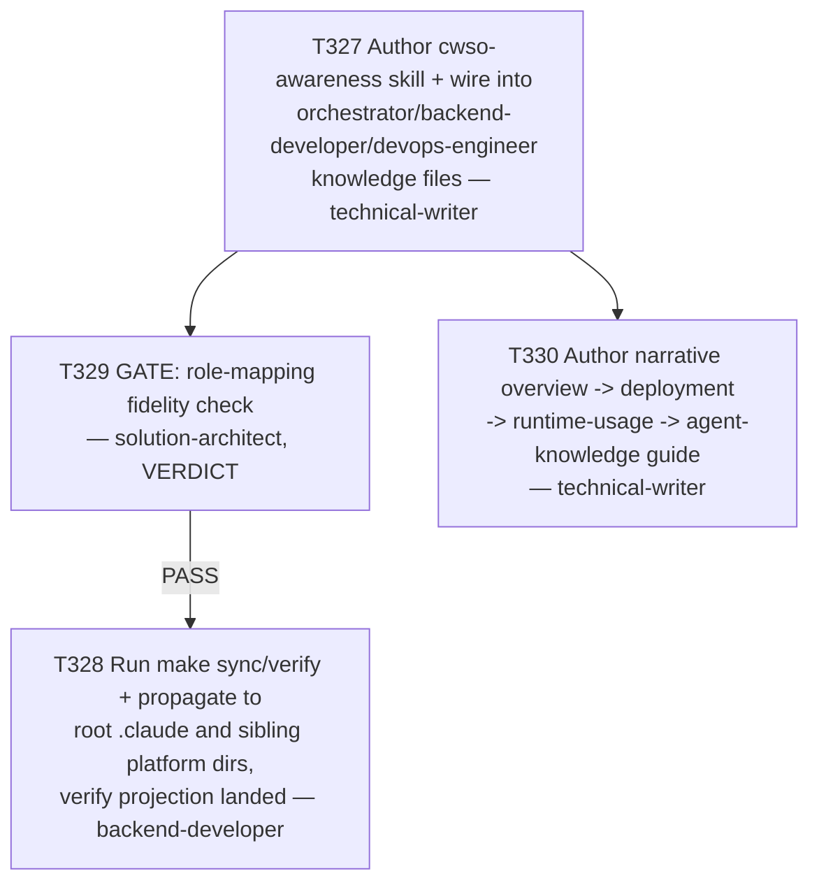

# Plan 018 — CWSO Agent Knowledge Awareness

**Status:** approved (user issued an explicit, numbered execution brief — see § 0)
**Created:** 2026-08-06
**Owner:** orchestrator
**Based on:** `implementation/runtime/cwso/README.md` (task T319), `docs/artifacts/role-mapping-cwso-v1.md`
(task T211, solution-architect, already reviewed/approved), `docs/deployment/README.md`,
`docs/deployment/local-docker-desktop-guide.md`, `docs/deployment/cwso-emage-orchestrator-connection-guide.md`,
`AGENTS.md` § Knowledge Base.

---

## 0. Why this plan exists / approval note

The user manually validated that CWSO is deployed and reachable (Docker stack via
`deploy/docker-compose-t226.yml`, JWT minting, live contract test, 11-tool `tools_list()`). That part is
resolved and out of scope here.

The open gap: **nothing in emage.code's agent-facing knowledge base (`implementation/knowledge/agents/*.md`,
`implementation/knowledge/skills/*`) mentions CWSO's existence, purpose, or the mandatory worker/orchestrator
permission split.** Confirmed independently: `grep -rl -i cwso .claude/skills .claude/agents implementation/knowledge`
→ zero hits before this plan. `AGENTS.md` → zero mentions of CWSO.

The user's request came as a fully-specified, numbered execution brief (5 concrete steps: decompose into
tasks, author the skill/knowledge update, delegate the narrative guide to a Technical Writer, have an
architect/writer sanity-check the role-mapping fidelity, follow checkpoint/gate conventions). Per
Plan-Approve-Execute, this plan document is produced for the audit trail and the task ledger, and execution
proceeds immediately under that existing explicit authorization rather than pausing for a second round-trip
confirmation of a plan that only restates what was already directed.

## 1. Goal

Close the agent-knowledge gap for CWSO in one coherent change: (a) a new `cwso-awareness` skill under
`implementation/knowledge/skills/` that states what CWSO is, why emage.code integrates it (Pattern A
concurrent multi-agent code editing), and the mandatory worker/orchestrator role-split rule (undocumented on
the CWSO server side, discovered empirically in T214 — ignoring it produces HTTP 403); (b) updates to the
`orchestrator`, `backend-developer`, and `devops-engineer` agent knowledge files wiring in that skill and their
CWSO permission tier per `role-mapping-cwso-v1.md`; (c) the real sync mechanism run so `.claude/` (and other
platform projections) actually pick up the change — not hand-edited; (d) one coherent narrative document
(overview → deployment → runtime usage → "does agent knowledge need updating," answered yes and done by this
plan) delegated to a Technical Writer, synthesizing rather than duplicating the three existing deployment docs;
(e) an architect/writer fidelity check confirming the role-mapping table embedded in the new skill matches
`role-mapping-cwso-v1.md` verbatim, not a reinvented mapping.

## 2. Scope

- **In scope:** `implementation/knowledge/skills/cwso-awareness/SKILL.md` (new); `implementation/knowledge/agents/orchestrator.md`,
  `backend-developer.md`, `devops-engineer.md` (edits — add a CWSO Awareness section each); running
  `make sync` / `make verify` from repo root; propagating the regenerated `implementation/.claude/**` (and
  other platform dirs) into the root `.claude/**` (and sibling platform dirs) via
  `scripts/install.sh --target . --platform all --update`, matching the precedent in commit `6d1fca3`
  ("sync root .claude/ install with T301 tool-projection fix"); one new narrative guide document (technical
  writer's choice of path, expected `docs/deployment/cwso-overview-and-agent-integration-guide.md` or similar,
  to be finalized in T330's brief) that links to, but does not duplicate, the three existing deployment docs.
- **Out of scope (explicitly untouched):** the VS Code JWT-paste mistake, the three existing deployment docs'
  content (`docs/deployment/README.md`, `local-docker-desktop-guide.md`, `cwso-emage-orchestrator-connection-guide.md`),
  `implementation/runtime/cwso/*.py`, `deploy/docker-compose-t226.yml`, `scripts/mint-cwso-jwt.py`, and any
  currently-uncommitted files belonging to the sibling session's in-progress bugfix work (`.vscode/mcp.json`,
  `deploy/local-dev/`, `docs/deployment/cwso-emage-orchestrator-connection-guide.md`, `scripts/mint-cwso-jwt.py`
  — all pre-existing working-tree state, not created or modified by this plan).
- **Branch note:** this plan's branch (`feature/327-cwso-agent-knowledge-awareness`) was created from the
  current checkout's HEAD (`bugfix/392-cwso-local-guide-script-alignment`, itself `develop` + one already
  committed, unrelated fix `523c6ff`) rather than a clean `develop` tip, because the working tree already
  carries unrelated uncommitted changes that must not be disturbed (see Out of scope). This is a deliberate,
  logged deviation from the strict "feature branches always from develop" rule; flagged for the user to
  rebase/clean up before merge if desired.

## 3. Task graph

## 4. Agent assignments

| Task | Agent | Scope estimate |
|------|-------|-----------------|
| T327 | technical-writer | 1 new skill file (~150-250 lines) + 3 agent-file edits (~10-20 lines each) |
| T329 | solution-architect | Read-only review, VERDICT only, no file writes |
| T328 | backend-developer | Run `make sync`, `make verify`, `scripts/install.sh --target . --platform all --update`, capture grep evidence |
| T330 | technical-writer | 1 new narrative doc (~150-300 lines), links only to existing docs, no duplication |

## 5. Artifact flow

- T327 produces `implementation/knowledge/skills/cwso-awareness/SKILL.md` and edited
  `implementation/knowledge/agents/{orchestrator,backend-developer,devops-engineer}.md` — consumed by T329
  (review) and T328 (sync input).
- T329 produces a VERDICT (PASS / CONDITIONAL_PASS / FAIL) referencing T327's output and
  `docs/artifacts/role-mapping-cwso-v1.md` — consumed by the orchestrator to gate T328.
- T328 produces regenerated `implementation/.claude/**` (+ other implementation platform dirs) and
  regenerated root `.claude/**` (+ other root platform dirs) — consumed by the orchestrator for final
  verification (`grep -rl -i cwso .claude/skills .claude/agents`).
- T330 produces the new narrative guide — consumed by the user directly.

## 6. Risks and mitigations

| Risk | Mitigation |
|------|------------|
| Technical Writer invents a different role mapping than `role-mapping-cwso-v1.md` | T329 gate explicitly checks the embedded table is verbatim-equivalent to the source artifact; FAIL blocks T328 |
| `make sync` / `--update` install clobbers unrelated uncommitted root-level state | `--update` only rewrites platform-generated dirs (`.claude`, `.github`, `.cursor`, `.gemini`, `.opencode`, `.pi`) via rsync `--delete`; none of the out-of-scope uncommitted files listed in § 2 live in those dirs — verified before running |
| New skill duplicates content already in `implementation/runtime/cwso/README.md` or the deployment docs instead of linking to it | Brief explicitly instructs "synthesize, link, do not duplicate"; T329 gate also checks for this |
| Narrative guide overstates CWSO integration as new/unverified | Brief explicitly requires honesty that integration was previously validated via manual/live testing (T214, T304, etc.) |

## 7. Token budget

Small, contained change — allocated under the Implementation phase budget (≤120k tokens), no new phase
budget required.
