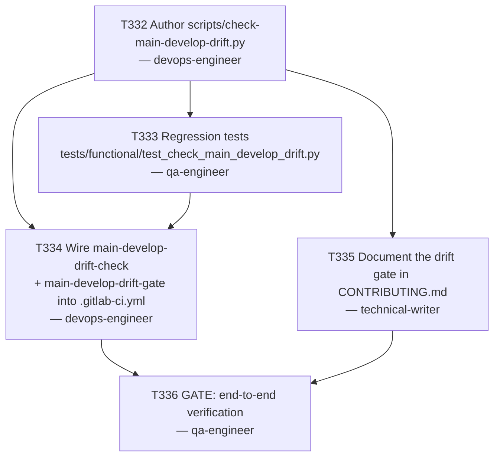

# Plan 019 — `main`/`develop` GitFlow Drift Detection

**Status:** proposed — awaiting user approval (Plan-Approve-Execute; do not execute until approved)
**Created:** 2026-08-07
**Owner:** orchestrator
**Based on:** `docs/tasks/task-T331.md` (full incident narrative and remediation), `docs/checkpoints/checkpoint-release-v6.5.0.md`,
`.claude/rules/git-workflow.md`, `CONTRIBUTING.md` § Releasing, `scripts/verify-release-docs.py`, `.gitlab-ci.yml`

---

## 0. Why this plan exists

`docs/tasks/task-T331.md` documents that `main` (protected, merge=[Maintainers]) and `develop`
(protected, merge=[Developers+Maintainers]) genuinely diverged across roughly 8 releases
(v6.0.4 through v6.4.2) before anyone noticed — some releases flowed `release/vX.Y.Z → main` as
documented in `CONTRIBUTING.md`, others were tagged/released on `develop` only and the main-sync
step was silently skipped. When finally reconciled (T331), 65 files conflicted, including
security-sensitive CWSO runtime code. The user resolved the immediate incident directly; this
plan's job is to design and break down the **prevention mechanism** — T331's own outcome note
recommends "a CI check that fails if `main` falls more than one release behind `develop`, so this
class of drift surfaces immediately instead of requiring a manual catch-up years later."

This is a planning-only artifact. No `.gitlab-ci.yml`, script, or test file is touched by this
plan itself — only this plan document, task briefs, and ledger rows.

## 1. Goal

Ship a machine-checkable, content-based (not commit-SHA-ancestry-based) drift signal between
`main` and `develop`, wired into the exact CI moment that historically let this incident
compound — cutting a new release while a prior one's `main`-sync was still outstanding — plus a
lightweight non-blocking signal on every `develop` push for earlier visibility. Concretely: one
new script (`scripts/check-main-develop-drift.py`), its regression tests, two new CI jobs wired
into the existing `verify` and `release` stages, and a `CONTRIBUTING.md` update documenting the
gate and its remediation path.

## 2. Scope

- **In scope (this plan):** design + task breakdown only. Task briefs authored under
  `docs/tasks/task-T332.md` through `task-T336.md`; new `pending` rows in
  `docs/tasks/active-tasks.md`; this plan document.
- **In scope (future execution, NOT done by this plan):** `scripts/check-main-develop-drift.py`;
  `tests/functional/test_check_main_develop_drift.py`; two new jobs in `.gitlab-ci.yml`
  (`main-develop-drift-check` in `verify`, `main-develop-drift-gate` in `release`); a
  `main-develop-drift-gate` entry added to the existing `release` job's `needs:`; a new
  "Drift detection" subsection in `CONTRIBUTING.md` § Releasing.
- **Explicitly out of scope:** redesigning where release tags are placed (`main` vs `develop`) —
  that is a separate, larger release-process decision belonging to `@release-manager`/the user,
  not something this plan silently changes (see § 6, risk row 3). Also out of scope: retroactive
  repair of any further historical drift (T331 already closed that), and any GitLab project-setting
  changes (no pipeline schedule is required by the chosen design — see § 3).

## 3. Technical approach and decision record

Three design axes needed a decision. Reasoning recorded here per the planning brief's requirement
that no open design questions are left for the executing agent.

### 3.1 Comparison signal: content/marker comparison, not commit-SHA ancestry

**Rejected:** `git merge-base --is-ancestor vX.Y.Z origin/main`. Verified false-positive-prone
this session: GitLab's merge-via-API can materialize a *new* commit object with an identical
tree/message rather than reusing the source branch's tip commit as a direct parent. A
content-correct, freshly performed `release/* → main` merge can still fail this check (confirmed
directly against `main`'s real post-T331 tip `5d5fd00`, whose GitLab-materialized second parent is
tree-identical to, but not the same commit as, `f75335c`).

**Chosen:** compare the existing `Latest release: vX.Y.Z` marker (already enforced by
`scripts/verify-release-docs.py` in `README.md`, `docs/wiki/README.md`, `docs/wiki/home.md`) as it
reads on `origin/main`'s `README.md` versus `origin/develop`'s `README.md`, via
`git show <ref>:README.md`. This is pure content comparison — immune to the commit-recreation
false positive above — and reuses a convention the team already maintains every release, so no new
marker or process is invented.

### 3.2 "How far behind" arithmetic: tag-list index distance, with a 1-release grace window

Two marker strings alone (`v6.4.2` on `main`, `v6.5.0` on `develop`) don't say *how many* releases
separate them — `v6.4.3` could exist in between and be missing from `main` without either marker
saying so directly. The script resolves both marker strings against the full, semver-sorted list
of git tags in the repo (`git tag`, filtered to `^v\d+\.\d+\.\d+(-[A-Za-z0-9.-]+)?$` and sorted
numerically, not lexically — verified necessary: `v6.4.10` must sort after `v6.4.2`, which plain
string sort gets wrong) and counts the index distance.

A **grace window of exactly 1 release** is allowed before this is treated as drift (FAIL). This
matches T331's own recommendation ("more than one release behind") and reflects the real, expected
transient state of this repo's actual practice: a release is tagged on `develop` first, and the
`release/vX.Y.Z → main` sync MR is expected to land before the *next* release ships — not
instantaneously. Verified against real repo state during this planning session:
`origin/main:README.md` and `origin/develop:README.md` both currently read `Latest release:
v6.5.0` (0 releases behind, would PASS). Verified against the actual incident shape: at the moment
`v6.5.0` was tagged, `main`'s marker was still `v6.4.2`, and the tag list is `..., v6.4.2, v6.4.3,
v6.5.0` — a distance of 2, which is `> 1` and would have correctly FAILed under this design,
catching the drift at the second unsynced release rather than letting it silently compound to
eight.

### 3.3 CI trigger point: block at release-tag time (primary), warn on every `develop` push (secondary) — not a scheduled pipeline

**Considered and rejected: a GitLab scheduled pipeline** (e.g. weekly cron via `rules: if:
$CI_PIPELINE_SOURCE == "schedule"`). Rejected because (a) it requires a separate, non-file,
manually-created GitLab project setting (`Pipeline schedules`), which is harder to make
"mechanical for a low-context executing agent" than a pure `.gitlab-ci.yml` diff, (b) it only
catches drift on a fixed calendar cadence rather than at the exact moment the incident's failure
mode actually occurs, and (c) the incident's real cause was specifically "cutting more releases
without syncing the previous one to `main`" — a scheduled check doesn't prevent that from
happening, it only reports it after the fact, same as what a human eventually did manually.

**Chosen: two layers, both pure `.gitlab-ci.yml` additions:**
1. **Blocking gate at release-cut time** — new job `main-develop-drift-gate` in the existing
   `release` stage, triggered by the same tag rule as `release-docs-gate`
   (`$CI_COMMIT_TAG =~ /^v[0-9]+\.[0-9]+\.[0-9]+(-[A-Za-z0-9.-]+)?$/`), and the existing `release`
   job's `needs:` is extended to include it. This means: if `main` is already more than 1 release
   behind at the moment a *new* tag is pushed, the release CI job (CHANGELOG regen + GitLab
   Release publish) is blocked until the outstanding `main`-sync MR lands. This is the exact
   control point that would have stopped the real incident at its second occurrence.
2. **Non-blocking signal on every `develop` push** — new job `main-develop-drift-check` in the
   existing `verify` stage, `rules: if: $CI_PIPELINE_SOURCE == "push" && $CI_COMMIT_BRANCH ==
   "develop"`, `allow_failure: true`. Gives earlier visibility between releases without turning
   every `develop` commit red during the expected 1-release grace window.

No new GitLab project settings, secrets, or scheduled pipelines are required — both jobs are pure
`.gitlab-ci.yml` additions using the existing `python:3.12-alpine` image pattern already used by
`release-docs-gate`.

## 4. Task graph

## 5. Agent assignments

| Task | Agent | Scope estimate |
|------|-------|-----------------|
| T332 | devops-engineer | 1 new script (~150-200 lines), pure-function design for testability |
| T333 | qa-engineer | 1 new test file (~120-180 lines), pure-function unit tests, no real git needed |
| T334 | devops-engineer | 2 new job blocks + 1 `needs:` edit in `.gitlab-ci.yml` |
| T335 | technical-writer | ~20-30 line new subsection in `CONTRIBUTING.md` § Releasing |
| T336 | qa-engineer | Verification only, no file writes beyond Execution notes |

## 6. Artifact flow

- T332 produces `scripts/check-main-develop-drift.py` — consumed by T333 (tests import it via
  `importlib.util.spec_from_file_location`, matching `tests/functional/test_publish_release.py`'s
  precedent), T334 (CI jobs invoke it), and T335 (documents its behavior).
- T333 produces `tests/functional/test_check_main_develop_drift.py` — consumed by T334 (must be
  green before CI wiring is considered done) and picked up automatically by `tests/run.py`'s
  functional-suite discovery, no runner changes needed.
- T334 produces the `.gitlab-ci.yml` diff — consumed by T336 for live-pipeline verification.
- T335 produces the `CONTRIBUTING.md` diff — consumed by T336 for consistency verification
  (`grep` for the exact required strings).
- T336 produces a VERDICT plus literal command evidence in its own Execution notes — consumed by
  the orchestrator to close the plan.

## 7. Risks and mitigations

| Risk | Mitigation |
|------|------------|
| Shallow CI clones don't have `main`/`develop`/tags fetched by default (GitLab CI fetches only the pipeline's own ref) | T332's script takes `--main-ref`/`--develop-ref` args (default `origin/main`/`origin/develop`); T334's exact job `script:` includes explicit `git fetch origin main develop --depth=1` and `git fetch origin 'refs/tags/*:refs/tags/*'` before invoking the script — specified literally in the task brief, not left to the executing agent to figure out |
| Blocking `main-develop-drift-gate` at release-cut time could itself become a source of release delays if a real, larger main-sync is mid-flight | This is intentional — it is the exact mechanism the plan exists to add. The 1-release grace window (§3.2) already tolerates the normal one-release transient gap; only genuine, compounding drift blocks a release, and the block is resolved by finishing the outstanding `release/vX.Y.Z → main` MR (already a documented, familiar step) |
| Redesigning tag placement (`main` vs `develop`) is tempting but out of scope | Explicitly deferred (§2) — T335's `CONTRIBUTING.md` update documents the new gate and grace window without changing where tags are placed; flagged here as a legitimate future follow-up for `@release-manager`, not silently decided in this plan |
| Non-semver or prerelease tags in `git tag` output could break numeric sort | T332's `semver_key()` returns `None` for anything not matching `^v\d+\.\d+\.\d+(-[A-Za-z0-9.-]+)?$`; `sorted_valid_tags()` drops non-matching tags before sorting — specified as an explicit acceptance criterion in T332's brief with a literal test case (`backup/release-v6.0.3-pre-rewrite-...` must be excluded) |
| Marker missing or unparseable on either branch (e.g. someone hand-edits README.md without the marker) | Treated as FAIL (exit 1), not a silent pass — fail-closed, per this repo's security guidelines ("no unvalidated external input") |

## 8. Token budget

Small, contained change — allocated under standard phase budgets (Planning ≤80k already spent on
this plan; Implementation ≤120k covers T332–T336 when executed). No new phase budget required.
