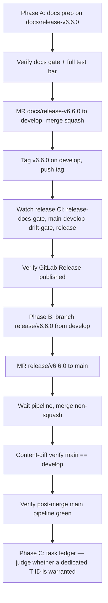

# Plan 020 — Release v6.6.0 and `main`/`develop` Sync

**Status:** approved (user gave explicit end-to-end authorization; not a plan-then-pause request)
**Created:** 2026-08-07
**Owner:** orchestrator
**Based on:** `docs/tasks/task-T331.md`, `docs/plans/plan-019-main-develop-drift-detection.md`,
`docs/tasks/task-T332.md` through `task-T336.md`, `docs/checkpoints/checkpoint-release-v6.5.0.md`,
`.claude/rules/git-workflow.md`, `CONTRIBUTING.md`

## Goal

Cut release v6.6.0 from `develop`'s current tip (which carries the new, tested, documented
`main`/`develop` drift-detection CI capability — `scripts/check-main-develop-drift.py` + tests +
two new `.gitlab-ci.yml` jobs + a `CONTRIBUTING.md` subsection, shipped via plan-019/T332-T336),
publish it as a GitLab Release, and then perform the standing `release/vX.Y.Z → main` sync per the
documented GitFlow policy — the exact policy whose historical neglect T331 diagnosed and whose
recurrence plan-019's new CI gate now exists to prevent. Version chosen: **MINOR** (v6.5.0 →
v6.6.0), matching this repo's own established convention that new capabilities (not fixes) bump
MINOR — confirmed against `docs/releases/v6.4.0.md` ("Two new sync-engine capabilities", "New
platform manifest and projection") and `docs/releases/v6.3.0.md` ("Shipped ledger validator", a
new script + command shipped into every target project), both MINOR bumps for new tooling/scripts
of the same shape as this release's drift-detection script.

## Task graph

## Agent assignments

| Phase | Agent | Scope |
|-------|-------|-------|
| A (docs prep, verification, MR, tag, publish) | release-manager | Release docs, marker updates, checkpoint, full verification bar, MR lifecycle, tag, CI watch, release-publish verification |
| B (main sync) | release-manager | `release/v6.6.0` branch, MR to `main`, non-squash merge, content-diff verification, post-merge pipeline check |
| C (task ledger) | orchestrator (this session) | Judge convention (v6.4.1 precedent: no dedicated T-ID for a similar release-only cycle), run `validate-tasks.py` |

Orchestrator independently re-verifies (via direct `git fetch`/`glab api`/diff commands) after
each phase before authorizing the next — per the user's explicit standing instruction this
session, not deferred to agent self-report.

## Artifact flow

- release-manager produces: `docs/releases/v6.6.0.md`, `docs/checkpoints/checkpoint-release-v6.6.0.md`,
  updated `Latest release:` markers in `README.md`/`docs/wiki/README.md`/`docs/wiki/home.md`.
- Orchestrator consumes these to verify against `scripts/verify-release-docs.py` and to write the
  final report to the user.
- Phase B produces MR record + merge commit SHAs on `main`, consumed by orchestrator for the
  final tip-SHA report.

## Risks and mitigations

| Risk | Mitigation |
|------|------------|
| `main-develop-drift-gate` unexpectedly fails at tag time | Stop and report exact output rather than working around it (explicit user instruction) |
| `release/v6.6.0 → main` MR has real conflicts | Should not happen (main/develop content-identical post-T331); if it does, escalate with specific files rather than resolve unilaterally, per the T331 precedent |
| Wrong squash setting on either merge | Phase A merge (docs branch → develop) squash=true (normal feature-branch convention); Phase B merge (release → main) squash=false explicit via API — verified explicitly before executing, not assumed |
| `git merge-base --is-ancestor` false negative (GitLab merge API commit-recreation, per T331) | Use content-diff (`git diff origin/develop origin/main`) as the authoritative post-merge verification, not ancestry check |
| Local worktree branch is stale (pointed at old `main` tip, not `develop`) | All new branches created explicitly from freshly-fetched `origin/develop`, not from local worktree HEAD |

## Token budget

Release phase: ≤60k tokens (per repo governance table). This is a release-only cycle (no new
implementation), so Planning/Architecture/Implementation budgets are not invoked.
