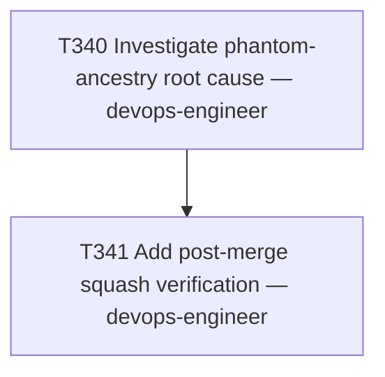

# Plan 021 — Post-merge squash/ancestry verification for `release/* → main` syncs

**Status:** approved — executed same session
**Created:** 2026-08-07
**Owner:** orchestrator
**Based on:** `docs/tasks/task-T340.md` (root-cause investigation), `docs/tasks/task-T331.md`,
`docs/tasks/task-T339.md` (both incidents this plan's task closes the detection loop for)

## 0. Why this plan exists

`docs/tasks/task-T339.md`'s "Flagged follow-up" section recommended a dedicated investigation into
why `release/* → main` merges keep producing ancestry-corrupted commits on `main`, "same treatment
T331 gave its own... recommendation... picked up as plan-019 in a later session." T340 delivered
that investigation and confirmed the root cause: GitLab squashes these merges despite an explicit
`squash: false` override, on a project with `squash_option: default_on` — producing a `main`-side
commit whose second parent is GitLab's own `squash_commit_sha` rather than the real source-branch
tip, which corrupts `git merge-base(main, develop)` for the next sync (exactly what happened in
T339, discovered a full release cycle later).

This is a small, single-task plan — filed retroactively alongside T341's execution, per this
repo's own `tests/performance/test_team_health.py::test_every_active_task_has_a_plan` gate, which
requires every active task to be referenced by a plan document. Unlike plan-019 (5 tasks, a full
CI mechanism), T340's recommendation was a single small, well-scoped task, so a full multi-task
plan document was not warranted — this file exists primarily to satisfy that traceability
requirement honestly, not to retroactively dress up a bigger process than what actually happened.

## 1. Goal

Close the detection loop on the phantom-ancestry failure mode T340 diagnosed: a script that
verifies, immediately after every `release/vX.Y.Z → main` merge, that GitLab did not silently
squash despite the override — plus a documented recovery procedure for when it does.

## 2. Scope

- **In scope:** `scripts/verify-main-sync-merge.py`, its regression test
  (`tests/functional/test_verify_main_sync_merge.py`), and a new "Post-merge squash verification"
  subsection in `CONTRIBUTING.md` § Releasing.
- **Explicitly out of scope (per T340's recommendation — deferred, not decided against):**
  bypassing the `/merge` API via direct push to `main` (weakens `push=[No one]` protection);
  disabling `squash_option` project-wide (removes squash-and-merge for every other MR type too).
  Both are deferred until the cheap verification-based approach is tried on a real
  `release/* → main` sync and shown insufficient.
- **Not touched:** `scripts/check-main-develop-drift.py` and its CI jobs (plan-019) — that
  mechanism correctly addresses the user-visible symptom (content drift) at a later point; this
  plan targets the ancestry corruption at its source, one layer earlier, and the two are
  independent, complementary mitigations.

## 3. Task graph

## 4. Outcome

Executed same session as this plan was filed. See `docs/tasks/task-T341.md` § Outcome for full
acceptance-criteria evidence (script behavior against real MR !103/!109 records, test results, MR
link).
