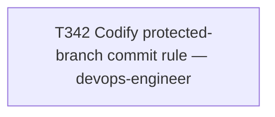

# Plan 022 — Codify the protected-branch commit rule

**Status:** approved — executed same session
**Created:** 2026-08-07
**Owner:** orchestrator
**Based on:** This session's own incident (two direct commits to local `develop`, both rejected
by GitLab's branch protection, both recovered by moving the commits to a branch and opening an
MR — once for T340's closeout, once for T341's closeout)

## 0. Why this plan exists

Same rationale as plan-021: a single, well-scoped task (T342) doesn't warrant a multi-task plan
document, but this repo's own `tests/performance/test_team_health.py::test_every_active_task_has_a_plan`
gate requires every active task to be referenced somewhere under `docs/plans/`. This file exists
to satisfy that traceability requirement honestly for T342, not to retroactively dress up a bigger
planning process than what actually happened: the user asked directly for the knowledge-base fix,
and it was scoped and executed as one task.

## 1. Goal

Make "no direct commits to `main`/`develop`, ever — including single-file, docs-only,
ledger-only orchestrator edits" an explicit, citable rule in
`implementation/knowledge/instructions/git-workflow.md` (the canonical source), propagated to
every platform projection this repo maintains, with a cross-reference in the `task-management`
skill at the exact point (ledger archival) where the orchestrator's own mistake occurred twice.

## 2. Scope

- **In scope:** `implementation/knowledge/instructions/git-workflow.md`,
  `implementation/knowledge/skills/task-management/SKILL.md`, and their regenerated projections
  (12 platform files total, both under `implementation/` and at repo root), plus the registry
  regeneration this triggers.
- **Not in scope:** any application code, CI config, or process change beyond the knowledge-base
  update itself.

## 3. Task graph

## 4. Outcome

Executed same session as this plan was filed. See `docs/tasks/task-T342.md` § Outcome for full
acceptance-criteria evidence (diff content, drift-verification command output, MR link).
