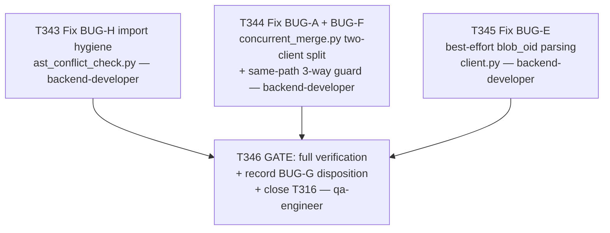

# Plan 023 — T316 Pattern A cleanup: resolve BUG-A/E/F/G/H

**Status:** approved — executing this session
**Created:** 2026-08-08
**Owner:** orchestrator
**Based on:** `docs/tasks/task-T316.md` (full bug narratives, P2 tracked debt, does not block
T214/T306), `docs/tasks/task-T214.md` Execution notes (original live evidence),
`docs/tasks/task-T315.md` (prior related live-response-shape fixes), `docs/tasks/task-T310.md`
(CWSO-core hand-off convention, referenced for BUG-G's disposition)

## 0. Why this plan exists

T316 tracks five real gaps found during T214's first live run of the Pattern A runtime, none of
which block T214/T306 but all of which are real, tracked debt per this repo's anti-fabrication
norms. Per `.claude/rules/coding-standards.md`'s versioned-artifact convention and this repo's own
`test_every_active_task_has_a_plan` gate, every active task needs a plan reference before it can
close — this is a genuine multi-task plan (not a single-task retroactive filing like plan-021/022)
because two of the five bugs (BUG-A, BUG-F) require an actual design decision, not just a
mechanical fix.

## 1. Goal

Give each of BUG-A/E/F/G/H an explicit, evidence-grounded disposition — fixed, deferred with
reason, or routed to CWSO — per T316's own acceptance bar, without expanding scope beyond what
T316 actually asked for.

## 2. Research grounding (done before writing this plan, not guessed)

- `implementation/runtime/cwso/client.py:200-229` confirms `CwsoClient.__init__` takes a single
  `role: str` locked at construction (`"orchestrator"` or `"worker"`), matching BUG-A's live
  permission-matrix finding.
- `tests/functional/test_pattern_a_integration_live.py:100-181` — the live integration test
  **already hand-rolls the exact fix** BUG-A needs: `cls.worker = CwsoClient(..., role="worker")`
  for `create_shadow_workspace`/`write_shadow_file`/`commit_shadow`/`drop_shadow_workspace`/
  `AstConflictChecker(cls.worker)`, and `cls.orch = CwsoClient(..., role="orchestrator")` for
  `merge_concurrent_results` — proving the two-role-client split works against the real server,
  not just in theory.
- `implementation/runtime/cwso/ast_conflict_check.py:13` confirmed to use
  `from implementation.runtime.cwso.client import (...)` (absolute), while
  `implementation/runtime/cwso/concurrent_merge.py:13-14` uses `from .client import ...` /
  `from .ast_conflict_check import ...` (relative) — confirms BUG-H exactly as described.
- `implementation/runtime/cwso/client.py:459-470` confirms `write_shadow_file`'s docstring claims
  a `blob_oid` key that the real server's prose response never actually populates (BUG-E);
  confirmed nothing downstream in `concurrent_merge.py` currently reads `blob_oid` from this
  specific call (only `commit_resp.get("commit_oid"/"tree_oid")` from the separate
  `commit_shadow` response is used) — so this is a real but currently-inert gap.
- Call-site survey (`grep -rl "ConcurrentMergeOrchestrator\|AstConflictChecker("`): source
  (`concurrent_merge.py`) + 4 test files (`tests/unit/test_ast_conflict_check.py`,
  `tests/unit/test_cwso_concurrent_merge.py`, `tests/functional/test_pattern_a_integration.py`,
  `tests/functional/test_pattern_a_integration_live.py`) — all four need their
  `ConcurrentMergeOrchestrator(...)` construction call updated for BUG-A's new two-client
  signature.

## 3. Design decisions

### 3.1 BUG-A — `ConcurrentMergeOrchestrator` accepts two role-scoped clients

**Chosen:** change `__init__(self, client: CwsoClient)` to
`__init__(self, worker_client: CwsoClient, orchestrator_client: CwsoClient)`. Route
`create_shadow_workspace`/`write_shadow_file`/`commit_shadow`/`drop_shadow_workspace` and the
internal `AstConflictChecker` to `worker_client`; route `merge_concurrent_results` to
`orchestrator_client`. This exactly mirrors the proven-live pattern in
`test_pattern_a_integration_live.py` (§2) rather than inventing a new shape.

**Rejected:** a single client with runtime role-switching (would require minting/holding two JWTs
inside one `CwsoClient` instance, a larger change to `client.py` itself, not just the orchestrator
— out of proportion for a P2 fix when the caller-supplies-two-clients shape already has live
proof it works).

### 3.2 BUG-F — raise a clear error for same-path 3+-worker collisions, don't silently drop

**Chosen:** `_build_merge_inputs` (or `run()`) raises `ValueError` with an explicit message
identifying the path and the ≥3 contributing worker roles when 3 or more workers edit the *same
path* — converting a silent data-loss bug into a loud, immediately-actionable failure. Paths
touched by ≤2 workers are unaffected and continue to batch-merge in a single
`merge_concurrent_results` call exactly as today.

**Rejected (this wave):** implementing genuine N-way sequential-pairwise merge composition inside
`ConcurrentMergeOrchestrator.run()` (chaining `merge_concurrent_results` calls two at a time for
any path with 3+ contributors, mirroring what T214's Scenario 1 did by hand in its test). This is
real, proven-possible (T214 Scenario 1 is existence proof), but is a materially larger algorithm
change to a concurrency-sensitive code path than this P2 cleanup wave's scope warrants, and
carries real risk of introducing a new bug in the process. Recorded here as a legitimate future
enhancement, not silently dropped — a follow-up task should be filed if genuine N-way support is
ever actually needed by a caller (none exists today; `ConcurrentMergeOrchestrator.run()` itself
has zero real call sites outside tests currently).

### 3.3 BUG-E — best-effort `blob_oid` extraction from the prose response, never raise

**Chosen:** `write_shadow_file` gets a small, defensive regex extraction
(`re.search(r"blob\s+([0-9a-f]+)", text)`) applied only when the response is still prose after
`_unwrap_tool_result`'s normal JSON-unwrap attempt (i.e., exactly the case BUG-E describes). If
the pattern matches, populate `blob_oid` on the returned dict so the existing docstring becomes
true; if it doesn't match, return the dict unmodified (current behavior) — never raise. This
resolves the practical gap without waiting on a CWSO-side response-shape fix, and fails safe if
the server's prose format ever changes.

### 3.4 BUG-G — deferred, not routed to CWSO, with reason recorded

**Chosen:** deferred, per T316's own acceptance criteria explicitly allowing "deferred with
reason" as a valid disposition (not every finding must become a CWSO hand-off). Reason: the
generic `"AST semantic overlap conflict"` message is not incorrect, only less specific than
originally hoped; T214 passes without needing symbol-specific wording; and per §3.1/§3.2's survey,
`ConcurrentMergeOrchestrator` has no real caller outside tests today, so there is no active
consumer asking for more specific messages. Not routed to `../CWSO` via the T310 convention at
this time — that convention is reserved for confirmed defects or real integration blockers (per
T310's own acceptance criteria), and a wording preference with no active consumer doesn't meet
that bar. If a real caller later needs symbol-specific messages, file the CWSO hand-off then, with
a concrete use case attached.

### 3.5 BUG-H — mechanical import fix

**Chosen:** change `ast_conflict_check.py`'s absolute import to the same relative style as
`concurrent_merge.py`. No design decision needed — this one is a straightforward hygiene fix.

## 4. Scope

- **In scope:** `implementation/runtime/cwso/concurrent_merge.py` (BUG-A, BUG-F),
  `implementation/runtime/cwso/ast_conflict_check.py` (BUG-H),
  `implementation/runtime/cwso/client.py` (BUG-E), and the 4 test files identified in §2 that
  construct `ConcurrentMergeOrchestrator` and need updating for BUG-A's new signature. BUG-G's
  disposition is recorded in this plan and in `task-T316.md`'s own Execution notes — no code, no
  `../CWSO` artifact.
- **Explicitly out of scope:** genuine N-way merge composition (§3.2's rejected option); any
  change to `client.py`'s role/JWT model beyond BUG-E's narrow regex fallback; any CWSO-core
  change (BUG-G deferred, not routed).

## 5. Task graph

T343/T344/T345 touch disjoint files (`ast_conflict_check.py`, `concurrent_merge.py`, `client.py`
respectively) and have no dependency on each other — dispatched independently, each in its own
isolated worktree, each landing its own branch + MR to `develop` before T346 begins.

## 6. Agent assignments

| Task | Agent | Files touched |
|------|-------|----------------|
| T343 | backend-developer | `implementation/runtime/cwso/ast_conflict_check.py` |
| T344 | backend-developer | `implementation/runtime/cwso/concurrent_merge.py`, `tests/unit/test_cwso_concurrent_merge.py`, `tests/functional/test_pattern_a_integration.py`, `tests/functional/test_pattern_a_integration_live.py`, `tests/unit/test_ast_conflict_check.py` (if it constructs the orchestrator) |
| T345 | backend-developer | `implementation/runtime/cwso/client.py` |
| T346 | qa-engineer | none (verification only) — `docs/tasks/task-T316.md` (BUG-G disposition + closeout) |

## 7. Landing convention (per T342)

Every task lands via its own branch + MR to `develop`, reviewed and merged by the orchestrator
after independent verification — no direct commits to `develop`, including this plan's own filing
and the final ledger closeout, per `implementation/knowledge/instructions/git-workflow.md` §
"Protected Branches — No Direct Commits, Ever".

## 8. Risks and mitigations

| Risk | Mitigation |
|------|------------|
| BUG-A's signature change breaks a caller this survey missed | §2's `grep -rl` survey is exhaustive for this repo; if a missed caller surfaces in CI, T344's own acceptance criteria requires the full suite green before its MR merges |
| BUG-F's raised error changes behavior for any hidden real caller relying on old silent-drop semantics | No real caller exists outside tests (confirmed in §2/§3.2) — a loud, correct error is strictly better than silent data loss for any future caller |
| T344's worktree branches from a stale point (recurring issue flagged in T340/T341/T342) | Explicitly instruct the dispatched agent to verify its worktree base matches current `develop` tip before starting, per the pattern that resolved it each prior time |

## 9. Outcome

Executed same session as this plan was filed. See `docs/tasks/task-T316.md` § Execution notes for
the final disposition of all five bugs, and `docs/tasks/task-T343.md` through `task-T346.md` for
per-task evidence.
