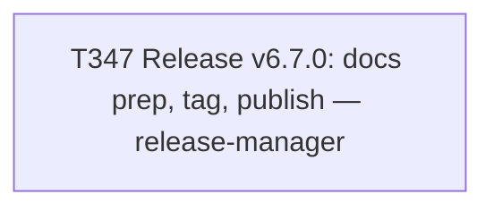

# Plan 024 — Release v6.7.0

**Status:** approved — executing this session
**Created:** 2026-08-08
**Owner:** orchestrator
**Based on:** `docs/tasks/task-T337.md` (v6.6.0 precedent, same procedure), user's explicit MINOR
version-bump choice

## 0. Why this plan exists

Same rationale as plan-021/022: a single-task release cut doesn't warrant a multi-task plan
document, but this repo's own `test_every_active_task_has_a_plan` gate requires every active task
to be referenced under `docs/plans/`. Filed alongside T347 rather than after, to avoid the same
CI round-trip plan-021/022 needed.

## 1. Goal

Cut and publish release v6.7.0 (MINOR bump from v6.6.0) covering everything completed since the
last release: T340 (merge-API phantom-ancestry investigation), T341 (post-merge squash
verification — the new capability justifying the minor bump), T342 (protected-branch commit
rule), T343–T346 (T316's Pattern A cleanup wave: BUG-H/A/F/E fixed, BUG-G deferred).

## 2. Scope

- **In scope:** `docs/release-v6.7.0` branch, release markers, `docs/releases/v6.7.0.md`,
  `docs/checkpoints/checkpoint-release-v6.7.0.md`, tag `v6.7.0`, GitLab Release publish.
- **Explicitly out of scope:** the `release/v6.7.0 → main` sync. Per T337/T339 precedent, that is
  a separate follow-up task, scheduled after this one lands if warranted — not silently bundled in.

## 3. Task graph

## 4. Outcome

Executed same session as this plan was filed. See `docs/tasks/task-T347.md` § Outcome for full
evidence (verification bar results, MR link, tag/publish confirmation).
