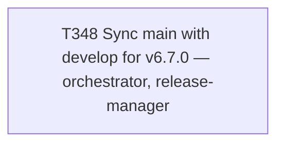

# Plan 025 — `main` sync for v6.7.0

**Status:** approved — executing this session
**Created:** 2026-08-08
**Owner:** orchestrator
**Based on:** `docs/tasks/task-T331.md`, `docs/tasks/task-T339.md` (precedent, twice-proven),
`docs/tasks/task-T340.md` (root-cause of the recurring phantom conflict), `docs/tasks/task-T341.md`
(the verification tool this sync gets to actually exercise for the first time)

## 0. Why this plan exists

Same rationale as plan-021/022/024: a single-task operation, filed alongside its task to satisfy
`test_every_active_task_has_a_plan` without a disproportionate multi-task plan document.

## 1. Goal

Sync `main` with `develop` for v6.7.0, following the exact procedure proven twice this session
(T331, T339), with two improvements available for the first time: T340's root-cause understanding
means any conflict here is diagnosed correctly from the start rather than re-investigated, and
T341's `scripts/verify-main-sync-merge.py` gives a real, immediate signal on whether GitLab
squashed the merge despite the override — this is that tool's first real production use.

## 2. Scope

- **In scope:** `release/v6.7.0 → main` MR, conflict diagnosis if any, merge, post-merge
  verification (T341's tool + content diff + pipeline), final local sync of `develop`/`main`/tags
  to origin.
- **Not in scope:** any further `develop` changes beyond this task's own ledger closeout (via a
  separate branch+MR).

## 3. Task graph

## 4. Outcome

Executed same session as this plan was filed. See `docs/tasks/task-T348.md` § Outcome for full
evidence.
