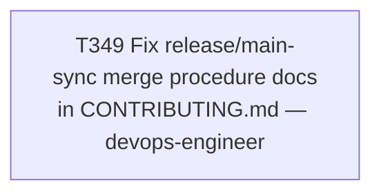

# Plan 026 — Fix the release/*→main merge procedure documentation

**Status:** approved — executing this session
**Created:** 2026-08-08
**Owner:** orchestrator
**Based on:** `docs/tasks/task-T348.md` § Outcome (the discovery this plan acts on), `CONTRIBUTING.md`
§ Releasing (current, partly incorrect documentation), `docs/tasks/task-T340.md`,
`docs/tasks/task-T341.md` (prior investigation/tooling this builds on)

## 0. Why this plan exists

T348 (the v6.7.0 `main` sync) surfaced two concrete, evidence-backed problems in
`CONTRIBUTING.md`'s documented release procedure:

1. The "Post-merge squash verification" § recovery procedure tells the operator to `git push`
   directly to `main` after a local `-s ours` no-op merge. This **cannot work** — confirmed via
   `glab api projects/.../protected_branches/main`: `push_access_levels: ['No one']`, identical to
   `develop`'s protection. T348 had to improvise a branch+MR workaround live, mid-incident. This is
   a plain factual bug in the docs, not a design question.
2. While improvising that fix, T348 found that `PUT`-updating a merge request's own `squash`
   attribute to `false` (via `glab api -X PUT projects/.../merge_requests/:iid -f squash=false`)
   *before* calling `/merge` held on the one real attempt made (MR !126) — whereas passing
   `squash: false` only in the `/merge` call's own body (what MR !103, !109, and !125 all did)
   failed all four times it was tried this session. This is a genuine candidate fix for the root
   cause T340 flagged as unresolved ("server quirk or client issue") — pointing to the latter.

This plan turns both into a corrected, strengthened `CONTRIBUTING.md` procedure. Single cohesive
task (not split), since both changes land in the same file/section and are two parts of one
"the documented release/main-sync procedure needs to reflect reality" fix — splitting them would
create pointless same-file merge risk between parallel dispatches for no benefit.

## 1. Goal

`CONTRIBUTING.md` § Releasing describes a `release/vX.Y.Z → main` procedure that (a) is factually
accurate about what a stuck/incorrectly-protected recovery looks like, and (b) adopts the
PUT-squash-false-first sequence as the **standard** merge step for this specific merge pattern —
turning T341's tool from "detect after the fact" into "prevent, with detection as the safety net
it was originally designed as."

## 2. Design decision: adopt the PUT-first sequence as standard now, on 1 confirmed data point

**Considered:** wait for a second real `release/*→main` sync before changing the documented
standard procedure, treating this release as too thin an evidence base (n=1) to promote from
"interesting finding" to "standard practice."

**Chosen:** adopt it now, as the standard first step of the merge action itself (not just a
recovery-path improvise), for these reasons:
- The change is a **strict superset** of the current documented step — it adds one `PUT` call
  before the existing `/merge` call, with no plausible downside if it turns out not to matter
  (setting `squash: false` on an MR that would've merged non-squashed anyway is a no-op).
- The mechanism has a plausible, specific explanation (the `/merge` endpoint reading the MR
  resource's *persisted* `squash` attribute rather than honoring a same-call override in the
  request body) — this isn't a coincidence-shaped finding, it's a testable hypothesis with a
  concrete API-shape reason to expect it to generalize.
- The cost of being wrong is low and self-correcting: T341's `scripts/verify-main-sync-merge.py`
  remains in place unchanged as the safety net. If the PUT-first sequence turns out not to help on
  a future sync, the tool still catches it immediately, exactly as it already proved it does
  (T348). Nothing about adopting this weakens the existing detection.
- Waiting for a second data point means deliberately keeping a known-more-reliable sequence
  undocumented through at least one more real release, for no compensating safety benefit.

## 3. Scope

- **In scope:** `CONTRIBUTING.md` § Releasing (both the "Cutting a release" step 5/6 area and the
  "Post-merge squash verification" § recovery procedure).
- **Explicitly out of scope:** any change to `scripts/verify-main-sync-merge.py` itself (it stays
  exactly as T341 built it — a post-merge safety net, not a merge-performing tool); any change to
  GitLab project settings (`squash_option`, branch protection) — this plan fixes documentation and
  procedure, not infrastructure; building new automation/scripting for the merge sequence itself
  (the corrected procedure is documented as clear `glab api` commands for the orchestrator to run
  directly, matching how this exact operation has been performed by the orchestrator directly
  every time this session — not delegated to a new script).

## 4. Task graph

## 5. Outcome

Executed same session as this plan was filed. See `docs/tasks/task-T349.md` § Outcome for full
evidence.
