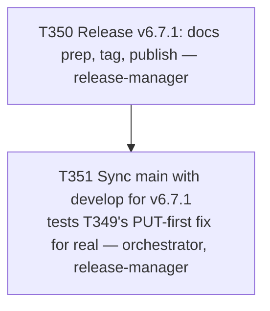

# Plan 027 — Release v6.7.1 and `main` sync

**Status:** approved — executing this session
**Created:** 2026-08-08
**Owner:** orchestrator
**Based on:** `docs/tasks/task-T337.md`/`task-T347.md` (release precedent), `docs/tasks/task-T348.md`
(main-sync precedent), `docs/tasks/task-T349.md` (the fix this cycle's sync tests for real), user's
explicit PATCH version-bump choice

## 0. Why this plan exists

Same rationale as plan-024/025: single-task-per-node operations, filed together this time since
the user bundled both instructions ("prepare and publish release, then main sync") in one request
— avoids a second plan-coverage round-trip.

## 1. Goal

Cut and publish v6.7.1 (PATCH, no new capability — T348 was a main-sync operation with no
develop-side code, T349 was a process-doc fix), then perform the `release/v6.7.1 → main` sync
using T349's newly-documented PUT-first merge procedure — the first real-world test of whether
that fix actually prevents the recurring squash problem, or whether it was a one-off.

## 2. Scope

- **In scope:** `docs/release-v6.7.1` branch/docs/tag/publish (T350); `release/v6.7.1 → main`
  sync using the new procedure, with explicit pass/fail reporting on whether it generalized (T351).
- **Not in scope:** any further `develop` changes beyond each task's own ledger closeout.

## 3. Task graph

## 4. Outcome

Executed same session as this plan was filed. See `docs/tasks/task-T350.md` and
`docs/tasks/task-T351.md` § Outcome for full evidence, including T351's explicit verdict on
whether T349's fix generalized.
