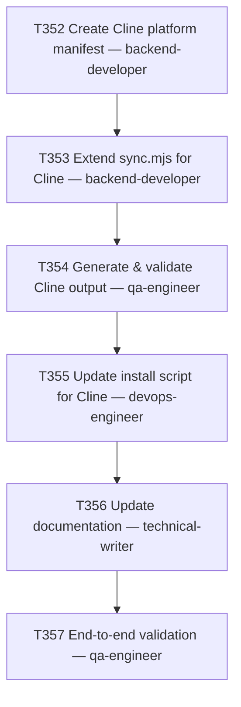

# Plan 028 — Cline platform integration

> **SUPERSEDED by [`plan-028-cline-platform-integration-v2.md`](plan-028-cline-platform-integration-v2.md).**
> T352 discovered (2026-08-08) that this plan's core Cline-format assumptions were factually wrong —
> confirmed independently by the orchestrator against live docs. Do not execute this version's task
> specs; kept only as historical record of what was tried and why it didn't hold up. See v2 §0 for
> the full discrepancy table.

**Status:** superseded — see v2
**Created:** 2026-08-08
**Owner:** orchestrator
**Based on:** `implementation/platforms/cursor.json`, `implementation/platforms/claude-code.json`,
`implementation/platforms/pi.json` (manifest shape reference), `implementation/scripts/sync.mjs`
(read in full for this plan — `emitFrontmatter`, `applyAgentFrontmatter`,
`applyGenericFrontmatter`, `emitMcp`), `scripts/install.sh`, `.gitlab-ci.yml`,
`docs/plans/_template.md`

> Supersedes the RAG/Obsidian portions of an earlier combined draft — this plan covers **Cline
> platform integration only**. Nothing in this document depends on, or produces, a vault, an
> embeddings pipeline, or a `vault-rag` MCP server.

## 0. Why this plan exists

The original draft of this plan (authored outside the task ledger, as an untracked file) was
reviewed against the current state of the repo before filing. Six factual corrections were made —
each would have blocked or misled a "cheap"/low-context delegate agent if left as-is:

1. **No `platform-engineer` agent exists.** `.claude/agents/` / `implementation/knowledge/agents/`
   list 26 agents; the closest fit for manifest + sync-engine work is `backend-developer` (already
   assigned the sync.mjs task). T352 and T353 are both reassigned to `backend-developer`.
2. **`implementation/platforms/_manifest.schema.json` does not exist**, and no
   `validate-manifest.mjs` or equivalent script exists anywhere in the repo (confirmed:
   `implementation/scripts/verify.mjs` only diffs generated output against `knowledge/`, it does
   not schema-check manifests). The draft's T001 acceptance criterion asking a delegate to "run
   whatever schema-check command the other manifests use" sends a cheap agent looking for a
   command that doesn't exist. Replaced with realistic checks: JSON validity + structural diff
   against `cursor.json`/`pi.json`/`claude-code.json`, confirmed end-to-end later by
   `sync.mjs --check` once T353 lands.
3. **`CHANGELOG.md` is CI-generated, not hand-edited.** Its own header says: *"This file is
   **regenerated** by the `release` CI job whenever a `vX.Y.Z` tag is pushed. Hand edits will be
   overwritten."* The draft's T005 criterion asking a delegate to hand-edit a `v6.7.0` CHANGELOG
   entry would have silently no-op'd on the next tag and referenced an already-shipped version
   number. Removed; release-note authoring for this work happens at actual release time via the
   established `/prepare-release` procedure (`docs/releases/vX.Y.Z.md`), out of scope for T356.
4. **Version baseline was stale.** The draft assumed baseline `v6.6.0` and a target of `v6.7.0`;
   the repo is now at `v6.7.1` (both already shipped, for unrelated work). No version number is
   hardcoded anywhere in this plan or its tasks — the actual version this ships in is decided at
   release time via the same user-confirmed MINOR/PATCH choice used for every release this session.
5. **`scripts/install.sh --platform` is a hardcoded allowlist, not auto-discovered** (unlike
   `sync.mjs`, which does `readdir(platforms/)`). T355 must edit three specific, named locations
   (usage text, the `case` statement, `Makefile` help text) — listed exactly in that task's brief —
   not "wire it up" in the abstract.
6. **A real bug in the draft's own T002 reference snippet.** `applyGenericFrontmatter()` is shared
   across *every* platform (cursor also renames `applyTo`→`globs`). Injecting
   `out.alwaysApply = false` unconditionally inside that shared function, as the draft's snippet
   did, would leak a Cline-only default onto Cursor's instruction output too. T353's brief gates
   the injection on `cfg.keepKeys?.includes('alwaysApply')` — true only for manifests (currently
   just `cline.json`) that opt into keeping the key — so no other platform's output changes.
   Separately: `emitFrontmatter()`'s `toolsFormat: 'string'` branch and `applyAgentFrontmatter()`'s
   `toolMap` expansion **already exist and work** (verified by reading the function bodies) — T353
   does not need to write that part, only wire the manifest's `tools: "string"` config through,
   which the existing dispatch already does.

## 1. Goal

Extend `emage.code` to support **Cline** (VS Code extension / CLI agent, https://cline.bot) as a
platform projection, so `node implementation/scripts/sync.mjs --platform=cline` emits a valid
`.cline/` directory (rules, skills, agents, MCP config) alongside the six platforms already
supported (`cursor`, `github`, `gemini`, `opencode`, `pi`, `claude-code` — confirmed against
`implementation/platforms/*.json`). "Done" means: `.cline/` output passes the structural checks in
T354, `make verify` and `make sync -- --check` pass with Cline included, install/doc updates land,
and the change ships in a future release (version TBD at release time, not this plan's concern).

## 2. Scope

- **In scope**: `implementation/platforms/cline.json` manifest; Cline-specific branches in
  `implementation/scripts/sync.mjs` (`emitMcp`, `applyGenericFrontmatter` gate,
  `_extras/cline/dot-clinerules` fallback content); generation and structural validation of
  `.cline/` output; installer support (`scripts/install.sh --platform=cline`,
  `make install PLATFORM=cline`); documentation updates (`README.md`, `AGENTS.md`,
  `docs/wiki/cline-setup.md`); end-to-end validation.
- **Out of scope**: any RAG layer, Obsidian vault, embeddings indexing, or `vault-rag` MCP server
  (do not add anything RAG-related even incidentally — e.g. no `mcp` block entries beyond what
  `implementation/knowledge/mcp/servers.yaml` already declares); creating
  `implementation/platforms/_manifest.schema.json` (doesn't exist for any platform today, not this
  plan's job to invent one); hand-editing `CHANGELOG.md`; deciding or hardcoding a release version
  number; any `.gitlab-ci.yml` changes (the `verify-knowledge-drift` and `sync-no-diff` jobs already
  loop over every manifest in `implementation/platforms/` generically — confirmed by reading both
  job definitions — so a new manifest is covered automatically, no CI file edit needed).
- **Assumptions**: Cline's on-disk config format is `.cline/rules/*.md` (YAML-frontmatter
  conditional rules), `.cline/skills/*/SKILL.md`, `.cline/agents/*.md`, `cline_mcp_settings.json`.
  **T352 must re-verify this against https://docs.cline.bot before writing the manifest** — this
  plan's authors have not independently confirmed it against live docs; treat it as a hypothesis to
  check, not a given.

## 3. Task graph



## 4. Agent assignments

| Task | Agent | Priority | Estimated scope |
|------|-------|----------|-----------------|
| T352 | backend-developer | P0 | medium |
| T353 | backend-developer | P0 | medium |
| T354 | qa-engineer | P0 | small |
| T355 | devops-engineer | P1 | small |
| T356 | technical-writer | P1 | small |
| T357 | qa-engineer | P0 | medium |

## 5. Artifact flow

```
T352 → implementation/platforms/cline.json                    (consumed by: T353, T354)
T353 → implementation/scripts/sync.mjs (modified),
        _extras/cline/dot-clinerules (new)                     (consumed by: T354)
T354 → .cline/ generated directory, validation notes            (consumed by: T355, T357)
T355 → scripts/install.sh, Makefile (modified)                  (consumed by: T356, T357)
T356 → README.md, AGENTS.md, docs/wiki/cline-setup.md (modified/new) (consumed by: T357)
T357 → validation report, CI green
```

Full task-by-task rails (exact commands, exact acceptance criteria, exact line-level targets in
existing files) live in the individual task briefs — `docs/tasks/task-T352.md` through
`task-T357.md` — not duplicated here, per this repo's Delegation Brief convention (agents receive
the task brief, not the plan file).

## 6. File inventory (new / modified)

| Path | Status | Task |
|------|--------|------|
| `implementation/platforms/cline.json` | New | T352 |
| `_extras/cline/dot-clinerules` | New | T353 |
| `implementation/scripts/sync.mjs` | Modified | T353 |
| `scripts/install.sh` | Modified | T355 |
| `Makefile` | Modified | T355 |
| `README.md` | Modified | T355, T356 |
| `AGENTS.md` | Modified | T356 |
| `docs/wiki/cline-setup.md` | New | T356 |

## 7. Risks & mitigations

| Risk | Likelihood | Impact | Mitigation |
|------|-----------|--------|-----------|
| Cline's on-disk config/MCP format has changed since this plan's assumptions were written | Medium | Medium | T352's first step is a live-docs check against https://docs.cline.bot before writing the manifest; a material mismatch is an `unclear_requirements` blocker, not something to guess past. |
| A delegate "fixes" `applyGenericFrontmatter()` by hardcoding a `platform === 'cline'` check instead of gating on `cfg.keepKeys` | Low | Medium | T353's brief states the exact gate condition and explains why (shared function, would leak to Cursor). |
| A delegate tries to hand-edit `CHANGELOG.md` or hardcode a version number, following old habits from other repos | Low | Low | Explicitly called out as out-of-scope in §2 and in T356's brief with the reason (CI overwrites it). |
| `toolMap`/Cline's native tool names drift from what's assumed in T352 | Low | Low | Kept centralized in the manifest (not hardcoded in `sync.mjs`), so it's a one-file fix later; flagged for re-check at each Cline major version, same treatment as the original draft proposed. |

## 8. Token budget

| Phase | Budget | Spent | Remaining |
|-------|--------|-------|-----------|
| Planning (this plan + T352) | 20k | — | — |
| Implementation (T353) | 30k | — | — |
| Validation (T354) | 15k | — | — |
| Install/Docs (T355–T356) | 30k | — | — |
| E2E validation (T357) | 25k | — | — |
| **Total** | **120k** | — | — |

## 9. Approval

- [x] User approved on 2026-08-08
- [ ] Plan locked; revisions create `plan-028-cline-platform-integration-v2.md`
