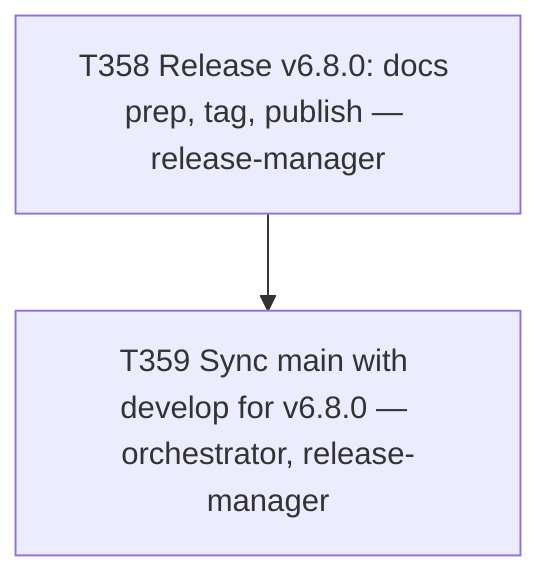

# Plan 029 — Release v6.8.0 and `main` sync

**Status:** approved — executing this session
**Created:** 2026-08-09
**Owner:** orchestrator
**Based on:** `docs/tasks/task-T337.md`/`task-T347.md`/`task-T350.md` (release precedent, now 3x proven),
`docs/tasks/task-T339.md`/`task-T348.md`/`task-T351.md` (main-sync precedent, now 3x proven,
`CONTRIBUTING.md` § "Cutting a release" step 6 PUT-first sequence 2/2 successful), user's explicit
MINOR version-bump choice (AskUserQuestion, 2026-08-09)

## 0. Why this plan exists

Same rationale as plan-027: single-task-per-node operations, filed together since the user bundled
both instructions ("prepare and publish release, then main sync") in one request — avoids a second
plan-coverage round-trip.

## 1. Goal

Cut and publish v6.8.0 (MINOR — packages T352-T357, the Cline platform integration: a genuine new
capability, not a fix), then perform the `release/v6.8.0 → main` sync using the now-twice-proven
PUT-first merge procedure from `CONTRIBUTING.md` (fixed by T349, validated by T351).

## 2. Scope

- **In scope:** `docs/release-v6.8.0` branch/docs/tag/publish (T358); `release/v6.8.0 → main` sync
  (T359).
- **Not in scope:** any further `develop` changes beyond each task's own ledger closeout.

## 3. Task graph

## 4. Outcome

Executed same session as this plan was filed. See `docs/tasks/task-T358.md` and
`docs/tasks/task-T359.md` § Outcome for full evidence.
