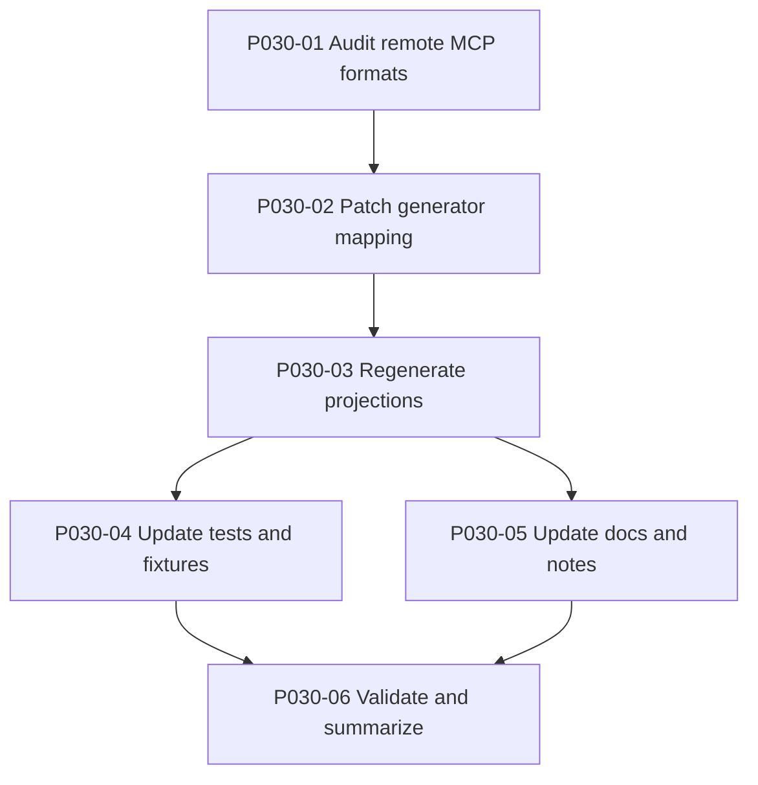

# Plan: MCP Remote Transport Alignment

**Author:** orchestrator
**Date:** 2026-08-09
**Status:** approved — audit complete, corrections applied 2026-08-09 (see "Plan Review Corrections (2026-08-09)")

## Plan Review Corrections (2026-08-09)

Before execution, the orchestrator re-checked this plan's factual claims against the current
repo state and ran the doc-backed audit this plan calls for. Two corrections to the plan text
itself:

1. **Line numbers had drifted.** The `sync.mjs` line references below (`#L354` for `cline`,
   `#L342` for `claude-code`) were accurate against an earlier revision of the file but no longer
   match the current `develop` tip. As of commit `0d1f4a5`, the `claude-code` format branch's
   `type: 'http'` assignment is at **line 356** (branch starts line 353) and the `cline` format
   branch's is at **line 368** (branch starts line 365). The `opencode` branch referenced
   elsewhere in this plan starts at line 341, not 342.
2. **The claim that `claude-code` shares the same staleness as `cline` is WRONG per the audit.**
   The plan's "Why This Should Be Corrected" section asserted the `claude-code` format was
   "the same stale literal" as `cline` and that "the issue is broader than one user config." The
   completed audit (see P030-01 / `docs/tasks/task-T360.md`) found the opposite: Claude Code's
   `"type": "http"` is current, documented, and correct (official docs at
   `code.claude.com/docs/en/mcp` show `"type": "http"` in every current remote-server example,
   with `streamable-http` documented as an accepted alias). **`claude-code` needed no change.**
   Cline's staleness is real and confirmed (`"type": "http"` silently falls back to deprecated SSE
   and 405s — Cline requires `"type": "streamableHttp"`, camelCase, per `docs.cline.bot`), but it
   is a Cline-specific transport-name divergence, not evidence of a broader "http" literal problem.
3. **The audit also found two platforms genuinely stale that this plan's original text never
   named:** VS Code/GitHub Copilot's `vscode` format branch (emits `{ "url": ... }` with **no**
   `"type"` field at all, but VS Code's schema marks `"type"` as a required field for HTTP/SSE
   servers) and Gemini CLI's `gemini` format branch (emits `{ "url": ... }`, but Gemini CLI reserves
   the `"url"` key for legacy SSE and requires `"httpUrl"` for streamable-HTTP remotes — using
   `"url"` would silently select the wrong, deprecated transport). Both are corrected under
   P030-02 alongside Cline. `cursor` and `opencode` format branches were confirmed already correct
   (no change). `pi` reuses the `cursor` branch verbatim and inherits that verdict; no distinct
   authoritative "Pi" MCP schema doc could be located to check independently — flagged, not
   silently assumed identical (see task-T360.md for the full caveat).

This plan's task breakdown, scope, and process below are otherwise still accurate and are executed
as written, with P030-02's actual diff scoped to `cline` + `vscode` + `gemini` only, per the audit
verdicts in task-T360.md.

## Objective
Correct stale remote MCP transport emission in emage.code's projection pipeline where platform configs still emit `"type": "http"` for hosted MCP servers even though at least one current downstream consumer, Cline, now requires a different transport identifier. The plan starts with a cheap audit so we only change formats that are actually stale, then updates the generator, regenerated artifacts, tests, and platform docs in one controlled pass.

## Scope
### In Scope
- Audit every emitted MCP projection that carries remote servers (`context7`, `hf-mcp-server`) and determine whether its current remote transport encoding still matches current platform docs.
- Fix the projection generator for every confirmed-stale target.
- Regenerate committed MCP artifacts produced by the sync pipeline.
- Update tests and validation fixtures that encode the stale transport name.
- Update repo docs that currently teach the stale transport format.

### Out of Scope
- Adding new MCP servers.
- Changing stdio server entries.
- Writing to user-global config outside the repo.
- Changing platform projections that are still current after audit.

## Why This Should Be Corrected In emage.code
- The confirmed runtime failure came from a file that mirrors emage.code's generated projection shape, not from a hand-edited one-off typo.
- The generator still emits `"type": "http"` for the `cline` format in `implementation/scripts/sync.mjs` (originally cited as line 354; see "Plan Review Corrections (2026-08-09)" above for the current, re-checked line number).
- The same stale literal was originally believed to also be emitted by the `claude-code` format in `implementation/scripts/sync.mjs` (originally cited as line 342), which this plan's original text used to claim made the issue "broader than one user config" — **the completed audit (P030-01) found this claim false; see the corrections section above.**
- Generated artifacts in `.mcp.json` (repo root), `implementation/.mcp.json`, and `implementation/.cline/mcp.json` already contained the stale value at the time this plan was drafted.

## Approach
1. Run a documentation-backed audit per platform format rather than assuming one transport label works everywhere.
2. Treat Cline as already confirmed stale and fix it unless the audit finds an even newer transport requirement.
3. For other projections that reuse `"type": "http"`, only change them if current docs confirm the same drift.
4. Regenerate all affected committed projections from the canonical registry and update tests/docs in the same change set.
5. Validate with focused checks: sync/verification scripts plus spot-checking the user-visible CLI where possible.

## Task ID Index
This plan's P030-0N steps map to the repo's T-numbered task ledger as follows (per
`docs/tasks/active-tasks.md` / `docs/tasks/completed-tasks.md`), so every active task traces back
to this plan (per the `test_every_active_task_has_a_plan` team-health gate — see the T283
precedent for the same fix on plan-014):

| Plan step | Task ID | Title |
|---|---|---|
| P030-01 | T360 | Audit remote MCP transport formats per platform |
| P030-02 | T361 | Patch generator transport mapping for confirmed-stale platforms |
| P030-03 | T362 | Regenerate committed MCP projections |
| P030-04 | T363 | Update tests and fixtures for audited transport expectations |
| P030-05 | T364 | Update platform docs and release notes |
| P030-06 | T365 | Validation gate and impact summary |
| (release, not a P030 step) | T366 | Release v6.9.0 (MCP remote transport alignment) |
| (release, not a P030 step) | T367 | Sync main with develop for v6.9.0 |

## Task Breakdown
| ID | Title | Assignee | Priority | BlockedBy | Estimated Effort |
|----|-------|----------|----------|-----------|-----------------|
| P030-01 | Audit remote MCP formats per platform | backend-developer | P0 | — | S |
| P030-02 | Patch generator transport mapping | backend-developer | P0 | P030-01 | S |
| P030-03 | Regenerate committed projections | backend-developer | P0 | P030-02 | S |
| P030-04 | Update tests and fixtures | qa-engineer | P0 | P030-03 | S |
| P030-05 | Update platform docs and release notes | technical-writer | P1 | P030-03 | S |
| P030-06 | Run validation gate and summarize impact | qa-engineer | P0 | P030-04, P030-05 | S |

## Detailed Task Briefs

### P030-01 Audit remote MCP formats per platform
- Goal: build an evidence table of every emage.code projection that emits hosted MCP servers and whether its remote transport field is current.
- Inputs:
  - `implementation/scripts/sync.mjs`
  - `implementation/knowledge/mcp/servers.yaml`
  - Current platform docs via Context7 or official docs for Cline, Claude Code, VS Code/Copilot, Cursor, Gemini, Opencode, and Pi if they expose remote transport syntax.
- Outputs:
  - Audit note appended to the execution checkpoint or captured in the task report.
  - Table: platform, emitted file, current repo encoding, doc-confirmed expected encoding, change needed yes/no.
- Acceptance criteria:
  - Every platform with remote MCP projection is covered.
  - Cline is explicitly marked confirmed stale.
  - No platform is changed later without a doc-backed verdict from this task.

### P030-02 Patch generator transport mapping
- Goal: update only the projection branches proven stale by P030-01.
- Inputs:
  - P030-01 audit table.
  - `implementation/scripts/sync.mjs`
- Outputs:
  - Minimal generator diff.
- Acceptance criteria:
  - Remote transport mapping is correct for every audited stale branch.
  - Untouched branches remain unchanged.
  - No unrelated refactor.

### P030-03 Regenerate committed projections
- Goal: sync generated platform artifacts after the generator patch.
- Inputs:
  - Updated generator from P030-02.
- Outputs:
  - Regenerated MCP projection files under repo-managed outputs.
- Acceptance criteria:
  - All changed projection files are generator-produced, not hand-edited.
  - No drift remains between source registry and committed outputs.

### P030-04 Update tests and fixtures
- Goal: align tests with the audited transport expectations.
- Inputs:
  - Regenerated outputs from P030-03.
  - Existing tests referencing `"type": "http"`.
- Outputs:
  - Updated assertions and any necessary fixture snapshots.
- Acceptance criteria:
  - Tests assert the correct transport per platform instead of a stale hardcoded assumption.
  - No test is weakened to avoid checking transport semantics.

### P030-05 Update platform docs and release notes
- Goal: remove stale examples and document any platform-specific transport differences.
- Inputs:
  - Audit results from P030-01.
  - Changed generated artifacts from P030-03.
- Outputs:
  - Documentation updates for setup/install references that mention remote MCP transport.
- Acceptance criteria:
  - Repo docs no longer instruct users to use the stale value where wrong.
  - If a platform differs from others, docs state that difference explicitly.

### P030-06 Run validation gate and summarize impact
- Goal: prove the fix with executable evidence.
- Inputs:
  - All prior task outputs.
- Outputs:
  - Validation report in task output or checkpoint.
- Acceptance criteria:
  - Generator verification passes.
  - Relevant tests pass.
  - If Cline CLI is available, `cline config mcp` succeeds against the corrected config shape.
  - Final summary lists exactly which platforms changed and which were audited but left untouched.

## Dependency Graph

## Agent Assignments
| Task | Agent | Rationale |
|------|-------|-----------|
| P030-01 | backend-developer | Cheap read-only audit across generator and emitted files. |
| P030-02 | backend-developer | Small targeted code change in one generator file. |
| P030-03 | backend-developer | Mechanical regeneration from existing tooling. |
| P030-04 | qa-engineer | Cheap assertion and fixture alignment. |
| P030-05 | technical-writer | Cheap doc-only clean-up after technical verdicts are known. |
| P030-06 | qa-engineer | Focused validation and summary. |

## Artifact Flow
- P030-01 produces the audit table consumed by P030-02 and P030-05.
- P030-02 updates the generator consumed by P030-03.
- P030-03 produces regenerated configs consumed by P030-04, P030-05, and P030-06.
- P030-04 and P030-05 feed P030-06 validation.

## Risks & Mitigations
| Risk | Likelihood | Impact | Mitigation |
|------|-----------|--------|------------|
| Another platform still expects `"http"` while Cline requires a newer transport name | Medium | Medium | Audit each projection against current docs before changing it. |
| Repo docs and tests encode assumptions from earlier platform support work | High | Low | Make docs/tests explicit outputs, not incidental follow-up. |
| Generated root-level artifacts and implementation-level artifacts drift differently | Medium | Medium | Regenerate from one generator pass and verify drift immediately after. |
| Fixing only the user-global config would hide the underlying repo defect | High | Medium | Treat local fix as reproduction evidence, not the final remedy. |

## Token Budget
| Phase | Budget |
|------|--------|
| Audit | 12k |
| Generator patch + regen | 18k |
| Tests + docs | 15k |
| Validation | 10k |
| Total | 55k |

## Success Criteria
- [ ] Every projection with hosted MCP servers has a documented transport verdict.
- [ ] All confirmed-stale generator branches are corrected.
- [ ] Regenerated committed artifacts match the corrected generator output.
- [ ] Tests and docs no longer encode stale remote transport assumptions.
- [ ] Validation produces executable evidence for the changed projections.

## Open Questions
- Should the audit include non-committed user-level staging examples outside repo-managed outputs, or keep scope strictly to generator-owned artifacts?
- If Claude Code still accepts `"http"`, do we prefer platform-specific divergence or a compatibility-first unchanged branch?
