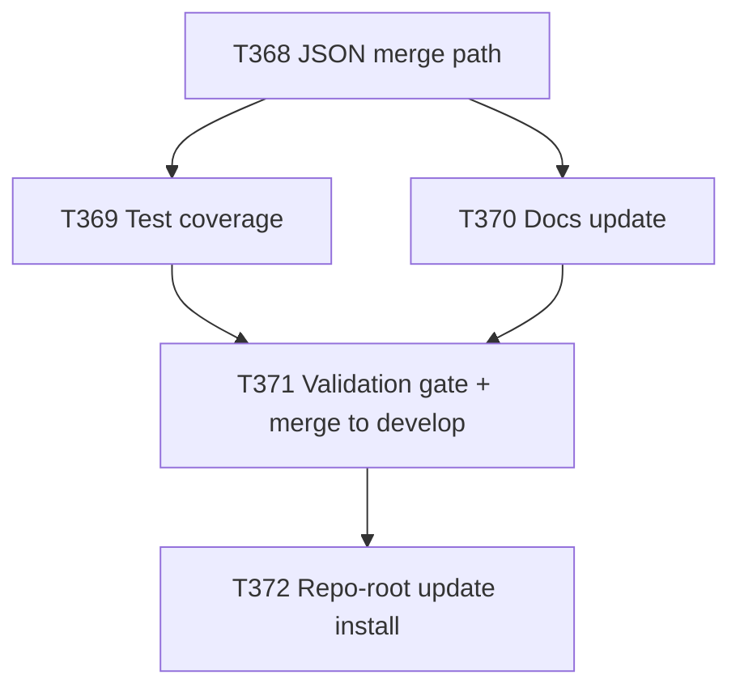

# Plan: Installer MCP JSON Merge Fix + Repo-Root Self-Install Update

**Author:** orchestrator
**Date:** 2026-08-09
**Status:** approved (execution authorized by explicit user directive — see Execution requirements in
the originating request; plan is presented for the record per Plan-Approve-Execute protocol)

## Objective
`scripts/install.sh` has no merge path for the two single-file MCP configs it installs
(`.vscode/mcp.json` for the `github` platform, `.mcp.json` for the `claude-code` platform) — both
are a plain `cp` that unconditionally overwrites the target file, even in `--update` mode. This repo
self-hosts its own install at its root, and its root-level `.vscode/mcp.json` is not pure generator
output: it carries a hand-added `cwso` MCP server entry (bearer-token auth via
`${input:cwso_jwt_token}`) with no generator source, which a naive re-copy would silently delete.
`docs/tasks/task-T362.md` already recorded this exact risk being dodged manually ("deliberately left
root `.vscode/mcp.json` unregenerated to avoid destroying a manually-added local-dev `cwso` MCP
block that `install.sh`'s plain-`cp` handling has no merge capability for"). This plan (1) gives both
single-file MCP configs a real key-preserving merge path in `install.sh`, analogous in spirit to the
existing `merge_tree_preserve_existing`/`merge_task_docs` update-mode merge utilities but JSON-key-
aware rather than whole-file/whole-tree, with test coverage and doc updates, and then (2), only after
that fix has landed on `develop`, uses the fixed installer to bring this repo's own root-level
self-install up to date — picking up Cline (`.cline/`, `.clinerules/`, added as a platform in v6.8.0
but never installed at repo root) and refreshing all other already-installed platforms, while proving
the merge fix works by confirming the `cwso` entry survives the update.

## Scope
### In Scope
- A JSON-level merge strategy for `.vscode/mcp.json` (`servers` map) and `.mcp.json` (`mcpServers`
  map) in `install.sh`'s `--update` path only.
- Investigating `implementation/scripts/sync.mjs`'s `emitMcp()` output shape for `vscode` and
  `claude-code` formats before choosing the merge algorithm (no assumption without checking).
- Auditing whether root `.mcp.json` (Claude Code format) carries the same class of hand-added,
  non-generator content as `.vscode/mcp.json` — and either applying the same fix or explicitly
  documenting why it's unnecessary.
- Test coverage proving the merge preserves an unknown pre-existing key across `--update` while
  still correctly updating/adding all generator-known keys.
- Doc updates (README.md and/or CONTRIBUTING.md) describing the new merge behavior, if current docs
  describe or imply the old overwrite behavior.
- Executing a real `--update` install run at this repo's own root using the fixed installer, so
  `.cline/`/`.clinerules/` are installed for the first time and all other platforms refresh to
  latest, with the `cwso` entry in `.vscode/mcp.json` surviving as living proof the fix works.

### Out of Scope
- Adding, removing, or reconfiguring MCP servers themselves (registry content in
  `implementation/knowledge/mcp/servers.yaml` is unchanged).
- Any change to platform tree merge behavior (`merge_tree_preserve_existing`,
  `sync_tree_into`) beyond what's needed for the two single JSON files.
- Cutting a new release/version tag — this plan explicitly stops after merging to `develop`
  unless the release-readiness check in "Success Criteria" says otherwise.
- Any change to Cline's own platform manifest/generator branch (already shipped in v6.8.0/plan-028);
  this plan only installs the already-generated Cline output at repo root.

## Why This Should Be Corrected In emage.code
- Confirmed root cause: `scripts/install.sh` lines ~261-262 (`install_github`) and ~279
  (`install_claude_code`) both do a bare `cp` of the generated MCP file over the target, with no
  merge step, even when `UPDATE=1`.
- Confirmed real-world impact, not hypothetical: this repo's own root `.vscode/mcp.json` already
  diverges from `implementation/.vscode/mcp.json` (missing the `"type": "http"` field T361/T362
  added to `context7`) precisely because T362 refused to run the overwrite-only update and
  hand-waived the regeneration instead, to avoid deleting the `cwso` entry. That workaround is not
  a fix; it's accumulating drift every release since v6.9.0's transport-alignment fix landed.
- Root `.mcp.json` was checked and found currently byte-identical to `implementation/.mcp.json` (no
  hand-added keys today), so it has no *live* incident — but it shares the exact same overwrite
  mechanism and is exposed to the same risk the moment anyone hand-adds an entry there. Silently
  leaving that twin code path unfixed would reintroduce this exact bug class later.

## Approach
1. Read `emitMcp()` in `implementation/scripts/sync.mjs` for the `vscode` (`{ servers: {...} }`) and
   `claude-code`/`cline` (`{ mcpServers: {...} }`) shapes to confirm the merge target structure
   before writing any merge code (done during planning; confirmed: `vscode` → top-level `servers`
   object, no `inputs` key emitted; `claude-code` → top-level `mcpServers` object).
2. Implement a small, dedicated Python helper (`scripts/merge-mcp-json.py`), following this repo's
   existing convention of Python helpers for structured (non-whole-file) merges
   (`scripts/merge-task-docs.py`, `scripts/render_installed_agents.py`) rather than trying to force
   the existing `rsync`-based tree helpers — which operate on whole files/trees, not JSON keys — to
   do JSON-key-level work.
   - Algorithm: recursive merge, source (generator output) wins for any key present in both; any
     key present only in the destination (target file) at any level is preserved as-is; any key
     present only in source is added. This uniformly handles both the `servers.cwso` case (dest-only
     key inside a shared object) and the general case of a dest-only top-level key (e.g. a future
     hand-added `inputs` block), without a special case for either.
   - Only invoked in `--update` mode when the destination file already exists; a fresh (non-update)
     install, or an update where the destination file doesn't exist yet, keeps doing a plain copy
     (matches how `install_tree_into` already branches on `$UPDATE` for directory merges).
3. Wire the helper into `install_github()` (`.vscode/mcp.json`) and `install_claude_code()`
   (`.mcp.json`) in `scripts/install.sh`.
4. Add regression tests to `tests/functional/test_install_script.py` (or a new sibling test module)
   proving: (a) an unknown pre-existing key in `servers`/`mcpServers` survives a `--update` run, and
   (b) all generator-known keys are present and current afterward.
5. Update README.md/CONTRIBUTING.md only if they currently describe (or a reader would reasonably
   infer) the old overwrite behavior for these two files.
6. Run the full verification bar (`make verify`, `implementation/scripts/generate-registry.py
   --check`, `implementation/scripts/validate-tasks.py`, `python3 tests/run.py`,
   `implementation/scripts/sync.mjs --check`), branch → MR → CI green → merge to `develop`, per
   `git-workflow.md`.
7. Only after that MR is merged to `develop`, run the actual repo-root update install
   (`scripts/install.sh --target . --update --platform all`, per the script's own `--target` +
   `--update` + `--platform all` usage text) from a checkout of the just-updated `develop`, so the
   merge-safe code path is what actually executes. Diff before/after, confirm `.cline/`/
   `.clinerules/` now exist, confirm the `cwso` entry survived, confirm no other root content was
   unexpectedly destroyed, then commit the result through the normal branch + MR flow (this is a
   real filesystem mutation of the repo's own root, not exempt from branch policy).

## Task ID Index
| Plan step | Task ID | Title |
|---|---|---|
| P031-01 | T368 | Implement JSON merge path for `.vscode/mcp.json` and `.mcp.json` in `install.sh` |
| P031-02 | T369 | Add test coverage for MCP JSON merge behavior |
| P031-03 | T370 | Update docs describing installer MCP merge behavior |
| P031-04 | T371 | Validation gate and merge item 1 to develop |
| P031-05 | T372 | Execute repo-root update install (item 2) — Cline + refresh, `cwso` preserved |

## Task Breakdown
| ID | Title | Assignee | Priority | BlockedBy | Estimated Effort |
|----|-------|----------|----------|-----------|-------------------|
| T368 | Implement JSON merge path for `.vscode/mcp.json` and `.mcp.json` | devops-engineer | P0 | — | M |
| T369 | Add test coverage for MCP JSON merge behavior | qa-engineer | P0 | T368 | S |
| T370 | Update docs describing installer MCP merge behavior | technical-writer | P1 | T368 | S |
| T371 | Validation gate and merge item 1 to develop | tech-lead, orchestrator | P0 | T369, T370 | S |
| T372 | Execute repo-root update install (item 2) | devops-engineer, orchestrator | P0 | T371 | M |

## Detailed Task Briefs

### T368 — Implement JSON merge path for `.vscode/mcp.json` and `.mcp.json`
- Goal: replace the unconditional `cp` overwrite of these two files in `--update` mode with a
  key-preserving JSON merge.
- Inputs: `scripts/install.sh` (`install_github`, `install_claude_code`), `implementation/scripts/
  sync.mjs` (`emitMcp()`), `.vscode/mcp.json` (root, has hand-added `cwso` + `inputs`),
  `.mcp.json` (root, currently generator-identical — audit for hidden hand-edits before assuming).
- Outputs: `scripts/merge-mcp-json.py` (new); `scripts/install.sh` diff wiring it into
  `install_github()`/`install_claude_code()` for `--update` only.
- Acceptance criteria:
  1. Fresh (non-`--update`) install of `github` or `claude-code` platform still does a plain copy
     (unchanged behavior).
  2. `--update` install merges: any pre-existing destination key not present in the generated
     source is preserved; every generator-sourced key is present and current afterward.
  3. No literal secret value is ever written by the merge logic (only placeholder strings such as
     `${input:...}`/`${env:...}` may appear in output — verify none of the merge code paths
     interpolate real values).
  4. `.mcp.json` gets the same class of fix applied, or the task report states explicitly (with
     evidence) why it's not needed for that file today, without leaving the underlying overwrite
     code path structurally different from `.vscode/mcp.json`'s.
  5. No unrelated refactor of `install.sh`.

### T369 — Add test coverage for MCP JSON merge behavior
- Goal: prove the merge behavior with automated tests, including the regression this plan exists to
  prevent (an unknown key surviving `--update`).
- Inputs: T368's implementation; `tests/functional/test_install_script.py` (existing pattern/style).
- Outputs: new or extended test(s) in `tests/functional/`.
- Acceptance criteria:
  1. A test creates a target `.vscode/mcp.json` (or `.mcp.json`) with a synthetic unknown server
     key, runs `--update`, and asserts the unknown key is still present afterward.
  2. A test asserts all current generator-known server keys (context7, hf-mcp-server, gitlab,
     playwright, fetch, memory, sequential-thinking, brave, etc., as applicable per platform) are
     present and match generated content after `--update`.
  3. A test covers the fresh-install (non-`--update`) case still doing a plain copy.
  4. Full suite (`python3 tests/run.py`) green.

### T370 — Update docs describing installer MCP merge behavior
- Goal: make README.md/CONTRIBUTING.md accurately describe the new merge behavior for these two
  files, only if current text implies or documents the old overwrite behavior.
- Inputs: T368's implementation; `README.md` "Install"/"Supported platforms" sections;
  `CONTRIBUTING.md`.
- Outputs: doc diff, or an explicit note in the task report that no doc changes were needed (with
  the specific text checked).
- Acceptance criteria:
  1. Every doc location that currently describes `--update` behavior for platform files is checked.
  2. If updated, doc text is accurate and specific (not vague "merges intelligently" language).

### T371 — Validation gate and merge item 1 to develop
- Goal: independently verify T368-T370 and land item 1 on `develop` per `git-workflow.md`.
- Inputs: T368, T369, T370 outputs.
- Outputs: merged MR on `develop`.
- Acceptance criteria:
  1. Full verification bar green: `make verify`, `implementation/scripts/generate-registry.py
     --check`, `implementation/scripts/validate-tasks.py`, `python3 tests/run.py`,
     `implementation/scripts/sync.mjs --check`.
  2. Orchestrator independently reviews the full diff (not just the delegate's report) before
     merging.
  3. Branch named in the `bugfix/T368-install-vscode-mcp-merge` family, MR to `develop`, CI green.
  4. `FAIL` verdict blocks progression — orchestrator creates fix tasks and re-routes; does not
     proceed to T372 until this gate passes.

### T372 — Execute repo-root update install (item 2)
- Goal: use the now-fixed `develop` installer to update this repo's own root self-install.
- Inputs: `develop` post-T371 merge; `scripts/install.sh` usage/help text (read, not guessed) for
  the correct update-mode invocation.
- Outputs: repo-root filesystem changes (`.cline/`, `.clinerules/` created; `.claude/`, `.cursor/`,
  `.github/`, `.gemini/`, `.opencode/`, `.pi/` refreshed; `.vscode/mcp.json`, `.mcp.json` updated),
  committed via branch + MR.
- Acceptance criteria:
  1. `git status` captured before running the install, diff captured after — no unexpected
     destruction of existing root content.
  2. `.cline/` and `.clinerules/` exist post-install with expected generated content.
  3. `.vscode/mcp.json` contains the `cwso` entry (headers, `${input:cwso_jwt_token}` placeholder
     intact, no literal secret) AND all current generator-sourced keys (including the corrected
     `context7` `"type": "http"` field from T361/T362).
  4. Result committed through the normal branch + MR flow — no uncommitted working-tree state left
     on `develop`.
  5. Full verification bar green again after the update.

## Dependency Graph

## Agent Assignments
| Task | Agent | Rationale |
|------|-------|-----------|
| T368 | devops-engineer | Owns install/CI-CD files per `.claude/rules/security-guidelines.md` write-capable agent classification. |
| T369 | qa-engineer | Test coverage is QA's ownership; write access limited to test files. |
| T370 | technical-writer | Docs-only change. |
| T371 | tech-lead (review) + orchestrator (merge) | Implementation Gate per AGENTS.md validation gates. |
| T372 | devops-engineer (execution) + orchestrator (independent verification, git workflow) | Real repo-root install execution owned by the same role as T368; orchestrator independently verifies before commit per established repo precedent (T354/T357/T360-series). |

## Artifact Flow
- T368 produces `scripts/merge-mcp-json.py` + `scripts/install.sh` diff, consumed by T369 (tests
  against it) and T370 (docs describing it).
- T369 and T370 outputs feed T371's validation gate.
- T371's merged `develop` is the required input for T372 (item 2 is explicitly blocked on item 1
  landing first — not parallel).
- T372 produces the actual updated repo-root platform trees and MCP configs, the acceptance proof
  that item 1's fix works outside of unit tests.

## Risks & Mitigations
| Risk | Likelihood | Impact | Mitigation |
|------|-----------|--------|------------|
| Merge algorithm accidentally drops a generator-known key instead of only preserving unknown ones | Medium | High | Explicit test asserting generator-known keys are present and current after merge (T369 AC #2). |
| `.mcp.json` audit missed a real hidden hand-edit | Low | Medium | Byte-diff root `.mcp.json` vs `implementation/.mcp.json` before concluding "no live incident" (already done during planning — confirmed identical). |
| Repo-root update install (T372) destroys unrelated root content | Low | High | Capture `git status`/diff before and after; review full diff before committing; never use `-u`/`--delete` semantics on files outside the installer's own managed set. |
| A literal secret value gets written into a committed file by the merge logic | Low | Critical | AC explicitly requires verifying only placeholder syntax appears in output; no env var is ever read and inlined by the merge script itself. |
| Running the real update install at repo root before item 1 lands would just reproduce the known bug | Certain if done early | High | T372 is explicitly blocked on T371 (dependency graph enforces this; no parallel execution). |

## Token Budget
| Phase | Budget |
|------|--------|
| T368 implementation | 25k |
| T369 tests | 15k |
| T370 docs | 8k |
| T371 validation + merge | 12k |
| T372 repo-root update + verification | 20k |
| Total | 80k |

## Success Criteria
- [ ] `scripts/install.sh --update` merges `.vscode/mcp.json` and `.mcp.json` instead of overwriting.
- [ ] Automated tests prove an unknown pre-existing server key survives `--update`.
- [ ] Docs accurately describe the merge behavior (or explicitly confirmed no doc change was needed).
- [ ] Item 1 merged to `develop` with full verification bar green.
- [ ] Repo-root self-install updated: `.cline/`/`.clinerules/` present, all other platforms refreshed,
      `.vscode/mcp.json`'s `cwso` entry and all generator-sourced keys present, no unexpected
      destruction of existing root content, committed via branch + MR.
- [ ] No new release/version tag cut, unless explicitly re-justified at execution time.

## Open Questions
- Should the merge helper be a standalone `scripts/merge-mcp-json.py`, or should it be folded into
  `scripts/merge-task-docs.py`'s module as a second entry point? (Leaning standalone — different
  data shape, JSON vs. markdown tables — to be confirmed during T368 implementation.)
- Does `validate_before_update()`'s existing directory-replacement warning text need updating now
  that these two files are merge-safe rather than replace-only? (Nice-to-have, not a blocking
  acceptance criterion for T368.)
