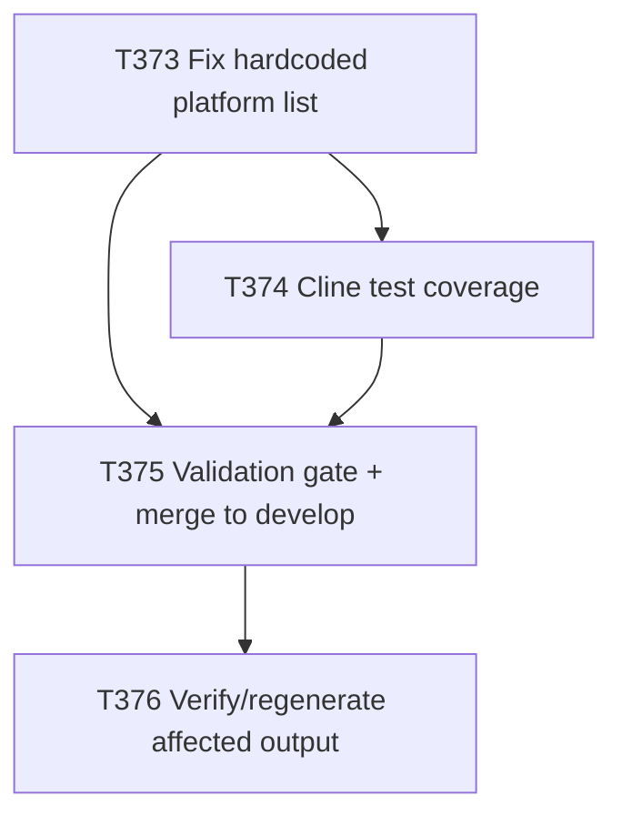

# Plan: Fix Hardcoded Platform List in `render_installed_agents.py`'s `--platform all` Branch

**Author:** orchestrator
**Date:** 2026-08-09
**Status:** proposed — awaiting user approval per Plan-Approve-Execute protocol. No execution,
delegation, or code change has occurred. This document is the Plan phase artifact only.

## Objective
`scripts/render_installed_agents.py` (note: the file lives at repo-root `scripts/`, not
`implementation/scripts/` — corrected during investigation) rewrites platform-specific reference
strings into the installed `AGENTS.md` for each target install. Its `render()` function has two code
paths: a per-platform branch that looks up all path data from the `PLATFORM_MAP` dict (which already
has a correct, complete `"cline"` entry), and a `platform == "all"` branch that instead builds five
reference strings (`skills_ref`, `code_ref`, `sec_ref`, `readme_ref`, `mcp_ref`) from **hardcoded
string literals** listing only `github`, `cursor`, `gemini`, `opencode`, `pi`, `claude-code` — Cline
was never added to these five literals when it shipped as a supported platform in v6.8.0 (T352-T357).
This plan fixes the `all` branch to source its platform list from `PLATFORM_MAP` (the same data
`PLATFORM_MAP`-driven fix pattern T355 already established for a comparable hardcoded-platform-list
gap in this same script family), adds test coverage that would have caught this, and verifies/repairs
any already-affected rendered output in this repository.

## Scope
### In Scope
- Fixing the `platform == "all"` branch in `scripts/render_installed_agents.py`'s `render()` function
  so `skills_ref`, `code_ref`, `sec_ref`, `readme_ref`, and `mcp_ref` are derived from `PLATFORM_MAP`
  (or an equivalent single source of truth) instead of hardcoded literals, covering `cline` today and
  any future platform added to `PLATFORM_MAP` without a matching code change.
- Handling Cline's two-root-folder shape correctly (`.cline/` from the `skills`/`mcp` fields,
  `.clinerules/` from the `standards`/`security` fields) — every other current platform has exactly
  one root folder, so the existing single-platform branch's `cfg['skills'].split('/')[0]` shortcut for
  `readme_ref` does not generalize as-is; the `all` branch needs to derive root folders from all four
  path fields per platform, not just `skills`.
- Test coverage in `tests/functional/test_install_agents_mapping.py` (the existing
  `test_all_platform_install_includes_projection_map` test) asserting Cline-specific strings are
  present in `--platform all` output — this test currently does not check for Cline at all, which is
  why the bug shipped undetected.
- Verifying whether any currently-committed, rendered `AGENTS.md`-type artifact in this repository is
  actually affected by the bug today, and regenerating/fixing it if so.
- Landing the fix on `develop` via the standard branch + MR flow per `git-workflow.md`.

### Out of Scope
- Any change to the per-platform (non-`all`) branch of `render()` — already correctly sourced from
  `PLATFORM_MAP`, not implicated in this bug.
- Any change to `PLATFORM_MAP` itself, `implementation/scripts/sync.mjs`, or Cline's platform manifest
  — Cline's own generator output is already correct (confirmed by T372: `.cline/`/`.clinerules/`
  installed byte-identical to `implementation/`).
- Auditing or fixing any external, non-repo target project that may have run `--platform all` since
  v6.8.0 shipped — out of this repo's control and not verifiable from here; noted as a residual risk
  below, not an in-scope remediation.
- Cutting a new release/version tag — this plan stops after merging to `develop`.
- Re-running the full repo-root `--update --platform all` self-install (that was already done in
  T372); this plan only touches the generator script and verifies/repairs output, it does not re-run
  the whole installer end-to-end again.

## Why This Should Be Corrected In emage.code
**Confirmed bug mechanics** (read `scripts/render_installed_agents.py` in full):
- `PLATFORM_MAP` (lines 11-54) already has a complete, correct `"cline"` entry: `skills:
  .cline/skills/`, `standards: .clinerules/coding-standards.md`, `security:
  .clinerules/security-guidelines.md`, `mcp: .cline/mcp.json`.
- The `platform == "all"` branch (lines 65-98) does **not** read `PLATFORM_MAP` at all for these five
  strings — it hardcodes six platforms' paths as literal text, omitting `cline` entirely from all
  five. The per-platform branch (lines 99-110), used for every individual `--platform <name>` install
  including `--platform cline`, is unaffected — it correctly reads `PLATFORM_MAP["cline"]`.
- Consequence confirmed by reading the code path: **any `--platform all` install or update run**
  (fresh or `--update`) writes an `AGENTS.md` whose "Skill Workflow", "Code Standards", "Security",
  "Knowledge Base", and "MCP Servers" sections' platform-reference lists omit `.cline/skills/`,
  `.clinerules/coding-standards.md`, `.clinerules/security-guidelines.md`, the `.clinerules/`/`.cline/`
  runtime-reference line, and `.cline/mcp.json` — even though `install_tree_into` correctly installs
  the actual `.cline/`/`.clinerules/` directories alongside it via the separate `install_cline`-style
  tree-copy path. This is exactly the distinction the task brief asked to confirm: **it is a
  reference-string omission in the rendered `AGENTS.md`, not a missing-files bug.** The Cline
  directories themselves are correctly installed regardless of this bug.

**Blast radius on this repository, checked directly (not assumed):**
- Repo-root `AGENTS.md` (`/home/emage/Code/emage/emage.code/AGENTS.md`) **currently correctly
  includes** Cline references — lines 88-90 read `.clinerules/`, `.cline/` explicitly in the Knowledge
  Base section. This is **not** because the generator bug is absent; it is because T372's execution
  notes (`docs/tasks/task-T372.md`, lines 73-90) record that running the fixed installer's
  `--update --platform all` at repo root *did* reproduce this exact regression against `AGENTS.md`,
  and the orchestrator/devops-engineer explicitly reverted it (`git checkout -- .claude/settings.json
  AGENTS.md`) as out-of-scope collateral for plan-031, keeping the repo's pre-existing, more-complete,
  hand-verified wording instead of accepting the buggy generator output. In other words: **repo-root
  `AGENTS.md` is right today by luck of a deliberate revert, not because the bug is fixed.** The next
  `--platform all` install/update run at repo root (or anywhere else) will reproduce the same
  regression unless this plan's fix lands first.
- `implementation/AGENTS.md` is the canonical source document read by `render()`, not its output —
  not affected by this bug (confirmed via `diff` against repo-root `AGENTS.md`; the differences are
  the expected canonical-source-vs-rendered-target wording, unrelated to Cline).
- No other committed `AGENTS.md`-type rendered artifact exists elsewhere in this repository (`find
  . -name AGENTS.md` returns only the two files above).
- Existing test coverage (`tests/functional/test_install_agents_mapping.py`,
  `test_all_platform_install_includes_projection_map`) asserts presence of `github`/`cursor`/
  `gemini`/`opencode`/`pi`/`claude-code` strings but **never asserts anything Cline-specific** —
  confirming why this shipped silently in v6.8.0 and stayed live through T360-T372 without being
  caught by CI.
- Residual, out-of-repo risk: any external target project that has run `scripts/install.sh --target
  <other-repo> --platform all` (fresh or `--update`) since v6.8.0 shipped would have received an
  `AGENTS.md` missing Cline references, with no revert-based protection like this repo had. This
  plan cannot detect or remediate those; it is flagged as a known residual risk, not a task.

## Approach
1. Read `scripts/render_installed_agents.py`'s `render()` function and `PLATFORM_MAP` in full (done
   during planning) to confirm exact variable names, current hardcoded values, and the correct source
   of truth (`PLATFORM_MAP`) — completed above.
2. Rewrite the `platform == "all"` branch to build `skills_ref`, `code_ref`, `sec_ref`, `readme_ref`,
   and `mcp_ref` from `PLATFORM_MAP.values()` (or an equivalent iteration) instead of hardcoded
   literals, so a future platform addition to `PLATFORM_MAP` needs no matching edit here — mirroring
   the `PLATFORM_MAP`-driven fix pattern already established for install.sh's own platform list by
   T355. Root-folder derivation for `readme_ref` must handle platforms with more than one distinct
   root folder (Cline: `.cline/` and `.clinerules/`) by deriving from all four path fields
   (`skills`, `standards`, `security`, `mcp`), not just `skills`, and deduping.
3. Extend `tests/functional/test_install_agents_mapping.py`'s
   `test_all_platform_install_includes_projection_map` (or add a sibling test) to assert Cline-specific
   strings (`.cline/skills/`, `.clinerules/coding-standards.md`, `.clinerules/security-guidelines.md`,
   `.cline/mcp.json`, and the `.clinerules/`/`.cline/` runtime-reference mention) are present in
   `--platform all` output, so this regression class is caught by CI going forward.
4. Run a dry-run `--platform all` render against `implementation/AGENTS.md` post-fix and diff it
   against the current repo-root `AGENTS.md` to confirm the fixed generator's output now matches (or
   is a strict superset of) the hand-verified content that was protected by T372's revert. If the
   diff is clean (or only reflects intentional wording differences unrelated to Cline), no
   regeneration of repo-root `AGENTS.md` is needed and the task report says so with evidence. If the
   diff reveals the fix still doesn't match, that is a new finding to report back to the orchestrator,
   not something to silently patch further within this task's scope.
5. Run the full verification bar (`make verify`, `implementation/scripts/generate-registry.py
   --check`, `implementation/scripts/validate-tasks.py`, `python3 tests/run.py`,
   `implementation/scripts/sync.mjs --check`), branch → MR → CI green → merge to `develop`, per
   `git-workflow.md`.

## Task ID Index
| Plan step | Task ID | Title |
|---|---|---|
| P032-01 | T373 | Fix hardcoded platform list in `render_installed_agents.py`'s `all` branch |
| P032-02 | T374 | Add Cline-specific test coverage for `--platform all` render output |
| P032-03 | T375 | Validation gate and merge to develop |
| P032-04 | T376 | Verify/regenerate already-affected rendered `AGENTS.md` output |

## Task Breakdown
| ID | Title | Assignee | Priority | BlockedBy | Estimated Effort |
|----|-------|----------|----------|-----------|-------------------|
| T373 | Fix hardcoded platform list in `render_installed_agents.py`'s `all` branch | devops-engineer | P0 | — | S |
| T374 | Add Cline-specific test coverage for `--platform all` render output | qa-engineer | P0 | T373 | S |
| T375 | Validation gate and merge to develop | tech-lead, orchestrator | P0 | T373, T374 | S |
| T376 | Verify/regenerate already-affected rendered `AGENTS.md` output | devops-engineer | P1 | T375 | S |

(First task under this plan is `T373` — `docs/tasks/active-tasks.md` is currently empty; no task
briefs have been created yet, this is the Plan phase only.)

## Detailed Task Briefs

### T373 — Fix hardcoded platform list in `render_installed_agents.py`'s `all` branch
- Goal: replace the six-platform hardcoded literals in `render()`'s `platform == "all"` branch with
  logic derived from `PLATFORM_MAP`, so Cline (and any future platform) is included automatically.
- Inputs: `scripts/render_installed_agents.py` (full file); `PLATFORM_MAP`'s existing `"cline"` entry;
  the per-platform branch (lines 99-110) as the reference pattern for how a single platform's config
  is turned into ref-string fragments.
- Outputs: `scripts/render_installed_agents.py` diff only. No unrelated refactor.
- Acceptance criteria:
  1. `--platform all` output includes `.cline/skills/`, `.clinerules/coding-standards.md`,
     `.clinerules/security-guidelines.md`, `.cline/mcp.json`, and a `.clinerules/`/`.cline/`
     runtime-reference mention, alongside the existing six platforms (still present, unchanged).
  2. `--platform github|cursor|gemini|opencode|pi|claude-code|cline` (single-platform branch) output
     is byte-identical to pre-fix output — this fix must not touch that code path's behavior.
  3. No hardcoded platform name literal remains in the `all` branch's ref-string construction; adding
     a new entry to `PLATFORM_MAP` in the future requires no matching edit to this function.
  4. Root-folder derivation for `readme_ref` correctly produces two distinct entries for Cline
     (`.cline/`, `.clinerules/`) without a Cline-specific special case hardcoded into the function
     (derive generically from all four path fields per platform, dedupe).
  5. Existing tests in `tests/functional/test_install_agents_mapping.py` (pre-T374 baseline) still
     pass.

### T374 — Add Cline-specific test coverage for `--platform all` render output
- Goal: close the test-coverage gap that let this regression ship undetected — prove the fix and
  prevent recurrence.
- Inputs: T373's implementation; `tests/functional/test_install_agents_mapping.py`'s existing
  `test_all_platform_install_includes_projection_map` (existing pattern/style to extend or sibling).
- Outputs: test diff in `tests/functional/test_install_agents_mapping.py`.
- Acceptance criteria:
  1. A test asserts `.cline/skills/`, `.clinerules/coding-standards.md`,
     `.clinerules/security-guidelines.md`, and `.cline/mcp.json` are all present in `--platform all`
     rendered output.
  2. A test asserts the existing six-platform strings are still present (no regression on the
     existing assertions).
  3. Full suite (`python3 tests/run.py`) green.

### T375 — Validation gate and merge to develop
- Goal: independently verify T373-T374 and land the fix on `develop` per `git-workflow.md`.
- Inputs: T373, T374 outputs.
- Outputs: merged MR on `develop`.
- Acceptance criteria:
  1. Full verification bar green: `make verify`, `implementation/scripts/generate-registry.py
     --check`, `implementation/scripts/validate-tasks.py`, `python3 tests/run.py`,
     `implementation/scripts/sync.mjs --check`.
  2. Orchestrator independently reviews the full diff (not just the delegate's report) before merging.
  3. Branch named in the `bugfix/T373-render-agents-cline-platform-map` family, MR to `develop`, CI
     green.
  4. `FAIL` verdict blocks progression — orchestrator creates fix tasks and re-routes; does not
     proceed to T376 until this gate passes.

### T376 — Verify/regenerate already-affected rendered `AGENTS.md` output
- Goal: confirm whether any currently-committed rendered `AGENTS.md` in this repository needs
  regeneration now that the generator is fixed, and regenerate/fix it if so — not just fix the script
  prospectively.
- Inputs: `develop` post-T375 merge; repo-root `AGENTS.md`; `implementation/AGENTS.md`; T372's
  execution notes (`docs/tasks/task-T372.md`) documenting the prior revert of this exact regression.
- Outputs: either (a) a task report with evidence that a post-fix dry-run `--platform all` render
  matches/exceeds current repo-root `AGENTS.md` content and no regeneration is needed, or (b) if the
  dry-run reveals remaining drift, a committed regeneration of repo-root `AGENTS.md` via the normal
  branch + MR flow, with a full diff review before commit.
- Acceptance criteria:
  1. Dry-run `--platform all` render (`--dry-run` flag, or render to a scratch path and diff — do
     not overwrite repo-root `AGENTS.md` directly without review) executed and diffed against current
     repo-root `AGENTS.md`.
  2. Result stated plainly with evidence: either "no regeneration needed, diff clean" or "regeneration
     needed, here is what changed and why."
  3. If regeneration is needed, it goes through the normal branch + MR flow (this is a real
     filesystem mutation of the repo's own root, not exempt from branch policy per T372's own
     precedent) — never committed directly to `develop`.
  4. Full verification bar green after any change.

## Dependency Graph

## Agent Assignments
| Task | Agent | Rationale |
|------|-------|-----------|
| T373 | devops-engineer | Same script family as T355/T368's `install.sh`/`render_installed_agents.py`/`merge-mcp-json.py` work; devops-engineer owns install/CI-CD tooling files per `.claude/rules/security-guidelines.md`'s write-capable agent classification. |
| T374 | qa-engineer | Test coverage is QA's ownership; write access limited to test files. |
| T375 | tech-lead (review) + orchestrator (merge) | Implementation Gate per AGENTS.md validation gates. |
| T376 | devops-engineer | Direct extension of T373's fix verification, same tooling/owner; a real repo-root `AGENTS.md` mutation (if needed) follows the same execution-and-independent-orchestrator-verification pattern established in T372. |

No technical-writer task is included: this is an internal generator-script bug affecting a rendered
platform-reference list, not user-facing documentation content (README.md/CONTRIBUTING.md do not
describe or need to describe this generator's internal ref-string construction). If T376 uncovers
that repo-root `AGENTS.md` needs regeneration, that change is docs-shaped but mechanically produced by
the (already-fixed) generator, not hand-authored — so it stays with devops-engineer rather than being
handed to technical-writer.

## Artifact Flow
- T373 produces the `scripts/render_installed_agents.py` diff, consumed by T374 (tests against it) and
  T376 (dry-run verification against it).
- T374's test diff feeds T375's validation gate alongside T373's implementation diff.
- T375's merged `develop` is the required input for T376 (verification/regeneration must run against
  the landed fix, not a pre-merge worktree, matching T372's own precedent of not acting until the
  underlying fix has actually merged).
- T376 produces either a "no action needed" finding (with diff evidence) or a regenerated repo-root
  `AGENTS.md`, closing the loop opened by T372's flagged-but-not-fixed finding.

## Risks & Mitigations
| Risk | Likelihood | Impact | Mitigation |
|------|-----------|--------|------------|
| `PLATFORM_MAP`-driven rewrite accidentally changes single-platform (`--platform <name>`) branch output | Low | Medium | T373 AC #2 explicitly requires byte-identical single-platform output; the `all` branch and single-platform branch are separate code paths, only the `all` branch is touched. |
| Root-folder dedup logic for `readme_ref` mishandles Cline's two-root-folder shape (e.g. drops `.clinerules/` or `.cline/`) | Medium | Medium | T373 AC #4 requires both folders present; T374's test explicitly asserts both `.cline/skills/`-derived and `.clinerules/`-derived strings independently. |
| T376's dry-run reveals repo-root `AGENTS.md` needs more than a mechanical Cline-string fix (e.g. other drift accumulated since T372) | Low | Medium | T376 AC #2 requires the finding to be stated plainly with evidence rather than silently absorbed or ignored; any regeneration goes through the normal branch + MR review, not a direct commit. |
| Residual risk: external target projects that ran `--platform all` since v6.8.0 have a stale `AGENTS.md` this plan cannot reach | Certain (already true) | Low (out of this repo's control) | Explicitly out of scope; documented here for visibility, not remediated by this plan. |
| Test-coverage gap recurs for the *next* new platform if `readme_ref`'s multi-root-folder handling isn't generic | Low | Medium | T373 AC #3-4 explicitly require no hardcoded platform-name literals and generic multi-root derivation, not a Cline-specific patch. |

## Token Budget
| Phase | Budget |
|------|--------|
| T373 implementation | 10k |
| T374 tests | 8k |
| T375 validation + merge | 8k |
| T376 verification/regeneration | 8k |
| Total | 34k |

(Well within the ≤80k Planning-phase and ≤120k Implementation-phase budgets in `AGENTS.md`'s Token
Governance table — this is a small, single-file fix.)

## Success Criteria
- [ ] `scripts/render_installed_agents.py`'s `platform == "all"` branch sources its platform-reference
      strings from `PLATFORM_MAP` (or equivalent single source of truth), not hardcoded literals.
- [ ] `--platform all` output includes all Cline-specific references (`.cline/skills/`,
      `.clinerules/coding-standards.md`, `.clinerules/security-guidelines.md`, `.cline/mcp.json`,
      `.clinerules/`/`.cline/` runtime-reference mention).
- [ ] Single-platform branch output is unchanged (byte-identical pre/post fix).
- [ ] Automated tests prove Cline references are present in `--platform all` output; full suite green.
- [ ] Fix merged to `develop` with full verification bar green.
- [ ] Repo-root `AGENTS.md` (and any other in-repo rendered artifact) is confirmed correct post-fix,
      with evidence — either "already correct, no action" or "regenerated and committed via branch +
      MR."
- [ ] No new release/version tag cut, unless explicitly re-justified at execution time.

## Open Questions
- Should `PLATFORM_MAP` iteration order (dict insertion order: github, cursor, gemini, opencode, pi,
  claude-code, cline) determine the rendered text's platform ordering in the `all` branch, matching
  the current repo `AGENTS.md`'s existing ordering (Cline last)? Leaning yes, for a clean T376 diff
  against the hand-verified content T372 protected — to be confirmed during T373 implementation.
- Should root-folder derivation for `readme_ref` iterate over all four `PLATFORM_MAP` path fields per
  platform (`skills`, `standards`, `security`, `mcp`) and dedupe, or is there a simpler shape (e.g. an
  explicit `roots: [...]` list added to each `PLATFORM_MAP` entry) that avoids fragile path-splitting
  logic entirely? Leaning toward the explicit `roots` list as more robust and less surprising for
  future platform additions — to be confirmed during T373 implementation, and would itself be a small,
  additive change to `PLATFORM_MAP`'s schema (backward compatible, does not affect the single-platform
  branch which doesn't need it).
- Is it worth widening T374's test to also cover a "future platform" synthetic case (e.g. a
  monkeypatched `PLATFORM_MAP` with a 7th synthetic entry) to prove the fix is truly generic and not
  just Cline-specific? Nice-to-have, not required for this plan's acceptance criteria — left to
  qa-engineer's judgment during T374.
