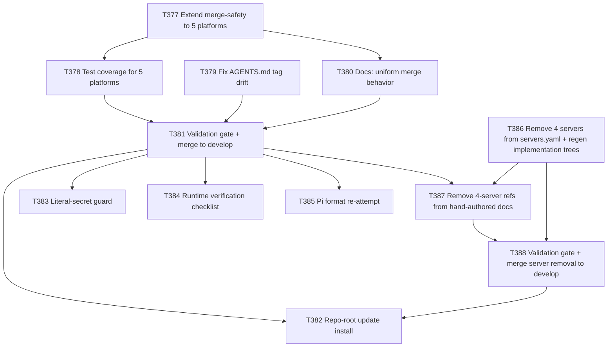

# Plan: MCP Settings Hardening (All Platforms)

**Author:** orchestrator
**Date:** 2026-08-09
**Status:** draft — pending user approval (Plan phase only; no task briefs authored, no execution)

## Objective
`scripts/install.sh --update` only merge-preserves hand-added content for two of the seven
platforms' MCP configs — `.vscode/mcp.json` (`github`) and root `.mcp.json` (`claude-code`), fixed
in plan-031/T368-T372. The other five platforms' MCP/settings files — `.cursor/mcp.json`,
`.gemini/settings.json`, `.opencode/opencode.json`, `.pi/mcp.json`, `.cline/mcp.json` — are still
installed via `install_tree_into()`, which on `--update` runs `sync_tree_into()` (`rsync -a
--delete`), unconditionally destroying any hand-added MCP server entry or local customization in
those five files. This plan closes that gap and, per the user's broader "make every MCP setting
template work correctly for every implemented platform" request, re-verifies (fresh, not assumed)
the five other areas of MCP-template correctness: structural/schema correctness per platform,
registry-to-output drift detection, secrets/env-var handling, runtime validation coverage, and
extended-vs-core server tagging accuracy. Findings below are evidence-based from direct inspection
of `scripts/install.sh`, `implementation/scripts/sync.mjs`, `implementation/knowledge/mcp/
servers.yaml`, all seven platforms' generated MCP outputs (both `implementation/<platform>/` source
and this repo's root self-install mirror), `.gitlab-ci.yml`, and `tests/functional/
test_install_script.py` — not assumed from plan-030/031's prior scope.

## Scope
### In Scope
- Extending the plan-031 merge-safety pattern (`merge_or_copy_mcp_json` +
  `scripts/merge-mcp-json.py`, both already file-format-agnostic) to the five remaining single-file
  MCP/settings configs, each of which currently sits *inside* a directory tree that
  `sync_tree_into()` fully replaces (`rsync --delete`) on `--update`.
- Regression test coverage for all five newly-covered platforms, closing the exact test-coverage
  gap that let plan-031 (and everything before it) scope out these five files.
- Fixing a confirmed documentation-accuracy drift in `AGENTS.md`'s "MCP Servers" table (both the
  canonical `implementation/AGENTS.md` and the projected root `AGENTS.md`): the table states
  extended servers are emitted only to "`gemini`, `opencode`, `cursor`", but every current platform
  manifest except `github` (i.e. also `claude-code`, `pi`, `cline`) declares `"tags": ["core",
  "extended"]` and actually emits all 19 core+extended servers. This is real doc drift discovered
  during this investigation, not previously known.
- Doc updates describing the extended, uniform merge behavior (README.md/CONTRIBUTING.md), building
  on plan-031/T370 which only covered two files.
- A repo-root self-install `--update --platform all` re-run after the fix lands, as the live proof
  point (mirrors plan-031's T372), confirming no unexpected destruction across all five newly
  merge-safe files.
- Two smaller, evidence-backed hardening gaps found during investigation (P2, see Task Breakdown):
  no CI/test guard scans generated MCP output for literal-secret-shaped strings, and no automated
  or documented runtime verification proves a generated config actually loads in each platform's
  real tooling except a single one-time manual Cline check (T365).
- One explicitly time-boxed re-attempt to resolve Pi's MCP config format, which T360 already
  investigated and left inconclusive (no authoritative "Pi" MCP doc found; `pi.json` reuses the
  `cursor` format branch by analogy) — with an explicit instruction to close the question with a
  documented decision either way, not leave it open a third time.
- **User-requested removal of four extended MCP servers** — `e2b`, `redis`, `figma`, `notion` — from
  `implementation/knowledge/mcp/servers.yaml`, cascaded through every currently-live/generated place
  they're referenced: the `implementation/` canonical platform trees (via `sync.mjs` regeneration),
  this repo's root self-install mirror (via the same `install.sh --update --platform all` proof run
  already planned as T382), and hand-authored (non-generated) docs that name these servers by hand
  (`implementation/PREREQUISITES.md`, `implementation/SECURITY.md`, `docs/wiki/mcp-servers.md`, both
  `AGENTS.md` files' "Extended servers (opt-in)" bullet). See T386-T388 below and the new "Why" bullet
  for this item.

### Out of Scope
- Adding, removing, or reconfiguring MCP servers in `implementation/knowledge/mcp/servers.yaml`
  beyond the four explicit removals in this plan (`e2b`, `redis`, `figma`, `notion`) — no other
  server addition/removal/reconfiguration is in scope.
- Re-litigating the remote-transport encoding fix (plan-030/T360-T365) — independently re-verified
  during this investigation as intact and correct for vscode/gemini/opencode/cline/claude-code (see
  "Investigation Findings" below); no task needed.
- Re-litigating the two-file merge fix itself (plan-031/T368-T372) — confirmed still correct and
  unchanged; this plan only extends its pattern to the remaining five files.
- Cutting a new release/version tag — this plan stops after merging to `develop`, matching the
  plan-031 precedent, unless re-justified at execution time.
- Building a full external JSON-Schema validation harness for platforms with no published schema —
  scoped down to "document what's checked today, add schema validation only where a real published
  schema exists (e.g. VS Code's `mcp.json`), document a manual checklist elsewhere."

## Why This Should Be Corrected In emage.code
- **Confirmed root cause (read directly, current `scripts/install.sh`, lines 268-304):**
  `install_cursor()`, `install_gemini()`, `install_opencode()`, `install_pi()`, and `install_cline()`
  all call only `install_tree_into()` on their platform's whole output directory. `install_github()`
  and `install_claude_code()` are the only two that additionally call `merge_or_copy_mcp_json()` on
  a file living *outside* their tree (`../.vscode/mcp.json`, `../.mcp.json` respectively — both
  written there by `sync.mjs` because their `platforms/*.json` manifest's `mcp.outputFile` points
  outside `outputDir`). For the other five platforms, `mcp.outputFile` is a path *inside*
  `outputDir` (`mcp.json` inside `.cursor/`, `settings.json` inside `.gemini/`, `opencode.json`
  inside `.opencode/`, `mcp.json` inside `.pi/`, `mcp.json` inside `.cline/`), so those five files
  get swept up in `sync_tree_into()`'s `rsync -a --delete` whole-tree replace with no exemption.
  `validate_before_update()` already prints a generic warning for this ("local edits there will be
  lost") but that warning is a disclosure, not a fix — and it doesn't call out that an MCP config
  with a hand-added server is specifically at risk, the way plan-031 fixed for two of seven files.
- **Confirmed this is a known, deliberately deferred gap, not a new discovery from nothing:**
  plan-031's own "Out of Scope" section explicitly states "Any change to platform tree merge
  behavior (`merge_tree_preserve_existing`, `sync_tree_into`) beyond what's needed for the two
  single JSON files" was excluded. This plan is the direct, intended follow-up.
- **Confirmed the merge tooling needed is already generic and reusable, not something to build from
  scratch:** `scripts/merge-mcp-json.py`'s `merge_json()` is a plain recursive-dict merge with no
  hardcoded knowledge of `mcpServers` vs `servers` vs `mcp` as a top-level key name — it will work
  unmodified on `.cursor/mcp.json` (`mcpServers`), `.gemini/settings.json` (`mcpServers` alongside a
  non-MCP `hooks` block), `.opencode/opencode.json` (`mcp` alongside non-MCP `$schema`/
  `instructions` keys), `.pi/mcp.json` (`mcpServers`), and `.cline/mcp.json` (`mcpServers`) exactly
  as it already does for `.vscode/mcp.json`/`.mcp.json`. What's missing is (a) excluding these five
  files from their platform's `rsync --delete` tree-replace so the merge step, not the tree-replace,
  is what touches them, and (b) wiring the existing merge call after that exclusion.
- **Confirmed real-world precedent for why this matters, not hypothetical:** this repo's own root
  `.vscode/mcp.json` already carries a hand-added `cwso` MCP server block (bearer-token auth via
  `${input:cwso_jwt_token}`, no literal secret) that plan-031/T368 proved survives `--update` only
  because that specific file got the merge fix. If a user hand-adds an equivalent custom server to
  `.cursor/mcp.json` or any of the other four files today, the next `--update` silently deletes it
  with no warning beyond the generic directory-level notice — the exact same bug class plan-031
  fixed, just for the remaining 5/7 platforms.
- **Confirmed doc drift on extended-tag emission is real, not a misreading:** every
  `implementation/platforms/*.json` manifest was read directly. Six of seven declare `"mcp": {
  "tags": ["core", "extended"] }` (`claude-code`, `cline`, `cursor`, `gemini`, `opencode`, `pi`);
  only `github` declares `"tags": ["core"]`. The generated output confirms this in practice — root
  `.mcp.json`, `.cursor/mcp.json`, `.gemini/settings.json`, `.opencode/opencode.json`,
  `.pi/mcp.json`, and `.cline/mcp.json` all contain all 19 core+extended servers (`hf-mcp-server`,
  `filesystem`, `github`, `git`, `supabase`, `e2b`, `docker`, `redis`, `postgresql`, `figma`,
  `notion`, `toolradar`, plus the 7 core servers); only `.vscode/mcp.json` (github) has core-only.
  `AGENTS.md`'s table text ("extended... platforms whose manifest opts in (`gemini`, `opencode`,
  `cursor`)") is stale — it undercounts by three platforms (`claude-code`, `pi`, `cline`), most
  likely never updated as those three platforms were added over time (Claude Code in plan-015,
  Cline in plan-028/v6.8.0). This is a pure documentation-accuracy bug: the *code* (manifests +
  `emitMcp()`) is internally consistent and behaves as its own manifests declare; only the
  human-facing summary table in `AGENTS.md` is wrong.
- **Deliberate user-requested removal, not a discovered defect:** unlike every other item in this
  plan, the removal of `e2b`, `redis`, `figma`, `notion` is not motivated by a bug, drift, or gap
  found during investigation — it is being done solely because the user explicitly asked for it in
  this session. All four are tagged `extended` in `servers.yaml` (confirmed by direct read: lines
  92-126) with no `env:`/credential block on any of the four, and no other server or generator logic
  depends on them by name (`grep -n "'e2b'\|\"e2b\"\|'redis'\|\"redis\"\|'figma'\|\"figma\"\|'notion'\|\"notion\""
  `implementation/scripts/sync.mjs` returns zero hits — the generator is purely data-driven off
  `servers.yaml`, no hardcoded per-server branching for any of the four). Because these four are
  tagged `extended` and, per this plan's own Investigation Finding #6, 6 of 7 platform manifests
  currently opt into `extended` (not the 3 `AGENTS.md`'s stale table claims), removing them has
  broad blast radius: they currently appear in `.mcp.json`, `.cursor/mcp.json`,
  `.gemini/settings.json`, `.opencode/opencode.json`, `.pi/mcp.json`, `.cline/mcp.json` (both the
  `implementation/<platform>/` canonical copies and this repo's root self-install mirror copies),
  plus three hand-authored (non-generated) docs — `implementation/PREREQUISITES.md` (line 28, a
  comma-separated token list), `implementation/SECURITY.md` (line 45, prose naming Figma/Notion/
  Redis alongside Hugging Face/Supabase/Docker), and `docs/wiki/mcp-servers.md` (line 31's extended-
  server list and lines 43-44's `FIGMA_ACCESS_TOKEN`/`NOTION_API_KEY` env-var-table rows) — and both
  `AGENTS.md` files' "Extended servers (opt-in)" bullet (root `AGENTS.md` line 113;
  `implementation/AGENTS.md`'s equivalent line).
- **Blocker-escalation skill grep hit investigated and confirmed a false positive — no edit needed:**
  a repo-wide grep for `redis` (case-insensitive) hits every platform projection of the
  `blocker-escalation` skill (`implementation/knowledge/skills/blocker-escalation/SKILL.md` and its
  7 platform copies), at exactly one line each: `- **Suggested Resolution:** Use Redis-based
  distributed rate limiting instead of in-memory` (line 153 of the canonical source, confirmed by
  direct read of the full file). This is prose inside a worked *example* "Technical Blocker" report
  illustrating how an agent might phrase a suggested fix for a rate-limiter race condition — it has
  no functional connection to the MCP server registry, does not reference the `redis` MCP server by
  its registry key, and is not affected by removing the `redis` MCP server entry. No `e2b`, `figma`,
  or `notion` hits appear anywhere in this skill file. **No edit to `blocker-escalation` is part of
  this plan.**

## Investigation Findings (by the six areas requested)

| # | Area | Finding | Action |
|---|------|---------|--------|
| 1 | Merge-safety gap | Confirmed: 5 of 7 platforms' MCP/settings files are fully destroyed by `--update`'s `rsync --delete`, not merged. Only github/claude-code fixed (plan-031). | **Task** (T377, T378) |
| 2 | Structural/schema correctness | plan-030's transport fix (vscode `"type":"http"`, gemini `"httpUrl"`, cline `"streamableHttp"`, opencode `"type":"remote"`) re-verified byte-for-byte intact in current `implementation/` output — no regression. Cursor/opencode/claude-code confirmed already-correct per T360's live-doc audit, unchanged since. Pi remains genuinely inconclusive (no authoritative distinct "Pi" MCP schema doc found by T360; `pi.json` reuses `cursor`'s format branch by analogy, unproven). | No task for vscode/gemini/cline/cursor/opencode/claude-code (already clean, re-verified). **Small time-boxed task** for Pi (T385) to close the open question one way or the other rather than leave it silently unresolved. |
| 3 | Registry-to-output drift | Confirmed: `.gitlab-ci.yml`'s `sync-no-diff` job (stage `sync`, runs on every branch push and MR) does a full `node implementation/scripts/sync.mjs --root implementation` regeneration + `git diff --quiet`, i.e. byte-for-byte content-level drift detection across all 7 platforms' generated trees including MCP outputs — not presence-only. `generate-registry.py --check` is also in the verification bar. This only covers the `implementation/` source-of-truth trees, not this repo's separate root self-install mirror (which is refreshed manually via `install.sh --update`, most recently T372/T376). | No task — already fully covered and CI-wired for the area that matters (source of truth). Root self-install mirror refresh is handled by this plan's T382 (post-fix re-run), consistent with plan-031's T372 precedent. |
| 4 | Secrets/env-var handling | Confirmed clean today: every `env`/`environment` value across all 7 platforms' current generated output uses `${env:VAR}` (vscode/cursor/gemini/pi/cline/claude-code) or `{env:VAR}` (opencode) placeholder syntax — no literal secret found in any inspected file. `servers.yaml` marks `secret: true` on `GITLAB_PERSONAL_ACCESS_TOKEN`, `BRAVE_API_KEY`, `TOOLRADAR_API_KEY` (the last carrying an explicit code comment referencing a real prior leak in "v1", now fixed). However, **no automated CI/test guard exists** that would catch a *future* accidental literal-secret commit to a generated MCP file (`grep -rn "secret\|gitleaks\|trufflehog\|detect-secrets" .gitlab-ci.yml` returns nothing). | **Small P2 task** (T383) — add a minimal regex-based guard as defense-in-depth, given the documented prior incident. |
| 5 | Runtime validation gap | Confirmed: `tests/functional/test_platform_projections.py` (strengthened by T363) does exact-shape assertions against `sync.mjs`'s own expected output — this proves the generator is internally consistent and deterministic, but does **not** prove a generated file loads in the platform's real tooling. The one exception is T365's one-time manual spot-check comparing generated `.cline/mcp.json` against a real installed `~/.cline/data/settings/cline_mcp_settings.json` on the host. No equivalent check exists, automated or documented, for vscode/cursor/gemini/opencode/pi/claude-code. | **P2 task** (T384) — document a per-platform manual verification checklist in `docs/wiki/mcp-servers.md`; add schema validation only where a platform publishes a real schema (confirm VS Code's `mcp.json` schema during task execution, not assumed here). |
| 6 | Extended-vs-core tagging correctness | Confirmed a real drift in `AGENTS.md`'s documentation (see "Why This Should Be Corrected" above) — 6 of 7 platforms actually receive extended servers, not the 3 the table names; the underlying manifests and generated output are internally consistent with each other, only the doc summary is stale. No server is missing where it should be present, and no extended server leaks to `github`/vscode (confirmed core-only). | **Task** (T379) — fix the doc, no code change needed. |

## Approach
1. Modify `scripts/install.sh`'s tree-sync path so a platform's single-file MCP/settings config can
   be excluded from the `rsync -a --delete` whole-tree replace and merged separately, reusing
   `merge_or_copy_mcp_json()`/`scripts/merge-mcp-json.py` exactly as plan-031 built them (no new
   merge algorithm — this is purely an install.sh wiring change). Concretely: add an optional
   exclude-relative-path parameter to `sync_tree_into()`/`install_tree_into()` (rsync's own
   `--exclude` flag on that relative path is confirmed available on the `rsync` binary already in
   use), then call `merge_or_copy_mcp_json()` on that one file afterward, for each of
   `install_cursor()`, `install_gemini()`, `install_opencode()`, `install_pi()`, `install_cline()`.
2. Confirm the exact relative path to exclude per platform before implementation (already confirmed
   during planning, restated in T377's brief so the delegate doesn't have to re-derive it):
   `.cursor/mcp.json` → `mcp.json`; `.gemini/settings.json` → `settings.json`;
   `.opencode/opencode.json` → `opencode.json`; `.pi/mcp.json` → `mcp.json`;
   `.cline/mcp.json` → `mcp.json`.
3. Add regression tests mirroring plan-031/T369's exact pattern (unknown key survives `--update`,
   generator-known keys refresh, fresh install is still a plain copy) for each of the five newly
   covered platforms, plus one test proving the *rest* of each platform's tree (a non-MCP file,
   e.g. an agent or skill file) is still correctly stale-cleaned by `--update` — i.e. that excluding
   the one MCP file from `rsync --delete` doesn't accidentally exempt the whole tree.
4. Fix `AGENTS.md`'s MCP Servers table (both `implementation/AGENTS.md` canonical and root
   `AGENTS.md` projection) to state the real extended-tag emission list, and grep the rest of the
   docs tree (`docs/wiki/mcp-servers.md`, `CONTRIBUTING.md`, `README.md`) for the same stale
   "gemini, opencode, cursor" phrasing before assuming only `AGENTS.md` needs the fix.
5. Update README.md/CONTRIBUTING.md's description of installer merge behavior to state it now
   applies uniformly to all seven platforms' MCP/settings files, not just two.
6. Run the full verification bar (`make verify`, `implementation/scripts/generate-registry.py
   --check`, `implementation/scripts/validate-tasks.py`, `python3 tests/run.py`,
   `implementation/scripts/sync.mjs --check`), branch → MR → CI green → merge to `develop`, per
   `git-workflow.md` — exactly the plan-031/T371 pattern.
7. Only after that merge, re-run `scripts/install.sh --target . --update --platform all` at this
   repo's own root (mirrors plan-031/T372) to prove the extended merge-safety works live; diff
   before/after, confirm no unexpected destruction, commit via branch + MR.
8. Execute the two P2 hardening tasks (secret-guard, runtime-verification doc) and the Pi
   time-boxed research task as follow-on work after the core fix lands, not blocking it.

## Task ID Index
| Plan step | Task ID | Title |
|---|---|---|
| P033-01 | T377 | Extend installer merge-safety to 5 remaining platforms' MCP/settings files |
| P033-02 | T378 | Add regression test coverage for the 5 newly merge-safe platforms |
| P033-03 | T379 | Fix AGENTS.md extended-tag documentation drift |
| P033-04 | T380 | Update docs describing the now-uniform installer MCP merge behavior |
| P033-05 | T381 | Validation gate and merge to develop |
| P033-06 | T382 | Execute repo-root update install — prove extended merge-safety live |
| P033-07 | T383 | Add literal-secret guard for generated MCP outputs (P2) |
| P033-08 | T384 | Document per-platform runtime MCP verification checklist (P2) |
| P033-09 | T385 | Time-boxed re-attempt to resolve Pi's MCP config format; close the question either way (P2) |
| P033-10 | T386 | Remove `e2b`/`redis`/`figma`/`notion` from `servers.yaml`; regenerate `implementation/` platform trees |
| P033-11 | T387 | Remove `e2b`/`redis`/`figma`/`notion` references from hand-authored docs |
| P033-12 | T388 | Validation gate and merge server removal to `develop` |

## Task Breakdown
| ID | Title | Assignee | Priority | BlockedBy | Estimated Effort |
|----|-------|----------|----------|-----------|-------------------|
| T377 | Extend installer merge-safety to 5 remaining platforms | devops-engineer | P0 | — | M |
| T378 | Add regression test coverage for the 5 newly merge-safe platforms | qa-engineer | P0 | T377 | M |
| T379 | Fix AGENTS.md extended-tag documentation drift | technical-writer | P1 | — | S |
| T380 | Update docs describing uniform installer MCP merge behavior | technical-writer | P1 | T377 | S |
| T381 | Validation gate and merge to develop | tech-lead, orchestrator | P0 | T378, T379, T380 | S |
| T382 | Execute repo-root update install (prove it live) | devops-engineer, orchestrator | P0 | T381, T388 | M |
| T383 | Add literal-secret guard for generated MCP outputs | security-engineer | P2 | T381 | S |
| T384 | Document per-platform runtime MCP verification checklist | devops-engineer | P2 | T381 | S |
| T385 | Time-boxed re-attempt to resolve Pi's MCP config format | devops-engineer | P2 | T381 | S |
| T386 | Remove 4 servers from `servers.yaml`; regenerate `implementation/` trees | devops-engineer | P1 | — | S |
| T387 | Remove 4-server references from hand-authored docs | technical-writer | P1 | T386, T381 | S |
| T388 | Validation gate and merge server removal to develop | tech-lead, orchestrator | P1 | T386, T387 | S |

## Detailed Task Briefs

### T377 — Extend installer merge-safety to 5 remaining platforms
- Goal: replace the unconditional `rsync --delete` destruction of `.cursor/mcp.json`,
  `.gemini/settings.json`, `.opencode/opencode.json`, `.pi/mcp.json`, `.cline/mcp.json` on
  `--update` with the same key-preserving JSON merge plan-031 built for `.vscode/mcp.json`/
  `.mcp.json`.
- Inputs: `scripts/install.sh` (`sync_tree_into`, `install_tree_into`, `install_cursor`,
  `install_gemini`, `install_opencode`, `install_pi`, `install_cline`); `scripts/merge-mcp-json.py`
  (existing, unmodified — confirmed format-agnostic during planning); the five confirmed
  relative-path mappings listed in "Approach" step 2.
- Outputs: `scripts/install.sh` diff (new exclude-and-merge helper wired into all five
  `install_<platform>()` functions).
- Acceptance criteria:
  1. Fresh (non-`--update`) install of each of the five platforms still does a plain full-tree copy
     (unchanged behavior).
  2. `--update` install of each platform: any pre-existing key in the MCP/settings file not present
     in the generated source is preserved; every generator-sourced key is present and current
     afterward; the rest of that platform's tree (agents/commands/instructions/skills) is still
     fully stale-cleaned by `rsync --delete` as before (only the one file is exempted).
  3. `.gemini/settings.json`'s non-MCP `hooks` block and `.opencode/opencode.json`'s non-MCP
     `$schema`/`instructions` keys are unaffected by the merge (confirm via test, not assumption).
  4. No literal secret value is ever written by the merge logic (placeholder syntax only).
  5. No unrelated refactor of `install.sh`; `validate_before_update()`'s directory-level warning
     text updated if it would now be misleading for these five files.

### T378 — Add regression test coverage for the 5 newly merge-safe platforms
- Goal: prove T377's merge behavior with automated tests, mirroring plan-031/T369's exact pattern,
  for all five platforms.
- Inputs: T377's implementation; `tests/functional/test_install_script.py` (existing github/
  claude-code test pattern to replicate).
- Outputs: new tests in `tests/functional/test_install_script.py` (or a clearly-named sibling
  module if the file grows unwieldy).
- Acceptance criteria:
  1. For each of the 5 platforms: a test creates a target file with a synthetic unknown key, runs
     `--update`, asserts the unknown key survives.
  2. For each of the 5 platforms: a test asserts all current generator-known keys are present and
     match generated content after `--update`.
  3. A test proves a non-MCP file elsewhere in each platform's tree (e.g. a stale agent/skill file
     no longer in the source) is still correctly deleted by `--update` — proving the exclude is
     scoped to exactly the one file, not the whole tree.
  4. Fresh-install (non-`--update`) case for all 5 platforms still asserted as a plain copy.
  5. Full suite (`python3 tests/run.py`) green.

### T379 — Fix AGENTS.md extended-tag documentation drift
- Goal: correct the "MCP Servers" table's extended-tag emission list to match actual manifest
  behavior.
- Inputs: `implementation/AGENTS.md` (canonical) and root `AGENTS.md` (projection) "MCP Servers"
  section; all 7 `implementation/platforms/*.json` manifests' `mcp.tags` fields (source of truth,
  already read during planning — 6 of 7 declare `["core","extended"]`, only `github` declares
  `["core"]`).
- Outputs: doc diff to both `AGENTS.md` files; grep sweep of `docs/wiki/mcp-servers.md`,
  `CONTRIBUTING.md`, `README.md` for the same stale phrasing, with either a fix or an explicit
  "checked, not present" note per file in the task report.
- Acceptance criteria:
  1. The table accurately lists which platforms receive extended servers, sourced from the actual
     manifest `tags` fields, not from memory of the old table.
  2. Root `AGENTS.md` regenerated via the sanctioned mechanism (`render_installed_agents.py` or
     equivalent, per the T373/T376 precedent) rather than hand-edited out of sync with
     `implementation/AGENTS.md`, if that's how the projection is normally kept in sync — confirm the
     correct mechanism during execution rather than assuming.
  3. No other unrelated content in either file changes.

### T380 — Update docs describing uniform installer MCP merge behavior
- Goal: extend plan-031/T370's doc update so it accurately describes merge-not-overwrite behavior
  for all 7 platforms' MCP/settings files, not just 2.
- Inputs: T377's implementation; README.md's `--update` section (already updated by T370 for 2
  files); CONTRIBUTING.md.
- Outputs: doc diff, or explicit note in the task report if no additional change is needed.
- Acceptance criteria:
  1. Every doc location describing the T370-era 2-file scope is checked and updated to reflect the
     7-file scope.
  2. Doc text is specific (names the actual files), not vague.

### T381 — Validation gate and merge to develop
- Goal: independently verify T377-T380 and land on `develop`, per `git-workflow.md`.
- Inputs: T377, T378, T379, T380 outputs.
- Outputs: merged MR on `develop`.
- Acceptance criteria:
  1. Full verification bar green: `make verify`, `generate-registry.py --check`,
     `validate-tasks.py`, `python3 tests/run.py`, `sync.mjs --check`.
  2. Orchestrator independently reviews the full diff before merging.
  3. Branch named in the `bugfix/T377-install-mcp-merge-all-platforms` family (or equivalent), MR to
     `develop`, CI green.
  4. `FAIL` verdict blocks progression; does not proceed to T382 until this gate passes.

### T382 — Execute repo-root update install (prove it live)
- Goal: use the now-fixed `develop` installer to update this repo's own root self-install, proving
  the extended merge-safety in a real run — mirrors plan-031/T372. This single run also cascades
  T386-T388's server removal into the root self-install mirror, since by this point `develop`
  carries both the merge-safety fix and the removal; both changes are proven live in one pass rather
  than running `--update --platform all` twice.
- Inputs: `develop` post-T381 **and** post-T388 merge (this task is blocked by both); `scripts/
  install.sh` usage/help text (read, not guessed).
- Outputs: repo-root filesystem changes (`.cursor/`, `.gemini/`, `.opencode/`, `.pi/`, `.cline/`,
  `.mcp.json`, `.vscode/mcp.json` refreshed with the fixed merge path actually exercised and the
  four servers absent), committed via branch + MR.
- Acceptance criteria:
  1. `git status`/diff captured before and after — no unexpected destruction of existing root
     content.
  2. **Revised expectation (updated from this plan's earlier draft):** this run is no longer expected
     to be byte-identical. Two, and only two, classes of change are expected in the diff: (a) no
     destructive loss from the merge-safety fix itself (T377-T381 — same proof as originally
     planned), and (b) the `e2b`, `redis`, `figma`, `notion` entries no longer present in any root
     MCP/settings output file (T386-T388). Any diff outside these two explained classes is a FAIL —
     investigate before committing.
  3. Result committed through the normal branch + MR flow.
  4. Full verification bar green again after the update.

### T383 — Add literal-secret guard for generated MCP outputs (P2)
- Goal: defense-in-depth automated check that no literal secret-shaped string ever appears in a
  generated MCP/settings file, given the documented prior `toolradar` v1 leak referenced in
  `servers.yaml`.
- Inputs: `implementation/knowledge/mcp/servers.yaml`'s existing leak-history comment; all
  generated MCP output files across 7 platforms; `.gitlab-ci.yml`'s existing job structure.
- Outputs: a minimal regex-based guard (test or CI job) scanning generated MCP outputs for
  suspicious literal-key-shaped strings, distinct from placeholder syntax.
- Acceptance criteria:
  1. Guard fails on a deliberately-injected literal-secret-shaped test fixture.
  2. Guard passes on current clean output.
  3. No false positives on legitimate placeholder syntax (`${env:VAR}`, `{env:VAR}`,
     `${input:...}`).

### T384 — Document per-platform runtime MCP verification checklist (P2)
- Goal: close the documented gap that only Cline has ever had a real one-time tool-load
  verification (T365); give every platform an explicit, honest verification story.
- Inputs: `docs/wiki/mcp-servers.md`; T365's Cline precedent; research into whether VS Code (or any
  other platform) publishes an official `mcp.json`/settings JSON Schema.
- Outputs: new checklist section in `docs/wiki/mcp-servers.md`; a schema-validation test only where
  a real published schema is confirmed to exist.
- Acceptance criteria:
  1. Every platform has either an automated check or an explicit documented manual verification
     step — no platform is silently unaddressed.
  2. Any schema-validation addition is backed by a confirmed, cited published schema, not assumed.

### T385 — Time-boxed re-attempt to resolve Pi's MCP config format (P2)
- Goal: give T360's inconclusive Pi finding one more, differently-sourced attempt (e.g. `context7`,
  which T360 did not use), and close the question either way rather than leaving it open a third
  time.
- Inputs: T360's original finding (`docs/tasks/task-T360.md`); `implementation/platforms/pi.json`
  (currently reuses the `cursor` format branch).
- Outputs: either a corrected `pi` format branch in `sync.mjs` backed by a cited authoritative
  source, or an explicit, documented decision to keep the `cursor`-format assumption with reasoning
  recorded in `docs/wiki/mcp-servers.md` and a comment in `pi.json`.
- Acceptance criteria:
  1. Research is time-boxed (state the time-box in the task report) and does not repeat T360's
     already-exhausted approach without a new angle.
  2. The question is closed with a recorded decision either way — not left open in a third plan.

### T386 — Remove `e2b`/`redis`/`figma`/`notion` from `servers.yaml`; regenerate `implementation/` platform trees
- Goal: delete the four confirmed `extended`-tagged entries from `implementation/knowledge/mcp/
  servers.yaml` (clean YAML removal, not commenting-out) and regenerate every `implementation/`
  canonical platform tree so the removal cascades through the generator path.
- Inputs: `implementation/knowledge/mcp/servers.yaml` (current entries confirmed by direct read
  during planning: `e2b` lines 92-96, `redis` lines 104-108, `figma` lines 116-120, `notion` lines
  122-126 — verify exact current line numbers at execution time, they may have shifted);
  `implementation/scripts/sync.mjs` (confirmed during planning to have zero hardcoded references to
  any of the four server names — purely data-driven off `servers.yaml`, no special-case code to
  remove).
- Outputs: `servers.yaml` diff (4 entries removed); regenerated `implementation/` platform trees
  (`.claude/`, `.cursor/`, `.gemini/`, `.opencode/`, `.pi/`, `.cline/`, `.github/`/`.vscode/` under
  `implementation/`) via `node implementation/scripts/sync.mjs --root implementation`.
- Acceptance criteria:
  1. `e2b`, `redis`, `figma`, `notion` entries fully removed from `servers.yaml` (no commented-out
     remnants).
  2. No other server entry in `servers.yaml` is modified.
  3. `node implementation/scripts/sync.mjs --root implementation` run and its output committed; `git
     diff --quiet` (the same check `.gitlab-ci.yml`'s `sync-no-diff` job runs) passes, confirming the
     regenerated trees exactly match what the generator produces from the edited registry.
  4. `implementation/scripts/generate-registry.py --check` passes.
  5. A grep of the regenerated `implementation/` trees for the four server names returns zero hits.

### T387 — Remove `e2b`/`redis`/`figma`/`notion` references from hand-authored docs
- Goal: update every hand-authored (non-generated) doc that names these four servers, since removing
  them from `servers.yaml` does not auto-update prose or manually-maintained lists/tables.
- Inputs: T386's merged registry state; `implementation/PREREQUISITES.md` (line 28's comma-separated
  token list — confirmed during planning); `implementation/SECURITY.md` (line 45's prose naming
  Figma/Notion/Redis — confirmed during planning); `docs/wiki/mcp-servers.md` (line 31's extended-
  server list and lines 43-44's `FIGMA_ACCESS_TOKEN`/`NOTION_API_KEY` env-var-table rows — confirmed
  during planning; note `e2b`/`redis` have no corresponding env-var-table rows to remove, since
  neither ever declared an `env:` block in `servers.yaml`); root `AGENTS.md` (line 113) and
  `implementation/AGENTS.md`'s equivalent "Extended servers (opt-in)" bullet line.
- **Reconciliation with T379:** both T387 and T379 touch `AGENTS.md` (both copies), but at different,
  non-overlapping lines — T379 fixes the "Tag | Emitted to" table (root `AGENTS.md` line 98 and
  `implementation/AGENTS.md`'s equivalent), T387 fixes the separate "Extended servers (opt-in)"
  bullet immediately below it (root line 113). They are **not** folded into one task because they
  have different root causes (T379: doc-drift bug fix; T387: deliberate user-requested removal) and
  ship through separate validation gates (T381 vs T388) — see dependency note below for why T387 is
  sequenced after T381, not run concurrently with it.
- Outputs: doc diffs to `implementation/PREREQUISITES.md`, `implementation/SECURITY.md`, `docs/wiki/
  mcp-servers.md`, root `AGENTS.md`, `implementation/AGENTS.md`.
- Acceptance criteria:
  1. All four server names removed from every hand-authored location listed above; no dangling
     comma, stray "and", or broken list punctuation left behind by the removal.
  2. `implementation/PREREQUISITES.md` line 28's token list retains its remaining entries (`github`,
     `supabase`, `postgresql`) unchanged aside from the four removals.
  3. `docs/wiki/mcp-servers.md`'s env-var table loses exactly the `FIGMA_ACCESS_TOKEN` and
     `NOTION_API_KEY` rows; no other row is touched.
  4. A repo-wide grep for `e2b|redis|figma|notion` (case-insensitive), excluding the historical
     records explicitly out of scope (`docs/tasks/task-T357.md`, `docs/tasks/task-T354.md`,
     `docs/checkpoints/checkpoint-v3-008-parallel-complete.md`, and this plan file itself), returns
     zero hits once T386, T387, and the T382 cascade have all landed.
  5. No edit made to `blocker-escalation`'s `SKILL.md` (any copy) — confirmed during planning to be
     an unrelated prose reference to "Redis-based rate limiting" in an example blocker report, not a
     reference to the MCP server registry.

### T388 — Validation gate and merge server removal to `develop`
- Goal: independently verify T386-T387 and land on `develop` via its own branch + MR, kept separate
  from T377-T381's merge-safety MR because the two changes have different `git-workflow.md`
  Conventional Commit types (`chore`/`refactor` for the removal vs `fix` for the merge-safety bug)
  and different root causes (deliberate request vs discovered defect).
- Inputs: T386, T387 outputs.
- Outputs: merged MR on `develop`.
- Acceptance criteria:
  1. Full verification bar green: `make verify`, `generate-registry.py --check`,
     `validate-tasks.py`, `python3 tests/run.py`, `sync.mjs --check`.
  2. Orchestrator independently reviews the full diff before merging, including confirming the grep
     sweep from T387 AC #4 is clean.
  3. Branch named in the `chore/T386-remove-e2b-redis-figma-notion-mcp-servers` family, branched from
     `develop` **after** T381 has already merged (not in parallel) — this avoids a merge conflict on
     `AGENTS.md` between T379's table fix (T381's MR) and T387's bullet-list fix (this MR), since
     both touch the same file.
  4. `FAIL` verdict blocks progression; does not proceed to T382 until this gate passes.

## Dependency Graph

## Agent Assignments
| Task | Agent | Rationale |
|------|-------|-----------|
| T377 | devops-engineer | Owns install/CI-CD files per security-guidelines.md write-capable classification; same owner as plan-031/T368. |
| T378 | qa-engineer | Test coverage is QA's ownership; write access limited to test files. |
| T379 | technical-writer | Docs-only change. |
| T380 | technical-writer | Docs-only change. |
| T381 | tech-lead (review) + orchestrator (merge) | Implementation Gate per AGENTS.md validation gates. |
| T382 | devops-engineer (execution) + orchestrator (independent verification, git workflow) | Real repo-root install execution owned by the same role as T377; orchestrator independently verifies before commit per T354/T357/T360-series/T372 precedent. |
| T383 | security-engineer | Secret-handling guard falls under security review ownership per security-guidelines.md. |
| T384 | devops-engineer | Owns install/CI tooling and verification checklists. |
| T385 | devops-engineer | Same role that owns `sync.mjs`/platform manifests (T352-T361 precedent). |
| T386 | devops-engineer | Owns `servers.yaml`/generator regeneration per T352-T361 precedent; same role as T385. |
| T387 | technical-writer | Docs-only change across three hand-authored files plus both `AGENTS.md` bullets. |
| T388 | tech-lead (review) + orchestrator (merge) | Separate Implementation Gate for the removal MR, kept distinct from T381 per the reconciliation note in T387/T388's briefs. |

## Artifact Flow
- T377 produces the `scripts/install.sh` diff, consumed by T378 (tests against it) and T380 (docs
  describing it).
- T379 is independent (pure doc fix from already-confirmed manifest state) but gated into the same
  T381 validation pass to avoid a second branch/MR cycle for a small change.
- T378, T379, T380 outputs feed T381's validation gate.
- T381's merged `develop` is the required input for T382 (mirrors plan-031's item-1-before-item-2
  ordering) and for T383/T384/T385, which are explicitly deferred to after the core fix lands so
  they don't block or entangle with the P0 merge-safety work.
- T382 produces the actual updated repo-root platform trees, the live acceptance proof that the
  extended merge-safety works outside unit tests.
- T386 produces the edited `servers.yaml` and regenerated `implementation/` trees, consumed by T387
  (needs the final registry state to write accurate doc text) and by T388's validation gate.
- T387 is explicitly sequenced after T381 (not merely after T386) so its `AGENTS.md` edit lands on
  top of T379's already-merged table fix, avoiding a same-file merge conflict — see the
  reconciliation note in T387's brief.
- T386 and T387 both feed T388's validation gate, run as a separate MR from T381's (different
  Conventional Commit type and root cause — see T388's brief).
- T388's merged `develop` is a second required input to T382, alongside T381's — T382 performs one
  combined repo-root refresh proving both the merge-safety fix and the server removal live, rather
  than two separate `--update --platform all` runs.

## Risks & Mitigations
| Risk | Likelihood | Impact | Mitigation |
|------|-----------|--------|------------|
| `rsync --exclude` interacts unexpectedly with `--delete` (e.g. excluded file still gets deleted, or exclusion accidentally widens to a directory) | Medium | High | T378 AC #3 explicitly tests that a stale non-MCP file in the same tree is still deleted, proving the exclude is scoped correctly. |
| Merge algorithm drops a generator-known key in a non-`mcpServers`-shaped file (`opencode.json`'s `mcp` key, `settings.json`'s `hooks` key) | Medium | High | T377 AC #3 + T378 AC #2 explicitly test the non-MCP sibling keys in gemini/opencode's files are unaffected. |
| Repo-root update install (T382) destroys unrelated root content | Low | High | Capture `git status`/diff before and after; review full diff before committing — same mitigation as plan-031/T372. |
| AGENTS.md fix (T379) is hand-edited out of sync with its generation mechanism, reintroducing the T373-class drift bug | Medium | Medium | T379 AC #2 requires confirming and using the sanctioned regeneration mechanism, not a manual edit, per the T373/T376 precedent. |
| Pi re-attempt (T385) burns time without new information, repeating T360's dead end | Medium | Low | Explicit time-box in the brief; acceptance criteria require closing the question either way rather than open-ended research. |
| Removing a server referenced in a skill file could break skill behavior if the reference is functional, not just illustrative | Low | Medium | Investigated during planning, not assumed: the only hit (`redis` in `blocker-escalation`'s `SKILL.md`) is confirmed-by-full-read to be prose inside a worked example ("Use Redis-based distributed rate limiting instead of in-memory"), unrelated to the MCP server registry. No `blocker-escalation` edit is in scope; T387 AC #5 makes this an explicit non-edit. |
| T387's `AGENTS.md` edit conflicts with T379's `AGENTS.md` edit if both branches are cut from `develop` in parallel (same file, different lines, but a naive parallel branch/merge could still produce a conflict or a confusing double-diff) | Medium | Low | T387/T388's branch is explicitly required to be cut from `develop` **after** T381 has already merged (T388 AC #3), not in parallel — sequencing, not concurrent-edit tooling, is the mitigation. |
| T386's registry removal lands on `develop` before T382's repo-root proof run, changing what "no unexpected destruction" means for that run (no longer byte-identical) | Medium | Medium | T382's AC #2 explicitly revised to name the two expected classes of diff (merge-safety no-destruction + server-removal absence) rather than assuming byte-identical; T382 is blocked on both T381 and T388 so both changes land before the single combined proof run. |

## Token Budget
| Phase | Budget |
|------|--------|
| T377 implementation | 30k |
| T378 tests | 25k |
| T379 docs (AGENTS.md) | 8k |
| T380 docs (merge behavior) | 8k |
| T381 validation + merge | 12k |
| T382 repo-root update + verification | 20k |
| T383 secret guard | 10k |
| T384 runtime verification checklist | 10k |
| T385 Pi format re-attempt | 8k |
| T386 remove 4 servers + regen implementation trees | 10k |
| T387 remove 4-server refs from hand-authored docs | 8k |
| T388 validation gate + merge (removal) | 8k |
| Total | 157k |

## Success Criteria
- [ ] `scripts/install.sh --update` merges (not overwrites) `.cursor/mcp.json`,
      `.gemini/settings.json`, `.opencode/opencode.json`, `.pi/mcp.json`, `.cline/mcp.json`, in
      addition to the two files plan-031 already fixed.
- [ ] Automated tests prove an unknown pre-existing key survives `--update` for all 5 newly covered
      files, and that non-MCP files in the same trees are still correctly stale-cleaned.
- [ ] `AGENTS.md`'s MCP Servers table (both canonical and root projection) accurately states which
      platforms receive extended servers.
- [ ] Docs accurately describe the now-uniform 7-platform merge behavior.
- [ ] Core fix (T377-T380) merged to `develop` with full verification bar green.
- [ ] Repo-root self-install re-run with the fixed installer, no unexpected destruction, committed
      via branch + MR.
- [ ] A literal-secret guard exists for generated MCP outputs.
- [ ] Every platform has either an automated runtime-verification check or an explicit documented
      manual verification step.
- [ ] Pi's MCP config format question is closed with a recorded decision, not left open.
- [ ] `e2b`, `redis`, `figma`, `notion` are fully removed from `servers.yaml` and every currently-
      live/generated location that referenced them (both `implementation/` canonical trees and this
      repo's root self-install mirror), plus every hand-authored doc naming them
      (`PREREQUISITES.md`, `SECURITY.md`, `docs/wiki/mcp-servers.md`, both `AGENTS.md` files).
- [ ] Historical records (`docs/tasks/task-T357.md`, `docs/tasks/task-T354.md`,
      `docs/checkpoints/checkpoint-v3-008-parallel-complete.md`) are left untouched — removal does
      not falsify history.
- [ ] No new release/version tag cut, unless explicitly re-justified at execution time.

## Open Questions
- Should `rsync --exclude` be the chosen exclusion mechanism, or should `sync_tree_into()` instead
  copy to a staging dir and move everything except the MCP file? (Leaning `--exclude` — simpler,
  and `rsync` is already a confirmed dependency on this code path; to be confirmed during T377.)
- Does `validate_before_update()`'s per-directory warning need to become per-file-aware now that 7
  of 7 platforms have at least one merge-safe file inside an otherwise-replaced tree? (Nice-to-have,
  not blocking for T377's acceptance criteria.)
- Is a full external JSON-Schema validation harness worth building for platforms that do publish a
  schema, beyond what T384 scopes as a lightweight addition? Deferred as a possible future plan if
  T384's research finds more than one platform has a usable published schema.
