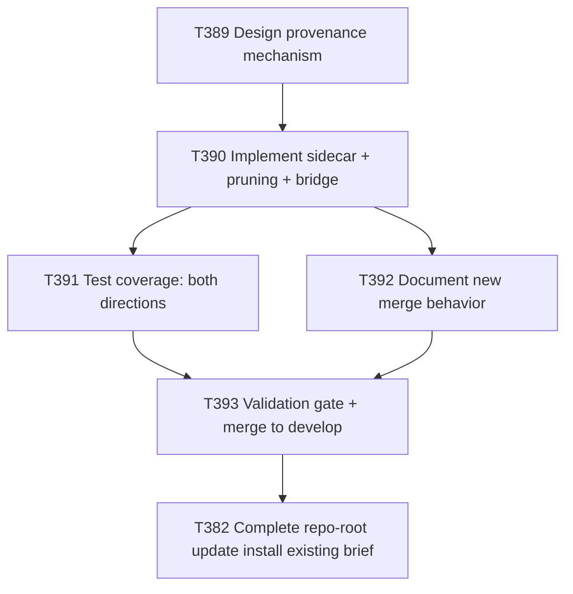

# Plan: MCP/Settings Merge Provenance Tracking (Unblock T382)

**Author:** orchestrator
**Date:** 2026-08-10
**Status:** draft — pending user approval (Plan phase only; no task briefs authored, no execution)

## Objective
`scripts/merge-mcp-json.py`'s recursive JSON merge (`merge_json()`, used by `scripts/install.sh`'s
`merge_or_copy_mcp_json()` for all 7 platforms' MCP/settings files since plan-033/T377) preserves any
key present only in the destination file, forever, with no way to distinguish genuinely hand-added
content (this repo's own `.vscode/mcp.json` `cwso` block, which must survive `--update` forever) from
a key the generator's source template (`implementation/knowledge/mcp/servers.yaml` via
`implementation/scripts/sync.mjs`'s `emitMcp()`) used to emit but no longer does (`e2b`/`redis`/
`figma`/`notion`, removed by T386). This is a genuine, independently-verified architectural gap
discovered during a real (uncommitted, reverted) T382 execution attempt on 2026-08-10 — see
`docs/tasks/task-T382.md` and the detailed blocker write-up in `docs/tasks/active-tasks.md`'s current
T382 row (both read in full during this plan's investigation; neither is duplicated here). This plan
designs and implements a provenance-tracking mechanism that lets the merge safely distinguish
"previously generator-owned, now retired — prunable" from "hand-added — preserve forever," then uses
that fixed tooling to finally complete T382 (referenced, not rewritten, below).

## Scope
### In Scope
- Designing a provenance-tracking mechanism for the MCP/settings merge, evaluated against at least
  two concrete design options, with an explicit safety-first recommendation (see "Investigation
  Findings" and "Approach" below).
- Implementing the chosen mechanism in `scripts/merge-mcp-json.py`, `implementation/scripts/sync.mjs`,
  and `scripts/install.sh` — the three files confirmed (by direct read, this plan) to be the exact
  hook points.
- Handling the "first `--update` after this fix ships" backward-compatibility case for every
  already-installed project (this repo's own root included), which today has zero provenance history
  to draw on — confirmed by direct read, not assumed (see Investigation Finding #3).
- A one-time, explicitly-scoped, opt-in bootstrap mechanism to finish the specific
  `e2b`/`redis`/`figma`/`notion` removal for already-installed roots, since generic provenance
  tracking cannot retroactively reconstruct history it never recorded.
- Test coverage proving both directions: a hand-added key (cwso-style) survives forever, and a
  retired-but-previously-generator-owned key gets correctly pruned once provenance exists.
- Re-attempting `docs/tasks/task-T382.md` (unchanged brief, referenced not duplicated) once the fix
  lands, as the final live proof point — mirrors the plan-031/T372 and plan-033/T382 precedent of a
  real repo-root `--update` run, not a test-directory simulation.

### Out of Scope
- Rewriting or superseding `docs/tasks/task-T382.md`'s existing content — it stays exactly as-is,
  `blocked`, until this plan's fix merges; only its `Depends on` column needs a future edit (deferred
  to task-brief-authoring time, not this Plan phase).
- Any change to which servers are `core`/`extended`, or to `servers.yaml`'s current entry list beyond
  what T386 already did — this plan only fixes the *mechanism* that failed to prune already-retired
  entries, not the registry content itself.
- A general-purpose diff/history tool for `servers.yaml` beyond what's needed for MCP/settings merge
  pruning.
- Cutting a new release/version tag — stops after merging to `develop` and completing T382, matching
  plan-031/plan-033 precedent, unless re-justified at execution time.
- Embedding comments/markers inside generated JSON files themselves (evaluated as design option (b)
  below and rejected — see reasoning).

## Investigation Findings

### 1. Exact current merge mechanism (confirmed by direct read of `scripts/merge-mcp-json.py`)
`merge_json(dest, source)` (lines 31-42) is a pure recursive-dict merge with three rules: (a) both
values are dicts → recurse; (b) key in both, either value a scalar/array leaf → `source` wins; (c) key
only in `dest` → preserved as-is, unconditionally, no exceptions. There is no third input anywhere in
the current call graph (`merge_or_copy_mcp_json()` in `scripts/install.sh`, lines 248-260, passes only
`--source`/`--dest`) that could carry "what did the generator emit last time" — the algorithm is, by
design, memoryless. The hook point for a provenance-aware pruning rule is rule (c): it needs to become
"key only in `dest` → preserved, UNLESS `dest_only_key` is confirmed to have been previously
generator-owned by some independent evidence, in which case pruned." That independent evidence is what
this plan designs.

### 2. What "generator-owned" means structurally (confirmed by direct read of `emitMcp()` and
`servers.yaml`)
`implementation/scripts/sync.mjs`'s `emitMcp(servers, tags, format)` (lines 293-352) filters
`servers.yaml`'s `servers:` map down to entries whose `tags` intersect the platform's requested tags,
then emits **exactly one output object key per surviving entry name**, unmodified, for every format
(`vscode`/`cursor` → `servers`/`mcpServers`; `gemini` → `mcpServers`; `opencode` → `mcp`). There is no
key-splitting, flattening, or renaming — a `servers.yaml` entry name maps 1:1 to a single top-level key
in the generated output. This means provenance can be safely tracked at "top-level key name"
granularity; no finer-grained (within-entry-field) tracking is structurally necessary.

**Real hand-edit precedent investigated directly (not hypothetical), confirming the above holds in
practice:** this repo's own `.vscode/mcp.json` has exactly two hand-added elements — a `cwso` key
under `servers` (sibling to every generator-owned key, never present in `servers.yaml`, added whole as
its own top-level key) and a top-level `inputs` array (a key `emitMcp()`'s `vscode` branch never emits
at all — confirmed by reading the branch, which only ever produces `{ servers: target }`). Neither is
a hand-edited *field inside* a generator-owned entry (e.g., nobody has hand-modified `gitlab`'s `args`
or added an extra field inside the `context7` block) — both are whole extra top-level keys. This is
the only real precedent in the repo, and it confirms coarse per-key-name provenance tracking is
sufficient; no evidence justifies the complexity of finer-grained sub-key provenance.

### 3. Reusable existing pattern found: `.generated-manifest.json` (confirmed by repo-wide grep, not
assumed)
`implementation/scripts/sync.mjs` (lines 524-535) already writes a `.generated-manifest.json` sidecar
into every platform's output directory (`implementation/.cursor/.generated-manifest.json`,
`implementation/.cline/.generated-manifest.json`, etc.), listing `generatedFrom`, `platform`, and a
`files` array — confirmed present both under `implementation/<platform>/` and, since it's copied like
any other generated file, at this repo's own root (`.cursor/.generated-manifest.json`, etc., all
confirmed present by direct `find`). This is real, working precedent for "a sidecar manifest describing
what the generator wrote" — but it tracks **file paths**, not **JSON keys within a file**, and it is
not consulted by `merge-mcp-json.py` at all today.

**Critical ordering nuance found (not obvious from reading either file in isolation — found by tracing
the actual call sequence in `scripts/install.sh`):** for the 5 tree-based platforms
(`.cursor/`, `.gemini/`, `.opencode/`, `.pi/`, `.cline/`), `install_tree_into()` calls
`sync_tree_into()` (`rsync -a --delete`, excluding only the one MCP/settings file via `exclude_rel`)
**before** `merge_or_copy_mcp_json()` runs. `.generated-manifest.json` is not in that exclude list
today, so it is already overwritten with the **new** manifest content by the time any merge step could
read it. Reusing the *existing* `.generated-manifest.json` file directly (rather than the *pattern*) as
the provenance source would therefore silently lose the "old" state needed to diff against, unless it
is also added to the exclude list — a real implementation detail this plan's design task must resolve,
not an assumption.

Additionally, `.mcp.json` and `.vscode/mcp.json` (the two platforms whose `mcp.outputFile` points
**outside** their platform's `outputDir`) have **no** `.generated-manifest.json` counterpart at all
today — confirmed by direct `find`/`ls` (`implementation/.mcp.json` and `implementation/.vscode/mcp.json`
exist as bare files with no sidecar). Any design must cover these two files too, not just the five
that ride inside a tracked directory tree.

### 4. Backward compatibility / bootstrap gap (confirmed, not assumed)
Every already-installed project — this repo's own root included — has **zero** provenance history
today, regardless of which design is chosen, because no provenance mechanism has ever existed before
this plan. This means: on the first `--update` after this fix ships, for *any* already-installed
project, a provenance-diffing mechanism has nothing to diff against and must safely default to
"unknown provenance → preserve" (i.e., today's exact behavior, zero regression risk) for every
dest-only key. Concretely, this means `e2b`/`redis`/`figma`/`notion` will **not** be pruned by the
general mechanism on that first post-fix update, for this repo or any other already-installed target.
Completing the specific, already-decided (T386) removal for already-installed roots requires a
separate, one-time, explicitly-scoped reconciliation step layered on top of the general mechanism —
see the recommendation below.

## Design Options Evaluated

### Option (a) — Sidecar provenance manifest, diffed old-vs-new
A dedicated per-mcp-file sidecar (kept separate from the existing `.generated-manifest.json`, whose
established purpose is unrelated file-path tracking with its own existing consumers/tests — mixing
concerns risks regressions there) recording the top-level key set `emitMcp()` produced at last
generation, e.g. `generatorOwnedKeys: ["gitlab", "playwright", ..., "toolradar"]`. Written by
`sync.mjs` next to every generated MCP/settings file (inside the tree for the 5 tree-based platforms,
next to the standalone file for `.mcp.json`/`.vscode/mcp.json`). `merge-mcp-json.py` reads both the
**old** dest-side sidecar (captured before any tree-sync could overwrite it — requires adding the
sidecar itself to `sync_tree_into()`'s exclude list, per Finding #3) and the **new** source-side
sidecar, and prunes a dest-only key only if it appears in the old sidecar's `generatorOwnedKeys` and
NOT in the new source's current key set.
- **Safety:** defaults to preserve when no old sidecar exists (bootstrap-safe, per Finding #4).
- **Automatic/self-maintaining:** once seeded, every future server removal is correctly pruned with no
  further human action required — the diff mechanism handles it forever.
- **Cost:** new file format, new exclude-list wiring in 3 files, and does **not** solve the current
  `e2b`/`redis`/`figma`/`notion` bootstrap gap by itself (Finding #4 applies to it too, since it has no
  history before this fix ships).

### Option (b) — In-file marker/comment convention
Embedding a marker (e.g. a `_generatorOwnedKeys` sentinel field, or a comment) directly inside the
generated JSON file. **Evaluated and rejected specifically for the JSON case**, as the task requested:
standard JSON has no comment syntax, so a true "comment convention" (viable in YAML, e.g.
`servers.yaml` itself) is not available. A sentinel *data* field (e.g. `"_meta": {"generatorOwnedKeys":
[...]}"`) is technically possible but was rejected because (1) it pollutes the platform-native schema
every downstream tool (VS Code, Cursor, Gemini CLI, Opencode, Cline) parses directly — none of their
schemas define such a field, risking validation warnings or silent tool confusion, a real concern per
`docs/wiki/mcp-servers.md`'s per-platform runtime-verification checklist added in T384; and (2) it
would need exactly the same old-vs-new diffing logic as option (a) anyway, just relocated — no
architectural simplification, only added schema risk. Not recommended.

### Option (c) — Explicit, opt-in `--prune-retired`-style flag (no silent auto-pruning)
`merge-mcp-json.py` gains an opt-in flag (e.g. `--force-prune-keys <name1,name2,...>`) that prunes
exactly the named dest-only keys, and only those — never inferred, never silent, always an explicit,
reviewed, human-supplied list. Lower engineering cost than (a) (no sidecar format, no sync.mjs change,
no exclude-list wiring), but provides **no automatic mechanism** for future retirements — every future
server removal would need a human to remember to pass the right list by hand, indefinitely. This is the
weakest option as a *standalone, permanent* mechanism, but it directly and safely solves the Finding #4
bootstrap gap that option (a) cannot solve alone, precisely because it needs no history — a human who
already knows the current retired set (T386's PR description) can supply it explicitly, once.

## Recommendation
**Adopt Option (a) as the permanent, self-maintaining mechanism going forward, plus Option (c) as a
narrowly-scoped, one-time bootstrap bridge for the pre-existing `e2b`/`redis`/`figma`/`notion` gap.**
Reasoning:
- Option (a) alone is architecturally correct and requires no ongoing human discipline for every
  future server retirement — the diff mechanism self-maintains once seeded, matching this plan's
  explicit design requirement to default toward *not* deleting anything the mechanism isn't confident
  about (Finding #4's bootstrap default is exactly "preserve," never "prune-if-unsure").
  Option (a) alone, however, cannot complete T382's actual goal today, because the bootstrap gap
  (Finding #4) applies equally to the very servers this plan needs pruned right now.
- Option (c), used **only** as a single, explicitly-scoped, reviewed, one-time invocation (naming
  exactly `e2b,redis,figma,notion` — the same four names T386 already removed from `servers.yaml`, no
  inference, no auto-discovery) during the T382 re-attempt, closes that specific gap safely: it is
  never silent, never a standing default, and blast radius is limited to four already-decided,
  already-reviewed, already-merged server names.
- Option (b) is rejected outright for the reasons above (JSON has no comment syntax; a sentinel data
  field pollutes platform-native schemas for no architectural gain over (a)).
- This combination is the design that most directly honors "silently deleting a user's data is far
  worse than leaving stale data present": the permanent mechanism (a) only ever prunes with positive
  historical evidence, and the one-time bridge (c) only ever prunes an explicitly human-named, reviewed
  list — no path in this design infers a prune decision from absence of information.

## Approach
1. **Design task (T389):** solution-architect produces a short design artifact (proposed:
   `docs/decisions/ADR-002-mcp-merge-provenance-tracking.md`, the next sequential ADR number — only
   `ADR-001-cwso-sia-integration.md` exists today, confirmed by direct `ls`) specifying: the exact
   sidecar file name/location per platform (including the two standalone files), its exact JSON schema,
   the exact `sync_tree_into()`/`install_tree_into()` exclude-list change needed so the *old* sidecar
   survives long enough to be read (per Finding #3's ordering nuance), the exact `merge-mcp-json.py`
   CLI surface for both the diff-based pruning and the one-time `--force-prune-keys` bridge, and the
   exact bootstrap-safe default (missing/absent old sidecar → preserve everything, no exceptions).
2. **Implementation task (T390):** implement the design in `implementation/scripts/sync.mjs` (emit the
   sidecar), `scripts/merge-mcp-json.py` (consume old+new sidecars for diff-based pruning; accept
   `--force-prune-keys` for the one-time bridge), and `scripts/install.sh` (wire the sidecar into the
   exclude list alongside each platform's MCP/settings file; pass sidecar paths to
   `merge_or_copy_mcp_json()`).
3. **Test task (T391):** prove both directions with automated tests — a cwso-style hand-added key
   (never in any sidecar) survives an `--update` with a sidecar present; a synthetic retired-key
   scenario (present in an old sidecar, absent from the new source) gets pruned; a missing-old-sidecar
   scenario (the bootstrap case) preserves every dest-only key exactly as today; `--force-prune-keys`
   prunes only the exact named keys and nothing else.
4. **Docs task (T392):** document the new provenance-aware merge behavior and the one-time bootstrap
   bridge in `README.md`/`docs/wiki/mcp-servers.md`, mirroring the plan-033/T380 precedent for
   describing installer merge behavior changes.
5. **Validation gate (T393):** full verification bar, branch → MR → CI green → merge to `develop`, per
   `git-workflow.md` — mirrors plan-033/T381.
6. **Complete T382 (existing task, unchanged brief):** once T393 merges, re-attempt
   `docs/tasks/task-T382.md` exactly as written, with one addition applied at task-brief-authoring time
   (deferred, not part of this Plan phase): its `Depends on` column gains T393, and its Step 2 command
   gains the one-time, explicitly-named `--force-prune-keys e2b,redis,figma,notion` bridge invocation
   so this specific already-retired set finally prunes from this repo's own root and both proof
   classes (merge-safety no-destruction, and now genuine server-removal) succeed in the same run.

## Task ID Index
| Plan step | Task ID | Title |
|---|---|---|
| P034-01 | T389 | Design MCP merge provenance-tracking mechanism |
| P034-02 | T390 | Implement provenance sidecar + pruning + bootstrap bridge |
| P034-03 | T391 | Test coverage: hand-added survival, retired-key pruning, bootstrap default, bridge flag |
| P034-04 | T392 | Document the new provenance-aware merge behavior |
| P034-05 | T393 | Validation gate and merge to develop |
| P034-06 | T382 | (existing, unchanged brief) Complete repo-root update install using the fixed tooling |
| (release, not a P034 step) | T394 | Release v6.10.0 (MCP settings hardening + merge-safety + provenance) |
| (release, not a P034 step) | T395 | Sync main with develop for v6.10.0 |

## Task Breakdown
| ID | Title | Assignee | Priority | BlockedBy | Estimated Effort |
|----|-------|----------|----------|-----------|-------------------|
| T389 | Design MCP merge provenance-tracking mechanism | solution-architect | P0 | — | M |
| T390 | Implement provenance sidecar + pruning + bootstrap bridge | devops-engineer | P0 | T389 | M |
| T391 | Test coverage for both preservation and pruning directions | qa-engineer | P0 | T390 | M |
| T392 | Document the new provenance-aware merge behavior | technical-writer | P1 | T390 | S |
| T393 | Validation gate and merge to develop | tech-lead, orchestrator | P0 | T391, T392 | S |
| T382 | (existing brief, unchanged) Complete repo-root update install | devops-engineer, orchestrator | P0 | T393 (new, in addition to already-satisfied T381/T388) | M |

## Detailed Task Briefs

### T389 — Design MCP merge provenance-tracking mechanism
- Goal: produce a concrete, implementable design for Option (a) + Option (c) per this plan's
  recommendation, resolving the specific open engineering questions this plan's investigation
  surfaced but did not fully resolve (exact sidecar schema, exact exclude-list wiring, exact CLI
  surface).
- Inputs: this plan (`docs/plans/plan-034-mcp-provenance-tracking.md`); `scripts/merge-mcp-json.py`;
  `implementation/scripts/sync.mjs`'s `emitMcp()`/`syncPlatform()`; `scripts/install.sh`'s
  `sync_tree_into()`/`install_tree_into()`/`merge_or_copy_mcp_json()`.
- Outputs: `docs/decisions/ADR-002-mcp-merge-provenance-tracking.md` (or next free sequential ADR
  number — confirm at execution time, not assumed).
- Acceptance criteria:
  1. Exact sidecar file name/path specified for all 7 platforms, including the two standalone files
     (`.mcp.json`, `.vscode/mcp.json`) that have no existing tree-level manifest.
  2. Exact sidecar JSON schema specified (at minimum: the generator-owned key list at last generation).
  3. Exact exclude-list change specified so the sidecar's old (dest-side) content is readable before
     being overwritten — addressing Finding #3's ordering nuance explicitly, not silently.
  4. Exact `merge-mcp-json.py` CLI surface specified for both the diff-based pruning path and the
     `--force-prune-keys` one-time bridge.
  5. Explicit statement of the bootstrap-safe default (missing/absent old sidecar → preserve every
     dest-only key, no exceptions) as a testable, unambiguous rule.
  6. Design reviewed against the cwso/`inputs` real precedent from Finding #2 — confirms neither is
     ever at risk under the new rule.

### T390 — Implement provenance sidecar + pruning + bootstrap bridge
- Goal: implement T389's design in the three confirmed hook-point files.
- Inputs: T389's ADR; `implementation/scripts/sync.mjs`; `scripts/merge-mcp-json.py`;
  `scripts/install.sh`.
- Outputs: sidecar-writing logic in `sync.mjs`; provenance-aware pruning logic (plus
  `--force-prune-keys`) in `merge-mcp-json.py`; exclude-list and call-site wiring in `install.sh`.
- Acceptance criteria:
  1. Fresh (non-`--update`) installs unaffected — still a plain copy, sidecar written alongside.
  2. `--update` with no old sidecar present preserves every dest-only key exactly as today (bootstrap
     default, no regression).
  3. `--update` with an old sidecar present prunes a dest-only key only if it was in the old sidecar's
     generator-owned set and is absent from the new source's current key set.
  4. `--force-prune-keys <names>` prunes only the exact named keys, never inferred names, and errors
     (not silently no-ops) if a named key doesn't actually exist as a dest-only key.
  5. cwso-style keys (never in any sidecar) are never pruned under any code path, including
     `--force-prune-keys` when cwso isn't named.
  6. No literal secret value ever written by any new code path (placeholder syntax only, per the
     existing module-level guarantee).

### T391 — Test coverage for both preservation and pruning directions
- Goal: prove T390's behavior automatically, covering the exact two proof points this plan's own
  objective names — a cwso-style hand-added case still survives, and a retired-server case gets
  correctly pruned — plus the bootstrap-default and bridge-flag cases.
- Inputs: T390's implementation; `tests/functional/test_install_script.py` (existing pattern to
  extend, per plan-031/plan-033 precedent).
- Outputs: new test methods in `tests/functional/test_install_script.py` (or a clearly-named sibling
  module).
- Acceptance criteria:
  1. Test: a synthetic hand-added key with no sidecar entry survives `--update` when a sidecar is
     present (mirrors the real cwso case).
  2. Test: a synthetic key present in an old sidecar's generator-owned set, and absent from the new
     source, is pruned on `--update`.
  3. Test: a synthetic key present in an old sidecar's generator-owned set, but still present in the
     new source, is refreshed (not pruned) — proving the mechanism doesn't over-prune actively-current
     servers.
  4. Test: `--update` with no old sidecar file at all preserves every dest-only key (bootstrap default).
  5. Test: `--force-prune-keys` prunes only the named keys; a hand-added key not named survives even
     when the flag is used.
  6. Full suite (`python3 tests/run.py`) green, count not reduced.

### T392 — Document the new provenance-aware merge behavior
- Goal: describe the new mechanism and the one-time bootstrap bridge for maintainers/users, mirroring
  plan-033/T380's precedent for documenting installer merge-behavior changes.
- Inputs: T390's implementation; `README.md`'s `--update` section (currently describes plan-033's
  7-file merge-preserve scope); `docs/wiki/mcp-servers.md`.
- Outputs: doc diff describing (a) that retired generator-owned servers are now pruned automatically
  once provenance history exists, (b) the bootstrap-safe default for first-time updates after this fix,
  and (c) the existence and safe, opt-in, explicit-only nature of `--force-prune-keys`.
- Acceptance criteria:
  1. Doc text specific (names the actual mechanism and flag), not vague.
  2. No overstatement of automatic pruning — the bootstrap limitation from Finding #4 is stated
     honestly, not glossed over.

### T393 — Validation gate and merge to develop
- Goal: independently verify T389-T392 and land on `develop`, per `git-workflow.md`.
- Inputs: T389, T390, T391, T392 outputs.
- Outputs: merged MR on `develop`.
- Acceptance criteria:
  1. Full verification bar green: `make verify`, `generate-registry.py --check`, `validate-tasks.py`,
     `python3 tests/run.py`, `sync.mjs --check`.
  2. Orchestrator independently reviews the full diff before merging.
  3. `FAIL` verdict blocks progression; T382 is not re-attempted until this gate passes.

### T382 — Complete repo-root update install (existing task, brief unchanged)
This task already exists in full at `docs/tasks/task-T382.md` and is intentionally **not** duplicated
or rewritten here. Once T393 merges, the orchestrator (at task-brief-authoring time, a separate,
explicit step per this session's cadence) applies exactly two additions to the existing brief: (1) adds
T393 to its `Depends on` column, and (2) adds the one-time, explicitly-named
`--force-prune-keys e2b,redis,figma,notion` invocation to its Step 2 command, so this specific
already-retired set is finally pruned. No other content in `task-T382.md` changes. Its existing
acceptance criteria (byte-for-byte cwso/`inputs` survival, zero-hit grep for the four retired servers,
full verification bar) remain the actual acceptance bar for completion.

## Dependency Graph

## Agent Assignments
| Task | Agent | Rationale |
|------|-------|-----------|
| T389 | solution-architect | Architecture-level design decision; orchestrator does not make these directly per `AGENTS.md` constraints. |
| T390 | devops-engineer | Owns `install.sh`/generator tooling per plan-031/plan-033 precedent (T368, T377). |
| T391 | qa-engineer | Test coverage is QA's ownership; write access limited to test files per security-guidelines.md. |
| T392 | technical-writer | Docs-only change, mirrors T380's ownership. |
| T393 | tech-lead (review) + orchestrator (merge) | Implementation Gate per AGENTS.md validation gates. |
| T382 | devops-engineer (execution) + orchestrator (independent verification) | Same ownership as its existing, unchanged brief. |

## Artifact Flow
- T389 produces the ADR consumed directly by T390's implementation.
- T390 produces the sidecar-writing, pruning, and bridge-flag code consumed by T391 (tests against it)
  and T392 (docs describing it).
- T391 and T392 both feed T393's validation gate.
- T393's merged `develop` is the new required input for T382, added alongside its already-satisfied
  `T381`/`T388` dependencies.
- T382 (unchanged brief) produces the actual repo-root filesystem proof, completing what plan-033
  could not.

## Risks & Mitigations
| Risk | Likelihood | Impact | Mitigation |
|------|-----------|--------|------------|
| Sidecar-exclude wiring mistake causes the *old* sidecar to be overwritten before it can be diffed, silently disabling pruning (fails safe) or, worse, silently disabling preservation (fails unsafe) | Medium | High | T389 explicitly specifies the exclude-list change; T391 includes a dedicated bootstrap-default test that would catch either failure mode. |
| Provenance-aware pruning incorrectly prunes a hand-added key that happens to share a name with a currently-retired server | Low | High | Design defaults to "preserve unless positive historical evidence," per Finding #2's cwso precedent (only ever whole extra top-level keys, never colliding with registry names in the one real case investigated); documented as an accepted, shared risk of any name-based provenance approach in T389's ADR. |
| `--force-prune-keys` bridge is later reused as a casual/automatic default rather than the one-time, explicitly-reviewed bridge it's designed to be | Medium | Medium | T392's docs explicitly state its opt-in, explicit-only, never-a-standing-default nature; T382's brief only ever invokes it with a hardcoded, already-reviewed name list, never a wildcard or discovery mode. |
| T382's existing brief and this plan's addition to it (Depends-on + one flag) drift out of sync if not applied carefully at task-brief-authoring time | Low | Medium | This plan explicitly scopes the addition to exactly two edits (see T382 detailed brief above), to be applied as a small, reviewable diff, not a rewrite. |
| Full sidecar-diff mechanism is more implementation surface than needed if a simpler design emerges during T389 | Low | Low | T389 is a dedicated design task specifically to catch this before T390 starts implementing; design can still choose a leaner variant of Option (a) as long as it meets the stated acceptance criteria. |

## Token Budget
| Phase | Budget |
|------|--------|
| T389 design | 20k |
| T390 implementation | 35k |
| T391 tests | 25k |
| T392 docs | 8k |
| T393 validation + merge | 12k |
| T382 completion (existing brief, budget already allocated at ≤20k per its own brief) | 20k |
| Total (new work, T389-T393) | 100k |
| Total (including pre-existing T382 budget) | 120k |

## Success Criteria
- [ ] A provenance-tracking mechanism exists that lets `scripts/install.sh --update` correctly prune a
      dest-only key that was previously generator-owned and has since been retired from
      `servers.yaml`, while never pruning a genuinely hand-added key.
- [ ] The mechanism defaults safely (preserve, not prune) whenever provenance history is unavailable —
      proven by an explicit bootstrap-default test, not assumed.
- [ ] A test proves the cwso-style hand-added case still survives an `--update` with the new mechanism
      active.
- [ ] A test proves a retired-server case is correctly pruned once provenance history exists.
- [ ] A one-time, explicitly-scoped, opt-in bridge exists to complete the specific
      `e2b`/`redis`/`figma`/`notion` removal for already-installed roots (this repo included), without
      making silent/automatic retroactive pruning the default behavior anywhere else.
- [ ] `docs/tasks/task-T382.md` is re-attempted, unchanged in content apart from the two additions
      described in its detailed brief above, and completes successfully — this repo's own root
      `.mcp.json` and all `extended`-tagged mirror files finally lose the four retired server entries,
      while `.vscode/mcp.json`'s hand-added `cwso` block and `inputs` array continue to survive
      byte-for-byte.
- [ ] Full verification bar green after both T393's merge and T382's completion.
- [ ] No new release/version tag cut, unless explicitly re-justified at execution time.

## Open Questions
- Exact sidecar file naming convention (e.g. `.mcp.json.provenance.json` vs. extending
  `.generated-manifest.json` with a new field vs. some other convention) — deliberately left to T389's
  design task rather than pre-decided here, since it's an implementation-level choice, not an
  architectural one, per this plan's Option (a) recommendation.
- Should `--force-prune-keys` remain a permanent CLI capability after this bootstrap use, or should it
  be removed/hidden once every currently-installed project has passed through one post-fix `--update`
  (making pure Option (a) sufficient going forward)? Leaning toward "keep it available but
  undocumented-as-routine" for future one-off registry cleanups, but not decided here — flag for T389
  or a future plan.
- Does `docs/tasks/task-T382.md`'s existing token budget (≤20k) still hold once it also runs the
  `--force-prune-keys` bridge, or does it need a small bump? Not resolved here; check at
  task-brief-authoring time.
