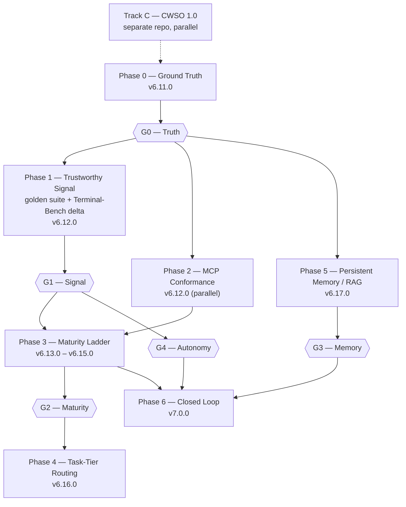

# Plan: emage.code Roadmap to v7.0 — "Ground Up"

- **Status:** Phase 0 (Ground Truth: T400–T406, T417) approved for task-brief authoring and
  execution — user-approved on 2026-08-12. All other phases (Phase 1 onward, including the
  Terminal-Bench two-arm harness T418–T41C and every task from T410/T420 onward) remain
  `proposed` pending Gate G0 closing **and** pending the two open questions in "Open questions"
  below (Arm A agent selection; written interpretation of a null/negative Terminal-Bench delta).
  No task beyond T400–T406 and T417 may be dispatched until both are resolved by the user.
  **Update (2026-08-13):** open question 3 (Arm A agent selection) is now resolved by the user —
  `claude-code` — see "Open questions" below. Gate G0 is also closed (Phase 0, `done`). Per
  §2.4 Phase 1's own status block, this closes both remaining preconditions for T418, T419, T41B,
  and T41C; open question 4 (null-delta interpretation) remains open and continues to block T41A
  specifically. This update records precondition status only — it does **not** itself approve
  task-brief authoring or dispatch for T418/T419/T41B/T41C, which remains a separate decision the
  user has not yet made. T410–T416 (Layer 1, golden suite) is addressed separately: see the
  formalization notes in §2.4 Phase 1 and in "Approval" below flagging an unresolved inconsistency
  between those two sections over whether T410–T416 needed both open questions resolved, or Gate
  G0 alone — that inconsistency is flagged, not resolved, this pass, so T410–T416 remains treated
  as blocked pending explicit user clarification.
  **Further update (2026-08-13, later same day):** open question 4 (null-delta interpretation) is
  also now resolved — see the registered interpretation block in §2.4 Phase 1 (immediately after
  the "Note on the sign of the delta") and the corresponding "resolved" mark on open question 4 in
  "Open questions" below. T41A's sole blocker is therefore resolved. The T410–T416 ambiguity noted
  above is now moot in practice — both readings of the conflicting passages converge on
  "unblocked" once both open questions are answered — but the underlying wording inconsistency in
  the document is left as flagged, not fixed, this pass. **None of this is dispatch approval.**
  The user explicitly chose "not yet" when asked whether to dispatch T418/T419/T41B/T41C, and was
  explicit that the same holds for T41A and T410–T416 once their gating resolves: no task brief is
  authored and `docs/tasks/active-tasks.md` is not modified for any of T410–T416, T418, T419,
  T41A, T41B, or T41C as a result of these updates.
- **Author:** synthesis review of two external roadmap documents + live repo audit (orchestrator)
- **Repo audited:** `github.com/xemage/emage.code` @ `develop` (`f317261`)
- **Supersedes:** nothing. Complements `docs/plans/plan-033-mcp-settings-hardening.md`.
  **Correction from the original draft (verified during formalization on 2026-08-12):**
  plan-033 (T377–T388) is not "in flight" — it is `done` per `docs/tasks/completed-tasks.md`
  (as is its follow-up, plan-034/T389–T393). §2.4 Phase 2's framing has been updated below to
  reflect this; see the inline note at the top of Phase 2.
- **Task ID range:** T400–T474 (highest allocated ID prior to this plan was T395; confirmed
  current at formalization time — `docs/tasks/active-tasks.md` is empty and
  `docs/tasks/completed-tasks.md`'s highest ID is T395)
- **Filename note:** this plan was originally drafted as
  `docs/plans/plan-roadmap-v7-ground-up - Claude Opus 5.md` and renumbered into this repo's
  `plan-<NNN>-<slug>.md` convention as `plan-035` (the next free plan number after
  `plan-034-mcp-provenance-tracking.md`) during formalization. Content and judgment calls below
  are preserved from the original draft; only the filename, this status block, and the note you
  are reading now were added or changed by the renumbering pass.

---

## Part 1 — Review of the two input roadmaps

Both uploaded documents describe the *same* roadmap. The KIMI file is the source
analysis; the ChatGPT PDF is an expansion of it. They should be treated as one input,
not two independent opinions. Neither author had repository access — both reason from a
prose summary — and this shows.

### 1.1 What they get right

| Claim | Verdict |
|---|---|
| "You cannot improve what you do not measure — baseline first" | **Correct and load-bearing.** Adopted as Gate 1. |
| "Never let the agent edit its own evaluator" | **Correct.** Adopted as a hard architectural rule. |
| "Every accepted harness change produces a merge request, not a silent edit" | **Correct.** Adopted verbatim. |
| Held-out task set to prevent overfitting | **Correct.** Adopted. |
| Installation friction is a real adoption barrier | **Correct**, though lower priority than they assume. |
| Knowledge projection is one-way; no runtime feedback | **Correct.** This is the single most valuable gap they identify. |
| Failure clustering by `cause × behavior × mechanism` | **Correct and cheap.** Adopted. |

### 1.2 What they get factually wrong

Every row below was verified against the cloned `develop` branch.

| Their claim | Actual repo state |
|---|---|
| "Current State (v6.9.0)" | `README.md:14` — latest release is **v6.10.0** |
| "22 skills" | `implementation/registry/summary.md` — **26 skills** |
| "18 slash commands" | **19 commands** |
| "No built-in benchmark harness for self-evaluation" | **False.** `tests/performance/` contains `test_tool_use_complexity.py`, `test_orchestration_trajectory_quality.py`, `test_scaling_and_throughput.py`, `test_agent_token_budget.py`, `test_benchmark_pack.py`, documented at `docs/wiki/performance-benchmarks.md`. A deterministic, offline, CI-safe suite already exists. |
| "No recursive self-improvement loop — harness is static" | **Substantially false.** `implementation/sia/`, `implementation/scripts/sia-executor.py`, `dispatch-test-sia.py`, `fine-tune-lora.py`, `fine-tune-pipeline.py`, `deploy-vllm.py`, plus tests `test_t222_sia_task_evaluator.py`, `test_t223_sia_harness_capture.py`, `test_t224_reward_attachment.py`, `test_t225_reward_shaping.py`. Trajectory capture and reward shaping exist. The **loop is open**, not absent. |
| "No RAG integration" | **True** — the only genuine absence of the four. |

The pattern: they inventory what a mature harness *should* have, assume absence, and
propose greenfield builds. Three of the four "Tier 1 critical" items are partially built.
An agent executing their plan would create duplicate infrastructure alongside working code.

> **Formalization note (2026-08-12):** the SIA/`implementation/sia/` items in the row above were
> subsequently reclassified as an **invalidated PoC** by `docs/plans/plan-016-*` / task T303 (see
> `docs/artifacts/phase2-3-poc-debt-scorecard-v1.md`): no real model, no real deployment, the
> evaluator produced zero discriminative signal. This does not change the verdict that the
> *scaffolding* (trajectory capture, reward shaping, executor) exists in the repo — an executing
> agent still must not rebuild it from scratch — but it does mean Phase 6 (§2.4, "Closed Loop")
> inherits a PoC-grade foundation, not a validated one. T460's audit (Phase 6) must read this
> scorecard before scoping any new module.

### 1.3 What they omit

Neither document contains a single item from `---TODO_AFTER_UPDATE---.txt` — the owner's
own backlog. That backlog is more grounded than either roadmap, and every item in it is
independently confirmable in the repo:

| TODO item | Repo evidence |
|---|---|
| Everything documented as beta | **All 76 registry entries** (27 agents / 19 commands / 4 instructions / 26 skills) carry `maturity: beta`. There is no promotion path defined anywhere. |
| Wrong version in docs | `implementation/README.md:4` states **v6.0.1**; `README.md:131` links `docs/releases/v6.0.1.md`. Actual: v6.10.0. Ten releases of drift. |
| MCP settings must work on all platforms | Projected `mcp.json` exists only in `.cursor/`, `.pi/`, `.cline/`. `.gemini/` and `.opencode/` carry MCP inside `settings.json` / `opencode.json`. `.claude/` and `.github/` have neither. Coverage is uneven and untested. |
| CWSO deployment docs live in the wrong repo | `docs/deployment/` holds 7 files; **6 are CWSO deployment** (`local-docker-desktop-guide`, `gcp-cloud-run-guide`, `proxmox-lxc-guide`, `cwso-overview-and-agent-integration-guide`, `cwso-emage-orchestrator-connection-guide`, `troubleshooting-guide`). |
| Plan-coverage test failure | `tests/performance/test_team_health.py::TestPlanCoverage::test_every_active_task_has_a_plan` — a plan-drift detector with no upstream rule forcing plan creation. |
| Cheap models for well-defined tasks | Not addressed by either roadmap except as a cost-optimization footnote. It is actually a *maturity* problem: you can only route a task to a cheap model once the brief has rails and tests. |

> **Formalization note (2026-08-12):** "MCP settings must work on all platforms" was
> subsequently addressed by `plan-033-mcp-settings-hardening.md` (T377–T388, `done`) and its
> follow-up `plan-034-mcp-provenance-tracking.md` (T389–T393, `done`). Merge-safety now covers all
> 7 platforms and 4 unused extended servers (`e2b`/`redis`/`figma`/`notion`) were removed. Phase 2
> of this plan (§2.4) is scoped down accordingly — see the note at the top of that section.

### 1.4 The structural problem

Both documents assign work to `benchmark-team`, `context-team`, `platform-team`,
`meta-team`, `knowledge-team`, `inference-team`, `community-team`, `cwso-team`,
`infra-team`, `collab-team`, `rl-team`, `hw-team`, `enterprise-team`, `ide-team`.
That is fourteen teams. The repo shows a solo maintainer working through
agent-executed task briefs. A plan that assumes fourteen teams is not executable — it is
an aspiration document wearing a plan's clothes.

They also chase external SOTA (≥85% Terminal-Bench, top-10 leaderboard, 10,000 active
projects) before the internal registry has left beta. Chasing a public benchmark with a
harness whose 76 components are all self-declared beta optimizes the scoreboard, not
the product.

### 1.5 Verdict

**Keep:** the disciplines (baseline-first, binary evals, protected evaluator, human gate,
minimal edits, failure clustering, held-out sets), the RAG gap, the bidirectional
knowledge insight, the installer as a later goal.

**Reject or defer:** the phase structure, the month bands, the team model, the
external-SOTA targets, Kubernetes operator, `emage.dev` hosted platform, enterprise
edition, native IDE plugins, academic program, photonic/sparse exposure, and the
package marketplace. Reasons are itemised in §2.7.

**Add:** the entire owner TODO, which is the actual critical path.

---

## Part 2 — The roadmap

### 2.0 Goal

Take emage.code from *"an architecturally sophisticated system that describes itself as
beta"* to **v7.0: a system whose components carry earned maturity claims, whose
documentation is true, and which remembers what it learned.**

Terminal-Bench enters at **Phase 1**, not later — but as a *delta harness*, not a
leaderboard chase. See §2.2.1 for why that distinction decides whether the number means
anything. Leaderboard submission remains deferred (§2.7).

### 2.1 Anchoring principle

The source roadmaps are anchored to **months**. This one is anchored to **releases**,
because the repo demonstrably ships releases (v6.5 → v6.10 with checkpoint documents per
release) and does not demonstrably run to a calendar. Duration estimates are given as a
courtesy and are not commitments.

### 2.2 Non-negotiable gates

Each gate is a precondition, not a milestone. Work in a later phase must not begin until
the preceding gate is closed.

| Gate | Statement | Why |
|---|---|---|
| **G0 — Truth** | No maturity, routing, or memory work until published docs state the correct version and the contributor/end-user split exists. | Agents read the docs. Docs claiming v6.0.1 in a v6.10.0 repo make every downstream inference unreliable. This is the cheapest gate and it gates everything. |
| **G1 — Signal** | No component may be promoted out of beta until an *outcome* eval exists that can fail it. | Today's suite measures whether the harness runs, not whether tasks succeed. Promotion without an outcome signal is a rename. |
| **G2 — Maturity** | No cheap-model routing until the target task class has a stable brief with rails and tests. | Routing a cheap model at an under-specified brief is how you convert a cost saving into a correctness incident. |
| **G3 — Memory** | No cross-platform knowledge sharing until scope boundaries (general / project / cross-platform) are enforced at write time. | An unscoped shared store leaks project A's decisions into project B. |
| **G4 — Autonomy** | No closed improvement loop until G1's evaluator is version-pinned, held-out sets exist, and the evaluator lives outside any agent's write scope. | Directly from the PostTrainBench finding both source documents cite and then under-apply. |

### 2.2.1 Terminal-Bench: measure the delta, not the score

Bringing Terminal-Bench forward is the right call — but there's a structural problem the
source roadmaps never address, and getting it wrong would produce a number that looks
rigorous and measures nothing.

**emage.code is not an agent.** It's a knowledge-projection layer that configures other
agents. Terminal-Bench evaluates an agent with a CLI entrypoint inside a container. So
"what do you submit?" has no obvious answer — and if you submit `claude-code + emage.code`
and score 84%, you have mostly measured Opus, not emage.code.

The fix is to run **two arms, identical in everything except the projection**:

| | Arm A (control) | Arm B (treatment) |
|---|---|---|
| Agent | `claude-code` (Harbor built-in) | same |
| Model | same | same |
| Dataset / timeouts / resources | same | same |
| Seed, `-k`, concurrency | same | same |
| Workspace | bare | emage.code projection applied |

**`score(B) − score(A)` is emage.code's contribution.** That is the number that answers
"did this change make the agent better or worse" — the question the whole roadmap exists
to serve. An absolute score cannot answer it.

This is a proven pattern, not a novel one: the `agentplane-harbor-adapter` project
submits its control plane to Harbor <cite index="5-1">as a harness profile rather than as a model, specifically to measure whether the wrapper improves reproducibility, traceability, recovery, and failure analysis while holding the underlying model and benchmark constraints fixed</cite>. That is precisely emage.code's situation.

**Mechanics** (verified against current Harbor docs): Harbor is <cite index="7-1">the official harness for Terminal-Bench, requires Docker, and is smoke-tested by running the oracle solutions</cite> — `harbor run -d terminal-bench/terminal-bench-2 -a oracle`. Custom agents <cite index="8-1">subclass `BaseInstalledAgent` or `BaseAgent`</cite>, or are passed via `--agent-import-path "path.to.agent:SomeAgent"`. For Arm A no custom agent is needed at all — `claude-code`, `codex`, and `gemini-cli` are already supported, which is why this is cheap to start.

**Two disciplines that are not optional:**

1. **Variance.** Agentic benchmarks are noisy run-to-run. A 3-point "improvement" from a single run of each arm is indistinguishable from noise. Every reported delta needs `k ≥ 3` per arm and a stated spread. Without this the improvement loop in Phase 6 will chase noise and dutifully merge it.
2. **Cost.** Terminal-Bench 2.1 is <cite index="3-1">89 tasks</cite>; two arms × `k=3` is 534 task-runs per measurement. Iterate on a fixed stratified subset (~25 tasks) with an economy model; run the full suite only for release baselines, with a hard budget cap.

**The internal golden suite is not replaced by this.** Terminal-Bench measures general
terminal-agent capability. It cannot tell you whether `/prepare-release` works or whether
`security-engineer` has usable rails. Both layers are needed: Terminal-Bench for external
comparability and delta, golden suite for the 76 components you actually promote.

### 2.3 Phase graph

`Track C` runs in the CWSO repository throughout and is coupled to this plan at exactly
one point: the deployment-documentation boundary (T403).

---

### 2.4 Phase specifications

#### Phase 0 — Ground Truth (v6.11.0, ~1–2 weeks)

**Status: APPROVED for task-brief authoring and execution (2026-08-12).** Task briefs live at
`docs/tasks/task-T400.md` through `task-T406.md`, plus `task-T417.md` (see below — pulled forward
from Phase 1 per §2.9's Week 1 guidance). Rows are tracked in `docs/tasks/active-tasks.md`.

**Goal:** every published statement about the repo is true.

| ID | Task | Owner agent | Scope |
|---|---|---|---|
| T400 | Add `scripts/check-version-consistency.py`: fail if any non-archived `.md` references a release older than the canonical current-version marker, excluding `docs/releases/`, `docs/checkpoints/`, `docs/archiv/`, `CHANGELOG.md` | devops-engineer | small |
| T401 | Fix confirmed drift: `implementation/README.md:4` and `:31`, `README.md:131` → current release | technical-writer | small |
| T402 | Split `docs/` into two entry points: `docs/wiki/quick-start.md` (end user: install, use, upgrade) and `CONTRIBUTING.md` (contributor: build, test, release). Neither may link into the other's tree except via one explicit cross-link. | technical-writer | medium |
| T403 | Move the 6 CWSO deployment guides out of `docs/deployment/`; replace with a single `docs/deployment/README.md` covering **usage only** — how and why to use CWSO from emage.code — linking to the CWSO repo for deployment | technical-writer | medium |
| T404 | Extend the release gate (`scripts/verify-release-docs.py`) to block a `vX.Y.Z` tag when T400's check fails | release-manager | small |
| T405 | Rule-set hardening: make `/plan` output a precondition of task creation. Amend `implementation/knowledge/commands/plan.md` and the orchestrator instruction so no task row may enter an active queue without a `plan-NNN` reference. Add the inverse assertion to `tests/performance/test_team_health.py`. | tech-lead | medium |
| T406 | Validation gate + merge to `develop` | qa-engineer | small |

> **Formalization correction (2026-08-12):** T400's original wording referenced
> `implementation/knowledge/VERSION` as the canonical version source. That file **does not exist**
> in the repo (verified by direct search at formalization time). The repo's actual canonical
> version marker is the `Latest release: vX.Y.Z` string in `README.md` (also asserted by
> `scripts/verify-release-docs.py`'s `MARKER_FILES` check), cross-checkable against the newest
> file under `docs/releases/` and the newest annotated git tag. T400's task brief
> (`docs/tasks/task-T400.md`) is written against this real mechanism, not the nonexistent file. If
> the assignee finds a different, more authoritative canonical-version source at execution time,
> this is a `type: unclear_requirements`, `severity: minor` blocker to report, not a silent
> substitution.
>
> Also note: `docs/wiki/quick-start.md` and `CONTRIBUTING.md` (T402) already exist in the repo, as
> does a `docs/deployment/README.md` (T403) — T402/T403 are about auditing and correcting the
> existing split/relocation against the acceptance criteria below, not creating these files from
> nothing. Verify current state at execution time rather than assuming a greenfield build.

**Acceptance criteria**
- [ ] `python3 scripts/check-version-consistency.py` exits 0 on a clean tree
- [ ] Deliberately reverting `implementation/README.md:4` to `v6.0.1` makes it exit non-zero
- [ ] `docs/deployment/` contains no deployment instructions for any target
- [ ] `pytest tests/performance/test_team_health.py` passes, including `test_every_active_task_has_a_plan`
- [ ] Creating a task row without a plan reference fails CI

> **Gate G0 closes here.**

---

#### Phase 1 — Trustworthy Signal (v6.12.0, ~3–4 weeks)

**Status: proposed — not approved for task-brief authoring or execution.** Blocked on Gate G0
closing (Phase 0 above) **and** on the two open questions in "Open questions" below (Arm A
selection; written interpretation of a null/negative delta) for the T417–T41C sub-track
specifically. **T417 is the sole exception**: pulled forward and approved alongside Phase 0
because it depends only on Docker, not on either open question — see its brief,
`docs/tasks/task-T417.md`. T418–T41C remain blocked.

> **Formalization note (2026-08-13):** open question 3 (Arm A agent selection) is now resolved —
> `claude-code` — see "Open questions" below. Per this section's own framing ("for the T417–T41C
> sub-track specifically"), this closes one of the two preconditions for T418, T419, T41B, and
> T41C. Gate G0 is also closed (Phase 0, `done`). Open question 4 (null-delta interpretation)
> remains open and continues to block T41A specifically — it "Blocks T41A only" per its own text,
> so T418, T419, T41B, and T41C are not blocked by it. **This note records precondition status
> only; it does not itself approve task-brief authoring or dispatch for T418/T419/T41B/T41C** —
> that remains a separate decision the user has not yet made this session.
>
> Separately, and unresolved: this section's phrase "for the T417–T41C sub-track specifically"
> appears to conflict with the "Approval" section near the end of this document (~line 578), which
> names "T410/T418 onward" as blocked by both Gate G0 and the two open questions without this
> section's sub-track qualifier — read literally, that would mean T410–T416 (Layer 1, golden
> suite) also waited on both open questions, not Gate G0 alone. Neither open question (Arm A
> selection; null-delta interpretation) has any apparent bearing on Layer 1's golden-suite
> mechanics, which favors this section's narrower reading — but the Approval section names T410
> explicitly by ID and is the document's authoritative approval record, so this inconsistency is
> flagged here, not silently resolved in either direction. **T410–T416 are treated as still
> blocked pending explicit user clarification of which passage governs**; see the matching note in
> "Approval" below. No task brief for T410–T416 is authored on the strength of open question 3's
> resolution alone.

> **Formalization note (2026-08-13, update 2):** open question 4 (null-delta interpretation) is
> also now resolved — see the registered interpretation block in this section, immediately after
> the "Note on the sign of the delta" above (thematically part of §2.2.1's delta-harness
> discussion, physically located here in §2.4 Phase 1's acceptance-criteria area), and the
> corresponding "resolved" mark on open question 4 in "Open questions" below. With both open
> questions now resolved, **T41A's sole blocker (open question 4) is resolved.** The T410–T416
> ambiguity flagged in the note immediately above (whether that sub-track needed both open
> questions or Gate G0 alone) is now **moot in practice**: with both open questions answered, both
> readings of the two conflicting passages converge on "unblocked" for T410–T416, regardless of
> which passage was the intended one. This note does not attempt to adjudicate which passage was
> correct — the underlying wording inconsistency between this section and the "Approval" section
> below still exists in the document text as written, and should be corrected by whoever next
> needs to interpret a similar sub-track gating question; fixing it is not required to determine
> current status, so it is left as-is here. **None of the above is dispatch approval.** Per the
> user's explicit instruction, resolving a gate is not the same as authorizing dispatch — no task
> brief is authored and no task is dispatched for T41A, T410–T416, T418, T419, T41B, or T41C on the
> strength of these resolutions; that remains a separate, later decision.

**Goal:** an eval that can tell you a change made things *worse*.

The existing `tests/performance/` suite is retained unchanged — it measures harness
health and is genuinely useful. What is added is an **outcome** layer beside it.

| ID | Task | Owner agent | Scope |
|---|---|---|---|
| T410 | Define the golden task suite format under `tests/golden/`: each case is a directory with `brief.md`, `fixture/`, `expect.py` returning binary pass/fail. No LLM-judged scoring. | solution-architect | medium |
| T411 | Author 20 golden cases spanning the command surface: `/new-feature`, `/code-review`, `/plan`, `/security-audit`, `/prepare-release`. Minimum 5 must be *known-failing* at authoring time. | qa-engineer | large |
| T412 | Split the suite `tests/golden/open/` (visible to improvement work) and `tests/golden/held-out/` (never read during any improvement task). Enforce with a CODEOWNERS-style guard. | qa-engineer | medium |
| T413 | `scripts/scorecard.py` → `docs/benchmarks/scorecard-<version>.json` + `.md`. Machine-readable first, human-readable rendered from it. | devops-engineer | medium |
| T414 | Publish `docs/benchmarks/baseline-v6.12.0.md`. **Do not optimise anything before this file exists.** | release-manager | small |
| T415 | Failure taxonomy: classify each golden failure as `cause × behavior × mechanism`, stored in `docs/benchmarks/failures/`. Adopted from the source roadmaps. | evaluation-agent | medium |
| T416 | Freeze the evaluator interface. `tests/golden/` and `scripts/scorecard.py` become protected paths — declared out of write scope for every agent definition. | tech-lead | small |

**Layer 2 — Terminal-Bench delta harness** (runs in parallel with T410–T416; T417 can start on day 1 since it depends only on Docker)

| ID | Task | Owner agent | Scope |
|---|---|---|---|
| T417 | Install Harbor, verify with the oracle smoke run: `harbor run -d terminal-bench/terminal-bench-2 -a oracle`. Record Harbor version, Docker version, and host resources in `docs/benchmarks/environment.md`. **A non-100% oracle pass means the environment is wrong — stop and fix before any measurement.** | devops-engineer | small |
| T418 | Define the stratified iteration subset: ~25 of the 89 tasks, chosen to span task families, pinned by name in `docs/benchmarks/tb-subset.json`. The subset is frozen — changing it invalidates every prior delta. | evaluation-agent | medium |
| T419 | Build the two-arm runner `scripts/tb-delta.sh`. Arm A: stock `claude-code`. Arm B: identical, with emage.code projection applied to the container workspace. Same model, dataset, timeouts, resources, seed, and `-k`. Emit both arms plus the delta into the same scorecard JSON as T413. | devops-engineer | large |
| T41A | Run the first delta measurement at `k ≥ 3` per arm on the subset. Publish `docs/benchmarks/tb-delta-v6.12.0.md` reporting **both arms, the delta, and the spread**. A delta reported without spread is not a result. | evaluation-agent | medium |
| T41B | Budget guard: hard cap per invocation in `tb-delta.sh`; abort on projected overrun. Default the iteration loop to an economy model; frontier models only for release baselines. | devops-engineer | small |
| T41C | Extend the T415 failure taxonomy to ingest Harbor trajectories, so Terminal-Bench failures cluster in the same `cause × behavior × mechanism` scheme as golden failures. One taxonomy, two sources. | evaluation-agent | medium |

**Acceptance criteria**
- [ ] `python3 scripts/scorecard.py` runs the full golden suite from one command
- [ ] Re-running on an unchanged tree produces an identical golden scorecard (deterministic)
- [ ] Golden baseline published with at least 5 recorded failures — a 20/20 baseline means the suite is too easy and must be hardened before proceeding
- [ ] Held-out set is never referenced from any file outside `tests/golden/held-out/`
- [ ] Every agent definition declares `tests/golden/**` and `scripts/scorecard.py` as read-only
- [ ] Harbor oracle run passes 100% on the pinned subset
- [ ] `scripts/tb-delta.sh` produces Arm A, Arm B, delta, and spread in one invocation
- [ ] The two arms differ **only** in projection — verified by diffing the two Harbor run configs; any other difference is a defect
- [ ] Published delta states `k`, the spread, the model, and the total cost
- [ ] Terminal-Bench and golden failures appear in one taxonomy

> **Gate G1 closes here. Gate G4's evaluator-protection precondition also closes here.**

> **Note on the sign of the delta.** The first measured delta may be negative or
> indistinguishable from zero. That is a legitimate and valuable result, not a failure of
> the plan — it would mean the projection's benefit lies outside what Terminal-Bench
> measures (which is plausible: emage.code optimises for planning discipline and
> multi-agent workflow, not lone terminal task completion). Decide *before* the first run
> what a null result implies, so the outcome isn't rationalised after the fact.

**Registered interpretation of the delta (committed before T41A; required by
Open Question 4).** This block is frozen at authoring time. It may not be
edited after the first T41A run — only superseded by a dated successor block
that states what changed and why.

**Prediction registered in advance.**

The projection is expected to move
Terminal-Bench primarily on tasks requiring multi-step planning before
execution, and to be neutral on single-command and lookup tasks. The tasks in
`tb-subset.json` predicted to move are tagged `predicted_effect: positive` in
that file at T418 time. Expected aggregate delta: small positive, plausibly
under the resolution floor.

**Decision rule.**

Let `spread` = per-arm min–max across the k runs.
- **Inconclusive** — either arm's spread ≥ 8pp. The measurement failed; the
  result is not about emage.code. Action: raise `k`, or reduce nondeterminism,
  before any interpretation is recorded. Do not report as null.
- **Null** — both arms tight (spread < 8pp) and their ranges overlap, or
  `|mean delta| < 4pp` (one task).
- **Positive / negative** — ranges disjoint and `|mean delta| ≥ 4pp`.

**What a null delta means.**

Terminal-Bench, as configured here, does not
resolve emage.code's contribution. It does *not* mean the projection is
without value, and it does *not* mean the projection is safe. It means this
instrument is not a progress signal for this system, and the golden suite
carries that role alone.

**Consequences of a null delta, pre-committed:**

- The result is published in `tb-delta-v6.12.0.md` with the same prominence a
  positive result would receive. A null is a publication, not a shelved run.
- The subset is **not** re-cut, re-stratified, or extended to search for a
  positive. T418's freeze holds. Re-cutting after seeing the result is the
  specific act this block exists to prevent.
- The harness is **not** deleted. Terminal-Bench is demoted from *improvement
  signal* to *no-harm guardrail*: subsequent releases must not show a delta
  below −4pp. Phase 6's improvement loop then optimises against the golden
  suite only, with the TB guardrail as a merge precondition.
- Check the `predicted_effect: positive` tasks in isolation. If they moved and
  the aggregate did not, the subset is diluted — record this, but do not act on
  it in this release cycle.
- Leaderboard submission (§2.7) stays deferred permanently rather than
  provisionally, unless a successor block supersedes this one.
- A null delta does **not** relax G1, does **not** license reducing `k`, and is
  **not** grounds for promoting any component out of beta.

**What a negative delta means.**

A defect, not a philosophy. Most likely
causes, in triage order: projection consuming context budget the agent needed;
projected instructions conflicting with the agent's own system prompt;
projection introducing files the agent explores and discards. Triage before any
further Phase 1 work; a negative delta blocks G1.

---

#### Phase 2 — MCP Conformance (v6.12.0, parallel with Phase 1)

**Status: proposed — not approved for task-brief authoring or execution.**
**Formalization correction (2026-08-12):** the original draft below states `plan-033-mcp-
settings-hardening.md` (T377–T388) "is already in flight." This is now false — verified against
`docs/tasks/completed-tasks.md`: T377–T388 are all `done`, and its direct follow-up,
`plan-034-mcp-provenance-tracking.md` (T389–T393), is also `done`. Both merge-safety across all 7
platforms and provenance tracking on top of it have already landed. This phase's four tasks
(T420–T423) — a per-platform contract doc, closing the `.claude`/`.github` MCP-config gap, a
conformance test, and a manual-verification checklist — should be **re-scoped at Phase 2
kickoff**, not executed as originally scoped: T421 in particular ("close the `.claude`/`.github`
gaps... no projected MCP config present") needs re-verification, since plan-033/034 may have
already closed part or all of this gap as a side effect of their work. This re-scoping is Phase
2's own first step when that phase is eventually approved; it does not block or change Phase 0.

**Goal:** finish what `plan-033`/`plan-034` started, and make the guarantee testable.

| ID | Task | Owner agent | Scope |
|---|---|---|---|
| T420 | Define the per-platform MCP contract: for each of the 7 platforms, the exact file path, format, and which `servers.yaml` tags project into it | solution-architect | medium |
| T421 | Close the `.claude/` and `.github/` gaps identified in the audit (no projected MCP config present) — **re-verify this gap still exists before starting; plan-033/034 may have already closed it** | backend-developer | medium |
| T422 | `tests/functional/test_mcp_platform_conformance.py`: for each platform, assert every `core`-tagged server in `servers.yaml` appears in that platform's projected config with correct transport and no inline secret | qa-engineer | medium |
| T423 | Document the manual runtime verification checklist — automated projection tests cannot prove a server actually connects. **Re-verify against T384 (plan-033, `done`), which already added a per-platform runtime verification checklist to `docs/wiki/mcp-servers.md` — this task may already be substantially or fully complete.** | technical-writer | small |

**Acceptance criteria**
- [ ] Adding a `core` server to `servers.yaml` and running sync makes it appear in all 7 platforms
- [ ] Deleting it from one platform's projection makes T422 fail
- [ ] `test_mcp_secret_guard.py` still passes — no literal secrets in any projection

---

#### Phase 3 — Maturity Ladder (v6.13.0 – v6.15.0, ~6–8 weeks)

**Status: proposed — not approved for task-brief authoring or execution.**

**Goal:** end the state where 76 of 76 components are beta. This is the highest-value
phase in the plan and the one both source documents miss entirely.

| ID | Task | Owner agent | Scope |
|---|---|---|---|
| T430 | Define maturity levels in `implementation/registry/schema.json`: `experimental` → `beta` → `stable` → `deprecated` | solution-architect | medium |
| T431 | Define promotion criteria per category. Proposed for `stable`: (a) ≥1 golden case exercising it, (b) explicit rails — declared inputs, declared out-of-scope, declared failure mode, (c) referenced by ≥1 command or agent, (d) documented in the end-user tree, (e) no open P0/P1 defect | tech-lead | medium |
| T432 | `scripts/check-maturity.py` — mechanically verify a claimed level; CI-enforced. A component may not *declare* `stable`; it must *satisfy* it. | devops-engineer | medium |
| T433 | Wave 1 promotion — the 8 highest-traffic components (`orchestrator`, `tech-lead`, `backend-developer`, `qa-engineer`, `security-engineer`, `validation-gates`, `code-review`, `plan`) | tech-lead | large |
| T434 | Wave 2 — remaining core agents and commands | tech-lead | large |
| T435 | Wave 3 — skills and instructions | tech-lead | large |
| T436 | Demote honestly: anything that cannot reach `stable` in three waves is marked `experimental` or `deprecated`. An accurate `experimental` label is worth more than an aspirational `beta` one. | product-owner | medium |
| T437 | Regenerate `implementation/registry/summary.md`; add a maturity distribution table to the release checkpoint template | release-manager | small |

**Acceptance criteria**
- [ ] `scripts/check-maturity.py` fails on a component claiming `stable` without a golden case
- [ ] `summary.md` shows a distribution, not a uniform column
- [ ] Every `stable` component has declared rails and at least one golden case
- [ ] Release checkpoints report maturity movement per release

> **Gate G2 closes when Wave 1 (T433) is complete for the routing target classes.**

---

#### Phase 4 — Task-Tier Routing (v6.16.0, ~2–3 weeks)

**Status: proposed — not approved for task-brief authoring or execution.**

**Goal:** cheap models on well-defined work — the owner TODO item, done safely.

The source roadmaps frame this as cost optimisation with a target of "30–60% reduction".
That target is unearned until the maturity work exists. Reframed here as a *capability*
gated on brief quality, with cost saving as a measured consequence rather than a goal.

| ID | Task | Owner agent | Scope |
|---|---|---|---|
| T440 | Define task tiers in the brief schema: `tier: mechanical \| standard \| judgment`. `mechanical` requires stable component + declared rails + test-backed acceptance criteria. | solution-architect | medium |
| T441 | Routing policy in `implementation/knowledge/instructions/`: `mechanical` → economy model, `standard` → mid, `judgment` → frontier. Static mapping only. **No historical-success-rate learning in v6.16** — that requires volume this project does not yet have. | tech-lead | medium |
| T442 | Escalation: on `mechanical` failure, escalate one tier and record the escalation. Two escalations on the same brief class = the brief is misclassified; open a defect against the brief, not the model. | backend-developer | medium |
| T443 | Extend the scorecard to record model tier and outcome per golden case, enabling a real measurement of the cost/quality frontier | evaluation-agent | medium |

**Acceptance criteria**
- [ ] A `mechanical`-tier golden case completes on the economy model at parity with the baseline
- [ ] Marking a `judgment` task as `mechanical` produces escalation, not silent degradation
- [ ] Scorecard reports cost per case alongside pass/fail
- [ ] No unstable component is reachable at `mechanical` tier

---

#### Phase 5 — Persistent Memory / RAG (v6.17.0, ~4 weeks)

**Status: proposed — not approved for task-brief authoring or execution.**

**Goal:** less forgetting; knowledge that crosses platforms. The one genuine gap the
source roadmaps identify.

Their design (tree-sitter → chunk → embed → hybrid retrieve, `<500ms` on 100K LOC,
`@context-retriever`) is sound and is adopted. What they omit is scoping, which is the
part that determines whether this helps or poisons.

| ID | Task | Owner agent | Scope |
|---|---|---|---|
| T450 | ADR for the memory layer — status `proposed`, human approval required to advance. Records the SoloMD-vs-alternatives decision and the read-only default. | solution-architect | medium |
| T451 | Define three enforced scopes: `general` (harness knowledge, curated), `project` (this repo only), `shared` (cross-platform, explicit opt-in per entry). Scope is set at write time and cannot be inferred at read time. | solution-architect | medium |
| T452 | Indexing pipeline over the vault: parse → chunk → enrich (path, symbol, language, AST type, parents, imports, line range, commit) → index | backend-developer | large |
| T453 | Hybrid retrieval: semantic + lexical + structural, ranked | backend-developer | large |
| T454 | `@context-retriever` agent — read-only. `ALLOW_WRITE=false` asserted in the agent definition, the server config, and the deployment manifest. | backend-developer | medium |
| T455 | Retrieval eval as its own golden sub-suite: precision, recall, irrelevant-context rate, latency. Measured independently of downstream task success. | evaluation-agent | medium |
| T456 | Downstream measurement: re-run the Phase 1 baseline with retrieval enabled. **If the golden suite does not improve, the feature does not ship.** | evaluation-agent | medium |

**Acceptance criteria**
- [ ] `<500ms` p95 retrieval on a 100K LOC repo
- [ ] Retrieval precision/recall measured and published before any claim of improved capability
- [ ] Golden suite improves measurably with retrieval enabled, against the same baseline
- [ ] A `project`-scoped entry is provably unreachable from a different project's session
- [ ] No write path from any agent into the canonical knowledge base

> **Gate G3 closes here.**

---

#### Phase 6 — Closed Loop (v7.0.0, ~4–6 weeks)

**Status: proposed — not approved for task-brief authoring or execution.**

**Goal:** connect the SIA infrastructure that already exists into a gated loop.

This is the source roadmaps' `emage.climb` — but built as *wiring*, not greenfield.
`implementation/sia/`, `sia-executor.py`, reward shaping (T225), harness capture (T223),
and reward attachment (T224) already exist. What is missing is the closing edge and the
gate. **See the Part 1 formalization note on the PoC-debt scorecard — T460's audit must read
`docs/artifacts/phase2-3-poc-debt-scorecard-v1.md` before scoping any new module, since the
existing SIA scaffolding is confirmed PoC-grade, not validated.**

| ID | Task | Owner agent | Scope |
|---|---|---|---|
| T460 | Audit existing SIA components against the Weakness Mining → Proposal → Validation model; produce a gap list. **No new module until this audit is complete.** | solution-architect | medium |
| T461 | Wire weakness mining to the Phase 1 failure taxonomy (T415) — reuse, do not reimplement | backend-developer | medium |
| T462 | `@meta-improver`: consumes a failure cluster, emits the smallest viable harness change as a **diff proposal**, never an applied edit | backend-developer | large |
| T463 | Validation: every proposal runs against the failing case, the open golden suite, the held-out suite, and the published baseline. Promotion rule: `improvement > regression AND no critical regression AND evaluator hash unchanged`. | evaluation-agent | large |
| T464 | Human gate: accepted proposals open a merge request against `develop`. No path exists by which a proposal reaches `develop` without human approval. | release-manager | medium |
| T465 | Harness lineage: `docs/harness-lineage/harness-v<N>.md` — what changed, which failure motivated it, before/after scorecard | technical-writer | medium |
| T466 | Kill switch: one documented command halts the loop; a halted loop cannot self-resume | devops-engineer | small |

**Acceptance criteria**
- [ ] One complete cycle runs end-to-end and produces a merge request
- [ ] Improvement is measurable on the *held-out* suite, not only the open suite
- [ ] A proposal that touches `tests/golden/**` or `scripts/scorecard.py` is rejected automatically
- [ ] Evaluator hash is recorded in every scorecard and compared across runs
- [ ] Lineage document exists for every accepted change
- [ ] Kill switch verified by test

> **Gate G4 governs this entire phase.**

---

### 2.5 Track C — CWSO 1.0 (separate repo, parallel)

From the owner TODO. Runs independently; coupled to this plan only at T403.

| ID | Task | Scope |
|---|---|---|
| T470 | Audit `/input` and `/docs/archive`: planned vs. implemented vs. missing | large |
| T471 | Define the v1.0 boundary — the minimum that runs as a local Docker MCP server and is genuinely useful. Everything else moves to v1.1+. | medium |
| T472 | Single `docker compose up` path to a working local MCP server | large |
| T473 | Consolidate deployment + configuration + usage into **one** document tree in the CWSO repo; receive the 6 guides relocated by T403 | large |
| T474 | Delete superseded documentation rather than archiving it — the emage.code audit shows archived docs still surfacing in searches | medium |

**Explicitly out of scope for CWSO 1.0:** Kubernetes operator, `AgentSwarm`/`ShadowWorkspace`/`MergePolicy` CRDs, horizontal autoscaling, live collaboration / WebSocket layer, 100+ concurrent agents. All are Phase 3 items in the source roadmaps and all presuppose a v1.0 that does not yet exist.

**CWSO as a Terminal-Bench participant** — the source roadmaps place this in their Phase 3
and treat it as greenfield. It is cheaper than they assume: `orchestrator/internal/rollout/evaluator_registry.go`
already implements a pluggable `Plugin` interface with `SessionRewardPlugin` live and
`SWEBenchPlugin` stubbed (T148, harness launch deferred). A Terminal-Bench evaluator plugs
into the same registry. But this stays **after** CWSO 1.0 — benchmarking a pre-1.0
orchestrator measures its incompleteness.

**Coupling points with the emage.code plan.** Concurrent tracks need their contact
surfaces named, or they diverge silently. There are exactly three:

| # | Coupling | Direction | Ordering constraint |
|---|---|---|---|
| 1 | Deployment docs (T403 → T473) | emage.code hands 6 guides to CWSO | T403 must not land before T473 is ready to receive them, or the guides are orphaned |
| 2 | MCP contract (T420) | CWSO is an MCP server emage.code consumes | CWSO 1.0's MCP surface must be frozen before T422's conformance test is written against it |
| 3 | Benchmark taxonomy (T41C / T415) | shared failure scheme | Both repos should use one `cause × behavior × mechanism` scheme; define it once in emage.code, reference it from CWSO |

Everything else is independent and genuinely parallelisable.

---

### 2.6 Risks and mitigations

| Risk | Likelihood | Impact | Mitigation |
|---|---|---|---|
| An agent reads the source roadmaps and builds duplicate benchmark/SIA infrastructure | **High** | High | T460 and T410 both require auditing existing code *first*. Both source documents are wrong about what exists; they must not be handed to an executing agent as ground truth. |
| Maturity promotion becomes a rename | Medium | High | T432 makes maturity mechanically checkable. Declaration alone cannot pass CI. |
| Golden suite is authored too easy, baseline reads 20/20 | Medium | High | T411 mandates ≥5 known-failing cases; T414 rejects a perfect baseline. |
| Held-out set leaks into improvement work | Medium | **Critical** | T412 path guard + T463 evaluator-hash check + T416 write-scope exclusion. Three independent controls, per the PostTrainBench finding. |
| RAG ships without demonstrated benefit | Medium | Medium | T456 blocks the ship on the golden suite improving. |
| Cheap-model routing degrades quality quietly | Medium | High | T442 records escalations; two escalations on one brief class raises a defect against the brief. |
| Scope creep back toward the visionary roadmap | **High** | Medium | §2.7 is an explicit rejection list with re-entry conditions. |
| Doc drift returns after Phase 0 | Medium | Medium | T404 makes it a release blocker, not a review item. |
| **Benchmark noise mistaken for improvement** | **High** | **Critical** | `k ≥ 3` per arm (T41A); spread mandatory in every published delta; frozen subset (T418). This is the single most likely way this plan produces a confident wrong answer — and Phase 6 would then automate merging it. |
| Terminal-Bench cost overrun | High | Medium | T41B hard budget cap; economy model for iteration; full 89-task suite only at release baselines. |
| The two arms drift apart | Medium | High | T419 acceptance criterion requires diffing both run configs; any difference beyond projection is a defect, not a variable. |
| Null or negative delta is rationalised away | Medium | High | Interpretation is committed in writing before the first run (Phase 1 note). |

### 2.7 Deferred — with re-entry conditions

Nothing below is a bad idea. Each is a good idea whose preconditions do not yet hold.

| Deferred item | Source | Re-entry condition |
|---|---|---|
| ~~Terminal-Bench 2.1 integration~~ | Both, Phase 1 | **Promoted into Phase 1** (T417–T41C) as a delta harness. See §2.2.1. |
| SWE-bench Verified integration | Both, Phase 1 | After the Terminal-Bench delta is stable. Note CWSO already has the hook: `orchestrator/internal/rollout/evaluator_swebench.go` is a registered plugin stub with harness launch deferred (task T148). Cheaper than the source roadmaps assume — but a second benchmark before the first one's variance is understood adds noise, not signal. |
| Terminal-Bench **leaderboard submission** | Both, Phase 3 | Submission requires <cite index="3-1">the fixed task environments, timeouts and resource settings, plus public trajectories for verification</cite>. Worth doing — after the registry has left beta. Targeting a public score with a self-declared-beta harness optimises the scoreboard. |
| ≥85% absolute Terminal-Bench target | Both, Phase 3 | Rejected as a target in this form. An absolute score is dominated by the model; see §2.2.1. Replace with a *delta* target once the first three measurements establish what normal variance looks like. |
| Containerised installer / Homebrew / npm / pip / Go | Both, Phase 1 | After Phase 3. Frictionless installation of a beta system distributes a beta system faster. |
| Kubernetes operator, CRDs, autoscaling | Both, Phase 3 | After CWSO 1.0 ships and a real capacity constraint is observed. |
| Live collaboration / WebSocket layer | Both, Phase 3 | After a second concurrent user exists. |
| `emage.dev` hosted registry + leaderboard | Both, Phase 5 | After ≥5 external contributions arrive through the existing repo. |
| Enterprise edition (SSO, audit, SLA) | Both, Phase 5 | After a paying enterprise conversation exists. |
| Native IDE plugins | Both, Phase 5 | After Phase 3 — plugins are thin clients over a canonical surface, and that surface must be stable first. |
| Sparse / photonic exposure | Both, Phase 4 | After CWSO 1.0 and a workload that benefits. |
| GRPO / LoRA fine-tuning at scale | Both, Phase 4 | After Gate G4 and sustained trajectory volume. Prototype scripts already exist; scaling them now would train on an untrustworthy reward signal. |
| Academic program, 10,000-project target | Both, Phase 5 | Not a plan item. An outcome. |

### 2.8 Token budget

| Phase | Budget | Spent | Remaining |
|---|---|---|---|
| Phase 0 — Ground Truth | 100k | — | — |
| Phase 1 — Signal | 200k | — | — |
| Phase 2 — MCP Conformance | 100k | — | — |
| Phase 3 — Maturity Ladder | 350k | — | — |
| Phase 4 — Routing | 120k | — | — |
| Phase 5 — Memory / RAG | 300k | — | — |
| Phase 6 — Closed Loop | 300k | — | — |
| Track C — CWSO 1.0 | 300k | — | — |

### 2.9 Recommended first 30 days

Deliberately narrower than the source roadmaps' first 30 days, which span five
workstreams simultaneously.

**Week 1** — T400, T401. Version-consistency check exists and CI-enforced; confirmed drift fixed. **In parallel: T417** — install Harbor, pass the oracle smoke run. It depends only on Docker, so it can start on day 1 and it de-risks the whole measurement layer early. If Harbor won't run clean locally, you want to know that in week 1, not week 6.
**Week 2** — T402, T403. Contributor/end-user doc split; CWSO deployment content relocated. T418: freeze the task subset.
**Week 3** — T405, T404, T406. Plan-coverage rule closed at the source; release gate extended; merge. **Gate G0 closes.** T419 begins.
**Week 4** — T410, T411 begin. Golden case format defined; first cases authored, including known-failing ones. First exploratory `k=1` delta run for cost calibration — **not** published as a result.

Everything else waits. The first month buys two things: a repository that tells the truth
about itself, and a measurement environment proven to work before anything depends on it.

---

## Approval

**Phase 0 (T400–T406) and T417 are approved** for task-brief authoring and execution, per the
user's explicit instruction on 2026-08-12. No task from T410/T418 onward, and no task from T420
onward, may be dispatched until Gate G0 closes **and** the two open questions below are resolved
in writing by the user. Task IDs T400–T474 are reserved on the assumption that T395 remains the
highest allocated ID prior to this plan; this was verified true at formalization time
(`docs/tasks/active-tasks.md` empty, `docs/tasks/completed-tasks.md` highest ID T395).

> **Formalization note (2026-08-13):** this paragraph's blanket "No task from T410/T418
> onward... until Gate G0 closes **and** the two open questions below are resolved" appears to
> conflict with §2.4 Phase 1's own status block, which scopes the two-open-questions gate to "the
> T417–T41C sub-track specifically" and implies T410–T416 (Layer 1, golden suite) waits on Gate G0
> alone. Gate G0 closed with Phase 0 (`done`, 2026-08-12). Neither open question (Arm A agent
> selection; null-delta interpretation) has any apparent bearing on Layer 1's golden-suite
> mechanics — which favors the narrower, Phase-1-scoped reading. That said, this paragraph names
> T410 explicitly by ID, and this "Approval" section is the document's authoritative record of
> what the user has approved, so the inconsistency is flagged here rather than silently resolved
> in either direction. **T410–T416 are treated as still blocked pending explicit user
> clarification of which passage governs**, and no task brief for T410–T416 is authored on the
> strength of open question 3's resolution alone (see item 3 below).
>
> Also recorded here: open question 3 (Arm A agent selection) is resolved — `claude-code` — per
> the user's explicit instruction on 2026-08-13. This closes the two-open-questions precondition
> for T418, T419, T41B, and T41C (open question 4 continues to block T41A only). It does not
> change this paragraph's literal T410 wording, which remains the subject of the inconsistency
> flagged immediately above.
>
> **Update (2026-08-13, later same day):** open question 4 (null-delta interpretation) is now also
> resolved — see the registered interpretation block in §2.4 Phase 1 and the "resolved" mark on
> open question 4 below. This resolves T41A's sole remaining blocker. It also makes the T410–T416
> inconsistency flagged above **moot in practice**: with both open questions answered, both
> readings of the conflicting passages ("§2.4 Phase 1 sub-track-specific" vs. this paragraph's
> literal "T410/T418 onward") now converge on "unblocked" for T410–T416, regardless of which one
> governs. The underlying wording inconsistency in this paragraph and in §2.4 Phase 1 is left
> uncorrected — flagged for whoever next needs it, not silently patched over. **Gate/precondition
> status is not dispatch approval.** The user was explicit this session: choosing "not yet" on
> dispatching T418/T419/T41B/T41C applies equally to T41A and to T410–T416 once their gating
> resolves — no task brief is authored and no task is added to `docs/tasks/active-tasks.md` for any
> of T410–T416, T418, T419, T41A, T41B, or T41C as a result of this update.

### Resolved decisions

1. **Terminal-Bench timing — resolved: as early as it fits.** Implemented as Phase 1, tasks T417–T41C, structured as a two-arm delta harness (§2.2.1). Leaderboard submission stays deferred; the *measurement* does not.
2. **Track C concurrency — resolved: concurrent.** Coupling points enumerated in §2.5. One caveat stands: concurrency is safe at the *repository* level, and the three contact surfaces are ordered. It remains a single maintainer's attention split two ways, so if Phase 1 and CWSO 1.0 start competing, Phase 1 wins — the measurement layer is what makes CWSO 1.0's progress legible.

### Open questions

3. **Which agent is Arm A? — resolved: `claude-code` (2026-08-13).** `claude-code`, `codex`, and `gemini-cli` are all Harbor built-ins and all are emage.code projection targets. The user has explicitly selected `claude-code`. This is now a fixed constant of every future Terminal-Bench delta measurement in this series — changing it later invalidates the series. **Blocks T418–T41C. Does not block T417** (T417 only installs Harbor and runs the built-in oracle solutions — no agent-under-test is invoked). With this resolution, the two-open-questions precondition is met for T418, T419, T41B, and T41C; T41A remains additionally blocked by open question 4 below.
4. **What does a null delta mean? — resolved (2026-08-13).** The full registered interpretation — the prediction registered in advance, the decision rule for inconclusive/null/positive/negative outcomes, and the pre-committed consequences of a null or negative result — is recorded in §2.4 Phase 1, immediately after the "Note on the sign of the delta" (thematically part of §2.2.1's delta-harness discussion). That block is frozen at authoring time per its own terms. **Blocked T41A only; T41A's sole blocker is now resolved.**
