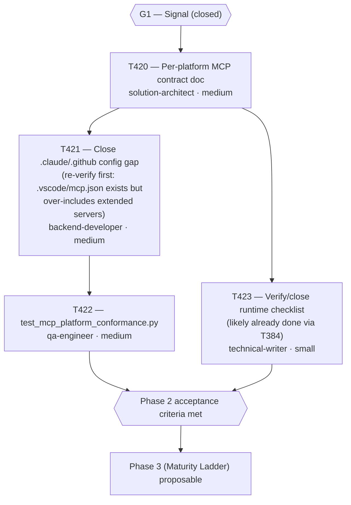

# Plan: Sequencing Phase 2 (MCP Conformance) and Phase 5 (Persistent Memory/RAG)

> Based on: `docs/plans/plan-035-roadmap-v7-ground-up.md` §2.3 (phase graph), §2.4 (Phase 2 and
> Phase 5 specifications), §2.6 (risks), §2.8 (token budget); `docs/checkpoints/checkpoint-021-
> phase1-complete-gate-g1-closed.md` (Gate G1 closure, "Next steps" section).
>
> This is not a new roadmap. Phase 2's and Phase 5's task tables, owners, and acceptance criteria
> already exist in plan-035 §2.4 and are not being rewritten here. This document exists to answer
> a question plan-035 deliberately left open: now that both phases are independently startable,
> which goes first, and what does kicking off the first one actually look like in execution terms.

## Goal

Gate G1 (Phase 1, "Trustworthy Signal") closed 2026-09-08 per checkpoint-021. Per plan-035's phase
graph, this unlocks two independently-gated phases that have not been started: Phase 2 (MCP
Conformance, T420-T423, gates Phase 3 jointly with G1) and Phase 5 (Persistent Memory/RAG,
T450-T456, gates only G3 → Phase 6). Neither has a task brief, an active-tasks row, or any
completed work. This plan re-confirms that state, assesses both phases on cost/value/risk,
recommends a sequencing decision, and produces an execution-ready breakdown for the recommended
first phase — without dispatching any implementation. Dispatch remains a separate, later decision
per this repo's Plan-Approve-Execute protocol.

## Re-confirmed state (2026-09-08, this session)

Verified directly against `origin/develop` (not assumed from prior session summary):

- `docs/tasks/active-tasks.md` on `origin/develop`: 0 active rows (confirmed by direct read).
- `docs/tasks/completed-tasks.md` on `origin/develop`: no `T42x` or `T45x` rows (grepped directly).
- `docs/checkpoints/`: newest is `checkpoint-021-phase1-complete-gate-g1-closed.md`
  (`origin/develop`), which itself already states Phase 2 and Phase 5 are unstarted and
  independently unlocked — this plan's starting premise matches that record exactly, not just the
  prior session's own summary of it.
- `plan-035-roadmap-v7-ground-up.md` differs between `origin/develop` and the currently-checked-out
  `feature/T475-codex-platform-integration` branch by 77 lines — but the diff is entirely a
  post-T407 "successor block" documenting the Inconclusive/ADR-004 outcome, appended *after* the
  Phase 2/Phase 5 sections (§2.4, lines 471-546 in the develop copy). It does not touch Phase 2 or
  Phase 5 content. This plan is authored against the `origin/develop` copy (canonical) via an
  isolated worktree, not the feature branch.
- Live re-verification of Phase 2's own flagged pre-condition (plan-035 §2.4 Phase 2's
  "Formalization correction," which says T421/T423 "should be re-scoped at Phase 2 kickoff" and
  "may already be substantially or fully complete"): checked directly, see "Phase 2 kickoff
  finding" below — partially true, but not the whole story.

## Phase 2 vs Phase 5 — assessment

### Phase 2 — MCP Conformance (T420-T423)

- **Delivers:** a per-platform MCP contract doc (T420), closes the `.claude`/`.github`
  config-gap audit (T421), a conformance test asserting every `core`-tagged server appears
  correctly in all 7 platform projections (T422), and a documented manual runtime-verification
  checklist (T423).
- **Budget:** 100k tokens (plan-035 §2.8). Smallest of the two.
- **Real external cost:** none. All four tasks are config/test/doc work — no paid model trials,
  no external API calls with a per-run cost. No T407-style real-money confirmation gate applies to
  any task in this phase.
- **Time:** plan-035 doesn't give Phase 2 its own week estimate (it was scoped to run "parallel
  with Phase 1"); given 1 medium + 1 medium + 1 medium + 1 small task with no cross-task blocking
  chain deeper than two levels, this is realistically a short phase — on the order of the shortest
  phases already executed (T417 alone, or T400-401, took under a week each).
- **What it unblocks:** Phase 3 (Maturity Ladder), which plan-035 itself calls "the highest-value
  phase in the plan and the one both source documents miss entirely." Phase 3 needs **both** G1
  (closed) and G2 (closes on Phase 3's own Wave 1, T433 — so Phase 2 doesn't need to fully finish
  Phase 3's gate itself, but Phase 3 cannot be *proposed* as a next phase at all until Phase 2 is
  at least underway and re-scoped).
- **Risk:** low. The task table is mechanical (docs, a test, config diffing). The one real risk
  plan-035 already names is scope duplication — doing full T420-T423 work when plan-033/034 already
  closed part of it — and plan-035 already prescribes the mitigation (re-scope at kickoff).

**Phase 2 kickoff finding (done now, at no dispatch cost, as part of this assessment).** Plan-035's
"may already be substantially or fully complete" caveat for T421/T423 is partially right and
partially wrong, checked directly against the repo rather than assumed:

- T423 (manual runtime-verification checklist) does appear genuinely done — `docs/wiki/mcp-
  servers.md` already has this section, added by T384 (plan-033, `done` 2026-08-10, see
  `completed-tasks.md` T384 row). T423 at Phase 2 kickoff is very likely a **verify-and-close**
  task, not new-write work.
- T421 (close the `.claude`/`.github` config gap) is **not** simply done, and the actual state is
  more interesting than "gap closed": `.vscode/mcp.json` (the projection target for the `github`
  platform per this repo's own MCP-config table) now exists and is *not* empty — but it contains
  `brave` and `context7`, which are tagged `extended` in this project's server-tag scheme, and
  AGENTS.md's own tag table states extended servers are emitted "to platforms whose manifest opts
  in (all except `github`)." That is a live, currently-undetected conformance mismatch — exactly
  the class of bug T422's automated conformance test (`test_mcp_platform_conformance.py`, which
  does not exist yet — confirmed by directory listing) exists to catch mechanically instead of by
  manual audit. This is not a solved gap; it's real, if narrow, unfinished scope, and a concrete
  reason T422 has genuine value beyond ceremony. **No fix was made — this is a finding for T420/
  T421's assignee to re-verify and act on at kickoff, not a change made under this planning task.**

### Phase 5 — Persistent Memory/RAG (T450-T456)

- **Delivers:** an ADR for the memory-layer design (T450, explicitly gated on human approval before
  advancing), three enforced write-time scopes (T451), an indexing pipeline (T452), hybrid
  retrieval (T453), a read-only `@context-retriever` agent (T454), an independent retrieval eval
  (T455), and a downstream re-run of the Phase 1 golden-suite baseline with retrieval enabled,
  gating ship on measured improvement (T456).
- **Budget:** 300k tokens (plan-035 §2.8) — 3x Phase 2's.
- **Real external cost: genuinely unresolved, and this is the important asymmetry with Phase 2.**
  T452 (indexing) and T453 (hybrid retrieval) plausibly require an embeddings model. Plan-035 does
  not commit to a specific embeddings provider — that decision is explicitly deferred to T450's ADR
  ("records the SoloMD-vs-alternatives decision"). If T450 recommends a hosted/paid embeddings API,
  the resulting T452 dispatch would need the same explicit real-cost confirmation gate this project
  already required for T407's Terminal-Bench trials (per `AGENTS.md`'s Blocker Protocol / this
  session's own instruction to flag anything with a "T407-style real-money profile"). If T450
  instead recommends a local/open-source embedding model, no such gate applies. **This is not
  knowable before T450 runs** — flagging it now so the eventual T450→T452 handoff doesn't skip the
  confirmation step by default.
- **Time:** ~4 weeks (plan-035's own phase header estimate) — meaningfully longer than Phase 2,
  consistent with T452/T453 being scoped `large`.
- **What it unblocks:** only G3 → Phase 6 (Closed Loop, v7.0.0). Phase 6 is also gated on Phase 3
  and G4, both several phases out regardless of Phase 5's own timing. Nothing on the *near-term*
  critical path depends on Phase 5 finishing soon.
- **Risk:** higher than Phase 2, structurally: two `large`-scope backend tasks (T452, T453) with
  real design uncertainty (chunking/embedding/ranking strategy is not yet chosen), plus a hard
  ship-gate (T456: "if the golden suite does not improve, the feature does not ship") that means
  real engineering effort here is not guaranteed to convert into a shippable feature. That's good
  discipline (mirrors Phase 1's own guardrail-not-vanity-metric philosophy), but it does mean
  Phase 5's cost is more front-loaded relative to its payoff certainty than Phase 2's.

## Recommendation: sequence, Phase 2 first — not parallel

**Start Phase 2 now. Start Phase 5 after Phase 2 closes**, not concurrently, for four reasons:

1. **Asymmetric cost/value/certainty.** Phase 2 is 3x cheaper in token budget, has zero external
   cost, is mechanical, and unblocks the plan's own highest-value phase (Phase 3). Phase 5 is
   larger, has a real unresolved cost question that needs its own human-approval gate (T450), and
   only unblocks a phase (Phase 6) that is many steps out regardless. There is no scenario where
   delaying Phase 5 by roughly Phase 2's short duration costs anything material against Phase 5's
   own 4-week span.
2. **This repo has real, not hypothetical, concurrency-contention precedent.** Two distinct
   failure modes are already documented in this exact project, not generic caution:
   - **Ledger merge conflicts.** The still-unmerged `feature/T475-codex-platform-integration`
     branch edits `active-tasks.md`/`completed-tasks.md` independently of Phase 1's edits, and the
     handoff record for that branch explicitly predicts "a real ledger merge conflict whenever it's
     eventually reconciled with `develop`." Two more active phases writing to the same ledger
     concurrently is the same failure mode again, self-inflicted this time rather than inherited.
   - **Host/Docker resource contention.** T417 and T407 both hit repeated "Docker daemon
     unreachable" incidents from shared-host contention, serious enough that the team provisioned a
     dedicated second host (`10.10.160.12`) specifically to escape it. Phase 5's indexing/retrieval
     work is exactly the kind of resource-heavy task (large corpus parse/chunk/embed) that would
     compete for the same class of resources if run alongside any other active dispatch stream.
3. **Plan-035 already registered this exact judgment once, for a different pair of workstreams.**
   §2.9 "Resolved decisions" states, for Phase 1 vs. Track C (CWSO 1.0): "concurrency is safe at
   the *repository* level... It remains a single maintainer's attention split two ways, so if Phase
   1 and CWSO 1.0 start competing, Phase 1 wins." The same reasoning applies here: Phase 2 and
   Phase 5 are architecturally independent (no artifact overlap — Phase 2 touches platform
   projection config/tests, Phase 5 touches a new memory subsystem), but they'd still be one
   orchestrator's attention split two ways, and this repo's own instruction protocol (Plan-Approve-
   Execute, one task dispatched to an unblocked queue at a time per "Task Management") is built
   around sequential dispatch, not simultaneous multi-phase execution.
4. **Phase 2 doubles as a low-risk warm-up after a long, high-scrutiny Phase 1 closeout.** Phase 1
   closed after two independently-verified dispatch passes and real paid-trial spend (~$34-39,
   T407). A short, cheap, zero-external-cost phase is a reasonable next step before committing to
   Phase 5's larger scope and its own pending cost decision.

**If the user prefers speed over this margin of safety:** true parallel dispatch is not unsound —
both phases are independently gated, and no file-path overlap is expected between them. The
recommendation above is a risk/attention trade-off, not a hard architectural blocker. If chosen,
each phase would need its own worktree/branch, and *whichever phase reaches a ledger write first
should not block on the other* rather than trying to interleave a single active-tasks edit across
both phases in one commit — treat them as two fully independent dispatch streams if run together.

## Concrete plan for Phase 2 (recommended first phase)

This reuses plan-035 §2.4 Phase 2's existing task table verbatim (owners, scope, acceptance
criteria already defined there) and adds only the re-scoping finding above and an execution
sequence.

### Task graph



T420 goes first because T421's re-scoping and T422's conformance test both need the finalized
per-platform contract to check against — without T420, T422 cannot know what "correct" looks like
per platform, and T421 cannot say the `.vscode/mcp.json` extended-server mismatch found above is a
defect rather than intended behavior. T423 only depends on T420 (needs the contract to confirm the
checklist covers the right server set) and can run in parallel with T421/T422.

### Agent assignments (from plan-035, unchanged)

| Task | Agent | Scope | Note |
|------|-------|-------|------|
| T420 | solution-architect | medium | First — defines the contract T421/T422/T423 check against |
| T421 | backend-developer | medium | Re-verify `.vscode/mcp.json` extended-server gap (found above) before writing new code |
| T422 | qa-engineer | medium | Write `tests/functional/test_mcp_platform_conformance.py`; should catch the T421 finding by construction once T421 lands |
| T423 | technical-writer | small | Likely a verify-and-close against T384's existing checklist, not new-write |

### Artifact flow

```
T420 → docs/artifacts/mcp-platform-contract-v1.md (consumed by: T421, T422, T423)
T421 → corrected .vscode/mcp.json (or equivalent github-platform projection) + sync.mjs fix if the
        extended-server gap is confirmed a defect (consumed by: T422)
T422 → tests/functional/test_mcp_platform_conformance.py (consumed by: release gate, future syncs)
T423 → docs/wiki/mcp-servers.md verification note (confirms/closes, does not necessarily rewrite)
```

### Acceptance criteria (from plan-035 §2.4 Phase 2, unchanged)

- [ ] Adding a `core` server to the server-tag manifest and running sync makes it appear in all 7
      platforms
- [ ] Deleting it from one platform's projection makes T422 fail
- [ ] `test_mcp_secret_guard.py` still passes — no literal secrets in any projection

### Token/time budget

| Item | Budget |
|------|--------|
| Phase 2 total (plan-035 §2.8) | 100k tokens |
| Estimated wall-clock | well under a week — 3 medium + 1 small task, shallow dependency chain, no external-cost gate to wait on |
| Real external cost | none |

## Phase 5 — held for after Phase 2, not detailed to execution level yet

Per the recommendation above, Phase 5's task table (T450-T456, plan-035 §2.4) is not re-broken-down
to execution granularity in this document — that is deliberately deferred until Phase 2 closes, to
avoid producing a second execution-ready plan that then sits stale while Phase 2 runs. When Phase 2
closes, the next planning step should re-open plan-035 §2.4 Phase 5, confirm T450's ADR scope
explicitly requires resolving the embeddings-cost question before T452 is dispatched, and produce a
Phase-5-specific execution plan at this same granularity.

## Risks & mitigations (this plan, not restating plan-035 §2.6)

| Risk | Likelihood | Impact | Mitigation |
|------|-----------|--------|-----------|
| T421 finding (extended servers leaking into `github` platform) turns out to be intended behavior, not a defect | Low | Low | T420's contract doc is written first and explicitly adjudicates this before T421 "fixes" anything |
| Phase 2 re-scoping at kickoff (T421/T423) reveals more overlap with plan-033/034 than expected, shrinking real scope further | Medium | Low (reduces cost, doesn't block) | Already plan-035's own prescribed mitigation; this plan does not pre-judge the outcome |
| User prefers parallel Phase 2 + Phase 5 despite the recommendation | Medium | Medium | Documented as a supported alternative above with the worktree/ledger-isolation condition attached |
| T450's ADR (Phase 5, next planning cycle) recommends a paid embeddings API without the team registering it needs a real-cost confirmation gate | Medium | Medium | Flagged explicitly in this plan's Phase 5 assessment now, so the eventual T450→T452 handoff carries the warning forward |

## Approval

- [ ] User approves Phase 2 as the next phase to dispatch (task-brief authoring + `docs/tasks/
      active-tasks.md` rows for T420-T423)
- [ ] User approves or overrides the sequential (not parallel) recommendation
- [ ] Plan locked; revisions create `plan-037-phase2-phase5-sequencing-v2.md`
