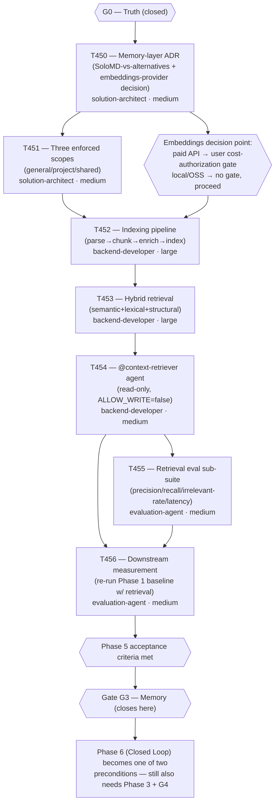

# Plan: Phase 5 (Persistent Memory/RAG) — Detailed Task Breakdown

> Based on: `docs/plans/plan-035-roadmap-v7-ground-up.md` §2.4 Phase 5 (T450-T456 task table,
> acceptance criteria, Gate G3), §2.3 (phase graph — Phase 5's only precondition is Gate G0,
> closed), §2.8 (300k token budget); `docs/plans/plan-037-phase2-phase5-sequencing.md` (approved
> Phase 2 → Phase 5 sequencing, and its own Phase 5 cost-question flag); `docs/checkpoints/
> checkpoint-022-phase2-complete.md` (Phase 2 closure — "Phase 5 is also now proposable," open
> embeddings-cost flag not yet resolved).
>
> This is the "next planning pass" that `plan-037` deliberately deferred: "When Phase 2 closes, the
> next planning step should re-open plan-035 §2.4 Phase 5, confirm T450's ADR scope explicitly
> requires resolving the embeddings-cost question before T452 is dispatched, and produce a
> Phase-5-specific execution plan at this same granularity." Phase 2 closed 2026-09-08
> (checkpoint-022). This document is that pass. It does not rewrite Phase 5's task identities,
> owners, or acceptance criteria — those already exist in `plan-035` §2.4 — it sequences them to
> execution-ready granularity and resolves the one thing `plan-035` explicitly deferred to this
> phase's own ADR: whether the embeddings question is safe to leave open at dispatch time.

## Goal

Produce an execution-ready task breakdown for Phase 5 (Persistent Memory/RAG, T450-T456, plan-035
§2.4) at the same granularity as `plan-037`'s Phase 2 breakdown: per-task objective/inputs/outputs/
acceptance-criteria summary, explicit dependencies, agent assignments, and token/time budget per
task and in aggregate — without dispatching implementation or authoring full `task-T45x.md` briefs,
which remain a separate, later Execute-phase decision. The one substantive open question this plan
must resolve or explicitly frame (not guess at) is whether Phase 5 carries a real-money profile
comparable to T407's, via a paid embeddings API — and if so, gate it exactly as T407 was gated:
explicit user authorization before the cost is incurred, not a default assumption either way.

## Re-confirmed state (2026-09-09, this session)

Verified directly against `origin/develop` via an isolated worktree
(`/home/emage/Code/emage/worktrees/docs-phase5-planning`, branch `docs/plan-038-phase5-detailed-
planning`), not assumed from the prior session's own summary or from this session's framing:

- `docs/tasks/active-tasks.md` on `origin/develop`: **0 active rows** (direct read, confirmed
  empty).
- `docs/tasks/completed-tasks.md` on `origin/develop`: **no `T45x` rows** (grepped directly, zero
  matches) and **no `T45x` task briefs on disk** (`ls docs/tasks/ | grep T45` — empty).
- `docs/checkpoints/`: newest is `checkpoint-022-phase2-complete.md` — confirmed by directory
  listing (no `checkpoint-023` or later exists). Checkpoint-022 explicitly states Phase 5 is
  "proposable" but "has [not] been planned to execution-ready detail or approved for dispatch," and
  restates the embeddings-cost flag as still open. This matches the task brief for this session
  exactly — nothing has changed underneath it since checkpoint-022 was written.
- `docs/decisions/`: `ADR-001`, `ADR-002`, and `ADR-004` exist on `develop`. **`ADR-003` does not
  exist on `develop`** — it lives on the still-unmerged `feature/T475-codex-platform-integration`
  branch (`ADR-003-codex-native-projection.md`, per that branch's `completed-tasks.md` T475 row).
  This means the next real ADR number on `develop` today is `ADR-005`, but whoever dispatches T450
  should re-check at dispatch time — if T475 has merged by then, `ADR-003` will exist on `develop`
  too and the true next number could differ from what's stated here. Flagging this now so T450's
  eventual brief doesn't hardcode a stale number.
- No `T45x` ID collision exists anywhere, including on `feature/T475-codex-platform-integration`
  (checked directly: that branch uses `T475`-`T482`, entirely outside the `T450`-`T456` range
  `plan-035` reserved for Phase 5).
- **Prior assessment re-verified, not restated from memory:** the 300k-token budget is `plan-035`
  §2.8's own stated figure (verified by direct read, not recalled). The "~4 weeks" estimate is
  `plan-035`'s own Phase 5 header ("v6.17.0, ~4 weeks," verified by direct read). "Two large-scope
  backend tasks with real design uncertainty" refers to T452 (indexing pipeline) and T453 (hybrid
  retrieval), both tagged `large` in `plan-035`'s own table (verified) — and both are exactly the
  tasks that would need an embedding model, so the design uncertainty and the cost uncertainty are
  the same two tasks, not independent risks. All of this holds up under direct re-check; nothing in
  this session's re-reading contradicts the prior assessment.

**Gate status confirmed directly, not assumed:** Phase 5's only precondition in `plan-035`'s phase
graph (§2.3) is `G0 --> P5` — Gate G0 (Truth), already closed at Phase 0. Phase 5 does **not** wait
on G1, G2, or Phase 3/4 completing. This was re-verified by reading the mermaid graph directly
(`plan-035` line ~248: `G0 --> P5["Phase 5 — Persistent Memory / RAG<br/>v6.17.0"]`), not inferred
from the phase ordering in the document's table of contents.

## The embeddings-API cost question — framed, not resolved here

**This is the one item in Phase 5 with a real-money profile comparable to T407's, and it is
genuinely open — not resolved by any existing ADR, and not something this planning pass should
resolve by guessing.** Confirmed directly:

- `grep -i "embed"` across `plan-035-roadmap-v7-ground-up.md` returns exactly two hits: the design
  summary ("tree-sitter → chunk → embed → hybrid retrieve") and T450's own row ("Records the
  SoloMD-vs-alternatives decision"). Neither commits to a specific embeddings provider, hosted or
  local. `plan-035` explicitly defers this to T450's ADR by design.
- `grep -i "embed\|vector\|RAG"` across `docs/decisions/*.md` (`ADR-001`, `ADR-002`, `ADR-004`) —
  zero relevant hits. No existing ADR touches the memory-layer/embeddings decision. This is a
  genuinely new decision, not one this session failed to find.
- `plan-037`'s own Phase 5 assessment reached the identical conclusion in the prior planning pass
  ("This is not knowable before T450 runs — flagging it now so the eventual T450→T452 handoff
  doesn't skip the confirmation step by default") — re-confirmed independently here rather than
  taken on trust from that document.
- **"SoloMD"** (the term T450's row uses for one side of the decision) does not resolve anywhere in
  this repository (`grep -r "SoloMD"` returns only the two planning-document mentions already
  cited) and returned no results on a general web search either. It is presumably a term from the
  external "source roadmaps" `plan-035` synthesizes from, not yet defined in this project. T450
  will need to either recover that source's original meaning or treat it as an open label and
  define the actual alternatives being compared from first principles. This is a real gap in the
  plan as inherited, not something to paper over — flagged for T450's assignee, not resolved here.

**Framing, not a decision:** T450 must produce, as part of its ADR, an explicit answer to "does the
chosen design require a paid embeddings API, or is a local/open-source embedding model viable?"
before T452 (indexing pipeline) or T453 (hybrid retrieval) can be dispatched. Two properties make
this need *more* caution than T407's gate, not the same amount:

1. **T407's cost was one-off and bounded** (a fixed number of benchmark trials, a hard budget cap,
   a single explicit authorization). **A paid embeddings API is a recurring operational cost** — it
   would be invoked at every indexing run (T452) *and* at every retrieval query thereafter (T453,
   T454, and every future use of `@context-retriever`), not just once during Phase 5's own
   execution. The user-facing decision is closer to "commit this system to an ongoing per-query
   cost" than to "authorize one bounded measurement."
2. Unlike T407 (where the only choice was *whether* to spend, at a known unit cost), T450's ADR
   introduces a second axis: *whether spending is required at all*. A local/open-source embedding
   model may satisfy T452/T453's design needs with no recurring cost. This is not yet known and
   should not be guessed at here.

**Gate for the Execute phase (not resolved by this Plan document):** when T450's ADR is complete
and recommends a hosted/paid embeddings provider, T452's task brief must not be authored or
dispatched until the user has explicitly authorized that recurring cost — mirroring T407's
"explicit authorization, this session, in response to the orchestrator's cost flag" pattern, stated
as a token budget line, an expected per-call/per-index unit cost, and an explicit ask, not a
default assumption either way. If T450 instead recommends a local/open-source model, no such gate
applies and T452 can proceed under Phase 5's normal token budget alone.

## Task breakdown (T450-T456)

Reuses `plan-035` §2.4 Phase 5's task identities, owners, and acceptance criteria verbatim; adds
sequencing, per-task inputs/outputs, and budget.

### Task graph



T450 goes first because every downstream task depends on a decision it makes: T451's scope
enforcement needs to know the storage substrate; T452/T453 cannot be designed, let alone dispatched
if the answer is "paid API," without T450's provider decision. T451 depends on T450 for the same
reason `plan-037`'s T420 gated T421-T423 — a later task cannot conform to a contract that does not
exist yet. T452 depends on both T450 (embeddings decision, chunking/enrichment design) and T451
(scope tagging must be built into the indexing pipeline from the start — `plan-035`'s own acceptance
criterion "scope is set at write time and cannot be inferred at read time" means retrofitting scope
onto an already-built indexer is exactly the failure mode being guarded against). T453 depends on
T452 because hybrid retrieval has nothing to retrieve against until an index exists. T454 wraps
T453 into an enforced-read-only agent interface — it needs working retrieval first. T455 and T456
both depend on T454 (an eval needs the actual agent surface to test), but are independent of each
other in what they measure (T455 = retrieval quality in isolation; T456 = downstream task-success
effect) and could in principle run in parallel if two agent sessions were available; under this
project's serial one-task-at-a-time dispatch convention (`plan-037`'s own point 3, still the
prevailing execution discipline in this repo), they are sequenced T455 → T456 here, with T455 first
since a broken retriever is cheaper to catch on its own eval than after a full golden-suite rerun.

### Per-task summary

**T450 — Memory-layer ADR**
- **Owner:** solution-architect · **Scope:** medium
- **Objective:** Produce `docs/decisions/ADR-00N-memory-layer-design.md` (status `proposed`,
  human approval required to advance — per `plan-035`'s own instruction, this ADR does not
  self-authorize downstream dispatch). Must resolve: (a) the SoloMD-vs-alternatives storage/format
  decision — recovering or redefining what "SoloMD" refers to, since it does not resolve anywhere
  in this repo (see "embeddings-API cost question" above); (b) the embeddings-provider decision —
  paid hosted API vs. local/open-source model, stated explicitly with the recurring-cost
  implication called out if paid; (c) the read-only-by-default architectural principle that governs
  T454.
- **Inputs:** `plan-035` §2.4 Phase 5 (design summary: "tree-sitter → chunk → embed → hybrid
  retrieve, <500ms on 100K LOC, `@context-retriever`"), this plan document's cost-framing section
  above, `docs/decisions/_template.md`.
- **Outputs:** `docs/decisions/ADR-00N-memory-layer-design.md` (status `proposed`).
- **Acceptance criteria (summary):** ADR explicitly states the embeddings-provider decision and its
  cost profile (one-off / recurring / none); explicitly names the SoloMD alternatives compared, not
  just the label; states the read-only-default principle T454 will enforce; status is `proposed`
  pending human approval, not silently treated as accepted.
- **Blocker protocol note:** if T450 cannot determine what "SoloMD" originally meant, that is a
  `type: unclear_requirements`, `severity: minor` finding to report, not a blocker on producing the
  ADR — the task can and should proceed by defining the actual alternatives compared from first
  principles and noting the recovered/redefined term explicitly in the ADR.

**T451 — Three enforced scopes (general/project/shared)**
- **Owner:** solution-architect · **Scope:** medium
- **Objective:** Define `general` (harness knowledge, curated), `project` (this repo only), and
  `shared` (cross-platform, explicit opt-in per entry) as enforced scopes, set at write time and
  unrecoverable/uninferable at read time.
- **Inputs:** T450's ADR (storage substrate + read-only principle).
- **Outputs:** Scope-enforcement design doc (artifact name TBD at dispatch — e.g.
  `docs/artifacts/memory-scope-model-v1.md`), consumed by T452.
- **Acceptance criteria (summary):** A `project`-scoped entry is provably unreachable from a
  different project's session (this is also `plan-035`'s own Phase 5 acceptance criterion, restated
  here as this task's specific deliverable); scope cannot be inferred or overridden at read time,
  only at write time.

**T452 — Indexing pipeline**
- **Owner:** backend-developer · **Scope:** large
- **Objective:** Parse → chunk → enrich (path, symbol, language, AST type, parents, imports, line
  range, commit) → index over the knowledge vault.
- **Inputs:** T450's ADR (embeddings provider — **do not dispatch this task's brief until the
  cost-authorization gate above is resolved, if the ADR recommends a paid provider**), T451's scope
  model.
- **Outputs:** Indexing pipeline implementation + index artifacts (paths TBD at dispatch,
  consistent with T450's storage decision).
- **Acceptance criteria (summary):** Enrichment fields present and correct per `plan-035`'s list;
  scope tagged at write time per T451; feeds T453.
- **Cost note:** if a paid embeddings API is in play, this is the first task that actually spends
  money — the per-document/per-token unit cost and an estimate of total vault size should be stated
  in this task's eventual brief before dispatch, mirroring T407's stated cost estimate before
  authorization.

**T453 — Hybrid retrieval**
- **Owner:** backend-developer · **Scope:** large
- **Objective:** Semantic + lexical + structural retrieval, ranked.
- **Inputs:** T452's index.
- **Outputs:** Retrieval implementation, queryable interface consumed by T454.
- **Acceptance criteria (summary):** `<500ms` p95 retrieval on a 100K LOC repo (Phase 5's own
  headline acceptance criterion); ranking combines all three signals, not semantic alone.
- **Cost note:** if the embeddings provider is paid, every query here incurs a per-call cost — this
  is the *recurring* half of the cost-authorization gate, distinct from T452's one-time indexing
  cost, and should be estimated separately in this task's eventual brief.

**T454 — `@context-retriever` agent**
- **Owner:** backend-developer · **Scope:** medium
- **Objective:** Wrap T453's retrieval into a read-only agent. `ALLOW_WRITE=false` asserted in
  three independent places: the agent definition, the server config, and the deployment manifest —
  per `plan-035`'s own explicit redundancy requirement (not one flag, three).
- **Inputs:** T453's retrieval interface.
- **Outputs:** `@context-retriever` agent definition + server/deployment config.
- **Acceptance criteria (summary):** No write path from any agent into the canonical knowledge base
  (Phase 5's own acceptance criterion); the three-place `ALLOW_WRITE=false` assertion is testable,
  not just declared.

**T455 — Retrieval eval sub-suite**
- **Owner:** evaluation-agent · **Scope:** medium
- **Objective:** Independent golden sub-suite measuring precision, recall, irrelevant-context rate,
  and latency — as its own signal, not folded into T456's downstream measurement.
- **Inputs:** T454's working agent.
- **Outputs:** Retrieval eval sub-suite (test/eval artifacts, scorecard format consistent with
  existing golden-suite conventions from Phase 1).
- **Acceptance criteria (summary):** Precision/recall measured and published *before* any claim of
  improved downstream capability (Phase 5's own acceptance criterion — this task exists specifically
  to produce that number ahead of T456).

**T456 — Downstream measurement (ship gate)**
- **Owner:** evaluation-agent · **Scope:** medium
- **Objective:** Re-run the Phase 1 golden-suite baseline with retrieval enabled. **If the golden
  suite does not improve, the feature does not ship** — `plan-035`'s own literal ship-gate language,
  reproduced verbatim here so it is not softened at dispatch time.
- **Inputs:** T454's agent, T455's eval sub-suite (sanity-check retrieval quality before spending on
  a full baseline re-run), the existing Phase 1 baseline (`docs/benchmarks/baseline-v6.12.0.md`,
  T414).
- **Outputs:** Updated baseline comparison report (name TBD at dispatch, e.g.
  `docs/benchmarks/baseline-v6.17.0-retrieval.md`).
- **Acceptance criteria (summary):** Golden suite improves measurably against the same baseline
  (Phase 5's own acceptance criterion); a null or negative result blocks ship, per the literal rule
  — this task's brief should pre-register what "improve" means numerically before the run, the same
  discipline T407's pre-registered decision rule used, to avoid post-hoc rationalization.

### Agent assignments

| Task | Agent | Scope | Depends on |
|------|-------|-------|-----------|
| T450 | solution-architect | medium | Phase 5 unblocked (G0 closed) |
| T451 | solution-architect | medium | T450 |
| T452 | backend-developer | large | T450 (+ cost-authorization gate if paid API), T451 |
| T453 | backend-developer | large | T452 |
| T454 | backend-developer | medium | T453 |
| T455 | evaluation-agent | medium | T454 |
| T456 | evaluation-agent | medium | T454, T455 |

### Artifact flow

```
T450 → docs/decisions/ADR-00N-memory-layer-design.md         (consumed by: T451, T452, T453, T454)
T451 → docs/artifacts/memory-scope-model-v1.md (name TBD)     (consumed by: T452)
T452 → indexing pipeline + index artifacts (paths TBD)        (consumed by: T453)
T453 → retrieval implementation/interface                     (consumed by: T454)
T454 → @context-retriever agent definition + config           (consumed by: T455, T456)
T455 → retrieval eval sub-suite + scorecard                   (consumed by: T456 as a pre-check)
T456 → baseline-v6.17.0-retrieval.md (name TBD)                (consumed by: release gate, Gate G3 closure record)
```

### Token/time budget

| Task | Token budget (estimate) | Notes |
|------|--------------------------|-------|
| T450 | 30k | Design + writing; no implementation |
| T451 | 30k | Design; depends on T450's substrate choice |
| T452 | 75k | `large` — indexing pipeline; real design uncertainty; possible real API cost on top of token budget if paid embeddings |
| T453 | 75k | `large` — retrieval ranking logic; real design uncertainty; possible per-query real API cost if paid embeddings |
| T454 | 30k | Wrapping + the three-place read-only assertion |
| T455 | 30k | Eval sub-suite authoring |
| T456 | 30k | Baseline re-run + comparison report |
| **Total** | **300k** | Matches `plan-035` §2.8's Phase 5 budget exactly; allocation here is this plan's own estimate, not a per-task commitment — same caveat `plan-037` applied to Phase 2's total |

| Item | Estimate |
|------|----------|
| Wall-clock | ~4 weeks (`plan-035`'s own Phase 5 header estimate, unchanged) — likely front-loaded toward T452/T453 given `large` scope and real design uncertainty; if T450 recommends a paid provider and the user's authorization takes time to arrive, that adds schedule risk not captured in the 4-week figure |
| Real external cost | **Unresolved — see decision point above.** Zero if T450 recommends a local/open-source embedding model. Non-zero and recurring (indexing + every retrieval query) if T450 recommends a paid API, in which case dispatch of T452 requires explicit user cost-authorization first, mirroring T407 |

## Risks and mitigations (this plan; not restating plan-035 §2.6 or plan-037's own risk table)

| Risk | Likelihood | Impact | Mitigation |
|------|-----------|--------|-----------|
| T450 recommends a paid embeddings API and T452 is dispatched without the cost-authorization gate being explicitly checked | Medium | High (recurring, not one-off, spend) | This plan states the gate explicitly as a precondition on T452's brief authorship, not just its dispatch; orchestrator must check for it before writing `task-T452.md` |
| "SoloMD" cannot be recovered and T450 stalls trying to reverse-engineer an external source document | Low | Low | T450's blocker protocol above explicitly permits proceeding by defining alternatives from first principles instead of blocking on term recovery |
| T452/T453's real design uncertainty (chunking/ranking strategy not yet chosen) causes scope growth beyond the `large` estimate | Medium | Medium | Token budget already reflects `large` scope (2.5x a `medium` task); if either task genuinely exceeds its 75k estimate mid-work, that is a checkpoint-worthy event per this repo's Token Governance rules, not silent overrun |
| T456's ship-gate is applied loosely ("close enough to improved") rather than the pre-registered numeric threshold | Medium | High | T456's summary above explicitly requires pre-registering what "improve" means before the run, mirroring T407's pre-committed decision-rule discipline |
| Phase 5 proceeds in parallel with a future Phase 3 dispatch and both write to `active-tasks.md` concurrently | Low (Phase 3 not yet proposed) | Medium | Same mitigation `plan-037` already prescribed for Phase 2 vs. Phase 5: if run concurrently with any other active phase, each needs its own worktree/branch and neither should block on interleaving a single ledger edit with the other |

## Open planning questions carried forward (not resolved by this document)

- **Gate G2's closure condition reads circularly against Phase 3's own start condition.**
  `plan-035` §2.4 states "Gate G2 closes when Wave 1 (T433) is complete for the routing target
  classes" — but T433 is itself a Phase 3 task, gated behind Phase 3's own T430-T432. This means G2
  is closed *by* completing part of the phase it's nominally supposed to gate, which is not how G0,
  G1, G3, or G4 are structured elsewhere in the same document (each of those gates something outside
  its own phase). This does not affect Phase 5 — Phase 5's only precondition is G0 — and is flagged
  here plainly, as instructed, for whoever next plans Phase 3, not resolved as part of this task.
- **T450's ADR numbering** (`ADR-005` vs. a lower number) depends on whether
  `feature/T475-codex-platform-integration` has merged by T450's dispatch time — flagged above, not
  resolved here since that branch is explicitly out of scope for this planning pass.

## No prep work performed under this plan

No scaffolding, directory structure, or code was written as part of this planning pass. Even a
minimal scaffold (e.g. a placeholder module layout for the indexing pipeline) would risk
presupposing T450's ADR outcome — storage substrate, scope-enforcement mechanism, and embeddings
provider are all still open, and `plan-035`'s own design principle for this phase ("what they omit
is scoping, which is the part that determines whether this helps or poisons") argues for the same
"no code before the design decision" discipline this repo already applies elsewhere (e.g. PoC
Guidelines' "no code before hypothesis"). This is a judgment call, consistent with the constraint
that substantive design/backend work — and specifically anything touching the embeddings-cost
question — waits for approval.

## Approval

- [ ] User approves Phase 5 (T450-T456) as the next phase to plan in detail — confirmed by this
      document; next step on approval is task-brief authorship for T450 only (subsequent tasks'
      briefs wait on T450's actual ADR content, per the dependency graph above)
- [ ] User acknowledges the embeddings-API cost question is explicitly unresolved and will require
      a separate, explicit authorization decision (T407-style) after T450's ADR lands, before T452
      is dispatched — if T450 recommends a paid provider
- [ ] User approves or overrides the task sequencing (T450 → T451 → T452 → T453 → T454 → T455 →
      T456) proposed above
- [ ] Plan locked; revisions create `plan-038-phase5-detailed-planning-v2.md`
