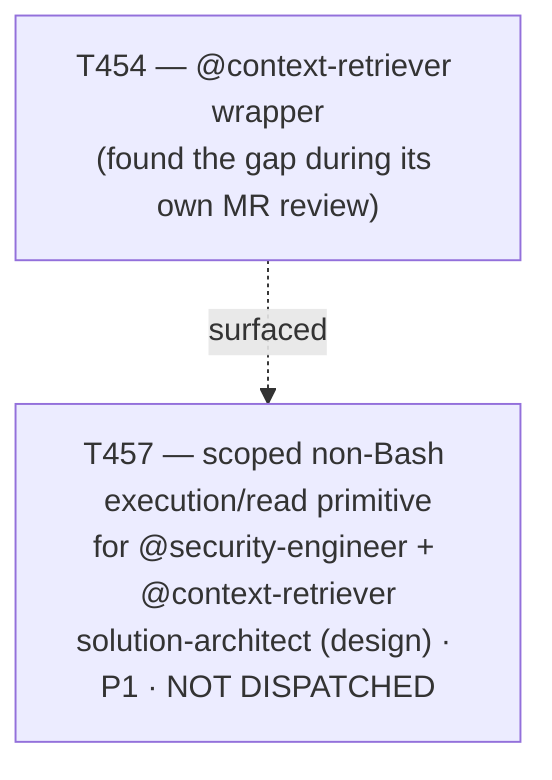

# Plan 039 — T457 backlog record: scoped, non-`Bash` execution/read primitive for read-only agents

> Filename: `plan-039-t457-tool-scoping-followup.md`

**Status:** proposed — presented for review in this session's report; recorded as backlog, **not**
approved for dispatch. This plan exists only to satisfy this repo's own "no task without a backing
plan" precondition (`implementation/knowledge/commands/plan.md`'s "Task Creation Precondition") for
the single task it creates (T457), and to make that task's existence and rationale traceable — it is
deliberately minimal, not a full Phase-level roadmap document.

**Based on:** `docs/artifacts/context-retriever-v1.md` §2/§2.1 (the finding); `docs/tasks/task-
T454.md`'s completion addendum and `docs/decisions/ADR-005-memory-layer-design.md`'s Validation
addendum (both dated 2026-09-09, same finding, different document layers); `docs/tasks/task-T457.md`
(the brief this plan backs).

## Goal

Record, with a genuine backing plan document (not a bare ledger row), the decision to defer fixing a
real but accepted tool-scoping gap: both `@security-engineer` and `@context-retriever`'s declared
"read-only" posture rests on agent-definition prose, not on a technically scoped tool grant — their
`execute` tool maps to unrestricted `Bash` on at least the Claude Code platform. The user's explicit
disposition, made during T454's MR review this session, was to accept this for now (it matches
`security-engineer.md`'s own pre-existing, previously-un-flagged precedent — not a new or lowered
bar), correct the documentation that had overclaimed stronger enforcement, and open a single
follow-up task (T457) to track the real fix — without dispatching it, since the fix's likely shape
(a dedicated MCP server or equivalent scoped-tool mechanism) would need to touch `.mcp.json`, which
this session may not touch.

## Task graph

T457 has no structural dependency on T454, T455, or T456 — it is a hardening follow-up on an
already-accepted, documented trust-model gap, not on the retrieval-quality work Phase 5's remaining
tasks (T455, T456) perform. See `docs/tasks/task-T457.md`'s own "Does this block T455/T456?" section
for the confirmation, checked against `plan-038`'s actual acceptance criteria for both.

## Agent assignment

| Task | Agent | Scope |
|------|-------|-------|
| T457 | solution-architect (design pass first; implementation owner(s) TBD once the design and the `.mcp.json` question are resolved) | Evaluate a genuinely scoped, non-`Bash` execution/read primitive for two already-shipped read-only agents; recommend one mechanism with the same rigor this repo's ADRs already apply |

## Artifact flow

`docs/tasks/task-T457.md` (this session, backlog) → (on future dispatch) →
`docs/artifacts/scoped-execution-primitive-v1.md` (solution-architect's design) → updated `tools:`
grants in `security-engineer.md`/`context-retriever.md` + regenerated platform projections
(backend-developer/devops-engineer, once assigned) → live adversarial test proving the new primitive
actually blocks a write (mirroring T454's own live-test discipline).

## Risks and mitigations

| Risk | Likelihood | Impact | Mitigation |
|------|-----------|--------|-----------|
| T457 sits in backlog indefinitely because its real fix requires an `.mcp.json` change no session is authorized to make | Medium | Low (the gap is already accepted/documented, not hidden) | Recorded explicitly in `task-T457.md`'s Blocker Protocol as a legitimate, reportable outcome, not a failure to route around |
| A future dispatch of T457 assumes the `.mcp.json` constraint has lifted without re-confirming | Low | Medium | `task-T457.md`'s Constraints section explicitly requires re-confirming the constraint at dispatch time, not inheriting this session's state silently |
| T457's fix, once designed, is applied to only one of the two agents rather than both | Low | Medium | `task-T457.md`'s Constraints explicitly forbid narrowing scope to one agent |

## Token budget

Not applicable — this plan authorizes no dispatch. A token budget will be set in `task-T457.md`'s own
brief refinement at actual dispatch time, per this repo's normal Planning-phase budget (≤80k) once a
concrete design scope is known.

## Approval

- [ ] User acknowledges T457 as a properly-recorded backlog item (not approved for dispatch this
      session)
- [ ] User confirms the priority (P1, as assigned) and owner (solution-architect for the design pass)
      are reasonable, or overrides them
- [ ] Plan locked; revisions create `plan-039-t457-tool-scoping-followup-v2.md`
