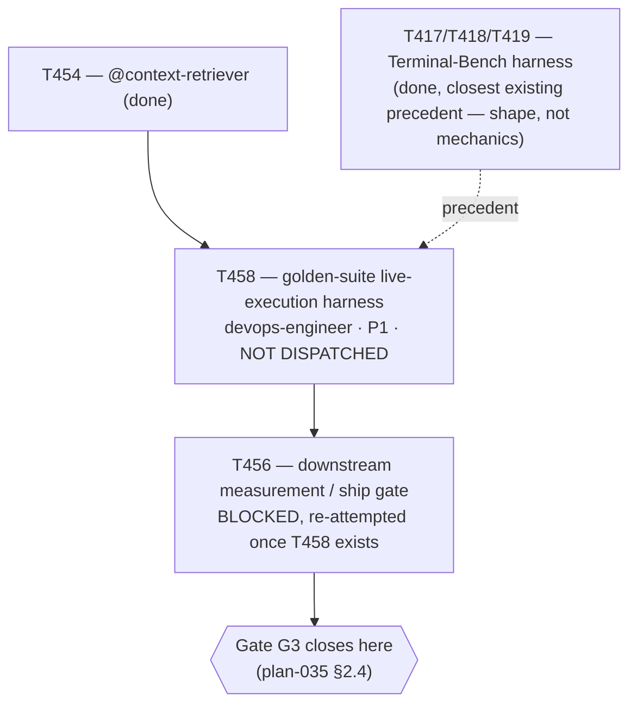

# Plan 040 — T458: live-execution harness for the golden suite (resolves T456's blocker)

> Filename: `plan-040-t458-golden-live-harness-followup.md`

**Status:** proposed — presented for review in this session's report. T458 is recorded and
scoped, **not dispatched this session**. This plan exists to satisfy this repo's own "no task
without a backing plan" precondition (`implementation/knowledge/commands/plan.md`'s "Task Creation
Precondition") for T458, and to make its scope and rationale traceable.

**Based on:** `docs/tasks/task-T456.md` (the blocker this task resolves — golden suite has no
live-agent execution path by deliberate Phase 1 design); `docs/tasks/task-T458.md` (the brief this
plan backs); `docs/plans/plan-035-roadmap-v7-ground-up.md` §2.4 Phase 5 (T456's literal ship-gate
rule, which T458 exists to make genuinely measurable); `docs/artifacts/golden-suite-format-v1.md`
(the case format T458 reuses unmodified).

## Goal

Record, with a genuine backing plan document, the decision to open a dedicated infrastructure task
(T458) rather than build a live-execution harness under T456's own mismatched "medium, 30k-token"
scope, or silently fabricate a comparison against a suite that structurally cannot produce one.
T456 found — reading `golden-suite-format-v1.md` and `scripts/scorecard.py` directly — that the
golden suite's `expect.py` contract is a deliberately pure, deterministic function of on-disk
fixture bytes with no live-agent invocation anywhere in its automated path, so no "retrieval
enabled/disabled" configuration can change its output on the existing 20 cases. Genuinely
measuring Phase 5's ship-gate question requires new infrastructure — a two-arm (control/treatment)
live-execution harness comparable in shape to what Terminal-Bench's own Layer 2 harness (T417-
T419) needed. The user approved (2026-09-09) declaring T456 honestly `blocked` on this gap rather
than fabricating a pass, and opening this task to build the real harness.

## Task graph

## Agent assignment

| Task | Agent | Scope |
|------|-------|-------|
| T458 | devops-engineer (matches this repo's own precedent for harness-building work — T417/T418/T419/T407/T408/T409 were all built by `devops-engineer`, not `evaluation-agent`; confirm tool grant before dispatch per this repo's now-repeated tool-grant-check discipline) | Real infrastructure — a two-arm live-execution harness, comparable in shape to Terminal-Bench's own Layer 2 harness, not a quick task |

## Artifact flow

`docs/tasks/task-T458.md` (this session, recorded/scoped) → (on future dispatch) → harness code
(`scripts/` or a new `implementation/runtime/` module, exact location at implementer's disclosed
choice) + `docs/artifacts/golden-live-harness-v1.md` (design/methodology, pre-registered
"measurably improve" threshold) → consumed by T456's own re-dispatch, which performs (or completes)
the actual two-arm comparison run and produces the real ship/no-ship verdict.

## Risks and mitigations

| Risk | Likelihood | Impact | Mitigation |
|------|-----------|--------|-----------|
| T458's true scope, once investigated in detail, exceeds what one task can absorb (mirrors T407's own "Design A" re-scoping mid-task) | Medium | Medium | `task-T458.md`'s own Blocker Protocol explicitly anticipates this as an expected, reportable outcome, not a failure |
| A live-run comparison proves noisy/non-deterministic in a way a single run can't resolve | Medium | Medium | `task-T458.md`'s Blocker Protocol requires a disclosed, designed response (e.g. multiple trials per arm, mirroring T407's own `k`-run design), not a silently-reported single noisy result |
| Genuinely needing to modify `expect.py`/a protected path to point it at a live-run's candidate output | Low-Medium | High (protected-path exception) | `task-T458.md`'s Constraints require an explicit, disclosed exception request before any such edit, per `protected-paths-v1.md`'s own documented exception process — never a silent workaround |
| T458 sits unscoped/undispatched indefinitely, leaving Phase 5's ship gate open with no forward motion | Low | Low (the memory layer itself is already usable; only the formal ship label is affected) | Recorded explicitly and visibly in the active task ledger as `pending`, not silently dropped — a future session can dispatch it without re-deriving this reasoning |

## Token budget

Not set here — `task-T458.md`'s own Objective section explicitly disclaims a "medium" estimate and
anticipates possible multi-task re-sequencing once scoped in detail (mirroring T407's own
experience). A concrete budget should be set at actual dispatch time once the implementer has done
enough initial investigation to estimate honestly, not pre-committed here to a number likely to be
wrong.

## Approval

- [ ] User acknowledges T458 as scoped and recorded, ready for future dispatch (not dispatched this
      session)
- [ ] User confirms the priority (P1) and owner (devops-engineer) are reasonable, or overrides them
- [ ] Plan locked; revisions create `plan-040-t458-golden-live-harness-followup-v2.md`
