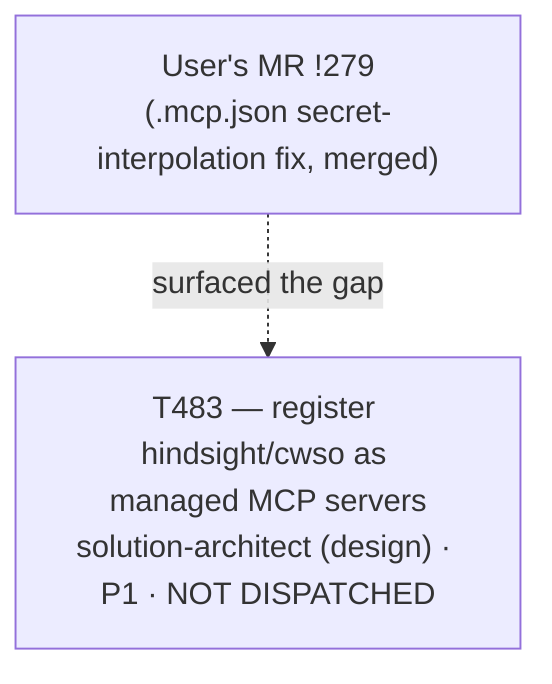

# Plan 042 — T483 backlog record: register `hindsight`/`cwso` as managed MCP servers

> Filename: `plan-042-t483-mcp-hindsight-cwso-followup.md`

**Status:** proposed — recorded as backlog, **not** approved for dispatch. This plan exists only to
satisfy this repo's own "no task without a backing plan" precondition
(`implementation/knowledge/commands/plan.md`'s "Task Creation Precondition") for the single task it
creates (T483), and to make that task's existence and rationale traceable — deliberately minimal,
not a full Phase-level roadmap document, matching `plan-039`'s (T457) and `plan-040`'s (T458)
precedent for this exact situation.

**Based on:** the user's own MR !279 fix (`hindsight`/`cwso` now use `${env:...}` interpolation in
root `.mcp.json`, matching every other credentialed server); `implementation/knowledge/mcp/
servers.yaml` (confirmed, read in full, genuinely has no entries for either server); `implementation/
scripts/sync.mjs`'s `emitMcp()` (confirmed, read in full, has no `headers` support in any of its 6
format branches and no env-templating pass for remote `url` values); `tests/functional/
test_mcp_secret_guard.py` (confirmed its `find_literal_env_values()` only walks `env` blocks, not
`headers`); `docs/artifacts/mcp-platform-contract-v1.md` (T420, the authoritative contract this
task's eventual change must keep in sync); `docs/tasks/task-T483.md` (the brief this plan backs).

## Goal

Record, with a genuine backing plan document (not a bare ledger row), the decision to defer bringing
two already-shipped, hand-added MCP servers (`hindsight`, `cwso`) into this repo's declarative
MCP-server-management pipeline. This was assessed for immediate execution in the same session it was
raised — direct inspection of `sync.mjs`'s `emitMcp()` found real, non-mechanical gaps (no `headers`
support for remote-transport servers in any format branch; no env-templating for remote `url`
values; the secret-guard test blind to `headers`), closer in scope to Phase 2 (T420-T423) as a whole
than to a single mechanical registry-row addition. Recorded as T483 rather than dispatched, so a
design owner can make the header/URL-templating schema decision deliberately.

## Task graph

T483 has no structural dependency on any other open task — it is a pipeline-completeness follow-up
on an already-working (for Claude Code only) manual fix, not blocking work.

## Agent assignment

| Task | Agent | Scope |
|------|-------|-------|
| T483 | solution-architect (design pass first; implementation owner(s) TBD once the header/URL-templating schema design lands — most likely `backend-developer` for `sync.mjs`/`emitMcp()` changes, matching T421's precedent, plus the QA-focused test-authoring role for the secret-guard/conformance test extensions, matching T422) | Design a `servers.yaml`/`sync.mjs` schema extension supporting env-templated remote `url` and per-format `headers`, then register `hindsight` (recommended `core`) and `cwso` (recommended `extended`) and regenerate all platform projections |

## Artifact flow

`docs/tasks/task-T483.md` (this session, backlog) → (on future dispatch) → a design note or ADR
(solution-architect's header/URL-templating schema decision) → `implementation/knowledge/mcp/
servers.yaml` + `implementation/scripts/sync.mjs` changes (implementation owner, once assigned) →
regenerated platform projections + extended `tests/functional/test_mcp_secret_guard.py` coverage for
`headers` blocks + updated `docs/artifacts/mcp-platform-contract-v1.md`.

## Risks and mitigations

| Risk | Likelihood | Impact | Mitigation |
|------|-----------|--------|-----------|
| Header/URL-templating schema design is deferred indefinitely because it isn't blocking anything today (Claude Code already has a working manual fix) | Medium | Low (the gap is disclosed, not hidden; only Claude Code needed the servers so far) | Recorded explicitly in `task-T483.md` with concrete acceptance criteria, not left as a vague backlog note |
| `cwso`'s live auth (last known `AUTH_HEADER_REJECTED`, 403 per a prior session handoff) is still broken independent of config-shape work | Medium | Low for this task (registration and live auth are separate failure modes) | `task-T483.md` explicitly instructs the implementation owner to re-check live status rather than assume the syntax fix also fixed auth |
| A future implementer copies `cwso`'s `headers` shape onto a platform whose real MCP client doesn't honor custom headers, silently breaking that platform's connection | Low | Medium | `task-T483.md` discloses the evidentiary gap (only 2 of 7 platforms have a citable official schema) and requires the design owner to state, per platform, whether `headers` is verified-supported or a disclosed unknown |
