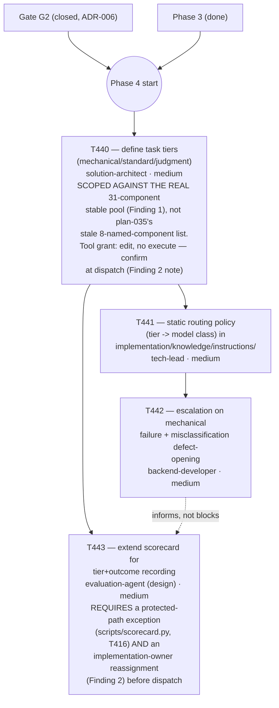

# Plan 043 — Phase 4 (Task-Tier Routing) detailed planning pass

> Filename: `plan-043-phase4-task-tier-routing-detailed-planning.md`

**Status:** proposed — presented for review in this session's report, **not approved for
task-brief authoring or execution**. Mirrors the precedent set by `plan-037-phase2-phase5-
sequencing.md` (Phase 2), `plan-038-phase5-detailed-planning.md` (Phase 5), and `plan-041-phase3-
maturity-ladder-detailed-planning.md` (Phase 3): each phase sat at `plan-035`'s own `"Status:
proposed — not approved for task-brief authoring or execution"` header until a dedicated planning
pass was written and approved, *before* any individual task brief (`task-T44x.md`) was authored.
This document is that pass for Phase 4.

**Based on:** `docs/plans/plan-035-roadmap-v7-ground-up.md` §2.2 (Gate table), §2.3 (phase graph),
§2.4 Phase 4 task table (T440-T443, unchanged here); `docs/checkpoints/checkpoint-032-phase3-
complete.md` "Next steps" (explicitly names Phase 4 as "available to start on request, not started
proactively"); `docs/decisions/ADR-006-gate-g2-routing-target-classes-interpretation.md` (adopted
reading (c): G2 closes on the infrastructure-precondition, and explicitly defers routing-candidate
identification to *this* planning pass — "a required first step of Phase 4's future planning pass,
not a task in its own right"); `docs/artifacts/phase3-wave1-promotion-v1.md` and the `T433` row in
`docs/tasks/completed-tasks.md` (the real, as-delivered Wave 1 outcome — read directly, not assumed
from `plan-035`'s original naming); `docs/artifacts/phase3-maturity-demotion-decision-v1.md`
Category 3 (the 4-agent T456/T457 blocker record); `implementation/registry/summary.md` and a fresh
`implementation/scripts/check-maturity.py --root implementation --verbose` run (this session, live);
`docs/artifacts/protected-paths-v1.md` (T416's freeze of `tests/golden/**` and `scripts/
scorecard.py`, directly relevant to T443's literal scope); `implementation/knowledge/agents/
{solution-architect,tech-lead,backend-developer,evaluation-agent}.md` (real tool grants, read
directly this session).

## Goal

Produce the same kind of dispatch-ready decomposition for Phase 4 (T440-T443, "Task-Tier
Routing") that `plan-037`/`plan-038`/`plan-041` produced for Phase 2/5/3: a re-confirmed
start-condition check, the routing-candidate identification ADR-006 explicitly deferred here, a
concrete per-task sequencing/agent-assignment table with tool-grant and protected-path checks done
*before* dispatch (not discovered mid-task, per this project's own repeated lesson), an artifact
flow, and risks. This plan does not itself author any `task-T44x.md` brief and does not dispatch
any agent — per this project's Plan-Approve-Execute protocol, that is the next, separate step
after user approval.

## Re-confirmed state (2026-09-11, this session)

- `origin/develop` HEAD is `e60a334` (fetched fresh this session, in a dedicated worktree —
  the primary checkout remains untouched on `feature/T475-codex-platform-integration` per standing
  instruction). `python3 docs/tasks/validate-tasks.py` → `PASS (4 active, 274 completed)`;
  `python3 tests/run.py` → `Ran 514 tests ... OK (skipped=24)`; `python3 implementation/scripts/
  check-maturity.py --root implementation --verbose` → `77 components checked, 0 failing`. All
  three match the two prior handoffs' expected baselines exactly — no drift since either handoff
  was written.
- Grepped `active-tasks.md`/`completed-tasks.md` for `T44[0-3]`: zero rows for any of T440-T443.
  **Phase 4 has not been silently started.** One incidental prose reference to `T440` exists inside
  `ADR-006`'s own text (cited above), not a task row.
- **Phase 4's start condition is met.** Per `plan-035` §2.3's phase graph (`P3 --> G2 --> P4`) and
  §2.4 ("Gate G2 closes when Wave 1 (T433) is complete"), Gate G2 closed per `ADR-006`
  (user-approved reading (c), 2026-09-10) on T433's real completion (`completed-tasks.md` T433
  row, confirmed archived). Phase 3 (T430-T437) is fully done (`checkpoint-032`). No further
  precondition is outstanding.
- **A real discrepancy was found and corrected against a prior handoff's claim, independent of
  this plan's own subject matter**: `docs/checkpoints/handoff-8ed4088b-3207-4e61-b6f5-6e66e2691167.md`
  states T483 (MCP server registration) "was created and dispatched... MR !280 merged after fixing
  two rounds of CI failures (a missing plan-coverage doc, and a 5th occurrence of the
  self-referential ledger-defect regression)." Direct inspection this session (`git show --stat`
  on the actual merge commit `08fbc7f`) found MR !280 touched exactly three files — `docs/plans/
  plan-042-t483-mcp-hindsight-cwso-followup.md`, `docs/tasks/active-tasks.md` (one row added), and
  `docs/tasks/task-T483.md` — all docs, zero lines in `implementation/knowledge/mcp/servers.yaml`
  or `implementation/scripts/sync.mjs`. `servers.yaml` itself, read directly, has 15 entries (7
  `core` + 8 `extended`) and no `hindsight`/`cwso` rows. `task-T483.md`'s own text confirms this
  ("recorded, not dispatched"); `plan-042`'s own status line reads "not approved for dispatch."
  **T483 is genuinely open, undispatched design-and-build work, not completed work as one prior
  handoff described it.** This is reported here as a disclosed correction, not silently folded in
  — it is unrelated to Phase 4's own subject matter and is not re-litigated further by this plan.

## Finding 1 — the real routing-candidate pool is smaller, and different in composition, than `plan-035`'s original naming, and ADR-006 assigns this plan the job of stating it

`ADR-006`'s Decision explicitly defers "routing-class identification... entirely to Phase 4's own
planning pass once its tier schema (T440) exists," and its Consequences/Follow-ups section states
this is "a required first step of Phase 4's future planning pass... not a task in its own right."
This plan performs that first step now, with one caveat stated up front: a *final* tier assignment
per component genuinely requires T440's tier vocabulary (`mechanical`/`standard`/`judgment`) to
exist first — this plan can only state the real *candidate pool* (which components are even
eligible, being genuinely `stable`), not assign each one a tier. That assignment is T440's own job,
now working from a grounded starting set instead of `plan-035`'s original guess.

**The real `stable` pool today, re-derived directly from `check-maturity.py --verbose` this
session, is 31 components: 20 agents, 4 instructions, 7 skills, 0 commands.**

Agents: `data-mockup-agent`, `database-engineer`, `demo-agent`, `feasibility-agent`,
`frontend-developer`, `integration-agent`, `poc-devops-engineer`, `poc-orchestrator`,
`poc-qa-engineer`, `poc-security-engineer`, `poc-technical-writer`, `product-owner`, `qa-engineer`,
`release-manager`, `scaffolding-agent`, `scrum-master`, `technical-debt-narrator`,
`technical-writer`, `technology-scout`, `ux-designer`.
Instructions: `coding-standards`, `git-workflow`, `poc-guidelines`, `security-guidelines`.
Skills: `checkpoint-protocol`, `code-review`, `receiving-code-review`, `systematic-debugging`,
`testing-strategy`, `validation-gates`, `verification-before-completion`.

**This does not match `plan-035`'s original Wave-1 naming.** `plan-035` §2.4 named "the 8
highest-traffic components" as Wave 1's promotion target: `orchestrator`, `tech-lead`,
`backend-developer`, `qa-engineer`, `security-engineer`, `validation-gates` (skill), `code-review`
(counted as both skill and command per `phase3-wave1-promotion-v1.md`'s own disclosed ambiguity),
`plan` (command). Of these, **only 3 genuinely reached `stable`**: `qa-engineer` (agent),
`validation-gates` (skill), `code-review` (skill only — the `/code-review` *command* did not). The
other 5 — `orchestrator`, `tech-lead`, `backend-developer`, `security-engineer`, `plan` (command),
`code-review` (command) — remain `experimental` today, for real, already-tracked, disclosed reasons
(re-confirmed directly this session against both `phase3-wave1-promotion-v1.md` and the `T433` row
in `completed-tasks.md`, not re-derived from scratch):

- `orchestrator` — blocked by tracked golden-suite format-drift defects inherited from its own
  owned commands (`/plan`, `/code-review` held-out, `/new-feature`, `/prepare-release`) — three
  independent real defects, any one of which alone would block promotion.
- `tech-lead` — blocked by the same `/code-review` format-drift defect, inherited.
- `backend-developer` — blocked by a genuine (not self-resolving) false-positive mechanical mention
  inside open task `T457`'s own brief text.
- `security-engineer` — blocked directly by `T457` (the same scoped-execution-primitive gap this
  plan's sibling open item, not Phase 4, is tracking).
- `code-review` (command) / `plan` (command) — the format-drift/golden-coverage defects above.

**Recommendation carried into T440's scope below:** T440 ("define task tiers in the brief schema")
must be scoped against the **real, current** `stable` set (the 31 above), not `plan-035`'s original
8-component naming, which is now stale in the same way `plan-041`'s Finding 2 found `plan-035`'s
T430 premise stale. Concretely, this means Phase 4's first realistic `mechanical`-tier candidates
skew toward the PoC-track and process/product agents already listed above — **not** the four
highest-stakes production coding/review roles (`orchestrator`, `tech-lead`, `backend-developer`,
`security-engineer`) `plan-035` originally imagined as Wave 1's (and implicitly Phase 4's) primary
targets, none of which are `stable` yet. This is arguably a *safer* starting position than
`plan-035` anticipated — the roles where a misrouted cheap-model failure would be most costly are
exactly the ones Gate G2's real mechanism is currently, correctly, keeping out — but it does mean
Phase 4's early cost-saving impact (the "30-60% reduction" language `plan-035` §2.4 itself already
distances from as "unearned") will be smaller in this first pass than the original roadmap's naming
implied. Not resolved further here — T440's own brief should state this explicitly rather than
silently inheriting the stale premise.

## Finding 2 — T443, as literally scoped in `plan-035`, conflicts with a protected path and with its own named owner's tool grant

`plan-035` §2.4 scopes T443 as: "Extend the scorecard to record model tier and outcome per golden
case, enabling a real measurement of the cost/quality frontier," owner `evaluation-agent`. Two real,
independent problems, both checked directly this session, neither assumed:

1. **`scripts/scorecard.py` is a declared protected/write-excluded path.** `docs/artifacts/
   protected-paths-v1.md` (T416) froze it specifically to protect held-out-set integrity, with an
   explicit documented exception process "requiring a named authorized task brief, never a silent
   edit." T443 as literally worded ("extend the scorecard") requires exactly this exception —
   T443's own eventual brief must request it explicitly, following `protected-paths-v1.md`'s own
   process, before any edit to `scorecard.py` is made. This mirrors `task-T458.md`'s own
   already-disclosed anticipation of a possible `expect.py` exception request for the same reason.
2. **`evaluation-agent`'s real tool grant is `[read, search, web]`** (`implementation/knowledge/
   agents/evaluation-agent.md`, read directly) — **no `edit`, no `execute`.** The named owner
   cannot write the code T443 requires under any reading of the task, exception or not. This is the
   fifth confirmed instance of this repo's now-established tool-grant-check discipline (T410/T420/
   T430/T451 precedent, per `completed-tasks.md`'s own T430 entry). **Recommendation carried into
   the per-task table below:** T443 needs an implementation-owner reassignment (most likely
   `devops-engineer` or `backend-developer`, both of whom have `edit`+`execute`, mirroring how
   `evaluation-agent`-designed, `devops-engineer`-implemented pairings already exist elsewhere in
   this roadmap — e.g. T407/T417-T419's harness work), with `evaluation-agent` retained only for
   the measurement-design/spec role its real tool grant actually supports. This is a scope note for
   T443's eventual brief, not resolved or reassigned by this planning document itself.

Also checked, not flagged as problems: `tech-lead` (T441, `[read, search, edit, execute, web,
mcp__fetch]`) and `backend-developer` (T442, same) both have full `edit`+`execute` — no
reassignment anticipated for either. `solution-architect` (T440, `[read, search, edit, web, todo,
mcp__sequential-thinking, mcp__fetch]`) has `edit` but **no `execute`** — plausibly sufficient for
T440's literal scope (editing an instruction/schema doc under `implementation/knowledge/
instructions/`), but T430's own precedent (same owner, same missing `execute`, needed reassignment
because the *real* work required running `generate-registry.py` and the test suite) means this is
flagged, not cleared, for confirmation at T440's own dispatch time — do not assume `solution-
architect` can close T440 unassisted just because the nominal scope looks doc-only.

## Task graph

T443 depends structurally only on T440 (needs the tier vocabulary to know what values to record),
not on T441/T442 — it can be scoped and even dispatched in parallel with them once T440 lands,
though real escalation data from T442 will make its "cost/quality frontier" measurement more
meaningful once available. This mirrors `plan-041`'s own T434/T435 parallelization note — flagged
explicitly here so it is not accidentally serialized at dispatch.

## Per-task summary

| Task | Depends on | Scope | Note |
|------|-----------|-------|------|
| T440 | Phase 4 start (G2 + Phase 3) | medium | Rescoped by Finding 1: define tiers against the real 31-component `stable` pool, explicitly stating that the roadmap's original highest-traffic 4 (`orchestrator`/`tech-lead`/`backend-developer`/`security-engineer`) are not yet eligible and why (cite the real defects, not a vague "not ready"). Tool grant flagged for confirmation, not cleared (Finding 2 note). |
| T441 | T440 | medium | Static `mechanical`→economy / `standard`→mid / `judgment`→frontier mapping, per `plan-035`'s own explicit "no historical-success-rate learning in v6.16" scope limit — do not silently expand scope to adaptive routing. |
| T442 | T441 | medium | Escalation mechanics + the "two escalations on one brief class = brief defect, not model defect" rule from `plan-035` §2.4. Needs T441's policy to exist so "escalate one tier" has a concrete target to escalate to. |
| T443 | T440 | medium | **Not dispatchable as literally worded without both (a) a `protected-paths-v1.md` exception request for `scripts/scorecard.py` and (b) an implementation-owner reassignment away from `evaluation-agent`** (Finding 2). T443's own eventual brief must carry both explicitly, not silently work around either. |

## Artifact flow

`docs/plans/plan-043-...md` (this document, pending approval) → (on approval) → individual
`docs/tasks/task-T440.md` through `task-T443.md` briefs authored in dependency order (T440 first;
T441 and T443 both unblock off T440; T442 last, depending on T441), mirroring `plan-037`/`plan-038`/
`plan-041`'s own precedent of one-at-a-time brief authorship rather than all four upfront →
`implementation/knowledge/instructions/` (T440's tier-schema definition, T441's routing policy) →
`implementation/knowledge/...` escalation mechanism + defect-opening hook (T442) →
`scripts/scorecard.py` extension, gated on the protected-path exception (T443) → consumed by a
future release checkpoint's cost/quality reporting, and by any later phase that wants real
routing-outcome data.

## Risks and mitigations

| Risk | Likelihood | Impact | Mitigation |
|------|-----------|--------|-----------|
| T440's brief silently inherits `plan-035`'s stale 8-component framing instead of Finding 1's real 31-component pool | Medium (now documented here) | Medium (Phase 4 starts with an already-wrong candidate list, repeating the exact class of error `plan-041`'s Finding 2 caught for Phase 3) | This plan's Finding 1 and the T440 table row state the corrected scope explicitly; the eventual `task-T440.md` brief should cite this plan and the real `check-maturity.py --verbose` output, not re-derive from `plan-035` §2.4 alone |
| T443 is dispatched as literally worded in `plan-035`, hitting the protected-path guard or a tool-grant wall mid-task instead of being caught before dispatch | Medium | Medium (wasted dispatch cycle, mirrors the repeated pattern of tool-grant mismatches this whole roadmap has hit) | Finding 2 and the T443 table row require both the exception request and the owner reassignment to be resolved in the brief itself, before dispatch, not discovered mid-task |
| The real `stable` pool (31 components, skewed toward PoC-track/process agents) yields a smaller, less cost-impactful first routing pass than `plan-035`'s original framing implied, and this gets silently oversold as "30-60% reduction achieved" | Low-Medium | Medium (a factual overclaim in a future release note) | `plan-035` §2.4 itself already frames the cost target as "unearned until the maturity work exists" and "a measured consequence rather than a goal" — this plan's Finding 1 reinforces that discipline with the real current numbers; T440's brief should state the actual candidate-pool size plainly |
| A sixth occurrence of the self-referential ledger-defect regression (a T44x brief's own prose naming an already-`stable` component id, e.g. `qa-engineer` or `validation-gates`, by literal reference) | Medium (four occurrences in Phase 3 alone, pattern still active) | Low-Medium (caught by `check-maturity.py` before merge, per established practice, but costs a review cycle if missed) | Apply the established fix on sight (placeholder/generic references instead of literal stable ids) — this plan itself was checked and contains no task-brief prose of its own (it's a planning document, not a brief), but the eventual `task-T44x.md` authors should sweep against the current 31-id stable list before dispatch, same as T437 did |
| Phase 4 planning runs concurrently with any future dispatch touching `active-tasks.md` (e.g. a T456/T457/T458/T483 resumption) | Low | Medium | Same mitigation `plan-037`/`plan-038`/`plan-041` already prescribed: separate worktree/branch per concurrent stream, no interleaved single-ledger-edit races. This plan itself makes no ledger edit. |

## Token budget

Not set to a single number here, consistent with `plan-040`/`plan-041`'s own disposition for
similarly-scoped `medium` tasks. T440-T442 are closer in shape to this repo's existing `medium`
task norms and can likely use standard per-scope budgets at dispatch time; T443's budget should
wait until the protected-path exception and owner reassignment are both resolved in its brief,
since the real implementation owner and scope may differ materially from the nominal one.

## Open planning questions carried forward (not resolved by this document)

- **T440's exact tier-assignment mechanics** (which of the 31 real `stable` components, if any,
  actually get marked `mechanical` vs. `standard` vs. `judgment`) are T440's own job once dispatched
  — this plan identifies the eligible *pool*, per ADR-006's explicit instruction, but does not
  pre-assign tiers, consistent with this project's "no code/decision before the design exists" norm.
- **T443's real implementation owner** is named here only as a recommendation (`devops-engineer` or
  `backend-developer`), not fixed — the eventual brief author should confirm at dispatch time,
  mirroring T430's own precedent of the plan flagging a likely reassignment without pre-deciding it.
- **`T456`/`T457`/`T458`/`T483`** (the other four open items from both prior handoffs) are entirely
  unaffected by this plan and are not advanced by it — this plan's only interaction with them is
  Finding 1's observation that `T457`'s and the golden-suite format-drift defects' resolution would,
  as a side effect, grow the real `stable` pool T440 should be re-checked against before its own
  dispatch, if enough time passes between this plan's approval and T440's actual dispatch.
- **`feature/T475-codex-platform-integration`** remains untouched and unrelated to Phase 4's
  component set — noted only for completeness, not a blocker to this plan.

## No prep work performed under this plan

No `task-T44x.md` brief was authored, no `implementation/knowledge/instructions/` edit was made, no
`scripts/scorecard.py` edit was made, and no agent was dispatched under this plan — consistent with
`plan-035`'s own "Status: proposed — not approved for task-brief authoring or execution" header for
Phase 4, and with this project's Plan-Approve-Execute protocol.

## Approval

- [ ] User approves Phase 4 detailed planning as scoped above (task breakdown, sequencing, agent
      assignments)
- [ ] User acknowledges Finding 1 (the real 31-component `stable` pool, and that it excludes
      `orchestrator`/`tech-lead`/`backend-developer`/`security-engineer` for real, tracked reasons)
      and Finding 2 (T443's literal `plan-035` scope needs both a protected-path exception and an
      owner reassignment before it can be dispatched)
- [ ] User authorizes authoring `task-T440.md` (first task in sequence) once this plan is approved
- [ ] Plan locked; revisions create `plan-043-phase4-task-tier-routing-detailed-planning-v2.md`
