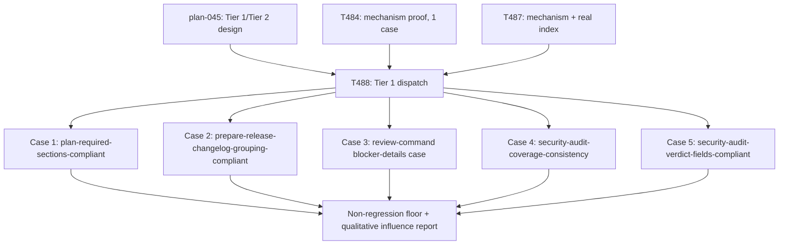

# Plan 046 — T458 scaling, Tier 1 dispatch record (T488)

> Filename: `plan-046-t458-tier1-dispatch.md`

**Status:** executed. This is a retrospective plan-of-record for a bounded piece of work the
orchestrating session instructed directly, in the same turn, rather than a forward-looking
proposal awaiting a separate approval cycle. It exists to satisfy this repository's own
Task Creation Precondition (`implementation/knowledge/commands/plan.md`: no task row may exist
without a backing plan document that names it) and to give T488 a durable planning record,
not to reopen or re-litigate `plan-045-t458-scaling.md`'s own Findings.

**Based on:** `docs/plans/plan-045-t458-scaling.md` (the technical specification — Finding 1's
5-case selection, Finding 2's Tier 1/Tier 2 split, Finding 3's non-regression-floor process,
Finding 4's agent-formulated-query design, Finding 5's no-vault-growth constraint, Finding 6's
cost/scope estimate); `docs/tasks/task-T484.md` and `docs/tasks/task-T487.md` (the live-dispatch
mechanism this work reused unchanged); `docs/tasks/task-T488.md` (the task brief this plan backs).

## Goal

Run `plan-045` Finding 2's Tier 1 slice only — a 5-case, `k=1` (one trial per arm) breadth
expansion of the live control/treatment mechanism T484/T487 already proved on a single case,
covering all five of the golden suite's distinct commands for the first time — and report the
real, honest per-case results and the non-regression floor, without attempting Tier 2 (the
separate 4-trial noise probe) or resolving `plan-045`'s other open items.

## Authorization

`plan-045` itself remained an unapproved, "proposed" investigative document (its own Approval
checklist unchecked) at the time this work ran. This work was authorized instead by the
orchestrating session's own direct, explicit, this-turn instruction to execute Tier 1 only,
naming the exact 5 cases and reusing the exact T484/T487 mechanism. `plan-045` supplies the
technical *content* of what "Tier 1" means; it does not supply the authorization itself.

## Task graph

## Resource assignments

| Task | Agent |
|------|-------|
| T488 outer dispatch (all 5 cases, both arms each) | orchestrator (in-process `Agent`-tool dispatch, same reason as T484/T487: the nominal owner's tool grant lacks `agent`) |
| Case 1 / Case 2 arms | `Orchestrator` role (per `/plan` and `/prepare-release` frontmatter) |
| Case 3 arms | `Tech Lead` role (per that case's own command frontmatter) |
| Case 4 / Case 5 arms | `Security Engineer` role (per `/security-audit` frontmatter) |

## Artifact flow

- `plan-045-t458-scaling.md` (input, technical spec) → `docs/tasks/task-T488.md` (task brief,
  produced by orchestrator) → 10 live scratch-directory trial outputs (outside the repo, not
  committed) → `docs/tasks/task-T488.md`'s own results table (consumed by this plan and by the
  orchestrating session's report back to the user).

## Risk assessment

| Risk | Complexity | Mitigation |
|------|------------|------------|
| `k=1` per case is statistically fragile — one formatting choice flips a boolean | Known, accepted per `plan-045` Finding 3 | Report the real floor result exactly as measured; do not paper over a miss with a post-hoc explanation that erases the result |
| Retrieval query could be inadvertently hinted, biasing "does retrieval help" | Low, mitigated by design | Treatment arms given only the corrected CLI invocation shape and told to formulate their own query; no vault-content hint given |
| Self-referential ledger-defect collision between a command name and an unrelated stable-tier skill of the same hyphenated spelling | Realized once during this work (case 3's own command name collides, as a bare token, with an unrelated stable-tier skill's identically-spelled id) | Resolved by rephrasing the task brief to avoid the bare token, verified via a fresh maturity-check run showing 0 failures, before push |

## Open questions

None — this is a retrospective record of bounded, already-completed work, not a forward-looking
proposal with unresolved design questions of its own. `plan-045`'s own deferred items (Tier 2,
the numeric improvement threshold, shapes b/c/d) remain exactly as deferred there.
