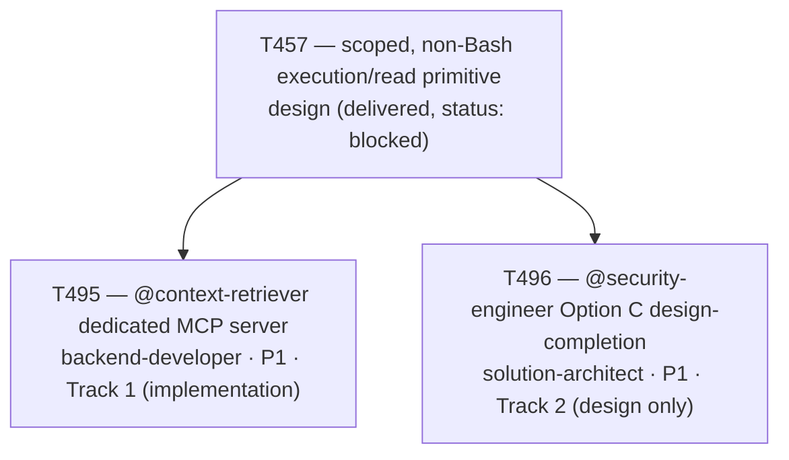

# Plan 050 — T495/T496 backlog record: plan coverage for T457's two dispatched follow-up tracks

> Filename: `plan-050-t495-t496-dispatch-plan-coverage.md`

**Status:** proposed — recorded as backlog, **not** approved for dispatch beyond what T495/T496
already are. This plan exists only to satisfy this repo's own "no task without a backing plan"
precondition (`implementation/knowledge/commands/plan.md`'s "Task Creation Precondition",
enforced by `tests/performance/test_team_health.py::TestPlanCoverage::
test_every_active_task_has_a_plan`) for the two tasks it references (T495, T496), and to make
their existence and rationale traceable — deliberately minimal, not a full Phase-level roadmap
document, matching `plan-039`'s (T457) and `plan-042`'s (T483) precedent for this exact
situation.

**Disclosed gap this plan closes:** T495 and T496 were dispatched (`docs/tasks/active-tasks.md`'s
2026-09-17 T495/T496 dispatch note, commits `1fdd9eb` on `agent/backend-developer/T495` and
`abc3819` on `agent/solution-architect/T496`) without a backing plan document in the same commit,
unlike the `T483`→`T491`/`T492` precedent (`plan-042`'s addendum, added in the same dispatch
commit `54ce60a` that created the `T491`/`T492` rows). This is an orchestrator dispatch-mechanics
gap, not a defect in either track's actual deliverable — this document is the fix, added
retroactively on each track's own branch.

**Based on:** `docs/artifacts/scoped-execution-primitive-v1.md` (T457, the design both tracks
implement/extend); `docs/plans/plan-049-t457-scoped-primitive-reinvestigation.md` (the
re-investigation that produced T457's design-phase delivery); `docs/tasks/task-T495.md` and
`docs/tasks/task-T496.md` (the briefs this plan backs); `docs/tasks/active-tasks.md`'s T495/T496
dispatch note (the user's explicit "@context-retriever OK" / "@security-engineer C" decisions this
plan traces back to).

## Goal

Record, with a genuine backing plan document, the rationale for T495 (Track 1 — implement
`@context-retriever`'s dedicated single-tool `stdio` MCP server per `scoped-execution-primitive-
v1.md` §1.4) and T496 (Track 2 — complete `@security-engineer`'s Option C design, per
`scoped-execution-primitive-v1.md` §2.3, without implementing it). Both are independent follow-ups
to T457's design pass; neither closes T457 itself.

## Task graph

## Agent assignment

| Task | Agent | Scope |
|------|-------|-------|
| T495 | backend-developer | Build the dedicated `stdio` MCP server wrapping `ContextRetriever.query()`, register it in `servers.yaml`, regenerate all platform projections, replace `@context-retriever`'s `execute` grant with the new exact-tool-name form, and back it with a live adversarial write-attempt test |
| T496 | solution-architect | Resolve `scoped-execution-primitive-v1.md` §2.3's two open questions for Option C (the fixed audit-command list; the injection-hazard treatment per tool), producing a new design artifact concrete enough for a future implementation task to build from — no code, config, or agent grant change |

## Artifact flow

`docs/artifacts/scoped-execution-primitive-v1.md` (T457) → `task-T495.md` → dedicated MCP server
package + `servers.yaml` entry + regenerated platform projections + `test_context_retriever_mcp_server.py`
(T495 deliverables). `docs/artifacts/scoped-execution-primitive-v1.md` §2.3 → `task-T496.md` →
`docs/artifacts/security-engineer-audit-server-design-v1.md` (T496's sole deliverable — a design
artifact, not an implementation).

## Risks and mitigations

| Risk | Likelihood | Impact | Mitigation |
|------|-----------|--------|-----------|
| T496's design artifact is never picked up by a future implementation task, leaving `@security-engineer`'s tool-scoping gap open indefinitely | Medium | Low (the gap is already disclosed and accepted per T457/`plan-039`; T496 only deepens the record, doesn't create a new risk) | T496 stays `blocked` (not `done`) in the ledger for exactly this reason — its own closure note makes the remaining gap explicit rather than implying completion |
| T495's new MCP server's tool-scoping guarantee is Claude-Code-specific and does not generalize to the other 6 platforms | Confirmed, not merely a risk | Low (disclosed in `scoped-execution-primitive-v1.md` §4 and repeated in T495's own agent-definition update) | `implementation/knowledge/agents/context-retriever.md`'s updated CRITICAL note explicitly says not to assume this holds on every platform |

## Addendum (2026-09-17) — plan-coverage gap disclosed and fixed retroactively

This document was authored and committed onto each of `agent/backend-developer/T495` and
`agent/solution-architect/T496` directly (not merged to `develop` first) specifically so each
branch's own CI (`tests/performance/test_team_health.py::TestPlanCoverage` and
`TestShippedTaskValidator`) has the plan coverage it needs to pass independently, mirroring how
`plan-042`'s addendum already existed on `develop` before `T491`/`T492` ever branched. Unlike the
`T491`/`T492` case, T495/T496 could not get this in the original dispatch commit because that
commit is already pushed and shared — this document is a same-effect follow-up commit instead of a
rewritten dispatch commit.
