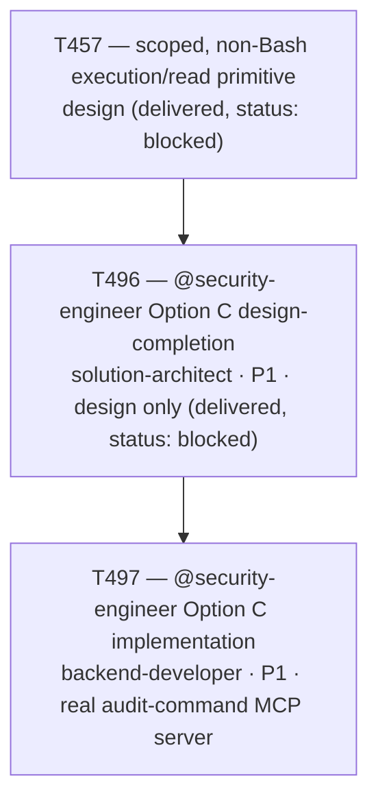

# Plan 051 — T497 backlog record: plan coverage for the Option C implementation dispatch

> Filename: `plan-051-t497-dispatch-plan-coverage.md`

**Status:** proposed — recorded as backlog, not a full Phase-level roadmap document. Exists solely
to satisfy this repo's "no task without a backing plan" precondition
(`implementation/knowledge/commands/plan.md`'s "Task Creation Precondition", enforced by
`tests/performance/test_team_health.py::TestPlanCoverage::test_every_active_task_has_a_plan`) for
`T497`, mirroring `plan-050`'s precedent for `T495`/`T496`.

**Based on:** `docs/artifacts/security-engineer-audit-server-design-v1.md` (T496, the design this
task implements); `docs/artifacts/scoped-execution-primitive-v1.md` (T457, the original gap both
`T495` and the `T496`/`T497` pair address); `docs/plans/plan-050-t495-t496-dispatch-plan-coverage.md`
(sibling precedent for `T495`/`T496`'s own plan coverage); `docs/tasks/task-T497.md` (the brief
this plan backs).

## Goal

Record the rationale for `T497` — implement `@security-engineer`'s Option C audit-command MCP
server exactly as specified by `T496`'s design artifact, closing the real capability gap (an
actual built, tested server) that `T496`'s own design-only scope deliberately left open.

## Task graph

## Agent assignment

| Task | Agent | Scope |
|------|-------|-------|
| T497 | backend-developer | Build `implementation/runtime/security/` (audit_server.py, commands.py, executor.py, validation.py) exactly per T496's design, register `security-audit` in `servers.yaml`, regenerate platform projections, update `security-engineer.md`'s Claude Code `tools:` grant, and back it with a live adversarial subprocess-over-stdio test suite |

## Artifact flow

`docs/artifacts/security-engineer-audit-server-design-v1.md` (T496) → `task-T497.md` →
`implementation/runtime/security/` package + `servers.yaml` entry + regenerated platform
projections + `security-engineer.md` grant change + new adversarial test suite (T497
deliverables).

## Note on T496's status

This plan does not reclassify `T496`. Per `task-T496.md`'s own Status field, `T496` stays
`blocked`, not `done`, regardless of `T497`'s outcome — mirroring `T457`'s own established
"design delivered, row stays blocked" posture, under which a downstream implementation task
succeeding does not retroactively close the design-tracking row that preceded it.
