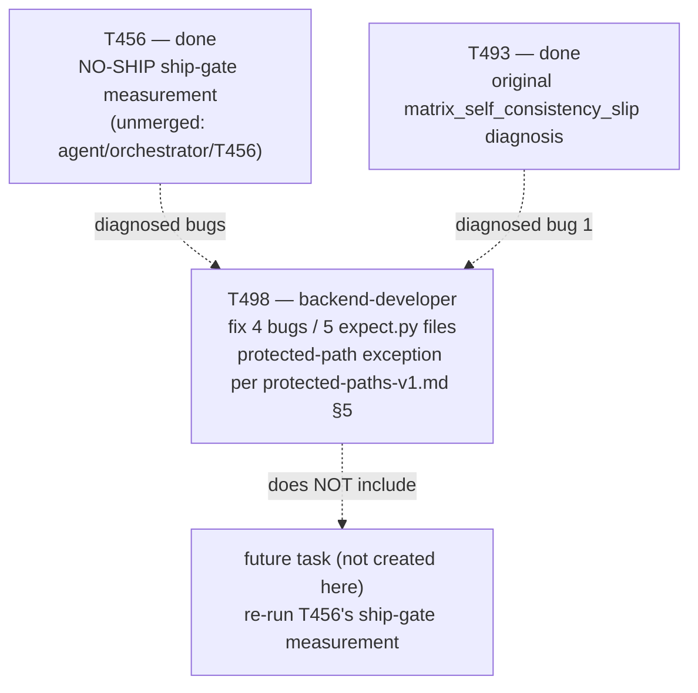

# Plan 052 — T498: fix four diagnosed golden-suite checker-brittleness bugs (protected-path exception)

> Filename: `plan-052-t498-golden-checker-brittleness-fixes.md`

**Date:** 2026-09-17

**Status:** authorized — this task was explicitly reasoned out and dispatched by the user's own
current-turn instruction ("continue with the next best step... proceed with normal dispatch
discipline (plan doc, task brief, branch/MR, no self-merge) rather than pausing for a fresh ask"),
not a separate approval request. This plan document is still written and presented in full, per
`implementation/knowledge/commands/plan.md`'s "Task Creation Precondition" (no task row may be
added without a backing plan), but does not gate on a fresh approval reply before the task row is
added and dispatch proceeds — merging the resulting MR still requires the user's own independent
review, per the no-self-merge rule.

**Based on:**
- `docs/benchmarks/baseline-v6.17.0-retrieval.md` §6 ("Root-cause analysis"), §7 ("New findings
  this session"), and §9 ("Recommendation") — **note on provenance, disclosed up front:** this
  document exists only on the unmerged branch `agent/orchestrator/T456` (an MR against `develop`
  is open for it, per that task's own execution log; it is not yet on `origin/develop` or in this
  worktree's checked-out tree). Read directly via `git show origin/agent/orchestrator/T456:docs/
  benchmarks/baseline-v6.17.0-retrieval.md` for this plan. This does not block dispatching T498 —
  the four bugs are independently verified by direct inspection of the live `expect.py` files
  themselves (see "Direct verification" below), not merely asserted from the report — but the
  report's own eventual merge is a loose end this plan does not resolve and is called out as a
  risk below.
- `docs/tasks/task-T456.md` (Execution log, "measurement complete" entry) and
  `docs/tasks/completed-tasks.md`'s `T456` row — the NO-SHIP verdict and the pointer to the report.
- `docs/tasks/task-T493.md` — the original, pre-dating-T456 diagnosis of the
  `matrix_self_consistency_slip` cause in `security-audit-coverage-consistency`.
- `docs/plans/plan-035-roadmap-v7-ground-up.md` §2.3's Mermaid phase graph — see "Phase-graph
  correction" below for one disclosed inaccuracy in this task's own originating instruction.
- `docs/artifacts/protected-paths-v1.md` §5 — the exception process this plan's task brief invokes
  explicitly for the five files below.
- `docs/benchmarks/scorecard-v6.12.0.md` (open-case per-ID table) and a fresh, uncommitted
  `python3 scripts/scorecard.py` run (output discarded/reverted immediately after inspection, see
  "Direct verification") — the Phase-1/current frozen-baseline cross-check for all five affected
  files.

## Goal

Fix exactly four already-diagnosed, arm-agnostic checker-brittleness bugs in the golden suite's
own `expect.py` files (spanning five files, since one bug's mechanism is duplicated across an
`open` case and its `held-out` sibling), each already root-caused by direct inspection of the live
file content — not by re-deriving from the report's prose alone. This is motivated by, but does
**not** itself perform, Phase 5's ship-gate re-measurement: `baseline-v6.17.0-retrieval.md` §9
recommends fixing these bugs and then re-running T456's measurement, predicting (not guaranteeing)
that doing so clears the floor. This plan scopes only the fix; the re-measurement is an explicitly
separate, future follow-up task, matching this session's established pattern of keeping "fix the
mechanism" and "re-measure with it" as distinct steps (`T457`→`T495`/`T496`/`T497`, `T458`→`T456`).

## Phase-graph correction (disclosed, not silently matched to the originating framing)

`plan-035` §2.3's real Mermaid graph gives Phase 6 **three** incoming edges, not one:

```
P3 --> P6
G3 --> P6["Phase 6 — Closed Loop<br/>v7.0.0"]
G4 --> P6
```

Phase 6 depends on `P3` (Phase 3, Maturity Ladder — status not re-verified by this plan) and `G4`
(Autonomy gate, itself downstream of `G1`), in addition to `G3` (Memory gate, closed by Phase 5 /
`T456`) — not on `G3` alone. This does not change the substance of why fixing these bugs matters:
`G3` is still open, still one of Phase 6's three gating dependencies, and still the most direct,
already-measured, already-diagnosed remaining item this session has visibility into. But "G3 alone
gates Phase 6" is not what the diagram says, and is corrected here rather than restated.

## Direct verification performed before writing this plan (not taken from the report alone)

Each of the five affected files was read directly this session:

1. `tests/golden/open/security-audit-coverage-consistency/expect.py` — confirmed: `declared_n ==
   len(rows)` is a strict equality between the declared `**OWASP coverage**: n/10` field and the
   count of distinct `A0X` matrix rows present, with no allowance for a narrower assessed/in-scope
   subset.
2. `tests/golden/open/prepare-release-real-verdict-missing/expect.py` — confirmed:
   `_verdict_section()`'s boundary regex is `\n#{1,2}\s`, unscoped to fenced code blocks.
3. `tests/golden/held-out/<HO-5>/expect.py` — confirmed: byte-identical
   `_verdict_section()` implementation, independently duplicated in this second file (not shared
   code), same bug mechanism.
4. `tests/golden/held-out/<HO-6>/expect.py` — confirmed: requires literal
   `\|\s*{cat}\s*\|` (e.g. `| A01 |`) as its own table cell for all ten `A01`–`A10` tokens, with no
   tolerance for a numeric-index-plus-folded-label format.
5. `tests/golden/open/security-audit-critical-not-fail/expect.py` — confirmed:
   `status_match = re.search(r"\*\*Status\*\*\s*:\s*(\S+)", text)` searches the whole document,
   not a `## VERDICT`-scoped substring.

`HO-5`/`HO-6` real directory names are deliberately not written in this plan document (outside
`tests/golden/`) — `tests/functional/test_golden_held_out_isolation.py` Check B flags any file
outside `tests/golden/` that mentions a held-out case ID as a whole token. The task brief instructs
the implementing agent to independently re-derive the two real paths by reading
`tests/golden/held-out/*/expect.py` directly, per the same discipline `T456` already established.

**Current (pre-fix) static-fixture baseline, captured fresh this session and cross-checked against
the frozen Phase-1 record, so post-fix parity has a concrete target:**

| Case (or alias) | Phase-1 baseline source | Expected | Actual (frozen, `scorecard-v6.12.0.md`) | Actual (fresh run, today, unchanged) |
|---|---|---|---|---|
| `security-audit-coverage-consistency` | `scorecard-v6.12.0.md` row | `expected_pass` | `pass` | `pass` |
| `prepare-release-real-verdict-missing` | `scorecard-v6.12.0.md` row | `known_failing` (`tracked_defect`) | `fail` | `fail` |
| `security-audit-critical-not-fail` | `scorecard-v6.12.0.md` row | `known_failing` (`tracked_defect`) | `fail` | `fail` |
| `HO-5` (redacted ID `held-out-case-5`) | fresh run only — held-out rows are not named in any committed doc, by design (`baseline-v6.12.0.md` §"Held-out case identities") | `expected_pass` | not published by ID | `pass` |
| `HO-6` (redacted ID `held-out-case-6`) | fresh run only, same reason | `expected_pass` | not published by ID | `pass` |

The fresh run was captured, inspected, and its two output files (`docs/benchmarks/
scorecard-v6.12.0.json`/`.md`, which `scripts/scorecard.py` regenerates in place with a
`run_metadata.generated_at`-only diff) were immediately reverted with `git checkout --` — this
plan does not leave a stray scorecard-regeneration diff in the tree, and neither should T498's own
verification step.

## Task graph



## Agent assignment

| Task | Agent | Scope |
|------|-------|-------|
| T498 | backend-developer | Minimal, targeted fixes to exactly 5 named `expect.py` files (protected-path exception, named files only); regression proof per fix; full verification bar; branch + MR, no self-merge |

## Artifact flow

`baseline-v6.17.0-retrieval.md` §7/§9 (diagnosis, unmerged branch) + `task-T493.md` (bug 1's
original diagnosis) + direct file reads (this plan) → `docs/tasks/task-T498.md` (brief, with
explicit protected-path exception) → `agent/backend-developer/T498` branch: 5 fixed `expect.py`
files + before/after regression evidence + test run output → MR against `develop` (unmerged,
pending independent orchestrator review and user merge) → (future, not this task) a re-run of
T456's measurement.

## Risks and mitigations

| Risk | Likelihood | Impact | Mitigation |
|---|---|---|---|
| `baseline-v6.17.0-retrieval.md` itself never merges (it lives only on an open, unmerged MR) | Low–Medium | Low | Not a blocker for T498: every bug this plan fixes was independently re-confirmed by direct `expect.py` inspection, not sourced from the report alone. Disclosed as a loose end, not silently ignored. |
| Bug 1's fix ("declared count may legitimately be narrower than matrix row count") turns out to need more context than `expect.py`/`fixture/` can access to distinguish a legitimate narrower count from a genuinely wrong one | Medium | Medium | Task brief instructs backend-developer to report this as a real blocker rather than pick an arbitrary interpretation, per this task's own standing instruction — mirrors `plan-035`'s general "don't force a fix past a genuine design question" posture. |
| A fix accidentally flips a currently-passing static fixture to failing (new false positive) or a currently-correctly-failing one to passing (masks a real defect) | Medium | High | Acceptance criteria require an explicit before/after trace per fix, plus the frozen Phase-1 baseline cross-check table above, plus a full `tests/run.py` pass with no regressions. |
| Held-out case identity leaks into a committed file outside `tests/golden/` (Check B violation) | Low | High (would trip a real, tested isolation guard and fail CI) | Brief explicitly forbids writing the real `HO-5`/`HO-6` directory names in any file outside `tests/golden/` (commit messages, MR description, task brief updates) — alias-only, mirroring `T456`'s own established discipline. |
| Scope creep into unrelated `tests/golden/**` cleanup, `fixture/`, or `brief.md` content, or into `scripts/scorecard.py` | Low | Medium (protected-path violation) | Brief names the exact 5 files authorized and nothing else; independent orchestrator diff review checks the MR touches only those files. |

## Token budget

Implementation phase, per the ≤120k token governance ceiling: this is a small, targeted bug-fix
task (5 files, mechanical regex/logic fixes, no new subsystem) — budgeted at ≤25k tokens for
`backend-developer`'s dispatch, well under the phase ceiling, leaving headroom for the rest of
Phase 5/6 follow-up work still pending in this session.

## Explicit non-goals

- **Does not re-run T456's ship-gate measurement.** That is a legitimate, separate, future
  follow-up once these fixes land, not folded into this task.
- **Does not touch `scripts/scorecard.py`.** None of the four diagnosed bugs are in it.
- **Does not touch any `tests/golden/**` content beyond the 5 named `expect.py` files** — no
  `fixture/`, no `brief.md`, no other case's `expect.py`.
- **Does not merge anything.** No self-merge by the orchestrator or by `backend-developer`, zero
  exceptions for content type, per this repo's standing rule.

## Approval

Dispatch authorization for this task comes from the user's own current-turn instruction (quoted
above), not a fresh plan-approval reply — consistent with this repo's memory note that the
orchestrator must never self-edit a plan's own approval gate: this section records where the real
authorization came from rather than asserting orchestrator-granted approval. The MR this task
produces still requires the user's own independent review and merge before anything lands on
`develop`.
