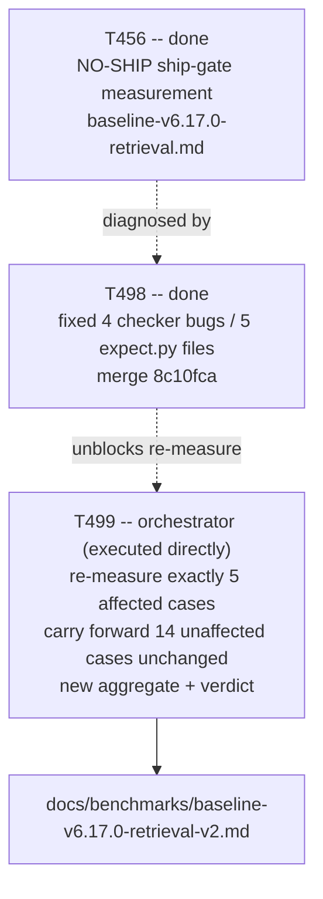

# Plan 053 — T499: re-measure Phase 5's ship gate now that T498 fixed the checker bugs

> Filename: `plan-053-t499-ship-gate-remeasurement.md`

**Date:** 2026-09-18

**Status:** authorized — dispatched per the user's own explicit current-turn instruction this
session ("Continue by re-running T456"), following this repo's own established precedent
(`plan-052`/`T498`) that an explicit current-turn dispatch instruction is sufficient authorization
to proceed with normal dispatch discipline (plan doc, task brief, branch/MR, no self-merge)
without a separate fresh approval round-trip. This document is still written and presented in
full, per `implementation/knowledge/commands/plan.md`'s Task Creation Precondition (no task row
may be added without a backing plan).

**Based on:**
- `docs/tasks/task-T456.md` — the original ship-gate measurement (control 20/29 = 68.97%,
  treatment 19/31 = 61.29%, `policy.floor_met()` = `False`, verdict **NO-SHIP**), its
  pre-registered threshold (reused verbatim below, not re-derived), its run scope, and its
  held-out isolation discipline (all re-read in full this session from `origin/develop`).
- `docs/benchmarks/baseline-v6.17.0-retrieval.md` — T456's own closed measurement report, all 19
  measured cases' per-case results (§4), root-cause analysis (§6), and the three new
  checker-brittleness findings (§7) that motivated T498.
- `docs/tasks/task-T498.md` and `docs/plans/plan-052-t498-golden-checker-brittleness-fixes.md` —
  the just-landed fix (merge `8c10fca`, commits `8e1ebec`/`137492a`/`3442761` on
  `agent/backend-developer/T498`), which fixed exactly four checker-brittleness bugs across
  exactly five `expect.py` files, each corresponding to exactly one of the 19 measured cases.
- `docs/plans/plan-048-t458-k-threshold-decision.md` §7 — the k/escalation/floor-tolerance policy
  this task reuses unchanged, implemented as `implementation/runtime/golden_harness/policy.py`
  (re-read directly this session, not re-derived).
- `docs/artifacts/protected-paths-v1.md` — `tests/golden/**` and `scripts/scorecard.py` remain
  protected; this task is measurement-only and touches neither.

## Goal

Re-measure Phase 5's `plan-035` ship gate now that T498's fix has landed, without re-running the
14 cases T498's fix structurally cannot have affected. Produce a new, versioned aggregate result,
apply T456's own pre-registered threshold honestly, and state the verdict plainly — SHIP or
NO-SHIP — with the same root-cause discipline `baseline-v6.17.0-retrieval.md` used.

## Why this is a narrow re-run, independently confirmed (not merely asserted from the dispatch)

`git diff cc77974 origin/develop -- 'tests/golden/**/expect.py' --stat` (`cc77974` = the merge
commit that landed `baseline-v6.17.0-retrieval.md`'s own measurement; `origin/develop` = current
tip `8c10fca`) was run directly this session, independent of any prior claim, and shows **exactly
five files changed, zero others**:

- `tests/golden/open/security-audit-coverage-consistency/expect.py`
- `tests/golden/open/prepare-release-real-verdict-missing/expect.py`
- `tests/golden/open/security-audit-critical-not-fail/expect.py`
- two files under `tests/golden/held-out/` — the real directories behind the aliases **HO-5** and
  **HO-6** in `baseline-v6.17.0-retrieval.md` (real names deliberately not written here; this
  document is outside `tests/golden/`, so it is exactly the kind of file
  `test_golden_held_out_isolation.py`'s Check B scans — see the provenance note below)

These are exactly the five cases named in `task-T498.md`'s "the four bugs, and the five files"
section. Each of the other 14 measured cases' `expect.py` is byte-identical between the commit
`baseline-v6.17.0-retrieval.md` was measured against and current `origin/develop` — mechanically
confirmed, not assumed. Their recorded results in `baseline-v6.17.0-retrieval.md` §4 therefore
carry forward unchanged into this task's new aggregate; only the five affected cases are
re-measured here.

**Held-out real-name provenance, disclosed:** the two real directory names were cross-confirmed
two independent ways before use — (1) by reading every `expect.py` under `tests/golden/held-out/`
directly and matching mechanism/command-surface/status against `baseline-v6.17.0-retrieval.md`'s
HO-5/HO-6 descriptions (same discipline `task-T498.md` itself required), and (2) this session's
own scratch trial-record file from the original T456 dispatch (`/tmp` scratch, never committed,
same session) independently logged these same two directory names against the same
control/treatment pass/fail pattern the report describes for HO-5/HO-6. Per this repo's
established discipline, the real names are used only in uncommitted, local reasoning and are
never written into any file this task commits outside `tests/golden/` — every committed artifact
(this document, `task-T499.md`, the new report) refers to them only as `HO-5`/`HO-6`.

## A genuine, disclosed recovery: isolating the checker-fix effect from live-session non-determinism

`task-T499.md`'s dispatch brief raised the possibility that the original T456 candidate outputs
for the five affected cases might still be recoverable on disk in this same session's own
scratchpad, since this re-run happens to be continued in the *same* orchestrator session that ran
T456 originally. This was checked directly, not assumed either way:

- **Recoverable, for four of the five cases:** `prepare-release-real-verdict-missing`, its
  held-out sibling `HO-5`, `security-audit-critical-not-fail`, and `HO-6` were all among the 13
  "new this session" cases T456 dispatched via 8 live dispatch groups (`A`–`H`), and the raw
  candidate markdown files those live sessions produced were still present, unmodified, in this
  session's own scratch directory. Re-scoring these exact, unmodified candidate files against the
  newly-fixed `expect.py` (via `implementation/runtime/golden_harness/scoring.py`'s real
  `score_scratch_dir()`, the same call shape T456 itself used) is strictly more rigorous than a
  fresh live re-dispatch: it isolates the checker-fix's effect completely from any live-session
  non-determinism, since the exact same candidate text is being re-graded, only the grader
  changed.
- **Not recoverable, for the fifth case:** `security-audit-coverage-consistency` was one of the
  **6 historical-evidence cases** in T456's run (backfilled from `task-T488.md`
  through `task-T493.md`'s own prose closure records, per `baseline-v6.17.0-retrieval.md` §3) —
  T456 never produced fresh candidate text for it in this session at all, so there is nothing to
  re-score. This case genuinely requires a fresh live trial.

This recovery path was verified mechanically, not asserted: for each of the four recoverable
cases, the true target fixture path each case's real `expect.py` reads (`fixture/release-notes.md`
vs. `fixture/docs/checkpoints/*.md` vs. `fixture/audit.md`) was independently confirmed by reading
the live `expect.py` source before building the scratch scoring directory, catching and fixing one
initial path-construction mistake (a doubled `docs/checkpoints/docs/checkpoints/` nesting) before
trusting any result.

## Fresh live trial: `security-audit-coverage-consistency`

Dispatched fresh at **k=1** per `plan-048` §7's default policy — the case's historical k=5
escalation record does *not* carry forward, because that escalation was itself triggered by the
buggy (pre-T498) checker's disagreement pattern between arms; `policy.should_escalate()` is
applied fresh against the two new k=1 trials under the *fixed* checker, exactly as
`task-T499.md`'s own dispatch brief specifies. Both arms (control: no retrieval; treatment: real
`@context-retriever`-equivalent retrieval, via the same real CLI invocation shape and the same
`fastembed`/`nomic-embed-text-v1.5` memory index T456 itself built this session — 25 chunks, 0
rejections, `entry_count: 11`, still present and independently re-confirmed functional this
session) were dispatched as real, live `Agent` tool sessions against the case's own `brief.md`
scope ("Perform a security audit on the internal admin CLI's authentication and authorization
paths only"), never a `claude` CLI subprocess, per this repo's standing live-trial mechanism.

## Task graph

## Agent assignment

| Task | Owner | Scope |
|------|-------|-------|
| T499 | orchestrator (executed directly) | Same structural reason as `T456`: `evaluation-agent`'s tool grant (`[read, search, web]`) cannot run the harness or dispatch live trials — no `Bash`, no `Agent` tool. Re-score 4 cases against recovered candidates; dispatch 1 fresh live k=1 pair for the 5th; carry forward 14 unaffected cases' historical results by citation; compute new aggregate; apply the pre-registered threshold; report the verdict honestly either way. |

## Artifact flow

`baseline-v6.17.0-retrieval.md` (14 unaffected cases' results, cited not re-derived) +
`implementation/runtime/golden_harness/scoring.py` (re-score 4 recovered candidates against fixed
`expect.py`) + 1 fresh live control/treatment pair (`security-audit-coverage-consistency`) →
`docs/tasks/task-T499.md` (pre-registered threshold, execution log) →
`docs/benchmarks/baseline-v6.17.0-retrieval-v2.md` (new aggregate, verdict, root-cause analysis) →
ledger closure in the same commit sequence.

## Risks and mitigations

| Risk | Likelihood | Impact | Mitigation |
|---|---|---|---|
| Re-scoring recovered T456 candidates against the fixed checker is treated as equivalent to a fresh live re-dispatch when it is not (it cannot detect a *new* live-session behavior change, only the checker-fix's effect on already-observed behavior) | Low (disclosed, not hidden) | Low | Disclosed explicitly in this plan and in the new report: this is the *more* rigorous choice for isolating the checker-fix's effect, not a shortcut: the candidate text is unchanged and real, only the grading logic changed for these 4 cases. The 5th case (no recoverable candidate) gets a genuine fresh live trial. |
| Held-out real directory names leak into a committed file outside `tests/golden/` | Low | High (trips `tests/functional/test_golden_held_out_isolation.py` Check B, fails CI) | Alias-only (`HO-5`/`HO-6`) in every committed artifact; real names used only in this session's own local/uncommitted reasoning, matching `T456`'s and `T498`'s own established discipline. |
| `security-audit-coverage-consistency`'s fresh k=1 trial reproduces a k=1 disagreement, requiring escalation to k>=3 mid-task | Medium | Low | `policy.should_escalate()` is applied mechanically to the fresh k=1 pair; if it fires, additional trials are dispatched within this same task before the aggregate is computed — not deferred to a second follow-up task. |
| New aggregate still misses the pre-registered floor (continued NO-SHIP) | Medium | none (this is a legitimate possible outcome, not a task failure) | Reported exactly as measured, per `T456`'s own "a negative, honestly-measured verdict is a legitimate, valuable completion" precedent — not treated as a reason to leave the task open or to adjust the threshold post hoc. |

## Token budget

QA/measurement-adjacent phase, per the ≤60k token governance ceiling for QA/Security/Release: this
is a narrow, 5-case re-scoring/re-trial task reusing an already-built harness and an
already-verified memory index — budgeted at ≤40k tokens for this orchestrator-executed dispatch,
leaving headroom under the phase ceiling.

## Explicit non-goals

- **Does not touch `tests/golden/**` or `scripts/scorecard.py`.** Measurement only, per
  `protected-paths-v1.md`.
- **Does not re-run the 14 cases T498's fix structurally cannot have affected.** Their
  `baseline-v6.17.0-retrieval.md` §4 results are cited and carried forward unchanged, not
  re-derived.
- **Does not overwrite `baseline-v6.17.0-retrieval.md`.** This repo's Artifact Versioning
  convention requires a new version (`baseline-v6.17.0-retrieval-v2.md`), citing the original as
  `Based on:`.
- **Does not merge anything.** No self-merge by the orchestrator, zero exceptions for content
  type, per this repo's standing rule — branch pushed, MR opened, left for independent top-level
  review.

## Approval

Dispatch authorization comes from the user's own current-turn instruction ("Continue by
re-running T456"), not a fresh plan-approval reply — consistent with this repo's own memory note
that the orchestrator must never self-edit a plan's own approval gate, and with the
`plan-052`/`T498` precedent for the same situation. The MR this task produces still requires the
user's own independent review and merge before anything lands on `develop`.
