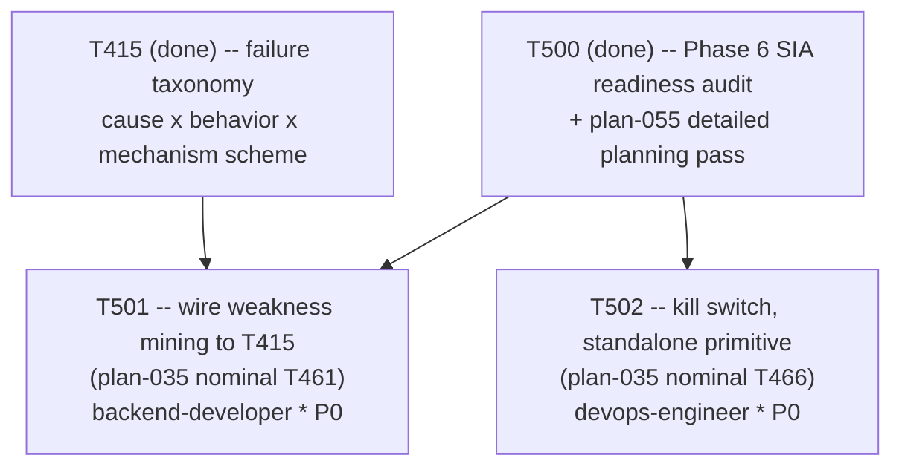

# Plan 056 — T501/T502 dispatch: plan coverage for Phase 6's first two tasks

> Filename: `plan-056-t501-t502-dispatch-plan-coverage.md`

**Status:** proposed — recorded as backlog, **not** approval for any work beyond what T501/T502
already are. This document exists only to satisfy this repo's own "no task without a backing
plan" precondition (`implementation/knowledge/commands/plan.md`'s "Task Creation Precondition",
enforced by `tests/performance/test_team_health.py::TestPlanCoverage::
test_every_active_task_has_a_plan`, which requires each active task's real ledger ID to appear as
a literal token somewhere under `docs/plans/`) for the two tasks it references (T501, T502) —
deliberately minimal, matching `plan-050`'s (T495/T496) and `plan-042`'s (T491/T492) precedent for
this exact situation: the real detailed-planning pass already exists (`plan-055`, referring to
these two tasks by `plan-035`'s nominal `T461`/`T466` names, not by their real ledger IDs, which
`plan-055` §1 explicitly left for the orchestrator to assign at dispatch time), this document just
makes the ID mapping literal and traceable.

**Based on:** `docs/plans/plan-055-phase6-closed-loop-rescoped-detailed-planning.md` (the real
detailed-planning pass this dispatch executes exactly two rows of — §4's `T461-equiv` and
`T466-equiv` rows, §1's explicit deferral of real ID assignment to dispatch time); `docs/artifacts/
phase6-sia-readiness-audit-v1.md` (the audit `plan-055` is itself based on); `docs/tasks/
task-T501.md` and `docs/tasks/task-T502.md` (the briefs this document backs).

## Goal

Record, with a genuine backing plan reference containing their real literal IDs, the mapping from
`plan-055` §4's nominal `T461-equiv`/`T466-equiv` rows to this ledger's real `T501`/`T502` task
IDs, and confirm both are dispatched exactly as `plan-055` §4 scoped them — no scope invented here
beyond what that document already specified.

## Task graph

`T501` and `T502` have no dependency on each other, per `plan-055` §4's own sequencing note.
Neither is a dependency of the other; both were dispatched in the same round because both are
unblocked. The four remaining Phase 6 tasks (a future diff-proposal generator, its validation/
promotion step, the human merge-request gate, the lineage document) are not dispatched by this
plan — `plan-055` §4 documents them as depending on `T501`'s and/or a future `T462`'s output,
which does not exist yet.

## Agent assignment

| Task | Real ID | `plan-035` nominal ID | Agent | Scope |
|------|---------|------------------------|-------|-------|
| Wire weakness mining to the Phase 1 failure taxonomy | T501 | T461 | backend-developer | Make the 15 already-classified failure records (`docs/benchmarks/failures/**`, T415/T409) genuinely queryable by a future consumer; explicitly defers the ongoing-feed design question |
| Kill switch | T502 | T466 | devops-engineer | Build a standalone, documented halt/check primitive with a real test proving detection and non-self-resumption; no dependency on any other Phase 6 code |

## Artifact flow

`docs/artifacts/failure-taxonomy-v1.md` + `docs/benchmarks/failures/**` (T415/T409, existing) →
`task-T501.md` → a new queryable Python module + test under `implementation/runtime/**` /
`tests/functional/**` (T501's sole deliverable). No existing artifact feeds T502 functionally —
`task-T502.md` → a new kill-switch module/CLI + test + `docs/artifacts/phase6-kill-switch-v1.md`
(or the implementer's chosen equivalent filename), all standalone.
