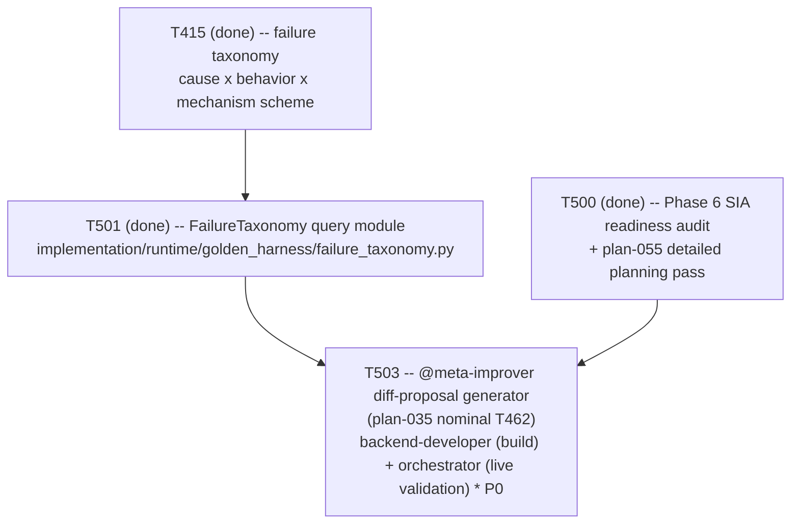

# Plan 057 — T503 dispatch: plan coverage for Phase 6's `@meta-improver`

> Filename: `plan-057-t503-dispatch-plan-coverage.md`

**Status:** proposed — recorded as backlog, **not** approval for any work beyond what T503
already is. This document exists only to satisfy this repo's own "no task without a backing
plan" precondition (`implementation/knowledge/commands/plan.md`'s "Task Creation Precondition",
enforced by `tests/performance/test_team_health.py::TestPlanCoverage::
test_every_active_task_has_a_plan`, which requires each active task's real ledger ID to appear as
a literal token somewhere under `docs/plans/`) for the one task it references (T503) —
deliberately minimal, matching `plan-050`'s (T495/T496), `plan-042`'s (T491/T492), and `plan-056`'s
(T501/T502) precedent for this exact situation: the real detailed-planning pass already exists
(`plan-055`, referring to this task by `plan-035`'s nominal `T462` name, not by its real ledger ID,
which `plan-055` §1 explicitly left for the orchestrator to assign at dispatch time), this
document just makes the ID mapping literal and traceable.

**Based on:** `docs/plans/plan-055-phase6-closed-loop-rescoped-detailed-planning.md` (the real
detailed-planning pass this dispatch executes one row of — §4's `T462-equiv` row, §1's explicit
deferral of real ID assignment to dispatch time); `docs/artifacts/phase6-sia-readiness-audit-v1.md`
(the audit `plan-055` is itself based on, §5 item 2 naming `@meta-improver` as genuinely greenfield
work); `docs/tasks/task-T503.md` (the brief this document backs); `docs/tasks/task-T501.md` (the
real, merged, tested `FailureTaxonomy` module this task consumes as its concrete input).

## Goal

Record, with a genuine backing plan reference containing its real literal ID, the mapping from
`plan-055` §4's nominal `T462-equiv` row to this ledger's real `T503` task ID, and confirm it is
dispatched exactly as `plan-055` §4 scoped it — no scope invented here beyond what that document
already specified.

## Task graph

`T503` depends on `T501`'s real output (the taxonomy is now queryable), per `plan-055` §4's own
sequencing note: "T462-equiv (build half) can start once T461-equiv's taxonomy-feed mechanism is
defined." `T502` (the kill switch) is not a dependency — it was already independent of every other
Phase 6 task per `plan-055`'s own sequencing. The three remaining Phase 6 tasks (validation/
promotion, the human merge-request gate, the lineage document) are not dispatched by this plan —
`plan-055` §4 documents them as depending on `T503`'s own proposal schema existing, which does not
exist yet at the time this document is written.

## Agent assignment

| Task | Real ID | `plan-035` nominal ID | Agent | Scope |
|------|---------|------------------------|-------|-------|
| `@meta-improver`: failure cluster → diff proposal, never an applied edit | T503 | T462 | Split: `backend-developer` (build) + orchestrator (live end-to-end validation, executed directly) | Genuinely greenfield, scoped `large` per the audit — a structured `DiffProposal` dataclass, target-path allowlist rejecting protected paths, clustering over `FailureTaxonomy` records, an adversarially-tested "never writes to a real repo file" guarantee |

## Artifact flow

`implementation/runtime/golden_harness/failure_taxonomy.py` (T501, existing, real, tested) → a new
`@meta-improver` module + test under `implementation/runtime/**` / `tests/functional/**` (T503's
sole deliverable) → (future, not this task) `task-T5xx.md`'s validation/promotion step (`plan-055`
`T463-equiv`), which consumes T503's proposal schema once it exists.
