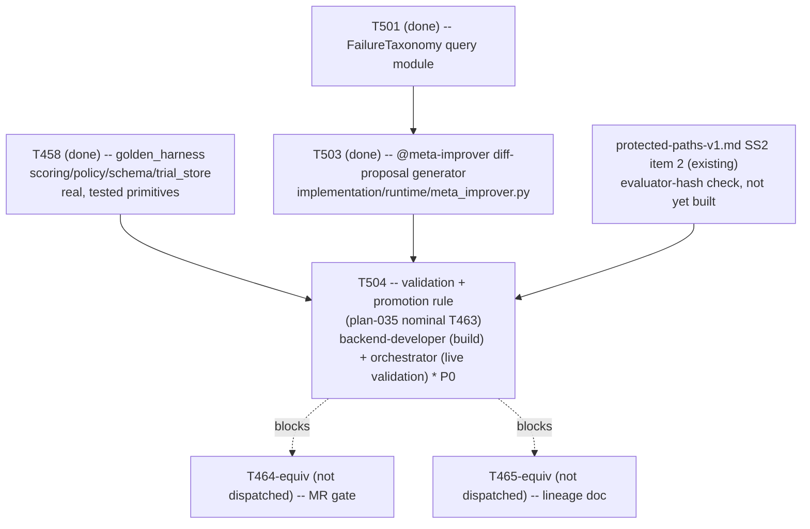

# Plan 058 — T504 dispatch: plan coverage for Phase 6's validation/promotion rule

> Filename: `plan-058-t504-dispatch-plan-coverage.md`

**Status:** proposed — recorded as backlog, **not** approval for any work beyond what T504
already is. This document exists only to satisfy this repo's own "no task without a backing
plan" precondition (`implementation/knowledge/commands/plan.md`'s "Task Creation Precondition",
enforced by `tests/performance/test_team_health.py::TestPlanCoverage::
test_every_active_task_has_a_plan`, which requires each active task's real ledger ID to appear as
a literal token somewhere under `docs/plans/`) for the one task it references (T504) —
deliberately minimal, matching `plan-050`'s (T495/T496), `plan-051`'s (T497), `plan-056`'s
(T501/T502), and `plan-057`'s (T503) precedent for this exact situation: the real
detailed-planning pass already exists (`plan-055`, referring to this task by `plan-035`'s
nominal `T463` name, not by its real ledger ID, which `plan-055` §1 explicitly left for the
orchestrator to assign at dispatch time), this document just makes the ID mapping literal and
traceable.

**Based on:** `docs/plans/plan-055-phase6-closed-loop-rescoped-detailed-planning.md` (the real
detailed-planning pass this dispatch executes one row of — §4's `T463-equiv` row, §1's explicit
deferral of real ID assignment to dispatch time); `docs/artifacts/phase6-sia-readiness-audit-v1.md`
§5 item 3 (the real scope-reduction finding this task's brief is built on: "the before/after
comparison machinery already exists and is tested... only the evaluator-hash check and the
promotion-rule wiring are net-new"); `docs/artifacts/protected-paths-v1.md` §2 item 2 (T463's
evaluator-hash check, the literal control this task implements); `docs/tasks/task-T504.md` (the
brief this document backs); `docs/tasks/task-T503.md` / `implementation/runtime/meta_improver.py`
(the real, merged `DiffProposal` objects this task validates); `implementation/runtime/
golden_harness/{scoring,policy,schema,trial_store}.py` (T458, real, tested — the primitives this
task's promotion-rule glue code reuses directly).

## Goal

Record, with a genuine backing plan reference containing its real literal ID, the mapping from
`plan-055` §4's nominal `T463-equiv` row to this ledger's real `T504` task ID, and confirm it is
dispatched exactly as `plan-055` §4 scoped it — no scope invented here beyond what that document
already specified, plus the two concrete design decisions this task's own brief resolves (the
promotion-rule mapping onto `golden_harness.policy`'s real functions, and the live-vs-historical
validation-data question) rather than leaving them open at dispatch time.

## Task graph



`T504` depends on `T503`'s real output (a `DiffProposal` object to validate) and on `T458`'s real
`golden_harness` primitives, per `plan-055` §4's own sequencing note: "T463-equiv depends on
T462-equiv's proposal schema existing (even in draft form) to know what it is validating." Per this
same dispatch's explicit instruction, `T464-equiv`/`T465-equiv` are **not** dispatched by this plan
— both depend on T504's own promotion rule existing first.

## Agent assignment

| Task | Real ID | `plan-035` nominal ID | Agent | Scope |
|------|---------|------------------------|-------|-------|
| Validation: proposal vs. failing case + open suite + held-out suite + baseline; promotion rule | T504 | T463 | Split: `backend-developer` (build: evaluator-hash tamper-evidence check + promotion-rule glue code around the already-real `golden_harness.scoring`/`golden_harness.policy` primitives) + orchestrator (at least one real end-to-end live validation cycle, executed directly) | Real scope reduction from `plan-035`'s original "large" estimate per the audit §5 item 3 — reuses `golden_harness`'s tested before/after comparison machinery; only the evaluator-hash check and the promotion-rule wiring are net-new. Re-estimated "medium" per `plan-055` §4, a recommendation not a hard ceiling. |

## Artifact flow

```
implementation/runtime/golden_harness/{scoring,policy,schema,trial_store}.py (T458, existing, real)
implementation/runtime/meta_improver.py (T503, existing, real -- DiffProposal objects)          ──┐
docs/artifacts/protected-paths-v1.md SS2 item 2 (existing -- the control T504 implements)          ─┼──> T504
                                                                                                    ──┘         │
                                                                                          (build: backend-developer)
                                                                                          (live validation: orchestrator)
                                                                                                    │
                                                                                                    ▼
                                                        docs/artifacts/evaluator-hash-known-good-v1.json (new)
                                                        docs/artifacts/evaluator-hash-check-v1.md (new, design doc)
                                                        implementation/runtime/golden_harness/evaluator_hash.py (new)
                                                        implementation/runtime/golden_harness/promotion.py (new)
                                                                                                    │
                                                                                                    ▼
                                                (future, not this task) T464-equiv's MR gate, consuming T504's
                                                promotion-rule decision once a real accepted-change cycle exists
```
